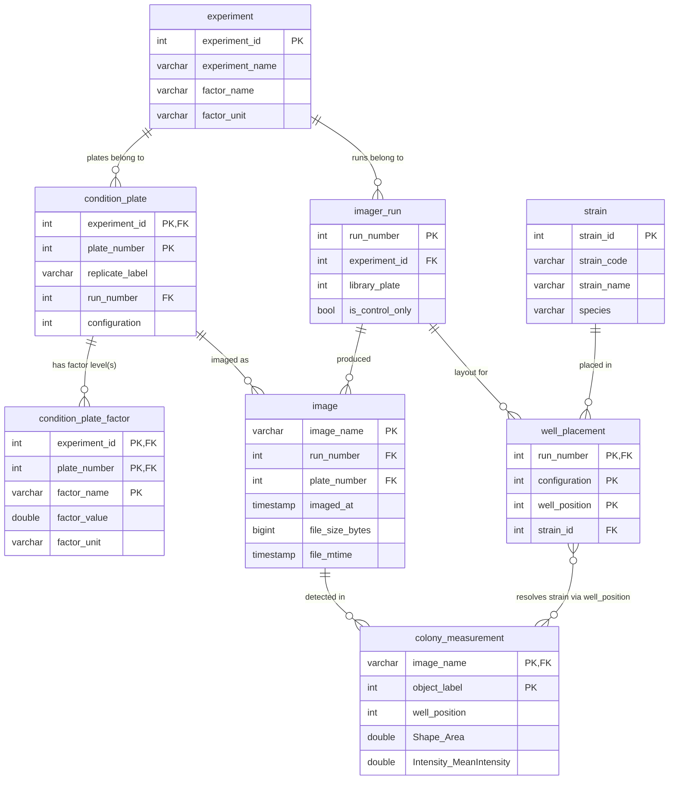

# Rhodotorula phenotyping database — DuckDB design and implementation plan

Companion to `README.md`. That document explains how a single Copper experiment's
files relate to each other. This document generalizes that understanding into a
DuckDB schema meant to hold **multiple experiment types over time** (Copper, and
in future Temperature, pH, Salinity, and other metals), all built from the same
per-plate Parquet measurement format, and designed so R and Python scripts can
query strain phenotypes across conditions and replicates without re-deriving any
of the join logic documented in `README.md`.

Status: **built and populated** for Copper. See "Review" and "Implementation
notes" at the bottom for what changed between this design and the working
`scripts/db/` pipeline, and `SCHEMA.md` (generated, do not hand-edit) for the
live schema.

---

## 1. Goals and constraints

- One database, many experiments. Each experiment (Copper, Temperature, pH,
  Salinity, a given metal) contributes its own imager runs, plates, and
  measurement files, but they all share the same strain identity space and the
  same per-image Parquet schema.
- New data arrives incrementally, one Parquet file per plate/timepoint, forever.
  Import must be re-runnable without duplicating rows (idempotent) and must be
  cheap to run again after a new drop of files lands in `data/preprocessed/`.
- The experiment-specific "which plate number means which condition" and "which
  well means which strain" metadata is delivered as CSVs per experiment (like
  `Copper.Plate_info.csv` / `Copper.Strain_info.csv` today) and is not assumed to
  keep the exact same column names, level counts, or block-size arithmetic in
  future experiments (see `README.md` quirk #4 — the current Copper `run_number`/
  `configuration` arithmetic is a fragile inferred convention, not written data,
  and must not be silently generalized to other experiments).
- The join logic already documented in `README.md` (Join 1: plate → condition;
  Join 2: well → strain) is preserved exactly for Copper, and generalized just
  enough that a second experiment type is a matter of adding rows/config, not
  new code paths.
- Downstream consumers are analysts writing short R (`duckdb` R package) or
  Python (`duckdb`/`polars`) scripts that ask questions like "show me trait X for
  strain Y across all Copper concentrations and replicates" — they should be able
  to do that against one view with one `WHERE strain_code = ...` clause, no joins.

## 2. Design principles

1. **Star schema.** One wide fact table (`colony_measurement`) holding every
   CellProfiler-style trait column, one row per detected colony per image.
   Everything else — strain, condition, run, well layout — is a dimension table
   joined in through views, not duplicated into the fact table.
2. **Experiment-agnostic condition modeling.** Instead of hardcoding
   `Concentration (mM)`, conditions are stored as `(factor_name, factor_value,
   factor_unit)` triples. Copper concentration, temperature, pH, and salinity are
   all just different `factor_name` values in the same table. A metal-type
   experiment adds a `factor_name = 'Copper'|'Zinc'|...` distinction for free.
3. **Resolve fragile arithmetic once, at import time, into real columns — never
   at query time.** The `run_number`/`configuration` block arithmetic that
   `README.md` documents as quirk #4 is run once per experiment during import,
   its output is written into an explicit `condition_plate.run_number` /
   `condition_plate.configuration` column, and validated against the strain
   metadata's actual `Run Number` values. If a future experiment's plate
   numbering doesn't follow the same block convention, it supplies its own
   explicit plate→run/configuration mapping file instead of relying on the
   formula — the schema doesn't care which method produced the columns, only
   that they're populated and validated before any measurement data is loaded.
4. **Strain identity is global, not per-experiment.** `strain` is one table keyed
   on `Strain ID`, shared across every experiment a strain appears in. This is
   what makes "trait X for strain Y across conditions" a single-table filter.
5. **Idempotent, file-level import.** `image.image_name` (the parsed
   `Metadata_ImageName`) is a natural unique key. Import upserts by that key, so
   re-running the import after new files land only inserts what's new.
6. **Views, not duplicated tables, for analysis-ready shapes.** The fully joined
   "one row per colony, all trait columns, strain + condition attached" shape is
   a SQL view (`v_phenotype`), not a materialized copy — it always reflects the
   latest import and costs nothing to keep in sync.

## 3. Entity overview

```
experiment          -- one row per experiment type/campaign (Copper, Temperature, pH, Salinity, ...)
imager_run           -- one row per physical imaging run/batch (d000353, d000354, ...)
strain               -- one row per strain, global across all experiments
well_placement        -- static strain-to-well layout for a given (run, configuration)
condition_plate       -- one row per physical assay plate: which experiment, which factor level, which replicate/run
image                -- one row per imaged plate at one timepoint (one Parquet file)
colony_measurement    -- fact table: one row per detected colony per image, all trait columns
```

## 4. Schema

### 4.1 `experiment`

One row per experiment campaign. New experiment types are added here, nothing
else in the schema changes shape.

| Column | Type | Notes |
| --- | --- | --- |
| `experiment_id` | INTEGER PK | Surrogate key. |
| `experiment_name` | VARCHAR UNIQUE | e.g. `'Copper'`, `'Temperature'`, `'pH'`, `'Salinity'`, `'Zinc'`. |
| `factor_name` | VARCHAR | The experimental variable this campaign manipulates, e.g. `'Copper concentration'`, `'Temperature'`, `'pH'`, `'Salinity'`. Free text, not an enum, so a new metal or variable needs no schema change. |
| `factor_unit` | VARCHAR | e.g. `'mM'`, `'C'`, `'pH units'`, `'ppt'`. |
| `plate_info_source` | VARCHAR | Path/filename of the condition CSV this experiment's `condition_plate` rows were loaded from, for provenance. |
| `strain_info_source` | VARCHAR | Path/filename of the strain CSV, for provenance. |
| `notes` | VARCHAR | Free text. |

### 4.2 `imager_run`

One row per `d000XXX` imager run number parsed out of filenames.

| Column | Type | Notes |
| --- | --- | --- |
| `run_number` | INTEGER PK | e.g. `353`. Parsed from `Batch_Number` (`dNNNNNN` → int). |
| `experiment_id` | INTEGER FK → experiment | Which campaign this run belongs to. |
| `library_plate` | INTEGER | From `Strain_info.Library Plate`, if the run has strain rows (control-only runs won't). |
| `is_control_only` | BOOLEAN | True for runs like 357 that have no strain metadata (README quirk #5). |

### 4.3 `strain`

Global strain identity, independent of experiment.

| Column | Type | Notes |
| --- | --- | --- |
| `strain_id` | INTEGER PK | From `Strain_info.Strain ID`. |
| `strain_code` | VARCHAR | From `Strain_info.Strain`, e.g. `TFCN_17-291Y-1`. |
| `strain_name` | VARCHAR | From `Strain_info.Strain Name` (free-text label, may include secondary IDs). |
| `species` | VARCHAR | |
| `origin` | VARCHAR | |
| `environment` | VARCHAR | Nullable — some rows have it blank. |

Strains that reappear in a later experiment (e.g. the same library rearrayed for
a Temperature screen) reuse the same `strain_id` — do not re-insert.

### 4.4 `well_placement`

The static rearray worklist: which strain sits in which well, for a given run
and configuration. This is what makes `well_position` → strain resolvable.

| Column | Type | Notes |
| --- | --- | --- |
| `run_number` | INTEGER FK → imager_run | |
| `configuration` | INTEGER | 1-4 today; not assumed fixed for future experiments. |
| `well_position` | INTEGER | 1-96, column-major (`Grid_ColMajorIdx + 1` — README quirk #2). |
| `strain_id` | INTEGER FK → strain | |
| `incubation_temp_c` | DOUBLE | From `Strain_info.Incubation Temp (°C)`. |
| `media` | VARCHAR | From `Strain_info.Media`. |
| PRIMARY KEY | `(run_number, configuration, well_position)` | |

### 4.5 `condition_plate` and `condition_plate_factor`

Generalizes `Copper.Plate_info.csv`. Split into two tables so a future
multi-factor experiment (e.g. temperature × pH varied together) doesn't require
a schema migration — flagged as a real risk in review, not just a hypothetical.

`condition_plate` — one row per physical assay plate:

| Column | Type | Notes |
| --- | --- | --- |
| `experiment_id` | INTEGER FK → experiment | |
| `plate_number` | INTEGER | The `Plate_Number` token from the filename — unique only *within* an experiment, not globally. |
| `replicate_label` | VARCHAR | Raw value from the source CSV's `Replicate`-like column (`'1'`,`'2'`,`'3'`,`'4'`,`'Control'` for Copper today). Stored as-is and documented as **not a true technical replicate** for Copper — see quirks. |
| `is_control` | BOOLEAN | |
| `run_number` | INTEGER FK → imager_run | Resolved and validated at import time (see §5), never recomputed at query time. |
| `configuration` | INTEGER | Resolved and validated at import time; joins to `well_placement`. |
| PRIMARY KEY | `(experiment_id, plate_number)` | |

`condition_plate_factor` — one row per manipulated variable on that plate (one
row for Copper today; a temperature×pH experiment would have two):

| Column | Type | Notes |
| --- | --- | --- |
| `experiment_id`, `plate_number` | FK → condition_plate | |
| `factor_name` | VARCHAR | e.g. `'Copper concentration'`, `'Temperature'`, `'pH'`. |
| `factor_value` | DOUBLE | e.g. `5` (mM), `30` (°C), `7.2` (pH). |
| `factor_unit` | VARCHAR | e.g. `'mM'`, `'C'`, `'pH units'`. |
| PRIMARY KEY | `(experiment_id, plate_number, factor_name)` | |

`experiment.factor_name`/`factor_unit` (§4.1) remain as the *default/primary*
factor label for simple single-factor experiments; `condition_plate_factor` is
the source of truth actually queried by views.

### 4.6 `image`

One row per Parquet file, i.e. one imaged plate at one timepoint.

| Column | Type | Notes |
| --- | --- | --- |
| `image_name` | VARCHAR PK | The full `Metadata_ImageName`, e.g. `d000355_300_079_2026-02-24_17-14-27`. Natural key, used for idempotent import. |
| `run_number` | INTEGER FK → imager_run | Parsed `Batch_Number`. `experiment_id` is deliberately **not** stored here — it's derived by joining through `condition_plate`, so there is no denormalized copy that can drift if a plate's experiment assignment is ever corrected. |
| `plate_number` | INTEGER | Parsed `Plate_Number`; with `run_number`'s experiment, FKs to `condition_plate`. |
| `temperature_token` | INTEGER | Raw parsed `300` token — kept for provenance even though README quirk #1 says it's constant; don't rely on it varying. |
| `imaged_at` | TIMESTAMP | Parsed `Datetime`. |
| `source_path` | VARCHAR | Original file path, for provenance/debugging. |
| `file_size_bytes`, `file_mtime` | BIGINT, TIMESTAMP | Captured at import. If a file with an already-imported `image_name` reappears with a different size/mtime, the importer treats it as a **corrected re-delivery**, not a duplicate — see §5. |

`hours_since_plate_start` is deliberately **not stored** — see §5/§6: it's
computed in a view via a window function so it can never go stale when files
for a plate arrive out of timestamp order.

### 4.7 `colony_measurement`

Fact table. One row per detected colony object per image — the full trait
vector from the Parquet files, unchanged column-for-column (see `README.md`
§"Per-image measurement files" for the full column group reference: `Bbox_*`,
`Grid_*`, `Shape_*`, `Intensity_*`, `TextureGray_*`, `Colorxy_*`, `ColorLab_*`,
`ColorHSV_*`).

| Column | Type | Notes |
| --- | --- | --- |
| `image_name` | VARCHAR FK → image | |
| `object_label` | INTEGER | Per-colony ID within the image (from `ObjectLabel`). |
| `grid_row`, `grid_col` | INTEGER | From `Grid_RowNum`/`Grid_ColNum`. |
| `well_position` | INTEGER | `Grid_ColMajorIdx + 1`, computed at import — this is the column actually used to join to `well_placement`, not stored redundantly elsewhere. |
| *(all other Parquet columns)* | DOUBLE / INTEGER | Loaded as-is, same names as the source Parquet files. ~150 numeric trait columns. |
| PRIMARY KEY | `(image_name, object_label)` | |

No traits are pre-aggregated or renamed here — this table is a faithful load of
the Parquet files plus the two derived join columns (`well_position`,
implicitly `plate_number`/`run_number` via `image`).

## 5. Import and processing plan

Run as an ordered sequence of scripts under `scripts/db/`, each idempotent and
safe to re-run. Suggested implementation language: Python (`duckdb` + `polars`),
matching the existing reference pipeline's tooling.

1. **`00_init_schema.sql`** — `CREATE TABLE IF NOT EXISTS` for all seven tables
   above, with declared primary/foreign keys. Run once per fresh database file;
   safe to re-run.

2. **`10_import_experiment.py <experiment_name> <plate_info.csv> <strain_info.csv>`**
   — registers or updates one row in `experiment`; loads the experiment's
   condition CSV into `condition_plate` + `condition_plate_factor`, and its
   strain CSV into `strain` + `well_placement` + `imager_run`. This is the step
   that resolves `run_number`/`configuration` for each `plate_number`:
   - For Copper: apply the block-arithmetic convention documented in
     `README.md` (`run_number = min(Run Number) + (plate_number-1)//28`,
     `configuration = (plate_number-1)//7 % 4 + 1`), then **validate**: every
     resolved `run_number` must exist in the strain CSV's `Run Number` column
     (or be flagged `is_control_only`), and every `(run_number, configuration,
     well_position)` parsed from the strain CSV must be unique — the script
     asserts no duplicate `(run_number, configuration, well_position)` triple
     exists in the source CSV *before* attempting the insert, and fails with
     the offending rows listed, rather than relying on the table's primary-key
     constraint to catch it after the fact.
   - For a future experiment where this arithmetic doesn't apply, this step
     instead reads an explicit plate→run/configuration mapping file for that
     experiment (a required argument or a companion CSV) — no formula is
     assumed by default for anything but Copper.
   - Upserts into `strain` by `strain_id` (`INSERT ... ON CONFLICT DO NOTHING`,
     since strain identity is global and may already exist from a prior
     experiment).

3. **`20_import_measurements.py <experiment_name> <glob>`** — for each Parquet
   file matching the glob:
   - Compute the file's size and mtime. If `image_name` is already present in
     `image` with the *same* size/mtime, skip it (already imported, no-op —
     this is the normal incremental-import case). If `image_name` is present
     with a **different** size/mtime, treat it as a corrected re-delivery: log
     a warning, delete the existing `image` row (`ON DELETE CASCADE` removes
     its `colony_measurement` rows) and re-import it. Never silently ignore a
     changed file.
   - Parse `Metadata_ImageName` into `run_number`, `temperature_token`,
     `plate_number`, `imaged_at` (same split logic as `README.md`).
   - Compute `well_position = Grid_ColMajorIdx + 1` per row.
   - If the Parquet file's columns don't match `colony_measurement`'s current
     columns, run `ALTER TABLE colony_measurement ADD COLUMN IF NOT EXISTS ...`
     for any new trait columns first (printing a warning so schema growth is
     visible, not silent), rather than failing the whole import on an
     unexpected new column.
   - Insert the `image` row and bulk-insert the Parquet rows into
     `colony_measurement` (via DuckDB's native
     `INSERT INTO colony_measurement SELECT ... FROM read_parquet(...)`, the
     fast path for ~150-column data) **inside a single transaction** —
     `BEGIN; INSERT image; INSERT colony_measurement...; COMMIT;`. This is
     what makes the file-level idempotency check safe: if the process dies
     mid-file, the transaction rolls back entirely, so on the next run the
     file is still absent from `image` and gets retried in full — there is no
     state where `image` has a row but `colony_measurement` doesn't.
   - Only `*.parquet` is globbed — matches README's "Parquet is the only
     supported input format."

4. **`30_create_views.sql`** — see §6.

5. **`40_data_dictionary.py`** — regenerates a schema description (see §7)
   from `information_schema`/`duckdb_columns()` so the doc never drifts from
   the live schema.

Re-running steps 2-4 after new files land is the normal update workflow: new
experiments get a `10_import_experiment.py` call, new plates/timepoints get
picked up by re-running `20_import_measurements.py` with the same glob.

## 6. View generation plan

### `v_image` — per-image time axis

Computes elapsed imaging time with a window function so it is always correct
regardless of the order files were imported in (a stored column would go stale
if a later-arriving file turned out to have an earlier timestamp than any seen
so far for that plate):

```sql
CREATE OR REPLACE VIEW v_image AS
SELECT
    i.*,
    i.imaged_at - MIN(i.imaged_at) OVER (PARTITION BY i.run_number, i.plate_number)
        AS hours_since_plate_start
FROM image i;
```

### `v_condition_factors` — one row per plate, factors collapsed to a map

Because a plate can have more than one manipulated factor (e.g. a future
temperature × pH experiment), factors are pivoted into a single `MAP` column
per plate here, so joining them into `v_phenotype` never fans out colony rows
— one plate is still one row, however many factors it has:

```sql
CREATE OR REPLACE VIEW v_condition_factors AS
SELECT
    experiment_id,
    plate_number,
    map(list(factor_name), list(factor_value)) AS factors
FROM condition_plate_factor
GROUP BY experiment_id, plate_number;
```

(For single-factor experiments like Copper today, `factors['Copper concentration']`
is equivalent to the old flat `factor_value` column. Units live in
`condition_plate_factor.factor_unit` — for the common single-factor case,
analysts who want a plain numeric column plus its unit can also just query
`condition_plate_factor` directly and skip the map.)

### `v_phenotype` — the main analysis view

One row per colony observation, every trait column, with strain and condition
already attached. This is the view R/Python scripts should query.

```sql
CREATE OR REPLACE VIEW v_phenotype AS
SELECT
    e.experiment_name,
    cp.replicate_label,
    cp.is_control,
    cf.factors,
    s.strain_id,
    s.strain_code,
    s.strain_name,
    s.species,
    i.image_name,
    i.run_number,
    i.plate_number,
    i.imaged_at,
    i.hours_since_plate_start,
    cm.* EXCLUDE (image_name)         -- all trait columns, avoid duplicate key
FROM colony_measurement cm
JOIN v_image i                ON i.image_name = cm.image_name
LEFT JOIN condition_plate cp   ON cp.run_number    = i.run_number
                              AND cp.plate_number  = i.plate_number
LEFT JOIN experiment e          ON e.experiment_id = cp.experiment_id
LEFT JOIN v_condition_factors cf ON cf.experiment_id = cp.experiment_id
                                AND cf.plate_number  = cp.plate_number
LEFT JOIN well_placement wp    ON wp.run_number    = i.run_number
                              AND wp.configuration = cp.configuration
                              AND wp.well_position = cm.well_position
LEFT JOIN strain s              ON s.strain_id = wp.strain_id;
```

Every join from `colony_measurement` onward is a `LEFT JOIN` — including
`condition_plate`/`experiment`, which the first draft had as an `INNER JOIN`.
That was a real bug: if measurement Parquet files for a plate get imported
before that experiment's condition CSV (nothing currently enforces load
order), an inner join would silently drop those colony rows out of the view
entirely instead of surfacing them with `NULL` condition columns. `LEFT JOIN`
throughout means every `colony_measurement` row always appears in
`v_phenotype` exactly once, with unmatched dimensions coming through as `NULL`
and filterable (`WHERE strain_id IS NOT NULL`, etc.) rather than silently
missing. `condition_plate`, `well_placement`, and `strain` are each joined on
their full primary key, so none of these joins can fan out a colony row into
more than one output row.

### `v_strain_experiment_summary` — convenience aggregate

A starter aggregate for the common "how does strain X respond across factor
levels and replicates" question, on a handful of the most-used traits (colony
size and intensity). Analysts needing other traits query `v_phenotype` directly
with their own `GROUP BY` — this view is a convenience, not an attempt to
pre-aggregate all ~150 traits.

```sql
CREATE OR REPLACE VIEW v_strain_experiment_summary AS
SELECT
    experiment_name, factors, replicate_label,
    strain_id, strain_code, strain_name,
    COUNT(*)                       AS n_colonies,
    AVG(Shape_Area)                AS mean_area,
    STDDEV_SAMP(Shape_Area)        AS sd_area,
    AVG(Intensity_MeanIntensity)   AS mean_intensity,
    STDDEV_SAMP(Intensity_MeanIntensity) AS sd_intensity
FROM v_phenotype
WHERE strain_id IS NOT NULL
GROUP BY ALL;
```

For the common single-factor case, pull the level out of the map at query time,
e.g. `factors['Copper concentration'] AS concentration_mm`.

### `v_growth_timeseries` — kinetics view

Same grain as `v_phenotype` but ordered/exposed for time-course plotting.

```sql
CREATE OR REPLACE VIEW v_growth_timeseries AS
SELECT
    experiment_name, factors, replicate_label,
    strain_id, strain_code, image_name, hours_since_plate_start,
    Shape_Area, Intensity_MeanIntensity
FROM v_phenotype
WHERE strain_id IS NOT NULL
ORDER BY strain_id, hours_since_plate_start;
```

## 7. Schema description / documentation

Rather than hand-maintain a data dictionary that drifts from the schema,
`40_data_dictionary.py` queries DuckDB's own catalog
(`SELECT * FROM duckdb_columns()`, `duckdb_tables()`, `duckdb_constraints()`)
and regenerates a `SCHEMA.md` (table list, column list with types, PK/FK,
row counts) on demand — run it after any migration so the doc is always a
snapshot of the live database, not a second source of truth to keep in sync
by hand.

## 8. Graphical representation of the schema



## 9. Schema evolution and the database file itself

**Trait-column drift.** If a future Parquet delivery adds or removes trait
columns (a CellProfiler pipeline change, a new measurement group), the import
script diffs the file's columns against `colony_measurement`'s current columns
and runs `ALTER TABLE colony_measurement ADD COLUMN IF NOT EXISTS <col> DOUBLE`
for anything new, printing what it added. Columns are never dropped
automatically — an old trait that stops appearing in new files just goes `NULL`
for future rows, preserving old data untouched.

**The `.duckdb` file is a disposable, rebuildable artifact, not a source of
truth.** Every table is fully reconstructible from `data/metadata/*.csv` and
`data/preprocessed/*.parquet` by re-running the import scripts in order —
those flat files are what's backed up carefully; the database file itself just
needs an opportunistic periodic copy from `$SCRATCH`/local build location to
`/bigdata` (per this cluster's storage guidance) so a rebuild isn't required
after routine node/job churn, not a rigorous backup policy of its own.

## 10. Implementation plan

| Phase | Deliverable | Depends on |
| --- | --- | --- |
| 1 | `scripts/db/00_init_schema.sql` — table DDL, including `condition_plate_factor` and `image.file_size_bytes`/`file_mtime` | This design approved |
| 2 | `scripts/db/lib/` — shared connection + filename-parsing helpers (Python) | Phase 1 |
| 3 | `scripts/db/10_import_experiment.py` — condition + factor + strain + well-placement import, with duplicate-well-position validation before insert | Phase 2 |
| 4 | `scripts/db/20_import_measurements.py` — Parquet ingest: per-file transaction (image + colony_measurement together), size/mtime-based re-delivery detection, auto-`ALTER` for new trait columns | Phase 2 |
| 5 | `scripts/db/30_create_views.sql` — `v_image`, `v_condition_factors`, `v_phenotype`, `v_strain_experiment_summary`, `v_growth_timeseries` | Phases 3-4 |
| 6 | `scripts/db/40_data_dictionary.py` → `SCHEMA.md` | Phase 5 |
| 7 | Build `db/rhodotorula_phenotypes.duckdb` by running phases 1-6 against the existing Copper data end-to-end; spot-check row counts and a handful of known strain/condition combinations against `README.md`'s worked example (`d000355_300_079`); deliberately kill the importer mid-run once and confirm re-running it recovers cleanly | Phases 1-6 |
| 8 | `scripts/db/query_examples/` — one short R script (`duckdb` package) and one short Python script (`duckdb`/`polars`), each showing: connect, `SELECT * FROM v_phenotype WHERE strain_code = ...`, and a `v_strain_experiment_summary` plot-ready pull | Phase 7 |

Each phase is a small, independently testable unit — schema and views can be
reviewed and adjusted before a single Parquet file is loaded.

## 11. Open questions for review

- Is `replicate_label` (raw `'1'..'4','Control'`) worth also exposing as an
  explicit `is_technical_replicate BOOLEAN` once we understand whether any
  future experiment does have true technical replicates within one run, versus
  Copper where — per README quirk #3 — it is actually an imager-run proxy?
- Confirm the `well_position` computation (`Grid_ColMajorIdx + 1`) and the
  `run_number`/`configuration` block arithmetic remain the right defaults for
  every future Copper-style experiment, or whether they should be
  experiment-specific configuration from day one rather than a Copper-shaped
  default with an escape hatch.

---

## Review

Reviewed by Fable before the revision above. Findings and how each was
addressed in this document:

**Must-fix — all applied:**
1. *Partial-crash inconsistency in the measurement importer* — fixed: §5 step 3
   now wraps each file's `image` + `colony_measurement` inserts in one
   transaction, so a mid-file crash leaves no orphaned `image` row and the file
   is retried in full on the next run.
2. *`hours_since_plate_start` going stale on out-of-order arrival* — fixed: no
   longer a stored column; `v_image` (§6) computes it with a window function
   over `MIN(imaged_at)`, always correct regardless of import order.
3. *No handling for a re-delivered file with corrected data under the same
   name* — fixed: `image` now carries `file_size_bytes`/`file_mtime`, and §5
   step 3 treats a changed file as a re-delivery (delete + reimport with a
   warning), not a silent no-op.
4. *`v_phenotype`'s `condition_plate`/`experiment` join was `INNER`, which
   could silently drop colony rows imported before their condition CSV* —
   fixed: §6 now joins every dimension from `colony_measurement` onward with
   `LEFT JOIN`.

**Should-fix — applied, with one exception noted:**
5. *Single `factor_value` column won't survive a multi-factor experiment* —
   fixed: split into `condition_plate` + `condition_plate_factor` (§4.5), with
   `v_condition_factors` (§6) collapsing factors to a `MAP` per plate so the
   main view still can't fan out on multiple factors.
6. *`image.experiment_id` denormalization with no sync mechanism* — fixed:
   removed; `experiment` is now reached only by joining through
   `condition_plate` (§4.6).
7. *No story for trait-column drift in future Parquet deliveries* — fixed:
   §9 documents the auto-`ALTER TABLE ... ADD COLUMN IF NOT EXISTS` approach,
   and §5 step 3 folds it into the import step.
8. *Duplicate `well_position` within a run/configuration only caught by the PK
   constraint after the fact* — fixed: §5 step 2 now validates uniqueness in
   the source CSV before inserting, and fails with the offending rows listed.

**Nice-to-have — applied:**
9. *No backup/rebuild story for the `.duckdb` file* — addressed in §9: it's
   documented as fully rebuildable from the flat files, with only an
   opportunistic copy to `/bigdata`, not a rigorous backup target in its own
   right.
10. *Wide `colony_measurement` vs. splitting by trait group or a long/EAV
    form* — reviewed and confirmed as the right call: DuckDB is columnar, so a
    narrow query (e.g. `v_growth_timeseries`) pays nothing for unused trait
    columns, a split-by-group design would tax every analyst with extra joins
    for no benefit, and a long form would cause a ~150x row explosion and
    require a pivot for any real query. No change made.
11. *`SELECT cm.* EXCLUDE (image_name)` syntax* — confirmed correct DuckDB
    syntax, unchanged.

## Implementation notes

Findings from actually building `scripts/db/` and running it end-to-end
against the full Copper dataset (2398 files, 211,800 colony rows, 0 import
errors). None of these change the schema in DATABASE_DESIGN.md §4-§8; they
are pipeline-level fixes and one new data quirk, recorded here so they aren't
rediscovered the hard way on the next experiment.

- **New data quirk, not previously caught**: `data/metadata/Copper.Strain_info.csv`
  has 2400 data rows by line count, but only **1284** are real — the other
  1116 are fully-blank padding rows (every column null except a populated
  `Index`). `10_import_experiment.py` filters on `Strain ID IS NOT NULL`
  before doing anything else and prints how many it dropped. Recompute-facts
  that depended on the old 2400 figure: real per-run strain counts are
  353→336, 354→332, 355→336, 356→280 (not a uniform 336 each, as the
  small README-quirk-#6 sample from Run 355 alone had suggested).
- **DuckDB cannot delete a foreign-key parent and child row in the same
  transaction**, even when the child is deleted first — confirmed directly
  (`DELETE FROM colony_measurement ...; DELETE FROM image ...;` inside one
  `BEGIN/COMMIT` raises `Constraint Error: ... still referenced by a foreign
  key in a different table`), and the same happens if the parent is
  `UPDATE`d instead of deleted. The re-delivery path in
  `20_import_measurements.py` therefore runs the child delete and the parent
  delete as two separately committed transactions, then falls through to the
  normal single-transaction insert path as if the file were new. This is
  documented in DATABASE_DESIGN.md §5/§9 as a design intent ("wrap in a
  transaction"); in practice that intent holds for the insert path but not
  for the delete-and-replace path, for reasons specific to this DuckDB
  version, not a design choice.
- **`hours_since_plate_start` is `DOUBLE`, not `INTERVAL`.** The original
  `v_image` draft computed it as a timestamp difference (`INTERVAL`).
  DuckDB's `INTERVAL` type doesn't convert cleanly through Arrow into Polars
  (`ComputeError: could not import from 'month_day_nano_interval' type`), so
  both example query scripts would have broken on this column. Fixed to
  epoch-seconds arithmetic (`(epoch(imaged_at) - epoch(min(imaged_at) over
  (...))) / 3600.0`), giving fractional hours as a plain numeric column.
- **`factors['Copper concentration']` on the `MAP` column returns the scalar
  value directly** in this DuckDB build, not a one-element list — the
  original view/query draft's `factors[...][1]` indexing was wrong and
  raised a binder error; both example scripts use the plain bracket form.
- **`Metadata_Dataset` is dropped at import**, matching
  `PhenotypicMeasurements/Copper/Scripts/copper_metadata.py`'s original
  choice (`Metadata_ImageName` is also dropped from the fact table, since it
  becomes the join key `image_name` computed once from the filename, not a
  duplicated stored column).
- **Verified against `README.md`'s worked example**: `Plate_Number` 79 in run
  `d000355` resolves to `run_number=355, configuration=4, factor_value=5.0
  mM`, matching the hand-derived example in `README.md` exactly.
- Full import of all 2398 Parquet files takes ~2m45s cold; a full re-run
  (idempotency check only, nothing to import) takes ~4s.

### What's built vs. what's still a plan

Done: `scripts/db/00_init_schema.sql`, `10_import_experiment.py`,
`20_import_measurements.py`, `30_create_views.sql`, `40_data_dictionary.py`,
`query_examples/query_example.py`, `query_examples/query_example.R`, and a
populated `db/rhodotorula_phenotypes.duckdb` for the Copper experiment. A
`pixi.toml` at the repo root (`duckdb`, `polars`, `pandas`, `pyarrow`,
`r-base`, `r-duckdb`) pins the environment these scripts run in — use `pixi
run python3 scripts/db/...` / `pixi run Rscript scripts/db/...`.

The mid-import-crash recovery drill (§10 phase 7) has been run: a fault was
injected between the `image` insert and the `colony_measurement` insert
inside a single file's transaction. Result: the transaction rolled back
cleanly (zero `image` rows left for that file), and a normal re-run of
`20_import_measurements.py` afterward imported the file correctly with no
manual cleanup needed.

Not yet exercised: a second experiment type (no Temperature/pH/Salinity data
exists yet to import) and the `--plate-run-map` escape hatch for
non-block-style plate numbering (untested against real data, only reasoned
about).
