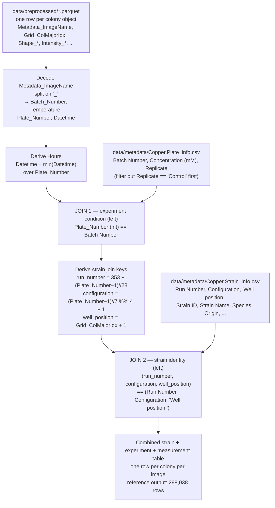

# Rhodotorula copper-stress colony phenotyping

Reference documentation for the colony-based phenotyping dataset: per-image colony
measurements from an arrayed *Rhodotorula* screen under copper stress, plus the
strain and experiment metadata needed to interpret them.

This document is the entry point for anyone writing an analysis script in `scripts/`.
It describes the data format, the directory layout, and — most importantly — exactly
how the files join together.

---

## Directory layout

```
data/
  metadata/
    Copper.Plate_info.csv        # 120 rows: Batch Number, Concentration (mM), Replicate
    Copper.Strain_info.csv       # 2400 data rows, 14 columns: strain identity per Run/Config/Well
  preprocessed/
    d000353_300_028_2026-02-21_10-31-05.parquet    # one file per imaged plate/timepoint
    ...                                            # 2398 parquet files total
    d000355_300_079_2026-02-24_17-14-27.parquet

scripts/                         # new analysis scripts go here; read from data/ and its subfolders
lib/                             # currently empty
```

New work reads from `data/` holds the original delivery,
the authoritative `About.MD` notes, and the reference join script.

---

## Per-image measurement files

`data/preprocessed/*.parquet`. One file per imaged plate at one timepoint; one row per
detected colony object within that image. Roughly 50–90 rows per plate — not all 96 grid
positions have a detected colony, so occupancy varies.

**Parquet is the only supported input format.** All measurement data should be read from
the `*.parquet` files in `data/preprocessed/` (2398 files).  

Columns, in order, by group:

| Group | Columns | Meaning |
| --- | --- | --- |
| Image identifiers | `Metadata_Dataset`, `Metadata_FileSuffix`, `Metadata_BitDepth`, `Metadata_ImageType`, `Metadata_ImageName` | Image-level identifiers. `Metadata_ImageName` is the key that gets decoded into run/temperature/plate/datetime. |
| Object ID | `ObjectLabel` | Per-colony object ID within the image. |
| Bounding box | `Bbox_*` | Bounding box center/min/max coordinates, in pixel space plus intensity- and distance-weighted variants. |
| Grid position | `Grid_RowNum` (0–7), `Grid_ColNum` (0–11) | 0-indexed position of the colony in the 8x12 (96-position) plate grid. |
| Grid index | `Grid_RowMajorIdx` = `Grid_RowNum * 12 + Grid_ColNum` | 0-indexed row-major numbering. |
| Grid index | `Grid_ColMajorIdx` = `Grid_ColNum * 8 + Grid_RowNum` | 0-indexed column-major numbering. **This is the field used for the well-position join**, not `Grid_RowMajorIdx`. |
| Shape | `Shape_*` | Colony morphology: area, perimeter, circularity, radii, Feret diameters, eccentricity, solidity, axis lengths, etc. |
| Intensity | `Intensity_*` | Grayscale intensity stats: integrated, min/max/mean/median, stddev, coefficient of variation, quartiles, density. |
| Texture | `TextureGray_*` | Haralick texture features (angular second moment, contrast, correlation, variance, entropy, etc.) at 4 angles (`deg000`/`deg045`/`deg090`/`deg135`) plus an `-avg-` variant, all at `scale05`. |
| Color | `Colorxy_*`, `ColorLab_*`, `ColorHSV_*` | Per-channel summary stats (min/Q1/mean/median/Q3/max/stddev/coeffvar) in xy, CIE L\*a\*b\*, and HSV color spaces, plus `ColorLab_ChromaEstimatedMean` / `ColorLab_ChromaEstimatedMedian`. |

### Filename convention

From `PhenotypicMeasurements/Copper/About.MD` (authoritative). Example:
`d000320_300_001_2026-02-01_15-44-58`

| Field | Example | Meaning |
| --- | --- | --- |
| Imager run number | `d000320` | Which imager run produced the image. Parsed as `Batch_Number` in code; called "Run Number" in `About.MD` and in the strain metadata. |
| Temperature | `300` | Temperature in Celsius x10, i.e. `300` = 30.0 °C. Constant `300` across every file in this dataset. |
| Plate/batch position | `001` | Plate position within the imager. Valid range 1–160; this dataset uses 1–120. Parsed as `Plate_Number`. |
| Datetime | `2026-02-01_15-44-58` | `year-month-day_hour-min-sec` the image was taken. |

Standard parse (Polars), as used in the reference script:

```python
df = df.with_columns(
    pl.col("Metadata_ImageName").str.split("_").list.get(0).alias("Batch_Number"),
    pl.col("Metadata_ImageName").str.split("_").list.get(1).alias("Temperature"),
    pl.col("Metadata_ImageName").str.split("_").list.get(2).alias("Plate_Number"),
    pl.col("Metadata_ImageName").str.split("_").list.slice(3, 4).list.join("_").alias("Datetime"),
)
```

---

## Metadata files

### `data/metadata/Copper.Plate_info.csv` — experiment conditions

120 rows. Columns: `Batch Number`, `Concentration (mM)`, `Replicate`.

- `Batch Number` (1–120) is the *global* plate/batch position. It is exactly
  `Plate_Number` from the filename — joined directly, no transformation.
- `Concentration (mM)` cycles 0, 5, 10, 15, 20, 25, 30 mM (7 steps) within contiguous
  blocks of 28 `Batch Number`s.
- `Replicate` values are `1`, `2`, `3`, `4`, `Control` — 28 rows each for 1–4, and 8 rows
  for `Control` (batches 113–120).
- Verified empirically: `Batch Number` blocks 1–28, 29–56, 57–84, 85–112, 113–120
  correspond 1:1 to imager run numbers 353, 354, 355, 356, 357 respectively. This was
  confirmed by cross-tabulating every `Plate_Number` that appears against its file's
  `Batch_Number` across all 2399 preprocessed files, with no exceptions. `Replicate` is
  therefore a proxy for imager run, not a technical-replicate count (see quirks).

### `data/metadata/Copper.Strain_info.csv` — strain identity

2400 data rows (2401 lines including the header), 14 columns:
`Index`, `Strain ID`, `Strain Name`, `Strain`, `Species`, `Origin`, `Environment`,
`Run Number`, `Library Plate`, `Configuration`, `Well position ` (trailing space in the
header), `Incubation Temp (°C)`, `Time stamped`, `Media`.

- `Run Number` values present: 353, 354, 355, 356. **357 never appears** — it is the
  Control-only imager run and has no strain rows.
- Each `Run Number` maps 1:1 to a `Library Plate`: 353→1, 354→3, 355→2, 356→4.
- Each `Run Number` has 336 strain rows split across `Configuration` values 1–4
  (84 rows each), i.e. up to 84 of the 96 possible well positions are populated. The
  skipped positions follow a consistent pattern (for example, Run 355 / Configuration 1
  is missing positions 1, 11, 21, 31, 34, 44, 54, 64, 65, 75, 85, 95), consistent with
  intentional edge/corner exclusion in the rearray design rather than a data gap.

Parse this file with a real CSV parser — several `Strain Name` values contain embedded
newlines inside quoted fields (see quirks).

---

## How the files join

Two sequential left joins onto the per-image measurement table.



### Join 1 — experiment condition

`Plate_Number` (cast to integer, parsed from the filename) is matched against
`Plate_info.Batch Number`, after first dropping `Replicate == "Control"` rows from the
plate metadata. This attaches `Concentration (mM)` and `Replicate`.

### Join 2 — strain identity

Three keys are derived from `Plate_Number` and the per-colony `Grid_ColMajorIdx`:

```python
run_number    = 353 + (Plate_Number - 1) // 28     # 353 = min non-null Run Number in Strain_info
configuration = (Plate_Number - 1) // 7 % 4 + 1
well_position = Grid_ColMajorIdx + 1               # column-major, 1-indexed
```

These are matched against `Strain_info`'s `(Run Number, Configuration, "Well position ")`
— note the trailing space in the third column name.

Because it is a left join on a unique key triple, it never fans out or drops rows; the
reference script asserts the row count is unchanged. Rows with no strain match (Control
batches 113–120, and any unoccupied well position) simply carry null strain columns and
should be filtered out downstream.

### The `Hours` column

`Hours = Datetime - min(Datetime) grouped by Plate_Number`, as whole hours. This gives
elapsed imaging time per plate. Each plate is imaged repeatedly over time, so `Hours` is
the time axis for growth-curve and kinetics analysis.

### Reference implementation

`PhenotypicMeasurements/Copper/Scripts/copper_metadata.py` implements exactly the above
in Polars: glob the parquet files, `pl.read_parquet` them as one frame, drop
`Metadata_Dataset`, decode the image name, parse `Datetime` with `%Y-%m-%d_%H-%M-%S`,
compute `Hours`, run the two joins, drop any `*_right` collision columns after join 1,
assert the row count is preserved across join 2, report the unmatched-row count, and
write `copper_measurements_combined(1).csv` (298,038 rows). It reads its inputs from the
`PhenotypicMeasurements/Copper/` copies and from a `per_image/` glob; new scripts in
`scripts/` should point at `data/metadata/` and `data/preprocessed/` instead.

---

## Quirks and inconsistencies

Each item below was verified directly against the files, not inferred.

1. **`Temperature` is not actually variable.** All 2399 files in `data/preprocessed/`
   have literally `300` in the temperature filename slot, and `Strain_info`'s own
   `Incubation Temp (°C)` column is always 30. It is a fixed value baked into the
   filename, not a per-experiment variable — despite being modeled as a "Temperature"
   field, which invites treating it as if it varies.

2. **The well-position join uses `Grid_ColMajorIdx`, not `Grid_RowMajorIdx`, despite the
   row-major field's more intuitive name.** Both fields exist in every measurement row:
   `Grid_RowMajorIdx = row*12 + col`, `Grid_ColMajorIdx = col*8 + row`. The reference
   script uses column-major. Anyone re-deriving this join from first principles (as
   happened during initial exploration of this repo) will naturally reach for
   `RowMajorIdx` and get a silently wrong join — it will not error, it will just
   mismatch strains to wells. Easy to make, hard to detect.

3. **The `Replicate` column name in `Plate_info.csv` is misleading.** Its values
   (1, 2, 3, 4, Control) are not independent technical replicates of the same condition
   — they are a 1:1 proxy for which imager run (353, 354, 355, 356, 357) the plate
   belongs to. Analyzing "replicate effects" without knowing this conflates imager-run
   batch effects with true biological or technical replication.

4. **The run-number/configuration derivation is not stored anywhere as data — it is
   arithmetic inferred from plate-number block boundaries.**
   `run_number = 353 + (Plate_Number-1)//28` and
   `configuration = (Plate_Number-1)//7 % 4 + 1` are documented in neither metadata CSV;
   they were reverse-engineered by whoever wrote `copper_metadata.py` (per `About.MD`),
   and are only correct because plate numbering happens to be laid out in perfectly
   regular contiguous blocks of 28. Any future batch that does not follow this exact
   block size and order (a run with a different number of configurations or
   concentration steps, for instance) will silently break the formula, with no
   validation in place to catch it.

5. **Two independent copies of both metadata CSVs exist in the repo**
   (`data/metadata/*` versus `PhenotypicMeasurements/Copper/metadata/*`), with no
   indication which is canonical going forward now that scripts are moving to `data/`
   plus `scripts/`. The `Plate_info` copies are byte-identical (verified). The
   `Strain_info` copies contain identical data (2400 rows, verified via proper CSV
   parsing), but the `PhenotypicMeasurements` copy carries 20 extra always-empty
   `Image 1`..`Image 20` columns not present in the `data/metadata/` copy — so they are
   not literally identical files, only data-equivalent. Any workflow reading columns by
   position rather than by name would break silently when switching between them.

6. **`Copper.Strain_info.csv`'s `"Well position "` column header has a trailing space.**
   Both copies of the file have it. Code joining on this column name must match it
   exactly (the reference script does). Re-typing the column name cleanly is a common
   source of silent null / no-match bugs.

7. **Strain names contain embedded newlines inside quoted CSV fields** (for example
   `"17-291Y-1\n BY126-B8"`). Naive line-counting tools (`wc -l`, `grep -c`, line-based
   readers) therefore report row counts roughly 20% higher than the true count. A real
   CSV parser is required (Polars' reader, Python's `csv` module); parsed correctly,
   both metadata copies have exactly 2400 data rows, not the inflated counts raw line
   counts suggest.

8. **The Control-only imager run (`d000357`, `Plate_Number` 113–120) has no
   corresponding rows in `Strain_info.csv` at all** — `Run Number` 357 never appears
   there — and it is also explicitly filtered out of `Plate_info.csv` by
   `Replicate == "Control"` before the first join. These plates are dropped from the
   pipeline for two independent, overlapping reasons. Worth confirming that is
   intentional, and that the same filter logic could not silently exclude a *non-control*
   row in the future.

9. **Not every well position (1–96) is populated for a given Run/Configuration.**
   `Strain_info` has only 84 of 96 possible positions filled per configuration, in a
   consistent skipped pattern (for example, positions 1, 11, 21, 31, 34, 44, 54, 64, 65,
   75, 85, 95 are missing for Run 355 / Configuration 1). This looks like intentional
   plate-edge exclusion in the rearray design rather than a data error, but the rule is
   documented nowhere — it is only visible empirically.

### Note (resolved, not a concern)

`data/preprocessed/` contains 2398 `*.parquet` measurement files plus a single `.csv`,
`d000355_300_079_2026-02-24_17-14-27.csv`. That CSV is a one-off test artifact, confirmed
as such — not a supported input format and not evidence of a dual-format convention.
Read all measurement data from `*.parquet`; ignore the CSV.
