# a* (carotenoid proxy) under metal stress: stratified analyses

Generated 2026-10-08, rerun on the curated strain table (PR #4, #5). All numbers come from `report/tables/*.csv`. Scripts are in `scripts/` and `scripts/strat/`. Data-quality caveats are in `analysis/heavy_metal_data_problems/HEAVY_METAL_DATA_PROBLEMS.md`.

**Question.** Strains grow on plates with a heavy metal at increasing doses. Does CIELAB a\* (red-green axis, used here as a carotenoid proxy) rise because of stress? Or do strains differ inherently in a\*? Colony size confounds the answer. Every dose effect is therefore shown with and without size.

## What changed in this version

- **Strain groups come from the curated database** (`strain_curation`, decisions D-45 to D-47 and D-53). The group "R. mucilaginosa" now means pure haploid strains only (173 strains in Cr and Cu, 172 in Pb). Hybrid diploids (33 strains) and R. aff. mucilaginosa (7 strains) are separate groups. Five strains were renamed R. frigidialcoholis (D-46) and five previously unnamed strains received a species (D-45).
- **Iron and Zinc are not analysed.** Their source tables are incomplete (D-56): Iron has 62 of 120 plates and Zinc 9 of 119 plates in the ingested files. This report covers Chromium, Copper and Lead only. Old Fe and Zn results from earlier versions of this report are withdrawn.
- **No population analyses.** The old population labels came from the Y-2510 reference work and are dropped (D-51, D-57). New DH4148 SNP-cluster labels do not exist yet.
- **Species tests include hybrids and aff. mucilaginosa as groups.** Ploidy and species are confounded in the hybrid group, so a hybrid effect is a combined effect.

## Main dataset (used everywhere unless stated)

- **Wells.** One row per replicate well. The largest object in each well and image is kept.
- **Area cutoff: colony area of at least 2,000 px.** Well-images whose largest object is smaller are dropped (section 10 gives the evidence).
- **Time window.** Median over the last 24 h up to a metal-specific end point T, counted from the first image of each plate. T is the median plate imaging span: Cr 114 h, Cu 114 h, Pb 107.5 h.
- **Wells kept.** Wells need at least 2 images in the window. Cr 7,287 wells (307 strains), Cu 7,484 (319), Pb 4,606 (307). Share of unfiltered wells kept: Chromium 90%, Copper 98%, Lead 68%.
- **Original unfiltered results** (no area cutoff) are in section 14, beside the main numbers.

## Summary

1. **There is no general "stress raises a\*".** The effect depends on the metal. Over the full dose range at fixed colony size: Cr -8.5, Cu -13.4 and Pb -4.3 a\* units (the Pb fit is singular).
2. **The dose-response is not linear.** Dose-as-factor models at fixed size show Cr a\* rising at low doses (+2.2 and +3.1 at doses 0.2 and 0.4) and falling at the top (-9.8 at 1.2). Pb rises at doses 5-15 (+4.9, +8.0, +9.5) and is near 0 at doses 20-30 (-0.0, -0.3, -0.2). Cu is flat at dose 5 (+0.1) and then falls (-3.2 at dose 10, -12.4 at dose 30), even though median colony area is at least 0.76 of control up to dose 25.
3. **a\* depends on colony area even without stress, so the main dataset drops colonies below 2,000 px.** In unstressed colonies median a\* is 0.2-2.4 below 1,500 px, 2.6-2.9 at 1,500-2,000 px, 3.9-4.6 at 2,000-3,000 px and 19-21 at 33,000 px (section 10). The cutoff was chosen from the unstressed Cr and Cu curves and is assumed for Pb. It removes mostly top-dose wells, so **top-dose estimates describe larger survivors** (Cr: 311 strains at the top dose become 241; median top-dose area 1,729 becomes 3,281 px). Cu is unchanged by any cutoff (-13.3 to -13.4). Cr moves from -8.4 (no cutoff) to -9.3 (5,000 px). Pb is unstable (-6.1 with no cutoff, -4.3 at 2,000 px, -6.0 at 3,000 px, +0.2 at 5,000 px), because few Pb colonies at doses 20-30 pass any cutoff.
4. **Species and ploidy groups differ in baseline a\*.** Against pure haploid R. mucilaginosa, hybrid diploids have lower baseline a\* in all three metals (size-adjusted: Cr -2.9, Cu -2.0, Pb -2.5; corrected p < 0.01). R. aff. mucilaginosa is lower in Cr (-3.3) and Pb (-3.4) and borderline in Cu (-2.5, corrected p = 0.075). R. diobovata is lower in all three (-3.2, -2.8, -5.2). The omnibus species tests are significant in every metal (corrected p <= 0.002).
5. **Hybrid diploids respond less strongly than pure haploids.** Dose slopes at fixed size: Cr -5.9 against -8.4, Cu -12.2 against -14.2, Pb -3.5 against -4.8 (p < 0.001, < 0.001, 0.04 against the reference).
6. **Phylogenetic signal depends on the scope and the root.** With the tree rooted on the Cystobasidium + Pseudomicrostroma outgroup clade, Pagel's lambda for baseline a\* in all strains with a tree tip is 0.79 (Cr), 0.49 (Cu) and 0.74 (Pb). Inside pure haploid R. mucilaginosa (161-163 strains) lambda is 0.91 for Cr (p = 0.008) and 0 for Cu and Pb. So only Cr shows a signal inside the species.
7. **Regression to the mean inflates the baseline-vs-change pattern.** Selecting the high-baseline third of strains on half of the replicate wells and measuring the change on the other half gives a smaller gap than the naive analysis: Cu -1.5 against -5.0, Cr -3.5 against -5.1, Pb -4.2 against -5.5.
8. **Strain-specific change in a\* is only partly repeatable.** Correlation of the change between replicate halves: Pb 0.56, Cr 0.49, Cu 0.11.
9. **Run (batch) is a small share of variance (0-3%). Only Cr shows clear heterogeneity of the dose effect between runs** (I2 = 0.77, Q p = 0.004; Cu 0.49, p = 0.12; Pb 0.53, p = 0.095). The Cr effect weakens from -13.8 (run d000320) to -4.3 (run d000323). Each run is a different strain subset, so run and strain set cannot be separated.
10. **Colour and morphology (section 12).** b\* moves much less than a\*. The hue angle shifts from red toward yellow in all three metals (+1.0 to +3.8 SD, total effect). Solidity falls and eccentricity rises under stress, mainly in Cr and Pb. Cu b\* jumps between dose 0 and dose 5 while a\* and size barely change. This looks like a plate or media difference and is not interpreted.

## 1. Models (short)

- Source: DuckDB table `heavy_metal_measurement` (517,371 colony rows; 5 metals). Only Chromium, Copper and Lead are used here. Named strains only. a\* is `ColorLab_a*GeoMedian` (the geometric-median CIELAB a\* of the colony pixels); b\* and L\* are the matching `GeoMedian` columns.
- Groups: the `species` column of `results/strat/strain_table.csv`, built by `s0_inputs.py` from the `strain_info` view (curated species, `ploidy_status`, `clade_marker`).
- Models (lme4, REML). The overall models (Tables 1 and 2, Figures 1-3) use strain and plate random effects. Plate is unique within a run, so the overall models have no separate run term. Tables 1 and 2 differ: Table 1 has a strain intercept and a correlated strain dose slope; Table 2 (dose as a factor) has strain and plate intercepts only. The species, regime, size-bin and per-run models have a strain intercept, an uncorrelated strain dose slope, and run and plate intercepts (per-run models have no run term). The per-species strata in section 11 (Table 24) have strain and plate intercepts only. Models without a strain slope give standard errors that are too small when strains respond differently, so Table 2 and Table 24 intervals are optimistic.
- `dose_s` is concentration divided by the maximum concentration. "At fixed size" adds ln(area) centred on the control mean. The size term is one common slope per model.
- Dose units are not given in the source. Cr spans 0-1.2 and the other metals 0-30. Metals are never pooled.

## 2. Overall dose response

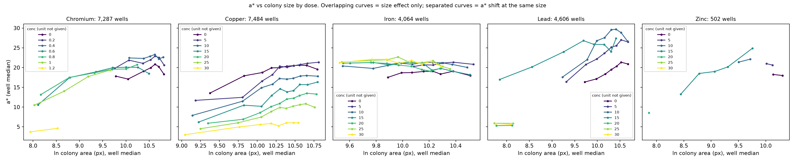

*Figure 1. a\* against colony size by dose (well medians, binned). Overlapping curves mean a size effect only. Separated curves mean a shift at the same size.*

| Metal | model | n_wells | n_strains | dose effect (0 to top) | SE | p | strain share @0 | strain share @top | singular |
|--------|-------------|-------|---------|----------------------|----|------|---------------|-----------------|--------|
| Chromium | total | 7287 | 307 | -12.65 | 1.05 | <0.001 | 0.48 | 0.29 | False |
| Chromium | at fixed size | 7287 | 307 | -8.54 | 0.98 | <0.001 | 0.52 | 0.31 | False |
| Copper | total | 7484 | 319 | -15.91 | 0.38 | <0.001 | 0.50 | 0.38 | False |
| Copper | at fixed size | 7484 | 319 | -13.39 | 0.31 | <0.001 | 0.51 | 0.31 | False |
| Lead | total | 4606 | 307 | -18.95 | 1.59 | <0.001 | 0.38 | 0.05 | True |
| Lead | at fixed size | 4606 | 307 | -4.31 | 1.23 | <0.001 | 0.43 | 0.10 | True |

*Table 1. Dose effect on a\* from 0 to the top dose. "total" has no size term. "at fixed size" adds ln(area). "strain share" is strain variance / (strain + plate + residual) at dose 0 and at the top dose. Both Pb models are singular fits.*

| dose | Chromium | Copper | Lead |
|-----|--------|------|-----|
| 0.20 | 2.15 |  |  |
| 0.40 | 3.11 |  |  |
| 0.60 | 1.17 |  |  |
| 0.80 | 0.92 |  |  |
| 1.00 | -2.93 |  |  |
| 1.20 | -9.83 |  |  |
| 5.00 |  | 0.08 | 4.93 |
| 10.00 |  | -3.21 | 7.96 |
| 15.00 |  | -5.52 | 9.49 |
| 20.00 |  | -8.65 | -0.01 |
| 25.00 |  | -10.57 | -0.25 |
| 30.00 |  | -12.36 | -0.23 |

*Table 2. a\* difference from 0 dose at fixed size (dose-as-factor model). Standard errors are 0.2-0.6 for Cr and Cu and 0.4-0.5 for Pb.*

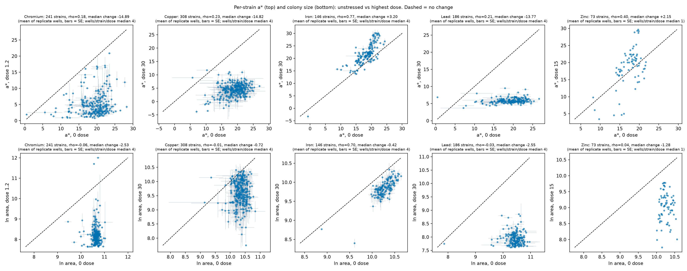

*Figure 2. Per-strain a\* (top) and ln area (bottom), unstressed against top dose (mean of replicate wells, bars = SE).*

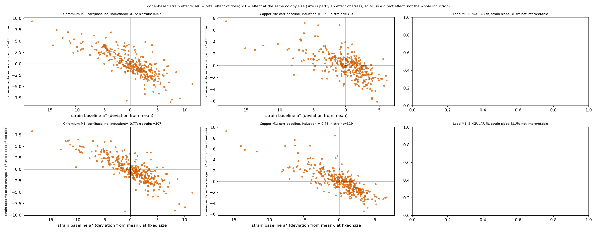

*Figure 2b. Model-based strain effects: baseline a\* (x) against the strain-specific extra change in a\* at the top dose (y), total (top row) and at fixed size (bottom row). Singular fits are not drawn. Points that lie on a straight line (a correlation near -1 or +1) mean the random-effect correlation is at the model boundary. Those points are a rescaling of one random effect and carry no separate information.*

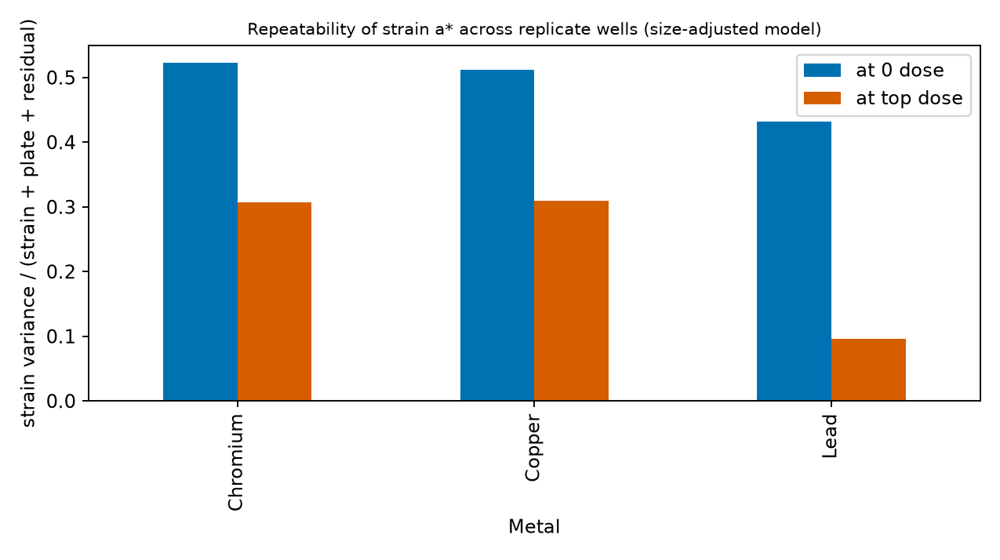

*Figure 3. Share of a\* variance due to strain at 0 dose and at the top dose (size-adjusted model).*

**Reading.** In all three metals strains converge toward a common low a\* at the top dose. The strain share falls from 0.52 to 0.31 (Cr), 0.51 to 0.31 (Cu) and 0.43 to 0.10 (Pb) (Table 1, size-adjusted model).

## 3. Which traits correlate with a\*

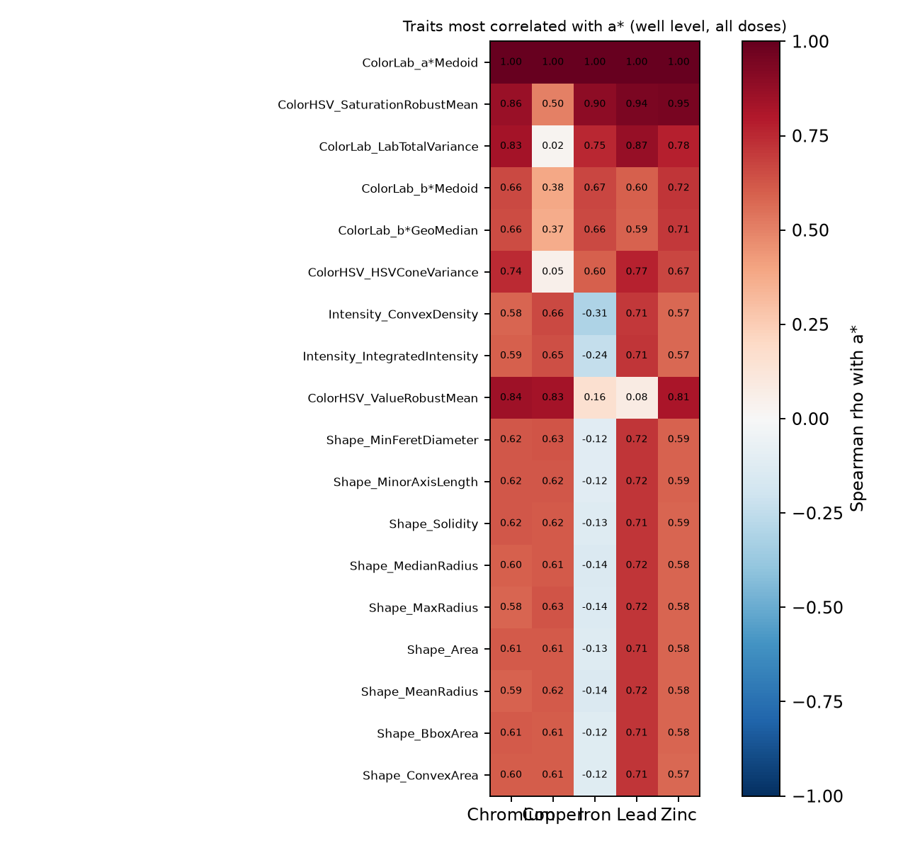

*Figure 4. Spearman correlation of a\* with the traits most correlated with it (well level, all doses).*

All doses (without `ColorLab_a*Medoid`, which is a\* itself):

| trait | Chromium | Copper | Lead | mean abs rho |
|--------------------------------------|--------|------|-----|------------|
| ColorHSV_SaturationRobustMean | 0.82 | 0.47 | 0.87 | 0.72 |
| ColorHSV_ValueRobustMean | 0.79 | 0.82 | 0.34 | 0.65 |
| ColorHSV_HueRobustMean | -0.35 | -0.90 | -0.39 | 0.55 |
| Intensity_CoefficientVarianceIntensity | -0.46 | -0.57 | 0.53 | 0.52 |
| Shape_MinorAxisLength | 0.50 | 0.60 | 0.46 | 0.52 |
| Shape_MinFeretDiameter | 0.50 | 0.60 | 0.46 | 0.52 |
| Shape_Solidity | 0.49 | 0.59 | 0.46 | 0.51 |
| Shape_Area | 0.49 | 0.59 | 0.46 | 0.51 |
| Shape_BboxArea | 0.48 | 0.58 | 0.46 | 0.51 |
| Intensity_IntegratedIntensity | 0.46 | 0.62 | 0.44 | 0.51 |

Control dose only:

| trait | Chromium | Copper | Lead | mean abs rho |
|---------------------------------------|--------|------|-----|------------|
| ColorHSV_SaturationRobustMean | 0.85 | 0.61 | 0.89 | 0.79 |
| ColorLab_LabTotalVariance | 0.79 | 0.73 | 0.79 | 0.77 |
| ColorHSV_HSVConeVariance | 0.68 | 0.60 | 0.71 | 0.66 |
| ColorHSV_ValueRobustMean | 0.69 | 0.52 | 0.66 | 0.63 |
| Intensity_StandardDeviationIntensity | -0.31 | -0.62 | -0.55 | 0.49 |
| Texture_SumVariance-deg090-scale05 | -0.21 | -0.60 | -0.52 | 0.44 |
| Intensity_CoefficientVarianceIntensity | -0.23 | -0.53 | -0.56 | 0.44 |
| Texture_HaralickVariance-deg090-scale05 | -0.20 | -0.59 | -0.52 | 0.44 |
| Texture_SumVariance-deg000-scale05 | -0.21 | -0.59 | -0.51 | 0.44 |
| Texture_HaralickVariance-deg000-scale05 | -0.20 | -0.59 | -0.51 | 0.44 |

Within strain and dose (replicate wells only):

| trait | Chromium | Copper | Lead | mean abs rho |
|-----------------------------|--------|------|----|------------|
| ColorHSV_SaturationRobustMean | 0.82 | 0.61 | 0.80 | 0.74 |
| ColorHSV_ValueRobustMean | 0.72 | 0.45 | 0.67 | 0.61 |
| ColorLab_b\*Medoid | 0.64 | 0.40 | 0.50 | 0.51 |
| ColorLab_b\*GeoMedian | 0.64 | 0.39 | 0.50 | 0.51 |
| ColorLab_LabTotalVariance | 0.66 | 0.20 | 0.63 | 0.50 |
| Shape_MinorAxisLength | 0.33 | 0.38 | 0.66 | 0.45 |
| Shape_Solidity | 0.32 | 0.38 | 0.66 | 0.45 |
| Shape_MinFeretDiameter | 0.32 | 0.38 | 0.66 | 0.45 |
| Shape_ConvexArea | 0.30 | 0.38 | 0.65 | 0.44 |
| Shape_MedianRadius | 0.28 | 0.38 | 0.66 | 0.44 |

**Reading.** Saturation, value and the colour-variance traits correlate most strongly with a\*. These share colour information with a\*. Size traits (area, radius, Feret diameter, integrated intensity) correlate at 0.44-0.62 in all three metals. Many size traits are near-duplicates, so treat them as one family. Replicate wells within a strain and dose still show an area-a\* correlation of 0.28 (Cr), 0.38 (Cu) and 0.64 (Pb), so the link is not only between strains.

## 4. Species and ploidy groups (stratification item 1)

Group is a fixed effect (reference: pure haploid R. mucilaginosa). Strain, run and plate are random. Groups with at least 5 strains are included. "Hybrid diploid" and "aff. mucilaginosa" are groups defined by the curation table; the hybrid group differs from the reference in both species composition and ploidy.

| Metal | model | F | p | p_BH |
|--------|---------------------------|----|------|------|
| Chromium | baseline | 8.05 | <0.001 | <0.001 |
| Chromium | baseline_size_adjusted | 8.05 | <0.001 | <0.001 |
| Chromium | dose_response_size_adjusted | 9.94 | <0.001 | <0.001 |
| Copper | baseline | 2.77 | 0.00 | 0.00 |
| Copper | baseline_size_adjusted | 2.98 | 0.00 | 0.00 |
| Copper | dose_response_size_adjusted | 3.14 | <0.001 | 0.00 |
| Lead | baseline | 7.98 | <0.001 | <0.001 |
| Lead | baseline_size_adjusted | 8.07 | <0.001 | <0.001 |
| Lead | dose_response_size_adjusted | 4.75 | <0.001 | <0.001 |

*Table 3. Omnibus tests (F test). `p_BH` is the Benjamini-Hochberg adjustment across all 9 rows (baseline, size-adjusted baseline and dose-response tests in three metals).*

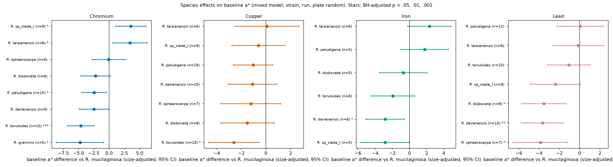

*Figure 5. Group effect on baseline a\* relative to pure haploid R. mucilaginosa (size-adjusted).*

| Metal | species | n_strains | estimate | se | p | p_BH |
|--------|------------------------------|---------|--------|----|------|------|
| Chromium | R. aff. mucilaginosa | 7 | -3.26 | 1.25 | 0.01 | 0.02 |
| Chromium | R. dairenensis | 8 | -3.08 | 1.18 | 0.01 | 0.02 |
| Chromium | R. diobovata | 9 | -3.25 | 1.11 | 0.00 | 0.01 |
| Chromium | R. frigidialcoholis | 5 | -3.46 | 1.47 | 0.02 | 0.04 |
| Chromium | R. mucilaginosa hybrid diploid | 33 | -2.92 | 0.62 | <0.001 | <0.001 |
| Chromium | R. paludigena | 12 | -3.12 | 0.98 | 0.00 | 0.01 |
| Chromium | R. sp_clade_I | 8 | 2.51 | 1.22 | 0.04 | 0.07 |
| Chromium | R. sphaerocarpa | 6 | -0.96 | 1.35 | 0.48 | 0.53 |
| Chromium | R. taiwanensis | 6 | 2.68 | 1.35 | 0.05 | 0.08 |
| Chromium | R. toruloides | 10 | -5.25 | 1.05 | <0.001 | <0.001 |
| Copper | R. aff. mucilaginosa | 7 | -2.55 | 1.26 | 0.05 | 0.08 |
| Copper | R. dairenensis | 10 | -1.69 | 1.03 | 0.10 | 0.13 |
| Copper | R. diobovata | 9 | -2.83 | 1.06 | 0.01 | 0.02 |
| Copper | R. frigidialcoholis | 5 | -2.65 | 1.43 | 0.06 | 0.09 |
| Copper | R. mucilaginosa hybrid diploid | 33 | -1.97 | 0.60 | 0.00 | 0.01 |
| Copper | R. paludigena | 18 | -1.43 | 0.83 | 0.08 | 0.11 |
| Copper | R. sp_clade_I | 9 | -1.03 | 1.13 | 0.36 | 0.42 |
| Copper | R. sphaerocarpa | 7 | -1.39 | 1.25 | 0.27 | 0.32 |
| Copper | R. taiwanensis | 6 | -0.30 | 1.33 | 0.82 | 0.85 |
| Copper | R. toruloides | 10 | -3.02 | 1.07 | 0.00 | 0.01 |
| Lead | R. aff. mucilaginosa | 7 | -3.42 | 1.09 | 0.00 | 0.01 |
| Lead | R. dairenensis | 10 | -4.35 | 1.01 | <0.001 | <0.001 |
| Lead | R. diobovata | 9 | -5.15 | 1.05 | <0.001 | <0.001 |
| Lead | R. frigidialcoholis | 5 | -5.35 | 1.29 | <0.001 | <0.001 |
| Lead | R. mucilaginosa hybrid diploid | 33 | -2.45 | 0.55 | <0.001 | <0.001 |
| Lead | R. paludigena | 9 | 0.71 | 1.21 | 0.56 | 0.59 |
| Lead | R. sp_clade_I | 9 | -2.67 | 1.27 | 0.04 | 0.07 |
| Lead | R. sphaerocarpa | 7 | -3.11 | 1.60 | 0.05 | 0.08 |
| Lead | R. taiwanensis | 6 | -0.08 | 1.22 | 0.95 | 0.95 |
| Lead | R. toruloides | 10 | -1.29 | 1.06 | 0.23 | 0.28 |

*Table 4. Group baseline contrasts (size-adjusted).*

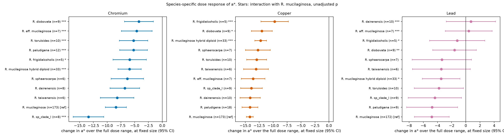

*Figure 6. Group-specific change in a\* over the full dose range at fixed size.*

| Metal | species | n_strains | slope_full_range | se | p vs mucilaginosa |
|--------|------------------------------|---------|----------------|----|-----------------|
| Chromium | R. mucilaginosa | 173 | -8.41 | 0.98 |  |
| Chromium | R. aff. mucilaginosa | 7 | -4.63 | 1.42 | <0.001 |
| Chromium | R. dairenensis | 8 | -6.78 | 1.37 | 0.11 |
| Chromium | R. diobovata | 9 | -4.23 | 1.33 | <0.001 |
| Chromium | R. frigidialcoholis | 5 | -5.91 | 1.54 | 0.04 |
| Chromium | R. mucilaginosa hybrid diploid | 33 | -5.93 | 1.07 | <0.001 |
| Chromium | R. paludigena | 12 | -5.21 | 1.28 | <0.001 |
| Chromium | R. sp_clade_I | 8 | -13.39 | 1.41 | <0.001 |
| Chromium | R. sphaerocarpa | 6 | -6.34 | 1.50 | 0.08 |
| Chromium | R. taiwanensis | 6 | -8.18 | 1.55 | 0.85 |
| Chromium | R. toruloides | 10 | -5.21 | 1.31 | <0.001 |
| Copper | R. mucilaginosa | 173 | -14.19 | 0.32 |  |
| Copper | R. aff. mucilaginosa | 7 | -13.60 | 1.09 | 0.59 |
| Copper | R. dairenensis | 10 | -14.15 | 0.93 | 0.96 |
| Copper | R. diobovata | 9 | -12.05 | 0.96 | 0.02 |
| Copper | R. frigidialcoholis | 5 | -9.74 | 1.26 | <0.001 |
| Copper | R. mucilaginosa hybrid diploid | 33 | -12.25 | 0.53 | <0.001 |
| Copper | R. paludigena | 18 | -14.17 | 0.73 | 0.98 |
| Copper | R. sp_clade_I | 9 | -13.91 | 0.99 | 0.78 |
| Copper | R. sphaerocarpa | 7 | -12.75 | 1.14 | 0.20 |
| Copper | R. taiwanensis | 6 | -13.08 | 1.14 | 0.33 |
| Copper | R. toruloides | 10 | -12.96 | 0.91 | 0.17 |
| Lead | R. mucilaginosa | 172 | -4.80 | 1.25 |  |
| Lead | R. aff. mucilaginosa | 7 | 0.41 | 1.69 | <0.001 |
| Lead | R. dairenensis | 10 | 0.72 | 1.78 | <0.001 |
| Lead | R. diobovata | 9 | -1.60 | 1.57 | 0.00 |
| Lead | R. frigidialcoholis | 5 | -1.21 | 1.99 | 0.02 |
| Lead | R. mucilaginosa hybrid diploid | 33 | -3.49 | 1.36 | 0.04 |
| Lead | R. paludigena | 9 | -4.75 | 1.84 | 0.97 |
| Lead | R. sp_clade_I | 9 | -4.37 | 1.92 | 0.77 |
| Lead | R. sphaerocarpa | 7 | -3.38 | 2.14 | 0.43 |
| Lead | R. taiwanensis | 6 | -3.45 | 2.09 | 0.43 |
| Lead | R. toruloides | 10 | -3.80 | 1.77 | 0.45 |

*Table 5. Group-specific dose slopes (a\* change over the full dose range).*

| Metal | n_other_strains | baseline_diff | baseline_se | baseline_p | slope_diff | slope_se | slope_p |
|--------|---------------|-------------|-----------|----------|----------|--------|-------|
| Chromium | 104 | -2.45 | 0.43 | 0.00 | 2.14 | 0.37 | 0.00 |
| Copper | 114 | -1.91 | 0.38 | 0.00 | 1.29 | 0.33 | 0.00 |
| Lead | 105 | -2.70 | 0.39 | 0.00 | 2.16 | 0.46 | 0.00 |

*Table 6. Pure haploid R. mucilaginosa against all other groups pooled (contrast only; the pool includes hybrids and aff. mucilaginosa).*

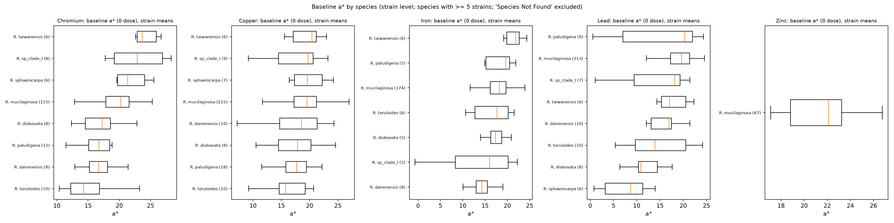

*Figure 7. Baseline a\* by group (strain means; groups with at least 5 strains).*

**Reading.**

- Hybrid diploids have lower baseline a\* than pure haploids in all three metals, and a weaker dose response in all three (Tables 4 and 5). The ploidy and the parental mixture cannot be separated here.
- Pooled other groups are lower in baseline a\* than pure haploid R. mucilaginosa in all three metals (-1.9 to -2.7) and respond less strongly (slope difference +1.3 to +2.2; Table 6).
- Species effects differ between metals. For example R. paludigena has no Pb baseline difference (+0.7) but is -3.1 in Cr. R. sp_clade_I is +2.5 in Cr and -2.7 in Pb. The non-mucilaginosa groups have 5-18 strains each, so single-group contrasts are noisy. Cu shows the weakest species signal (omnibus F = 3.0).
- R. sp_clade_I responds most strongly in Cr (-13.4 over the full range against -8.4 for the reference). In Cu most groups match the reference (-12.0 to -14.2); R. frigidialcoholis is weaker (-9.7).

## 5. Phylogenetic signal (item 2)

The PHYling tree is rooted on the outgroup clade made of its two non-Rhodotorula tips, Cystobasidium sp. DBVPG_10075 and Pseudomicrostroma phylloplanum DBVPG_6740. The root sits in the middle of the branch that separates them from the Rhodotorula strains. Lambda depends on the root, because the covariance under Brownian motion is built from the distance from the root to the common ancestor of each pair of strains.

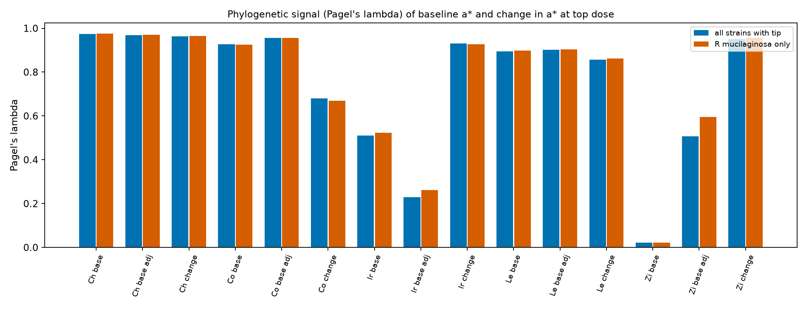

*Figure 8. Pagel's lambda of baseline a\* and of the change in a\* at the top dose.*

| Metal | scope | trait | n_strains | pagel_lambda | p (lambda > 0) |
|--------|--------------------|----------------------------|---------|------------|--------------|
| Chromium | all_strains_with_tip | baseline a\* | 255 | 0.79 | <0.001 |
| Chromium | all_strains_with_tip | baseline a\* (size-adjusted) | 255 | 0.79 | <0.001 |
| Chromium | all_strains_with_tip | change in a\* at dose 1.2 | 209 | 0.62 | <0.001 |
| Chromium | R_mucilaginosa_only | baseline a\* | 163 | 0.91 | 0.01 |
| Chromium | R_mucilaginosa_only | baseline a\* (size-adjusted) | 163 | 0.92 | 0.01 |
| Chromium | R_mucilaginosa_only | change in a\* at dose 1.2 | 135 | 0.90 | 0.01 |
| Copper | all_strains_with_tip | baseline a\* | 264 | 0.49 | <0.001 |
| Copper | all_strains_with_tip | baseline a\* (size-adjusted) | 264 | 0.48 | <0.001 |
| Copper | all_strains_with_tip | change in a\* at dose 30 | 256 | 0.13 | 0.51 |
| Copper | R_mucilaginosa_only | baseline a\* | 163 | <0.001 | 1.00 |
| Copper | R_mucilaginosa_only | baseline a\* (size-adjusted) | 163 | <0.001 | 1.00 |
| Copper | R_mucilaginosa_only | change in a\* at dose 30 | 163 | 0.91 | 0.19 |
| Lead | all_strains_with_tip | baseline a\* | 249 | 0.73 | <0.001 |
| Lead | all_strains_with_tip | baseline a\* (size-adjusted) | 249 | 0.69 | <0.001 |
| Lead | all_strains_with_tip | change in a\* at dose 30 | 164 | 0.56 | <0.001 |
| Lead | R_mucilaginosa_only | baseline a\* | 161 | <0.001 | 1.00 |
| Lead | R_mucilaginosa_only | baseline a\* (size-adjusted) | 161 | <0.001 | 1.00 |
| Lead | R_mucilaginosa_only | change in a\* at dose 30 | 106 | <0.001 | 1.00 |

*Table 7. Pagel's lambda (maximum likelihood under Brownian motion on the PHYling FastTree). 249-264 strains with a tree tip in the all-strains scope; 161-163 pure haploid R. mucilaginosa strains in the second scope.*

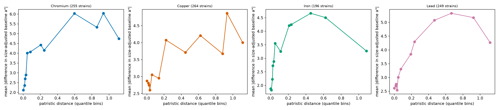

*Figure 9. Mean absolute difference in size-adjusted baseline a\* between pairs of strains, by patristic distance.*

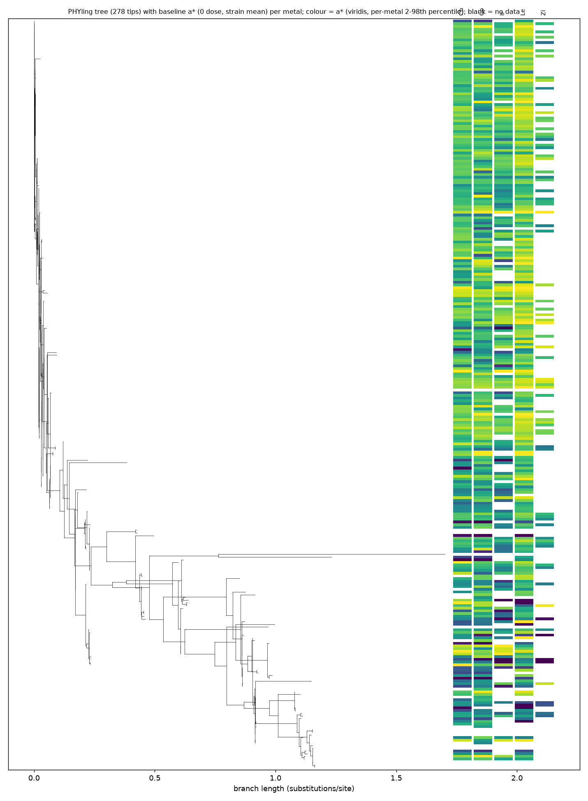

*Figure 10. The tree rooted on the Cystobasidium + Pseudomicrostroma outgroup clade (bottom), with the species of each tip and baseline a\* per metal (strain mean at dose 0, one common colour scale; blank = no data).*

**Reading and limits.**

- Closely related strains share baseline a\*. Lambda is 0.79 (Cr), 0.49 (Cu) and 0.74 (Pb) for all strains with a tip (Table 7). Inside pure haploid R. mucilaginosa it is 0.91 for Cr (p = 0.008) and 0.00 for Cu and Pb, so the signal in Cu and Pb is the separation between species and groups, not structure inside the haploid species. The pairwise difference in size-adjusted a\* increases with patristic distance (Figure 9; patristic distance does not depend on the root).
- **The root matters.** The first version of this report used the arbitrary root of the tree file and got different values. The outgroup-rooted values are used because the outgroup root is the biologically meaningful one.
- Lambda of the change in a\* at the top dose is 0.62 (Cr), 0.13 (Cu; p = 0.51) and 0.56 (Pb) for all strains. The change is top-dose a\* minus baseline a\*, and top-dose a\* sits on a floor with little variation (Pb SD 0.77 across strains), so for Pb, Cr and Cu the change partly restates the baseline.
- **Blomberg's K was dropped.** The tree has 22 zero-length tips and 74 tips with a neighbour closer than 1e-5, so the covariance matrix is nearly singular (condition number about 2e10 with the outgroup root). K varied from about 0 to 0.06 with the diagonal jitter (Table 8), so it is not interpretable. Lambda was stable across jitter 1e-8 to 1e-3 (for example 0.48 in Cu).
- Strains within species and groups are not independent (lambda 0.5-0.9 in the all-strains scope). The group tests in section 4 treat strain as the only grouping, so their p-values are too small.
- 266 of 321 strains have a unique tree tip. Strains without a tip are excluded.

| Metal | jitter | cond | lam | K | pK |
|--------|------|--------|-----|--------|-----|
| Copper | 1e-08 | 1.98e+10 | 0.482 | 7.62e-07 | 0.005 |
| Copper | 1e-06 | 1.98e+08 | 0.482 | 3.82e-05 | 0.005 |
| Copper | 0.0001 | 1.98e+06 | 0.482 | 0.00147 | 0.005 |
| Copper | 0.001 | 1.98e+05 | 0.482 | 0.00952 | 0.005 |
| Copper | 0.01 | 1.98e+04 | 0.487 | 0.0585 | 0.015 |
| Lead | 1e-08 | 1.95e+10 | 0.686 | 8.72e-07 | 0.005 |
| Lead | 1e-06 | 1.95e+08 | 0.686 | 4.08e-05 | 0.005 |
| Lead | 0.0001 | 1.95e+06 | 0.686 | 0.00125 | 0.005 |
| Lead | 0.001 | 1.95e+05 | 0.688 | 0.00703 | 0.005 |
| Lead | 0.01 | 1.95e+04 | 0.696 | 0.0407 | 0.005 |
| Chromium | 1e-08 | 1.97e+10 | 0.789 | 8.03e-07 | 0.005 |
| Chromium | 1e-06 | 1.97e+08 | 0.789 | 4.88e-05 | 0.005 |
| Chromium | 0.0001 | 1.97e+06 | 0.789 | 0.00203 | 0.005 |
| Chromium | 0.001 | 1.97e+05 | 0.789 | 0.0132 | 0.005 |
| Chromium | 0.01 | 1.97e+04 | 0.799 | 0.0795 | 0.005 |

*Table 8. Sensitivity of lambda and K to the diagonal jitter added to the covariance matrix (main dataset, outgroup-rooted tree).*

## 6. Dose regimes (item 3)

A dose is **sub-inhibitory** when the median (across strains) of area at that dose / area at dose 0 is at least 0.5. Otherwise it is **inhibitory**. The 0.5 cutoff is a choice, not a measured threshold. The regime is defined from colony size, and size also relates to a\*, so the split is descriptive and partly circular.

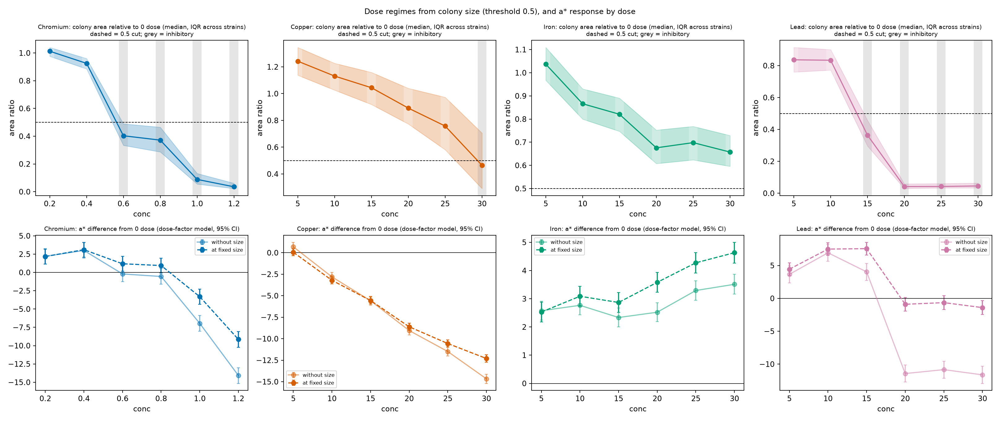

*Figure 11. Top: area ratio by dose with the 0.5 cutoff. Bottom: a\* difference from 0 dose, with and without size.*

| Metal | conc | median_ratio | q25 | q75 | n_strains | regime |
|--------|-----|------------|----|----|---------|--------------|
| Chromium | 0.20 | 1.01 | 0.98 | 1.04 | 305 | sub-inhibitory |
| Chromium | 0.40 | 0.93 | 0.88 | 0.96 | 305 | sub-inhibitory |
| Chromium | 0.60 | 0.40 | 0.34 | 0.49 | 305 | inhibitory |
| Chromium | 0.80 | 0.37 | 0.29 | 0.46 | 305 | inhibitory |
| Chromium | 1.00 | 0.12 | 0.09 | 0.16 | 292 | inhibitory |
| Chromium | 1.20 | 0.08 | 0.06 | 0.10 | 241 | inhibitory |
| Copper | 5.00 | 1.24 | 1.14 | 1.34 | 319 | sub-inhibitory |
| Copper | 10.00 | 1.12 | 1.03 | 1.21 | 318 | sub-inhibitory |
| Copper | 15.00 | 1.05 | 0.95 | 1.14 | 317 | sub-inhibitory |
| Copper | 20.00 | 0.90 | 0.79 | 1.02 | 313 | sub-inhibitory |
| Copper | 25.00 | 0.76 | 0.60 | 0.94 | 311 | sub-inhibitory |
| Copper | 30.00 | 0.48 | 0.35 | 0.70 | 308 | inhibitory |
| Lead | 5.00 | 0.84 | 0.77 | 0.92 | 295 | sub-inhibitory |
| Lead | 10.00 | 0.83 | 0.77 | 0.89 | 295 | sub-inhibitory |
| Lead | 15.00 | 0.37 | 0.30 | 0.44 | 288 | inhibitory |
| Lead | 20.00 | 0.08 | 0.07 | 0.10 | 165 | inhibitory |
| Lead | 25.00 | 0.08 | 0.07 | 0.10 | 177 | inhibitory |
| Lead | 30.00 | 0.08 | 0.07 | 0.10 | 186 | inhibitory |

*Table 9. Colony area relative to 0 dose.*

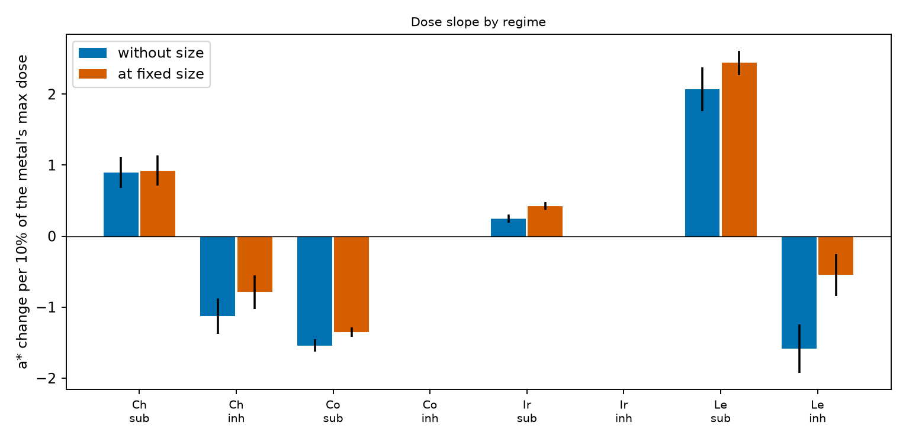

*Figure 12. Slope of a\* per 10% of the maximum dose, by regime.*

| Metal | regime | doses | n_wells | size_adjusted | slope_per_0.1_of_max_dose | se | p |
|--------|--------------|---------------|-------|-------------|-------------------------|----|------|
| Chromium | sub-inhibitory | 0,0.2,0.4 | 3562 | False | 0.89 | 0.11 | <0.001 |
| Chromium | sub-inhibitory | 0,0.2,0.4 | 3562 | True | 0.92 | 0.11 | <0.001 |
| Chromium | inhibitory | 0,0.6,0.8,1,1.2 | 4913 | False | -1.14 | 0.13 | <0.001 |
| Chromium | inhibitory | 0,0.6,0.8,1,1.2 | 4913 | True | -0.80 | 0.12 | <0.001 |
| Copper | sub-inhibitory | 0,5,10,15,20,25 | 6490 | False | -1.54 | 0.05 | <0.001 |
| Copper | sub-inhibitory | 0,5,10,15,20,25 | 6490 | True | -1.35 | 0.03 | <0.001 |
| Lead | sub-inhibitory | 0,5,10 | 2929 | False | 2.03 | 0.16 | <0.001 |
| Lead | sub-inhibitory | 0,5,10 | 2929 | True | 2.40 | 0.10 | <0.001 |
| Lead | inhibitory | 0,15,20,25,30 | 2655 | False | -1.59 | 0.17 | <0.001 |
| Lead | inhibitory | 0,15,20,25,30 | 2655 | True | -0.55 | 0.15 | <0.001 |

*Table 10. Regime-specific slopes (a\* change per 10% of the metal's maximum dose; random effects for strain, run and plate).*

**Reading.**

- Cr: sub-inhibitory doses (0-0.4) raise a\* by +0.9 per 10% of the range. Inhibitory doses lower it (-0.8 at fixed size, -1.1 without size).
- Pb: sub-inhibitory doses (0-10) raise a\* by +2.0 (without size) to +2.4 (at fixed size) per 10%. Inhibitory doses (15-30) lower it (-0.5 at fixed size, -1.6 without size). The inhibitory estimate rests on few wells after the area cutoff (section 10).
- Cu: only the top dose is inhibitory (area ratio 0.49), yet a\* falls steadily (-1.4 per 10% at fixed size). Cu lowers a\* without much reduction in colony size.

## 7. Size-matched comparison (item 4)

Colonies are placed in five size bins (quantiles of ln area within each metal, among colonies of at least 2,000 px). The dose effect is estimated inside each bin.

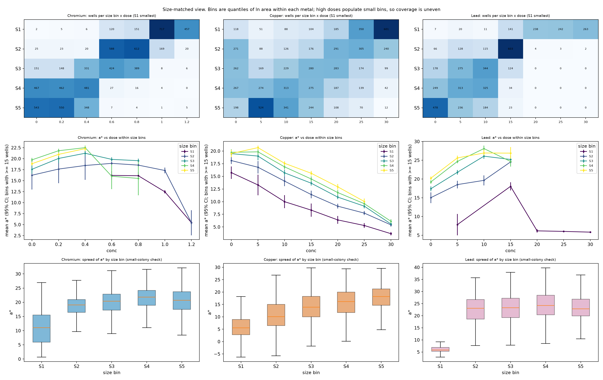

*Figure 13. Wells per size bin and dose (top), a\* against dose within bins (middle), and a\* spread by size bin (bottom).*

| Metal | size_bin | n_wells | n_doses | mean_a | sd_a | slope_full_range | se | p | max_dose_s_in_bin | change_over_observed_range |
|--------|--------|-------|-------|------|----|----------------|----|------|-----------------|--------------------------|
| Chromium | S1 | 1458 | 7 | 10.93 | 5.88 | -14.12 | 1.98 | <0.001 | 1.00 | -14.12 |
| Chromium | S2 | 1457 | 7 | 18.32 | 4.37 | -7.25 | 1.61 | <0.001 | 1.00 | -7.25 |
| Chromium | S3 | 1457 | 7 | 19.73 | 5.20 | -4.73 | 1.15 | <0.001 | 1.00 | -4.73 |
| Chromium | S4 | 1457 | 6 | 21.15 | 4.66 | -2.04 | 1.45 | 0.16 | 0.83 | -1.70 |
| Chromium | S5 | 1458 | 7 | 20.37 | 4.72 | -10.84 | 1.99 | <0.001 | 1.00 | -10.84 |
| Copper | S1 | 1497 | 7 | 6.36 | 5.88 | -12.41 | 0.37 | <0.001 | 1.00 | -12.41 |
| Copper | S2 | 1497 | 7 | 11.01 | 6.07 | -13.59 | 0.34 | <0.001 | 1.00 | -13.59 |
| Copper | S3 | 1496 | 7 | 14.01 | 5.68 | -14.19 | 0.35 | <0.001 | 1.00 | -14.19 |
| Copper | S4 | 1497 | 7 | 15.88 | 5.38 | -14.07 | 0.45 | <0.001 | 1.00 | -14.07 |
| Copper | S5 | 1497 | 7 | 17.82 | 4.80 | -13.69 | 0.59 | <0.001 | 1.00 | -13.69 |
| Lead | S1 | 922 | 7 | 7.93 | 5.40 | -4.96 | 1.85 | 0.01 | 1.00 | -4.96 |
| Lead | S2 | 921 | 7 | 22.25 | 6.29 | 8.73 | 1.81 | <0.001 | 1.00 | 8.73 |
| Lead | S3 | 921 | 4 | 23.00 | 5.98 | 19.47 | 1.12 | <0.001 | 0.50 | 9.74 |
| Lead | S4 | 921 | 4 | 24.41 | 5.91 | 22.81 | 1.45 | <0.001 | 0.50 | 11.40 |
| Lead | S5 | 921 | 4 | 23.11 | 5.61 | 22.43 | 1.51 | <0.001 | 0.50 | 11.22 |

*Table 11. Dose effect within size bins. `slope_full_range` is the a\* change over the full dose range; `change_over_observed_range` multiplies it by the highest dose in the bin (random effects: strain intercept and slope, run, plate).*

**Reading.**

- Cu: a\* falls with dose in every size bin (-12.4 to -14.2 over the full range), and all seven doses are present in every bin. This is the cleanest size-matched result: Cu lowers a\* at the same size.
- Cr: negative in every bin (-14.1 to -2.0). The effect in bin S4 (-2.0) is not significant (p = 0.16), and S4 lacks dose 1.2.
- Pb: size and dose stay confounded. The three largest bins contain only doses 0-15. Their slopes (+19 to +23 per full dose range) extrapolate twice beyond the observed range. The change over the observed range is +9.7, +11.4 and +11.2 (last column of Table 11). The smallest bin is negative (-5.0) and the second smallest positive (+8.7). There is no single size-matched Pb estimate.
- **Coverage is uneven.** High doses populate the small bins, and some size-by-dose cells in Cr and Pb hold few wells. Bins are quantiles of pooled ln area, so dose and size remain confounded inside a bin.

## 8. Selection on baseline, split-half (item 5)

Strains need at least 2 replicate wells at dose 0 and at the top dose. Replicate wells are split at random into halves A and B (1,000 splits). **Naive:** select the top and bottom baseline thirds from all wells and measure the change in the same wells. **Split-half:** select on half A, measure the change in half B.

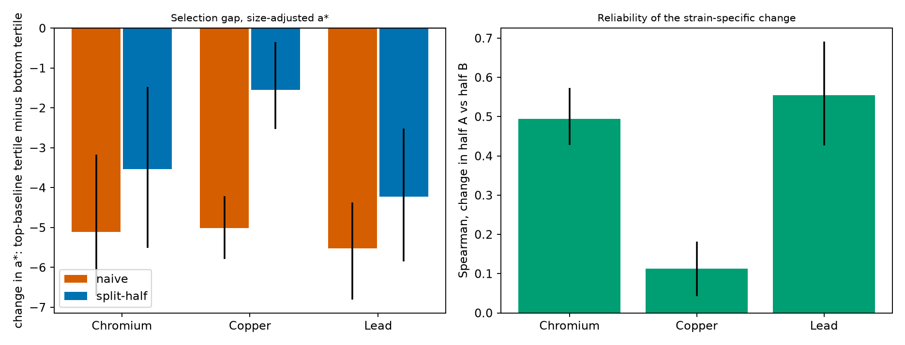

*Figure 14. Gap in the change in a\* between the high- and low-baseline thirds (left) and reliability of the strain-specific change (right).*

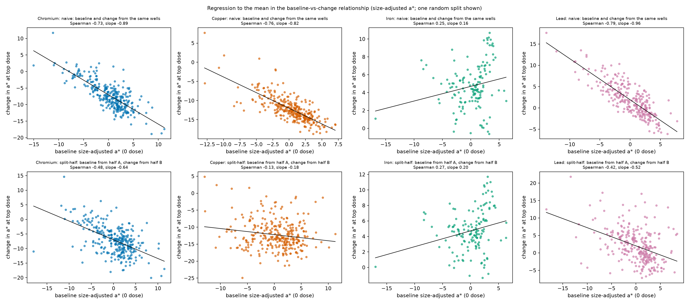

*Figure 15. Baseline against change in a\*: same wells (top) and independent halves (bottom).*

| Metal | top_dose | n_strains | naive_gap | naive_ci_lo | naive_ci_hi | split_gap_mean | split_gap_ci_lo | split_gap_ci_hi | reliability_change_A_vs_B | reliability_baseline_A_vs_B |
|--------|--------|---------|---------|-----------|-----------|--------------|---------------|---------------|-------------------------|---------------------------|
| Chromium | 1.20 | 148 | -5.11 | -6.71 | -3.17 | -3.53 | -5.50 | -1.47 | 0.49 | 0.60 |
| Copper | 30.00 | 298 | -5.01 | -5.79 | -4.21 | -1.55 | -2.53 | -0.35 | 0.11 | 0.25 |
| Lead | 30.00 | 62 | -5.52 | -6.80 | -4.37 | -4.22 | -5.85 | -2.52 | 0.55 | 0.70 |

*Table 12. Size-adjusted a\*. `naive_gap` and `split_gap_mean` are the change in the top-baseline third minus the bottom third (95% CI from a bootstrap over strains). `reliability_change_A_vs_B` is the Spearman correlation of the strain-specific change between the two halves.*

**Reading.**

- Part of the strong negative baseline-vs-change relationship is regression to the mean. The gap shrinks from -5.0 to -1.5 in Cu, from -5.1 to -3.5 in Cr and from -5.5 to -4.2 in Pb.
- In Cu the strain-specific change is barely repeatable (0.11).
- Only 62 Pb strains have enough wells at dose 30 after the area cutoff (Cr 148, Cu 298), so the Pb estimate is uncertain.
- The reliabilities are for halves of 1-2 wells and understate full-data reliability.
- "Size-adjusted" here is the residual of a\* on ln area from a line fitted to the dose-0 wells of each metal. That differs from the ln(area) term in the mixed models, and it extrapolates a linear slope to small top-dose colonies.

## 9. Batch (item 6)

Each metal is analysed separately, with run and plate as random effects (all models above). Each run is a different set of 67-84 strains across all doses, so run and strain set are confounded.

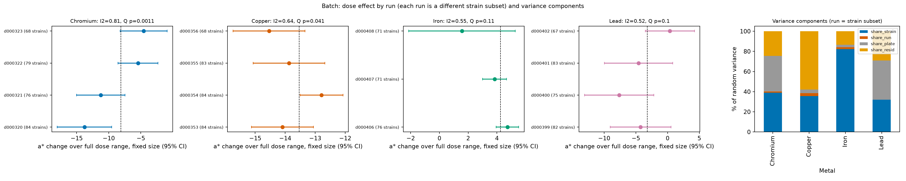

*Figure 16. Dose effect at fixed size by run (left three panels) and variance components (right).*

| Metal | k_runs | pooled_effect | Q | Q_p | I2 |
|--------|------|-------------|-----|----|----|
| Chromium | 4 | -8.33 | 13.30 | 0.00 | 0.77 |
| Copper | 4 | -13.40 | 5.88 | 0.12 | 0.49 |
| Lead | 4 | -2.97 | 6.37 | 0.10 | 0.53 |

*Table 13. Heterogeneity of the dose effect across runs (I2, Cochran Q).*

| Metal | run | n_wells | n_strains | n_doses | dose_effect | se | p |
|--------|-------|-------|---------|-------|-----------|----|------|
| Chromium | d000320 | 2018 | 84 | 7 | -13.78 | 2.16 | <0.001 |
| Chromium | d000321 | 1879 | 76 | 7 | -10.47 | 1.92 | <0.001 |
| Chromium | d000322 | 1877 | 79 | 7 | -6.38 | 1.70 | <0.001 |
| Chromium | d000323 | 1513 | 68 | 7 | -4.27 | 1.94 | 0.03 |
| Copper | d000353 | 2078 | 84 | 7 | -14.17 | 0.56 | <0.001 |
| Copper | d000354 | 1957 | 84 | 7 | -12.79 | 0.36 | <0.001 |
| Copper | d000355 | 1863 | 83 | 7 | -13.87 | 0.61 | <0.001 |
| Copper | d000356 | 1586 | 68 | 7 | -14.09 | 0.92 | <0.001 |
| Lead | d000399 | 1412 | 82 | 7 | -3.70 | 2.43 | 0.14 |
| Lead | d000400 | 1109 | 75 | 7 | -7.48 | 2.79 | 0.01 |
| Lead | d000401 | 1097 | 83 | 7 | -4.58 | 2.75 | 0.10 |
| Lead | d000402 | 988 | 67 | 7 | 0.66 | 1.99 | 0.74 |

*Table 14. Dose effect (a\* change over the full dose range at fixed size) per run.*

| Metal | n_runs | share_strain | share_run | share_plate | share_resid | singular |
|--------|------|------------|---------|-----------|-----------|--------|
| Chromium | 4 | 0.39 | 0.01 | 0.35 | 0.24 | False |
| Copper | 4 | 0.36 | 0.03 | 0.04 | 0.58 | False |
| Lead | 4 | 0.32 | 0.00 | 0.39 | 0.29 | True |

*Table 15. Variance components (shares of random variance).*

**Reading.** Run explains 0-3% of the random variance. Plate explains 35% (Cr) and 39% (Pb), but only 4% in Cu. Only Cr shows clear heterogeneity of the dose effect between runs (I2 = 0.77, Q p = 0.004). The Cr effect shrinks from run d000320 to d000323 (-13.8, -10.5, -6.4, -4.3). This could be a run-order effect or a difference between strain subsets. The Cu runs lie within -12.8 to -14.2 and the heterogeneity is not significant (p = 0.12). These models have a random strain dose slope.

## 10. Colony area cutoff (2,000 px)

Very small colonies may have a\* dominated by background pixels. Every image was used to test this. Colonies are small early at every dose. So unstressed small colonies (early) can be compared with stressed small colonies (late) at the same area.

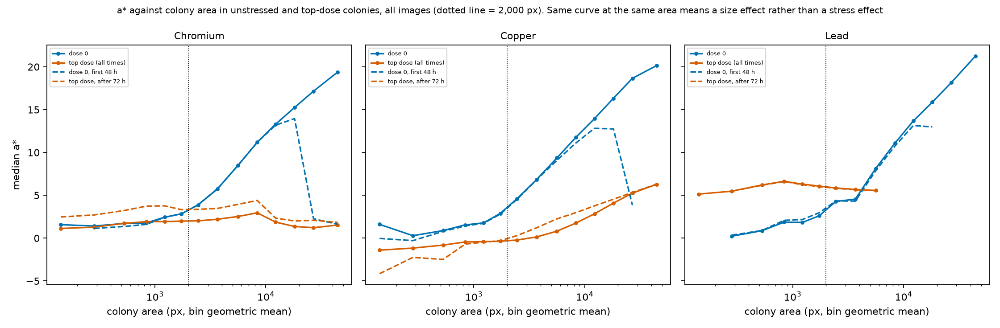

*Figure 17. Median a\* against colony area, unstressed (dose 0) and top dose, all images. The dotted line is 2,000 px.*

| area (px, bin start) | Chromium | Copper | Lead |
|--------------------|--------|------|----|
| 100 | 1.6 | 1.6 |  |
| 200 | 1.4 | 0.3 | 0.2 |
| 400 | 1.7 | 0.9 | 0.9 |
| 700 | 1.8 | 1.5 | 1.9 |
| 1000 | 2.4 | 1.8 | 1.8 |
| 1500 | 2.8 | 2.9 | 2.6 |
| 2000 | 3.9 | 4.6 | 4.3 |
| 3000 | 5.8 | 6.8 | 4.6 |
| 4500 | 8.5 | 9.4 | 8.1 |
| 7000 | 11.2 | 11.8 | 11.1 |
| 10000 | 13.3 | 13.9 | 13.7 |
| 15000 | 15.3 | 16.3 | 15.9 |
| 22000 | 17.2 | 18.7 | 18.2 |
| 32990 | 19.4 | 20.1 | 21.3 |

*Table 16. Median a\* in area bins for unstressed colonies (dose 0). Bins with fewer than 30 colonies are blank.*

| Metal | scope | n | change-point (px) | slope_below | slope_above | share of wells below |
|--------|---------|------|-----------------|-----------|-----------|--------------------|
| Chromium | dose 0 | 20229 | 1834.85 | 0.05 | 5.19 | 0.04 |
| Chromium | top dose | 20245 | 8000 | 0.52 | -1.67 | 0.97 |
| Chromium | all doses | 147748 | 2030.97 | 1.01 | 5.65 | 0.20 |
| Copper | dose 0 | 21281 | 1744.01 | 0.91 | 5.61 | 0.13 |
| Copper | top dose | 19271 | 4814.78 | 0.59 | 2.85 | 0.42 |
| Copper | all doses | 140311 | 5329.41 | 1.41 | 7.17 | 0.32 |
| Lead | dose 0 | 15436 | 3207.49 | 1.72 | 6.47 | 0.27 |
| Lead | top dose | 13553 | 735.66 | 1.53 | -1.06 | 0.15 |
| Lead | all doses | 104024 | 2897.76 | -0.01 | 7.36 | 0.55 |

*Table 17. Change-point of a\* against ln area (piecewise linear fit; area in px where the slope increases).*

**Reading.**

- **a\* depends on area in every metal, even without stress.** At dose 0, median a\* is 0.2-2.4 below 1,500 px, 2.6-2.9 at 1,500-2,000 px, 3.9-4.6 at 2,000-3,000 px, 8-9 at 4,500 px and 19-21 at 33,000 px. The curve is nearly the same in Cr, Cu and Pb. The first-48-h curve (dashed) matches the all-times curve, so area and colony age cannot be separated.
- **Cr and Cu: stressed and unstressed colonies differ little in a\* below about 1,500 px.** At 100-1,500 px the top-dose median is 1.1-1.9 (Cr) and -1.4 to -0.4 (Cu), against 1.4-2.4 and 0.3-1.8 at dose 0. The gap is at most about 2 a\* units there (Cu), against 10 or more above 5,000 px. Above 1,500-2,000 px stressed colonies are clearly lower.
- **Pb: stressed colonies of the same small size have higher a\* than unstressed ones.** Pb top-dose a\* is 5.1-6.6 at 100-1,500 px, against 0.2-1.9 at dose 0. So the Pb floor near 6 is partly a stress effect and not only a pixel effect.
- **The change-point estimates differ by metal** (Table 17: 1,700-1,800 px for Cr and Cu at dose 0; 3,200 px for Pb). The slope below the change-point is 0.05 (Cr) and 0.9 (Cu) but 1.7 for Pb, against 5-6.5 above, so "flat" holds for Cr and Cu and only "low and slowly rising" for Pb. The per-bin medians show a step at about 1,500-2,000 px in all three metals. The 2,000 px value was therefore chosen from the data and applied to all metals. It is assumed, not tested, for Pb.
- **The cutoff does not remove the size confound.** a\* keeps rising with area above 2,000 px, so every model still includes a size term.

**What the cutoff removes** (share of wells in the unfiltered table that are lost):

| Metal | dose | wells, unfiltered | wells, main | retained_% |
|--------|----|-----------------|-----------|----------|
| Chromium | 0 | 1197 | 1188 | 99 |
| Chromium | 0.2 | 1192 | 1188 | 100 |
| Chromium | 0.4 | 1188 | 1186 | 100 |
| Chromium | 0.6 | 1171 | 1166 | 100 |
| Chromium | 0.8 | 1179 | 1172 | 99 |
| Chromium | 1 | 1129 | 899 | 80 |
| Chromium | 1.2 | 1052 | 488 | 46 |
| Copper | 0 | 1138 | 1116 | 98 |
| Copper | 5 | 1124 | 1106 | 98 |
| Copper | 10 | 1106 | 1097 | 99 |
| Copper | 15 | 1107 | 1079 | 97 |
| Copper | 20 | 1078 | 1054 | 98 |
| Copper | 25 | 1061 | 1038 | 98 |
| Copper | 30 | 1038 | 994 | 96 |
| Lead | 0 | 1023 | 978 | 96 |
| Lead | 5 | 1025 | 972 | 95 |
| Lead | 10 | 1013 | 979 | 97 |
| Lead | 15 | 1004 | 925 | 92 |
| Lead | 20 | 891 | 242 | 27 |
| Lead | 25 | 924 | 245 | 27 |
| Lead | 30 | 875 | 265 | 30 |

*Table 18. Wells in the unfiltered table and in the main table, by metal and dose. Most losses are at the top doses of Cr and Pb.*

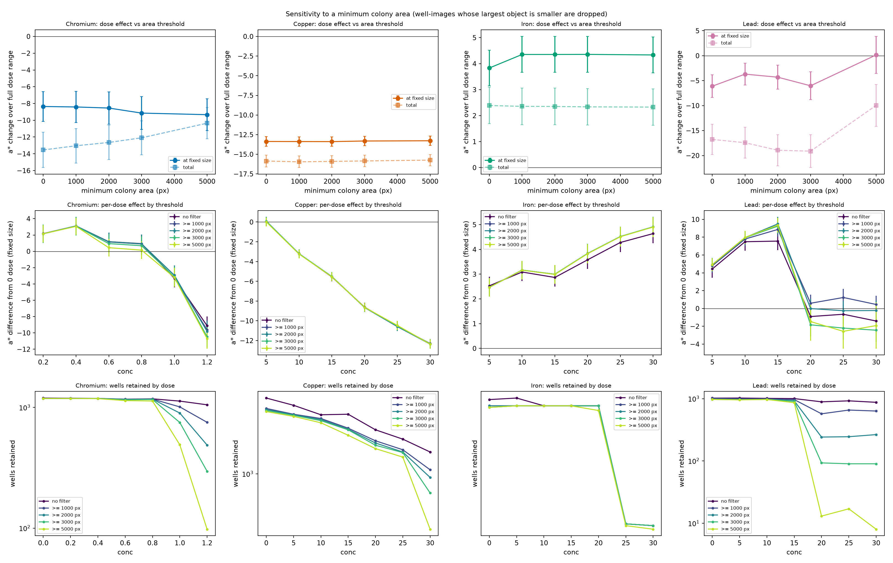

*Figure 18. Sensitivity to the area cutoff: dose effect against threshold (top), per-dose effect at fixed size (middle), wells retained by dose (bottom). Threshold 0 is the unfiltered run.*

| Metal | 0 | 1000 | 2000 | 3000 | 5000 |
|--------|------|------|------|------|------|
| Chromium | -8.36 | -8.41 | -8.54 | -9.14 | -9.33 |
| Copper | -13.37 | -13.38 | -13.39 | -13.31 | -13.28 |
| Lead | -6.10 | -3.69 | -4.31 | -6.03 | 0.15 |

*Table 19. Dose effect on a\* (at fixed size) by minimum colony area (0 = no filter).*

| dose | effect @0 | effect @1000 | effect @2000 | effect @3000 | effect @5000 | wells @0 | wells @1000 | wells @2000 | wells @3000 | wells @5000 |
|----|---------|------------|------------|------------|------------|--------|-----------|-----------|-----------|-----------|
| 0 |  |  |  |  |  | 1197 | 1189 | 1188 | 1188 | 1187 |
| 0.2 | 2.2 | 2.2 | 2.2 | 2.2 | 2.2 | 1192 | 1190 | 1188 | 1187 | 1187 |
| 0.4 | 3.1 | 3.1 | 3.1 | 3.1 | 3.1 | 1188 | 1187 | 1186 | 1185 | 1183 |
| 0.6 | 1.2 | 1.1 | 1.2 | 0.9 | 0.4 | 1171 | 1168 | 1166 | 1158 | 1140 |
| 0.8 | 0.9 | 0.9 | 0.9 | 0.7 | 0.1 | 1179 | 1174 | 1172 | 1164 | 1131 |
| 1 | -3.3 | -3.2 | -2.9 | -3.1 | -3.2 | 1129 | 1011 | 899 | 751 | 491 |
| 1.2 | -9.1 | -9.6 | -9.8 | -10.5 | -10.7 | 1052 | 753 | 488 | 296 | 98 |

*Table 20. Chromium: a\* difference from 0 dose at fixed size, by threshold, and wells retained.*

| dose | effect @0 | effect @1000 | effect @2000 | effect @3000 | effect @5000 | wells @0 | wells @1000 | wells @2000 | wells @3000 | wells @5000 |
|----|---------|------------|------------|------------|------------|--------|-----------|-----------|-----------|-----------|
| 0 |  |  |  |  |  | 1023 | 1015 | 978 | 975 | 974 |
| 5 | 4.4 | 4.8 | 4.9 | 4.9 | 4.9 | 1025 | 997 | 972 | 962 | 958 |
| 10 | 7.5 | 7.8 | 8 | 7.9 | 8 | 1013 | 994 | 979 | 975 | 971 |
| 15 | 7.6 | 8.9 | 9.5 | 9.2 | 9.3 | 1004 | 968 | 925 | 906 | 864 |
| 20 | -0.9 | 0.6 | -0 | -1.8 | -1.5 | 891 | 572 | 242 | 93 | 13 |
| 25 | -0.6 | 1.2 | -0.3 | -2.2 | -2.6 | 924 | 657 | 245 | 90 | 17 |
| 30 | -1.4 | 0.4 | -0.2 | -2.4 | -1.9 | 875 | 634 | 265 | 90 | 8 |

*Table 21. Lead: a\* difference from 0 dose at fixed size, by threshold, and wells retained.*

| Metal | min_area | top_dose | n_strains_top | top_dose_mean_a | top_dose_sd_across_strains | median_area_top_px |
|--------|--------|--------|-------------|---------------|--------------------------|------------------|
| Chromium | 0 | 1.20 | 311 | 4.43 | 2.52 | 1728.99 |
| Copper | 0 | 30.00 | 314 | 4.06 | 2.64 | 16541.21 |
| Lead | 0 | 30.00 | 307 | 6.48 | 1.09 | 1429.57 |
| Chromium | 1000 | 1.20 | 284 | 4.95 | 3.04 | 2405.72 |
| Copper | 1000 | 30.00 | 309 | 4.34 | 2.38 | 16974.50 |
| Lead | 1000 | 30.00 | 291 | 6.32 | 1.17 | 1794.31 |
| Chromium | 2000 | 1.20 | 241 | 5.12 | 3.57 | 3281.38 |
| Copper | 2000 | 30.00 | 308 | 4.45 | 2.35 | 17287.13 |
| Lead | 2000 | 30.00 | 189 | 5.87 | 0.77 | 2712.98 |
| Chromium | 3000 | 1.20 | 177 | 5.53 | 4.11 | 4101.66 |
| Copper | 3000 | 30.00 | 307 | 4.52 | 2.34 | 17960.48 |
| Lead | 3000 | 30.00 | 81 | 5.67 | 0.56 | 3476.00 |
| Chromium | 5000 | 1.20 | 74 | 7.13 | 6.15 | 6516.56 |
| Copper | 5000 | 30.00 | 306 | 4.66 | 2.37 | 19181.04 |
| Lead | 5000 | 30.00 | 8 | 5.28 | 0.98 | 6610.00 |

*Table 22. Strain-mean a\* at the top dose by threshold.*

**Reading.**

- **Cu is unaffected** (-13.4 to -13.3).
- **Survivor selection.** After the cutoff the top-dose estimates describe larger colonies. In Cr, 241 strains remain at the top dose (311 without a cutoff) and the median top-dose area rises from 1,729 to 3,281 px (Table 22). In Pb, 27-30% of the unfiltered wells at doses 20-30 remain. Compare the main and unfiltered numbers with this in mind.
- **Cr: the top-dose drop is not a small-colony artifact.** The effect at dose 1.2 is -9.1 with no filter and -10.7 with colonies of at least 5,000 px. The overall Cr dose effect stays between -8.4 and -9.3.
- **Pb: the rise at doses 5-15 holds or strengthens** (+4.9, +8.0 and +9.5 at 2,000 px, against +4.4, +7.5 and +7.6 with no filter). At doses 20-30 only 242-265 wells remain at 2,000 px and 8-17 at 5,000 px, so the Pb inhibitory range cannot be tested. The overall Pb dose effect is unstable across cutoffs and should not be quoted as one number.
- **A floor remains in Pb.** Among Pb colonies of at least 3,000 px at dose 30 (81 strains), strain-mean a\* is 5.7 with SD 0.56 across strains.

## 11. Stratified by species and ploidy group

Pure haploid R. mucilaginosa is shown alone. Each other group with at least 5 strains in at least two metals is shown alone against the reference as a grey line. Lines show strain means with 95% CI across strains.

| species | Chromium | Copper | Lead |
|---------------------------------------|--------|------|----|
| Rhodotorula mucilaginosa | 173 | 173 | 172 |
| Rhodotorula aff. mucilaginosa | 7 | 7 | 7 |
| Rhodotorula dairenensis | 8 | 10 | 10 |
| Rhodotorula diobovata | 9 | 9 | 9 |
| Rhodotorula frigidialcoholis | 5 | 5 | 5 |
| Rhodotorula mucilaginosa hybrid diploid | 33 | 33 | 33 |
| Rhodotorula paludigena | 12 | 18 | 9 |
| Rhodotorula sp_clade_I | 8 | 9 | 9 |
| Rhodotorula sphaerocarpa | 6 | 7 | 7 |
| Rhodotorula taiwanensis | 6 | 6 | 6 |
| Rhodotorula toruloides | 10 | 10 | 10 |

*Table 23. Strains per group and metal.*

### 11a. Pure haploid R. mucilaginosa alone

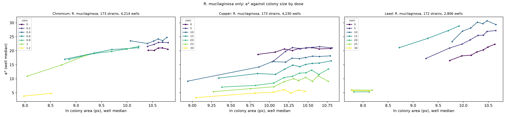

*Figure 19. Pure haploid R. mucilaginosa only: a\* against colony size by dose.*

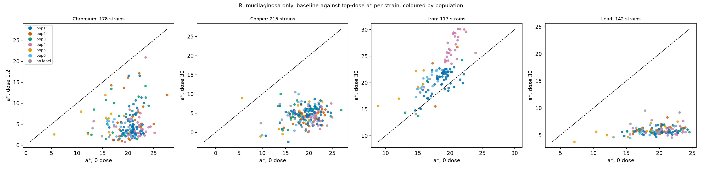

*Figure 20. Pure haploid R. mucilaginosa only: baseline against top-dose a\* per strain.*

### 11b. Each other group alone

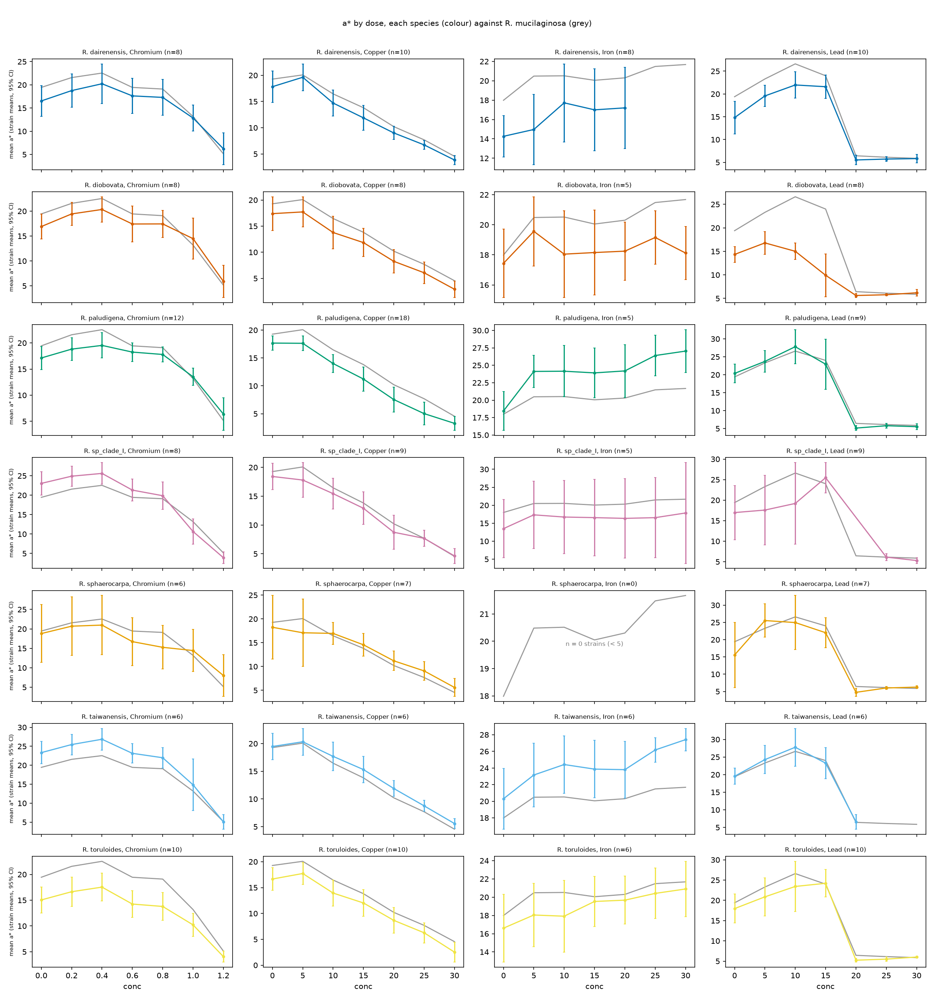

*Figure 21. a\* by dose for each group (colour) against pure haploid R. mucilaginosa (grey).*

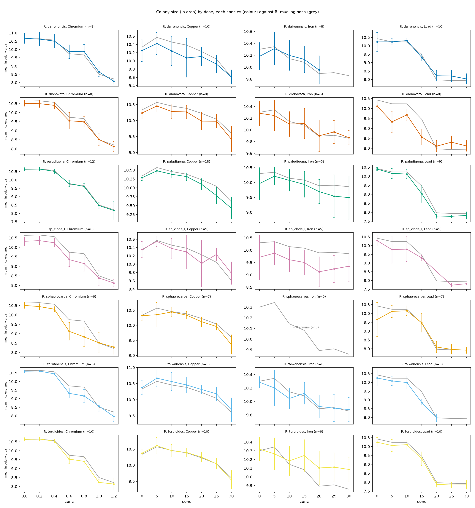

*Figure 22. Colony size (ln area) by dose for each group against pure haploid R. mucilaginosa.*

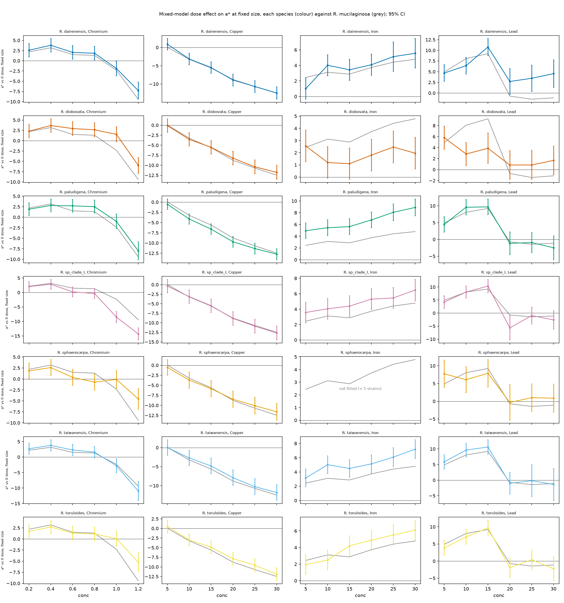

*Figure 23. Dose effect on a\* at fixed size for each group against pure haploid R. mucilaginosa (95% CI). One model per metal with a dose-by-group interaction and one common size slope, as in Table 5.*

| stratum | Chromium | Copper | Lead |
|------------------------------------|--------|------|-----|
| Other species (>= 5 strains, pooled) | -11.1 | -15.4 | -16.4 |
| R. aff. mucilaginosa | -7.2 | -16.5 | -12.2 |
| R. dairenensis | -9.0 | -16.7 | -10.0 |
| R. diobovata | -9.8 | -14.9 | -11.2 |
| R. frigidialcoholis | -9.1 | -12.5 | -8.9 |
| R. mucilaginosa | -13.4 | -16.5 | -20.8 |
| R. mucilaginosa hybrid diploid | -10.8 | -15.0 | -17.6 |
| R. paludigena | -8.6 | -16.9 | -19.7 |
| R. sp_clade_I | -16.4 | -15.6 | -17.4 |
| R. sphaerocarpa | -8.6 | -16.4 | -13.4 |
| R. taiwanensis | -10.7 | -14.9 | -13.3 |
| R. toruloides | -9.4 | -15.5 | -16.4 |

*Table 24. Total dose effect on a\* over the full dose range (no size term), by group. Random intercepts for strain and plate only (plate is nested in run), so the intervals are optimistic. "Other species" pools all groups with at least 5 strains except pure haploid R. mucilaginosa. A per-group size slope cannot be estimated reliably in small strata, because dose and size are confounded, so fixed-size effects by group come from the shared-slope models (Table 5, Figure 23).*

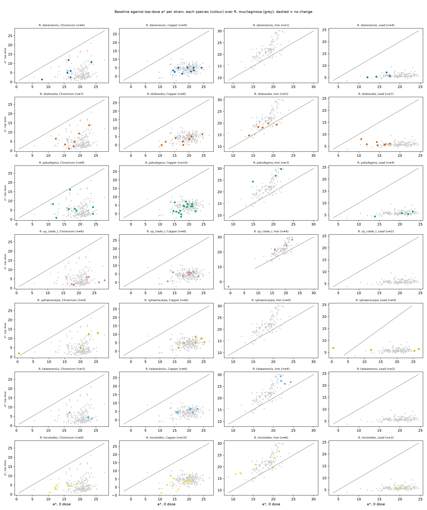

*Figure 24. Baseline against top-dose a\* per strain, each group (colour) over pure haploid R. mucilaginosa (grey).*

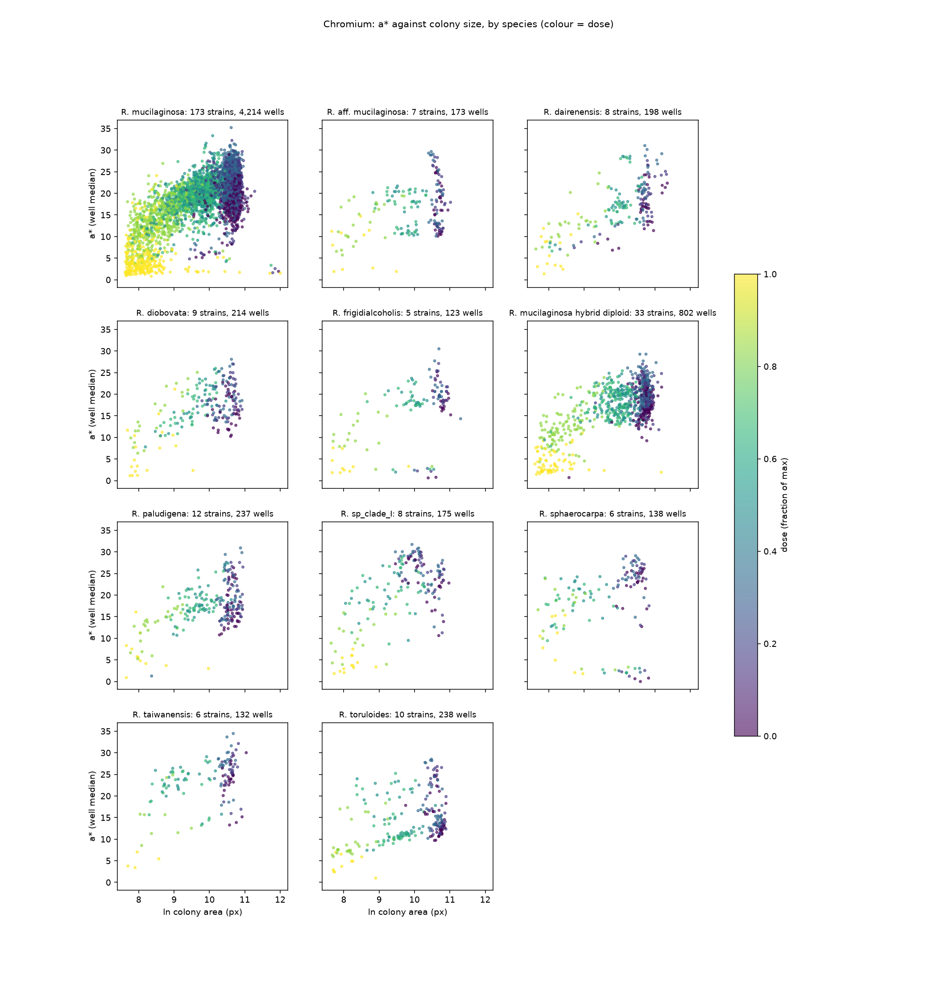

*Figure 25. Chromium: a\* against colony size by group (colour = dose).*

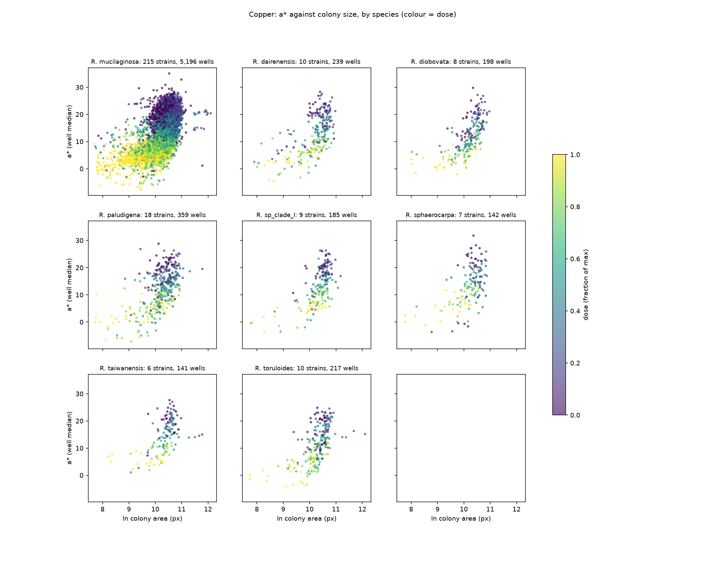

*Figure 26. Copper: a\* against colony size by group (colour = dose).*

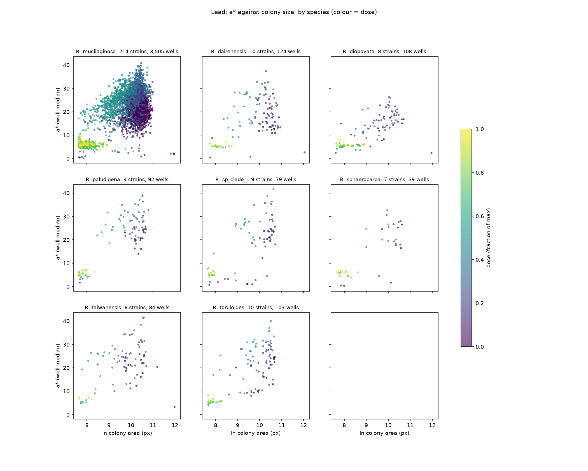

*Figure 27. Lead: a\* against colony size by group (colour = dose).*

**Reading.**

- **Cu is similar in most groups.** The fixed-size slope over the full range is -12.0 to -14.2 in 9 of the 10 other groups (Table 5), against -14.2 for the reference. R. frigidialcoholis is weaker (-9.7). Hybrids are -12.2.
- **Total effects** (no size term, Table 24) range from -7.2 to -16.4 in Cr, -12.5 to -16.9 in Cu and -8.9 to -20.8 in Pb. Pure haploid R. mucilaginosa has the largest Pb total effect (-20.8).
- **Hybrid diploids and aff. mucilaginosa respond less than the reference in Cr** (-10.8 and -7.2 against -13.4 in Table 24) **and in Pb** (-17.6 and -12.2 against -20.8).
- **Single-group curves are noisy.** Most groups have 5-18 strains, so the confidence intervals are wide.

## 12. b\* and morphology

Colour traits: L\*, a\*, b\*, chroma (square root of a\*^2 + b\*^2) and hue angle (atan2(b\*, a\*) in degrees; 0 is red and 90 is yellow). Morphology: circularity, solidity, eccentricity, compactness, extent and aspect ratio (major / minor axis). Wells and window are the main dataset. For the models, each trait is scaled by the mean and SD of the 0-dose wells of its metal, so effects are in SD units of the unstressed wells. Lines show strain means with 95% CI across strains, for pure haploid R. mucilaginosa and all other groups pooled.

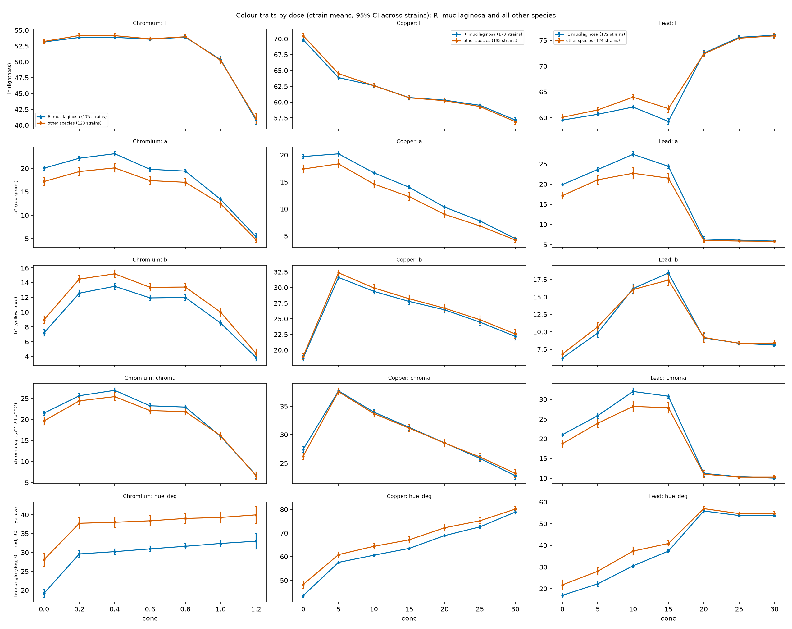

*Figure 28. Colour traits by dose: pure haploid R. mucilaginosa and other groups.*

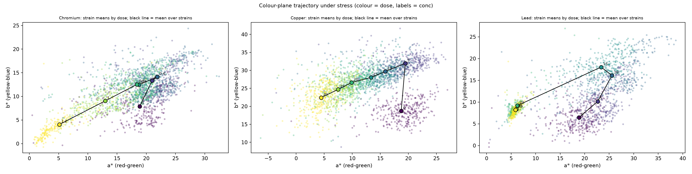

*Figure 29. Trajectory in the a\*-b\* plane under stress (colour = dose; labels give the concentration).*

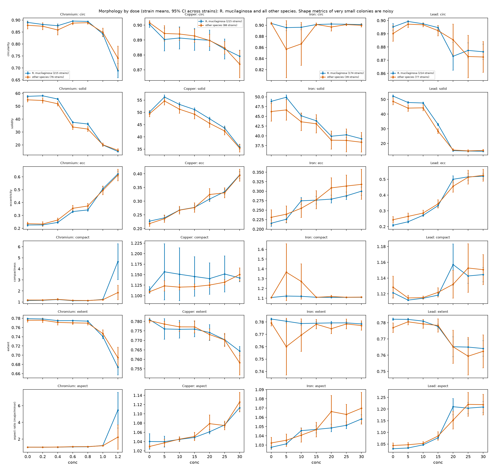

*Figure 30. Morphology by dose: pure haploid R. mucilaginosa and other groups. Shape metrics of very small colonies are noisy.*

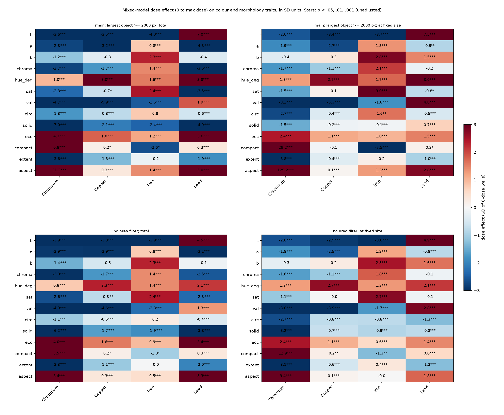

*Figure 31. Mixed-model dose effect on colour and morphology traits in SD units (stars: unadjusted p < 0.05, 0.01, 0.001). Rows of panels: main dataset and no area filter. Columns: total effect and effect at fixed size.*

| trait | Chromium | Copper | Lead |
|-------|--------|------|----|
| L | -3.6 | -3.5 | 7.0 |
| a | -2.8 | -3.2 | -4.3 |
| b | -1.2 | -0.3 | -0.4 |
| chroma | -2.7 | -1.7 | -3.6 |
| hue_deg | 1.0 | 3.0 | 3.8 |
| sat | -2.3 | -0.7 | -3.5 |
| val | -4.7 | -5.9 | 1.9 |
| circ | -1.8 | -0.8 | -0.6 |
| solid | -7.0 | -2.1 | -4.9 |
| ecc | 4.3 | 1.8 | 3.6 |
| compact | 6.8 | 0.2 | 0.3 |
| extent | -3.6 | -1.3 | -1.9 |
| aspect | 31.2 | 0.3 | 5.0 |

*Table 25. Dose effect over the full dose range, main dataset, total effect (SD of the unstressed wells).*

| trait | Chromium | Copper | Lead |
|-------|--------|------|----|
| L | -2.6 | -3.4 | 7.5 |
| a | -1.9 | -2.7 | -0.9 |
| b | -0.4 | 0.3 | 1.5 |
| chroma | -1.7 | -1.1 | -0.2 |
| hue_deg | 1.3 | 2.7 | 3.0 |
| sat | -1.5 | 0.1 | -0.8 |
| val | -3.2 | -5.3 | 4.8 |
| circ | -2.7 | -0.4 | -0.5 |
| solid | -1.5 | -0.2 | 0.7 |
| ecc | 2.4 | 1.1 | 1.5 |
| compact | 29.2 | -0.1 | 0.2 |
| extent | -3.8 | -0.4 | -1.0 |
| aspect | 129.2 | 0.1 | 2.8 |

*Table 26. Same, at fixed colony size.*

| dose | a | b | lnA |
|----|----|----|----|
| 0.0 | 18.7 | 18.8 | 10.3 |
| 5.0 | 19.4 | 32.0 | 10.5 |
| 10.0 | 15.9 | 29.7 | 10.4 |
| 15.0 | 13.3 | 28.0 | 10.4 |
| 20.0 | 9.9 | 26.6 | 10.2 |
| 25.0 | 7.5 | 24.7 | 10.0 |
| 30.0 | 4.4 | 22.4 | 9.6 |

*Table 27. Copper: strain-mean a\*, b\* and ln area by dose (main dataset).*

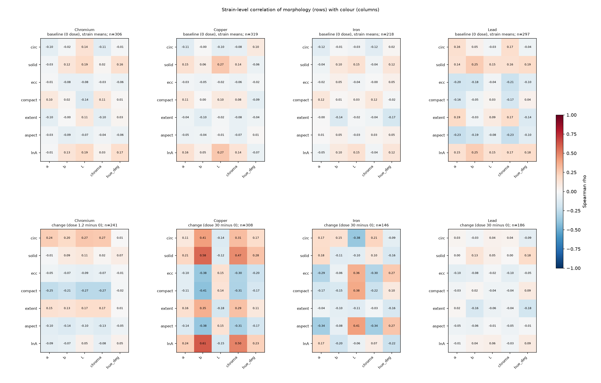

*Figure 32. Strain-level Spearman correlation of morphology (rows) with colour (columns): baseline (top) and change at the top dose (bottom).*

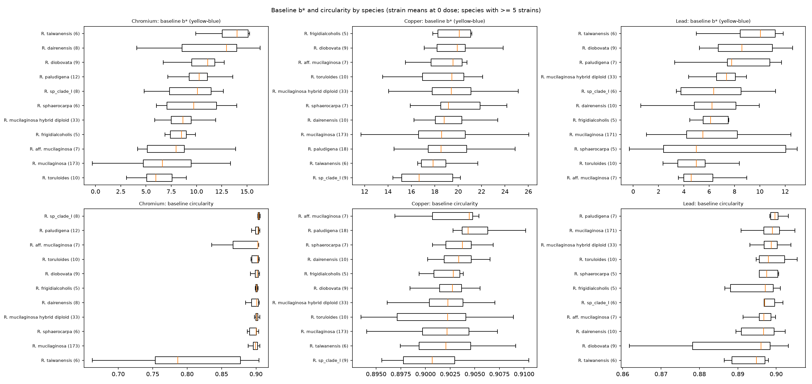

*Figure 33. Baseline b\* and circularity by group (strain means at 0 dose).*

**Reading.**

- **b\* moves much less than a\*** (total effect: Cr -1.2, Cu -0.3, Pb -0.4 SD; a\* is -2.8, -3.2, -4.3).
- **The hue angle rises in all three metals** (+1.0 Cr, +3.0 Cu, +3.8 Pb SD, total). Colour shifts from red toward yellow with stress, mainly because a\* falls faster than b\*.
- **Lightness (L\*) falls in Cr and Cu and rises in Pb** (-3.6, -3.5 and +7.0 SD, total). Pb colonies at doses of 20 and above are tiny and pale.
- **Colonies become less compact under stress.** Solidity falls (Cr -7.0 SD, Pb -4.9, Cu -2.1) and eccentricity rises (Cr +4.3, Pb +3.6, Cu +1.8). The effect is largest in the two metals that inhibit growth most. At fixed size most of the solidity effect disappears (Cr -1.5, Cu -0.2, Pb +0.7), so it follows colony size.
- **Do not read the Cr aspect-ratio and compactness effects as magnitudes** (+31 and +129 SD for aspect ratio, total and fixed size; +29 SD for compactness at fixed size). The unstressed wells have almost no variance in those traits, so the SD scale blows up. Only the direction (more elongated, less compact) is meaningful.
- **Cu b\* jumps from 18.8 at dose 0 to 32.0 at dose 5** (Table 27) while a\* (18.7 to 19.5) and ln area (10.3 to 10.5) barely change. This looks like a plate or media effect between the dose-0 plate and the treated plates, not biology. Cu b\* and hue results should be read with that in mind.
- Morphology of very small colonies is unreliable (few pixels). The main dataset already drops colonies below 2,000 px.

## 13. Not analysed: Iron and Zinc

Iron and Zinc are held out (D-56). The ingested Parquet files hold part of the plates only (Iron 62 of 120 plates; Zinc 9 of 119). The earlier Fe and Zn results, including the Zinc rescue, are withdrawn from this report. The full-plate tables are needed before these metals are analysed. See `analysis/heavy_metal_data_problems/HEAVY_METAL_DATA_PROBLEMS.md`.

## 14. Sensitivity: results without the area cutoff

The original analysis used no area cutoff. Key numbers from that run (tables in `report/sensitivity_unfiltered/`):

| Metal | model | dose_effect unfiltered | dose_effect main |
|--------|-------------|----------------------|----------------|
| Chromium | total | -13.54 | -12.65 |
| Chromium | at fixed size | -8.36 | -8.54 |
| Copper | total | -15.86 | -15.91 |
| Copper | at fixed size | -13.37 | -13.39 |
| Lead | total | -16.77 | -18.95 |
| Lead | at fixed size | -6.10 | -4.31 |

*Table 28. Dose effect (0 to top dose) in the unfiltered run and in the main run.*

| quantity | unfiltered | main |
|----------------------------------------|----------|------|
| Chromium: omnibus F, baseline size adjusted | 8.16 | 8.05 |
| Copper: omnibus F, baseline size adjusted | 2.96 | 2.98 |
| Lead: omnibus F, baseline size adjusted | 8.72 | 8.07 |
| Chromium: split-half gap (size-adjusted) | -5.48 | -3.53 |
| Chromium: reliability of strain change | 0.54 | 0.49 |
| Copper: split-half gap (size-adjusted) | -1.68 | -1.55 |
| Copper: reliability of strain change | 0.13 | 0.11 |
| Lead: split-half gap (size-adjusted) | -4.20 | -4.22 |
| Lead: reliability of strain change | 0.31 | 0.55 |
| Chromium: omnibus F, species by dose | 10.98 | 9.94 |
| Chromium: strains in the split-half analysis | 289.00 | 148.00 |
| Copper: omnibus F, species by dose | 3.39 | 3.14 |
| Copper: strains in the split-half analysis | 303.00 | 298.00 |
| Lead: omnibus F, species by dose | 13.80 | 4.75 |
| Lead: strains in the split-half analysis | 273.00 | 62.00 |

*Table 29. Other key numbers, unfiltered and main.*

**Reading.**

- **Cu and Cr are about the same in both runs** (Table 28).
- **Pb changes most.** The Pb dose-effect estimate moves from -6.1 (unfiltered) to -4.3 (main).
- **The comparison is not strictly like with like.** The split-half samples shrink (Cr 289 to 148 strains, Pb 273 to 62, because few strains keep at least 2 top-dose wells), so those rows also reflect fewer strains. Run heterogeneity is not compared: the unfiltered chain used the same slope models, but the number of wells per run changes with the cutoff.
- Pagel's lambda is not compared between runs.

## Limits

- Dose units are not given in the source, and metals are not pooled.
- Group tests treat strains as independent, although relatives share a\* (lambda 0.5-0.9). Their p-values are too small. Benjamini-Hochberg is applied across the 9 omnibus tests together.
- The dose-factor model (Table 2) and the per-group strata (Table 24) have no strain dose slope, so their intervals are optimistic.
- The regime split (section 6) is defined from colony size, which also relates to a\*.
- Size is partly an effect of stress. Models "at fixed size" estimate a direct effect, not the whole induction. One size slope is used for all strains.
- The area cutoff is justified for Cr and Cu from unstressed colonies and assumed for Pb. The Pb inhibitory range (doses 20-30) has too few colonies above any cutoff to test.
- Survivor selection: wells that never produced objects are absent, wells with fewer than 2 window images were dropped, and the area cutoff removes small colonies at the top doses. Top-dose estimates therefore describe larger colonies (Cr, Pb).
- 11 strains still have no species ("Species Not Found", no genome) and are excluded from group tests. Groups need at least 5 strains. Pure haploid R. mucilaginosa has 172-173 strains and the others have 5-33.
- The sourmash species calls used in D-45 come from single 9003-batch libraries and are not verified.
- The hybrid group combines ploidy and parentage; its differences cannot be attributed to ploidy alone.
- The all-objects sensitivity table is built (`results/wells_allobj.csv`) but not modelled.
- The Cu b\* jump between dose 0 and dose 5 is not explained.
- No population-structure analysis is included until DH4148 SNP clusters exist (D-51).
