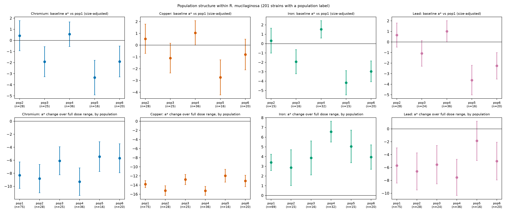
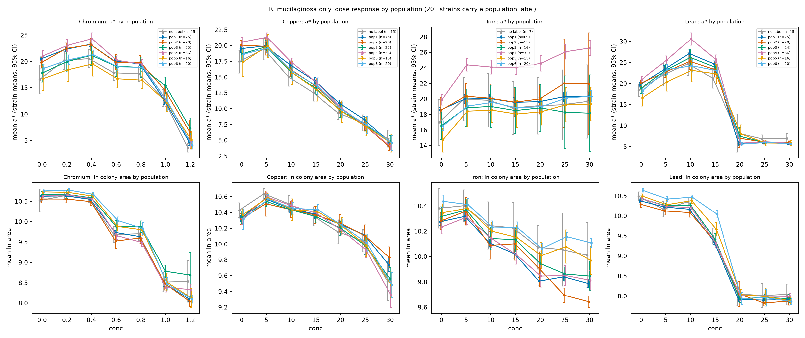
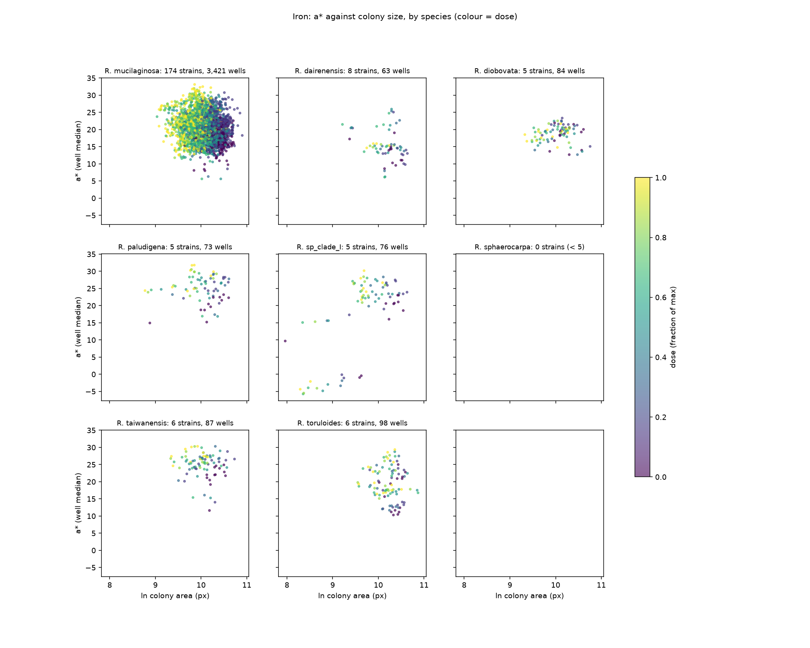
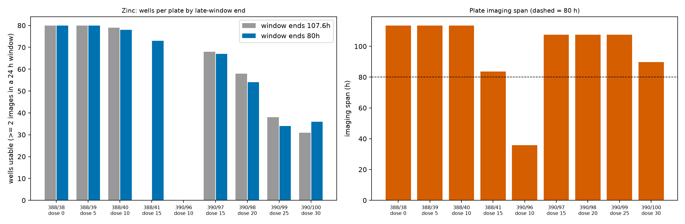
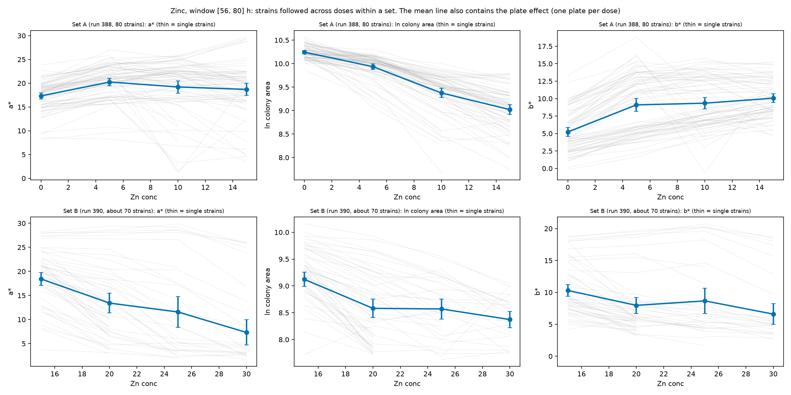
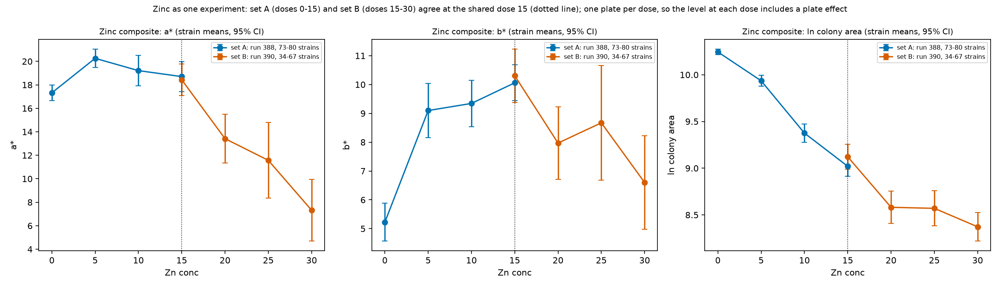
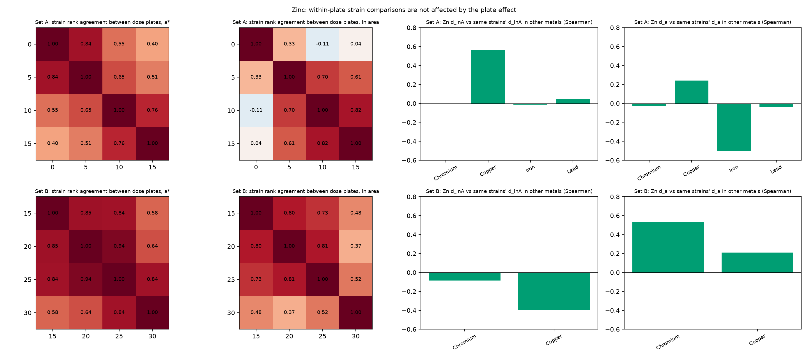

# a* (carotenoid proxy) under metal stress: stratified analyses

Generated 2026-10-08. All numbers come from `report/tables/*.csv`. Scripts are in `scripts/` and `scripts/strat/`. Data-quality caveats are in `analysis/heavy_metal_data_problems/HEAVY_METAL_DATA_PROBLEMS.md`.

**Question.** Strains grow on plates with a heavy metal at increasing doses. Does CIELAB a\* (red-green axis, used here as a carotenoid proxy) rise because of stress? Or do strains differ inherently in a\*? Colony size confounds the answer. Every dose effect is therefore shown with and without size.

## Main dataset (used everywhere unless stated)

- **Wells.** One row per replicate well. The largest object in each well and image is kept.
- **Area cutoff: colony area of at least 2,000 px.** Well-images whose largest object is smaller are dropped (section 10 gives the evidence).
- **Time window.** Median over the last 24 h up to a metal-specific end point T, counted from the first image of each plate. T is the median plate imaging span: Cr 114 h, Cu 114 h, Fe 89.9 h, Pb 107.5 h. **Zinc uses T = 80 h**, because two Zinc plates stop imaging at 83.7 and 89.7 h (section 13).
- **Wells kept.** Wells need at least 2 images in the window. Cr 7,287 wells (307 strains), Cu 7,484 (319), Fe 4,064 (218), Pb 4,606 (307), Zn 502 (150). Share of unfiltered wells kept: Chromium 90%, Copper 98%, Iron 100%, Lead 68%, Zinc 85%.
- **Original unfiltered results** (no area cutoff; median-span window for Zinc) are in section 14, beside the main numbers.

## Summary

1. **There is no general "stress raises a\*".** The effect depends on the metal. Over the full dose range at fixed colony size: Cr -8.5, Cu -13.4, Pb -4.3 (singular fit), Fe +4.4 a\* units. Zn cannot be estimated reliably (one plate per dose, so dose and plate effects are confounded; section 13).
2. **The dose-response is not linear.** Dose-as-factor models at fixed size show Cr a\* rising at low doses (+2.2 and +3.1 at doses 0.2 and 0.4) and falling at the top (-9.8 at 1.2). Pb rises at doses 5-15 (+4.9, +8.0, +9.5) and is near 0 at doses 20-30 (-0.0, -0.3, -0.2). Cu falls from the first doses (-3.2 at dose 10, -12.4 at dose 30), even though colonies are not smaller than control there. Fe rises steadily (+2.5 to +4.9). Zn rises to dose 15 (+7.7) and returns to 0 at dose 30; its standard errors are not valid (section 13).
3. **a\* depends on colony area even without stress, so the main dataset drops colonies below 2,000 px.** In unstressed colonies a\* is low and rises slowly below about 1,500-2,000 px (slope under 1.7 a\* per ln unit) and then rises three to four times faster (slope 5-7) to about 20 at 33,000 px (section 10). The cutoff was chosen from the unstressed Cr and Cu curves, where stressed and unstressed colonies share the same a\* below about 2,000 px. It is assumed for Pb, Fe and Zn. It removes mostly top-dose wells, so **top-dose estimates describe larger survivors** (Cr top-dose strains 311 to 241; median top-dose area 1,729 to 3,281 px). The cutoff leaves Cu unchanged (-13.4). Cr is nearly unchanged (-8.4 to -8.5). Fe moves from +3.8 to +4.4 (and its size slope from 2.9 to 3.9) when only 9 wells are removed, so treat Fe as stable only within about 0.5 units. Pb is unstable (-6.1 with no cutoff, -4.3 at 2,000 px, +0.2 at 5,000 px), because few Pb colonies at doses 20-30 pass any cutoff.
4. **Genetic structure matters more than species labels.** R. mucilaginosa populations differ in baseline a\* in all four metals (omnibus p < 0.001, corrected across the 20 omnibus tests). Population 5 is lowest everywhere (Cr -3.4, Cu -2.7, Fe -4.2, Pb -3.6 against population 1). Species effects are metal-specific. R. toruloides, R. dairenensis and R. diobovata have lower estimates than R. mucilaginosa in all four metals, but after correction each is individually significant in only one of them.
5. **Phylogenetic signal is present in every metal, but its size depends on the root of the tree.** With the tree rooted on the outgroup clade Cystobasidium + Pseudomicrostroma, Pagel's lambda for baseline a\* is 0.79 (Cr), 0.49 (Cu), 0.84 (Fe), 0.74 (Pb) for all strains with a tree tip, and 0.89, 0.48, 0.91, 0.80 inside R. mucilaginosa alone. All differ from 0 (p < 0.001) except Cu inside R. mucilaginosa (p = 0.036). Zinc (75 strains) is 0.96. The first version of this report used the arbitrary root of the tree file and got different values (Cr 0.97, Cu 0.95, Fe 0.51, Pb 0.90, Zn 0.15), so lambda is sensitive to the root and should be read as a rough size only.
6. **Regression to the mean inflates the baseline-vs-change pattern.** Selecting the high-baseline third of strains on half of the replicate wells and measuring the change on the other half gives a smaller gap than the naive analysis: Cu -1.6 against -5.0, Cr -3.5 against -5.1, Pb -4.3 against -5.5. Fe is unaffected (+1.8 against +1.6).
7. **Strain-specific change in a\* is only partly repeatable.** Correlation of the change between replicate halves: Fe 0.70, Pb 0.56, Cr 0.49, Cu 0.11.
8. **Run (batch) is a small share of variance (0-3%). Only Cr shows clear heterogeneity of the dose effect between runs** (I2 = 0.77, Q p = 0.004; Cu 0.49, p = 0.12; Fe 0.41, p = 0.18; Pb 0.53, p = 0.095). The Cr effect weakens from -13.8 (run d000320) to -4.3 (run d000323). Each run is a different strain subset, so run and strain set cannot be separated.
9. **The dose-response shape is shared across species (with one common size slope).** At the top dose, Cu is -11.6 to -12.7 in every species and Fe is +2.0 to +8.9 in every species. Cr is biphasic in every species (+1.7 to +3.8 at doses 0.2-0.4; -4.5 to -14.3 at dose 1.2). Pb is biphasic in every species (+2.8 to +10.8 at doses 5-15; -5.7 to +4.5 at doses 20-30). Species and populations differ mainly in baseline level. The population-by-dose test is also significant in all four metals (F 6.9-12.7), so population dose responses differ somewhat as well (section 11).
10. **Colour and morphology (section 12).** b\* moves much less than a\*. The hue angle shifts from red toward yellow in all four metals (+1.0 to +3.8 SD, total effect). Solidity falls and eccentricity rises under stress, mainly in Cr and Pb. Cu b\* jumps between dose 0 and dose 5 while a\* and size barely change. This looks like a plate or media difference and is not interpreted.
11. **Zinc is usable for strain-level questions (section 13).** With a window ending at 80 h, 8 of 9 plates give data (152 strains; 150 after the area cutoff). Strain a\* ranks agree between plates (Spearman 0.40-0.85). The two Zinc sets show no detectable difference at the shared dose 15. The population-mean dose effect cannot be separated from the plate effect.

## 1. Models (short)

- Source: DuckDB table `heavy_metal_measurement` (517,371 colony rows; 5 metals). Named strains only (502,051 rows). a\* is `ColorLab_a*GeoMedian` (the geometric-median CIELAB a\* of the colony pixels); b\* and L\* are the matching `GeoMedian` columns.
- Models (lme4, REML). The overall models (Tables 1 and 2, Figures 1-3) use strain and plate random effects. Plate is unique within a run, so the overall models have no separate run term. Tables 1 and 2 differ: Table 1 has a strain intercept and a correlated strain dose slope; Table 2 (dose as a factor) has strain and plate intercepts only. The species, population, regime, size-bin and per-run models have a strain intercept, an uncorrelated strain dose slope, and run and plate intercepts (per-run models have no run term). The per-species strata in section 11 (Table 26) have strain and plate intercepts only. Models without a strain slope give standard errors that are too small when strains respond differently, so Table 2 and Table 26 intervals are optimistic.
- `dose_s` is concentration divided by the maximum concentration. "At fixed size" adds ln(area) centred on the control mean. The size term is one common slope per model.
- Dose units are not given in the source. Cr spans 0-1.2 and the other metals 0-30. Metals are never pooled.
- Zinc is treated as one experiment (two runs, two strain sets, one plate per dose). It is shown for completeness in sections 2 and 13 and is left out of the stratified models.

## 2. Overall dose response

*Figure 1. a\* against colony size by dose (well medians, binned). Overlapping curves mean a size effect only. Separated curves mean a shift at the same size.*

| Metal | model | n_wells | n_strains | dose effect (0 to top) | SE | p | strain share @0 | strain share @top | singular |
|--------|-------------|-------|---------|----------------------|----|------|---------------|-----------------|--------|
| Chromium | total | 7287 | 307 | -12.65 | 1.05 | <0.001 | 0.48 | 0.29 | False |
| Chromium | at fixed size | 7287 | 307 | -8.54 | 0.98 | <0.001 | 0.52 | 0.31 | False |
| Copper | total | 7484 | 319 | -15.91 | 0.38 | <0.001 | 0.50 | 0.38 | False |
| Copper | at fixed size | 7484 | 319 | -13.39 | 0.31 | <0.001 | 0.51 | 0.31 | False |
| Iron | total | 4064 | 218 | 2.35 | 0.36 | <0.001 | 0.79 | 0.89 | False |
| Iron | at fixed size | 4064 | 218 | 4.35 | 0.35 | <0.001 | 0.83 | 0.92 | False |
| Lead | total | 4606 | 307 | -18.95 | 1.59 | <0.001 | 0.38 | 0.05 | True |
| Lead | at fixed size | 4606 | 307 | -4.31 | 1.23 | <0.001 | 0.43 | 0.10 | True |
| Zinc | total | 502 | 150 | -14.38 | 3.87 | 0.01 | 0.27 | 0.82 | False |
| Zinc | at fixed size | 502 | 150 | -3.48 | 4.21 | 0.43 | 0.30 | 0.70 | False |

*Table 1. Dose effect on a\* from 0 to the top dose. "total" has no size term. "at fixed size" adds ln(area). "strain share" is strain variance / (strain + plate + residual) at dose 0 and at the top dose. Both Pb models are singular fits.*

| dose | Chromium | Copper | Iron | Lead | Zinc |
|-----|--------|------|----|-----|-----|
| 0.20 | 2.15 |  |  |  |  |
| 0.40 | 3.11 |  |  |  |  |
| 0.60 | 1.17 |  |  |  |  |
| 0.80 | 0.92 |  |  |  |  |
| 1.00 | -2.93 |  |  |  |  |
| 1.20 | -9.83 |  |  |  |  |
| 5.00 |  | 0.08 | 2.47 | 4.93 | 4.59 |
| 10.00 |  | -3.21 | 3.16 | 7.96 | 6.49 |
| 15.00 |  | -5.52 | 3.00 | 9.49 | 7.66 |
| 20.00 |  | -8.65 | 3.84 | -0.01 | 5.39 |
| 25.00 |  | -10.57 | 4.52 | -0.25 | 2.73 |
| 30.00 |  | -12.36 | 4.91 | -0.23 | -0.26 |

*Table 2. a\* difference from 0 dose at fixed size (dose-as-factor model). Standard errors are 0.2-0.6 for Cr, Cu and Fe, 0.4-0.5 for Pb. The Zn standard errors (0.7-1.4) are not valid: with one plate per dose the plate variance collapses to zero, so plate-to-plate noise is ignored.*

*Figure 2. Per-strain a\* (top) and ln area (bottom), unstressed against top dose (mean of replicate wells, bars = SE). For Zinc the top dose shown is 15, the highest dose shared with dose 0.*

*Figure 2b. Model-based strain effects: baseline a\* (x) against the strain-specific extra change in a\* at the top dose (y), total (top row) and at fixed size (bottom row). Singular fits are not drawn. Points that lie on a straight line (a correlation near -1 or +1) mean the random-effect correlation is at the model boundary. Those points are a rescaling of one random effect and carry no separate information.*

*Figure 3. Share of a\* variance due to strain at 0 dose and at the top dose (size-adjusted model).*

**Reading.** In Cr, Cu and Pb, strains converge to a common low a\* at the top dose (strain share falls to 0.31, 0.31 and 0.10 against 0.52, 0.51 and 0.43 at dose 0). Fe keeps its strain differences (0.83 to 0.92).

## 3. Which traits correlate with a\*

*Figure 4. Spearman correlation of a\* with the traits most correlated with it (well level, all doses).*

All doses (without `ColorLab_a*Medoid`, which is a\* itself):

| trait | Chromium | Copper | Iron | Lead | Zinc | mean abs rho |
|-----------------------------|--------|------|-----|----|----|------------|
| ColorHSV_SaturationRobustMean | 0.82 | 0.47 | 0.90 | 0.87 | 0.90 | 0.79 |
| ColorLab_LabTotalVariance | 0.79 | -0.03 | 0.75 | 0.70 | 0.66 | 0.59 |
| ColorHSV_ValueRobustMean | 0.79 | 0.82 | 0.16 | 0.34 | 0.79 | 0.58 |
| ColorLab_b\*Medoid | 0.56 | 0.35 | 0.67 | 0.58 | 0.60 | 0.55 |
| ColorLab_b\*GeoMedian | 0.55 | 0.33 | 0.66 | 0.57 | 0.59 | 0.54 |
| Intensity_ConvexDensity | 0.44 | 0.64 | -0.32 | 0.42 | 0.45 | 0.45 |
| ColorHSV_HSVConeVariance | 0.68 | -0.00 | 0.59 | 0.41 | 0.53 | 0.44 |
| Intensity_IntegratedIntensity | 0.46 | 0.62 | -0.25 | 0.44 | 0.45 | 0.44 |
| Shape_MinFeretDiameter | 0.50 | 0.60 | -0.12 | 0.46 | 0.46 | 0.43 |
| Shape_MinorAxisLength | 0.50 | 0.60 | -0.12 | 0.46 | 0.46 | 0.43 |

Control dose only:

| trait | Chromium | Copper | Iron | Lead | Zinc | mean abs rho |
|---------------------------------------|--------|------|-----|-----|-----|------------|
| ColorHSV_SaturationRobustMean | 0.85 | 0.61 | 0.90 | 0.89 | 0.91 | 0.83 |
| ColorLab_LabTotalVariance | 0.79 | 0.73 | 0.85 | 0.79 | 0.86 | 0.80 |
| ColorHSV_HSVConeVariance | 0.68 | 0.60 | 0.78 | 0.71 | 0.78 | 0.71 |
| ColorHSV_ValueRobustMean | 0.69 | 0.52 | 0.56 | 0.66 | 0.51 | 0.59 |
| Intensity_StandardDeviationIntensity | -0.31 | -0.62 | -0.38 | -0.55 | -0.42 | 0.46 |
| Texture_Correlation-deg090-scale05 | -0.26 | -0.54 | -0.39 | -0.48 | -0.49 | 0.43 |
| Texture_SumVariance-deg090-scale05 | -0.21 | -0.60 | -0.35 | -0.52 | -0.41 | 0.42 |
| Intensity_MedianIntensity | -0.39 | -0.50 | -0.41 | -0.37 | -0.42 | 0.42 |
| Intensity_CoefficientVarianceIntensity | -0.23 | -0.53 | -0.37 | -0.56 | -0.39 | 0.42 |
| Texture_HaralickVariance-deg090-scale05 | -0.20 | -0.59 | -0.34 | -0.52 | -0.40 | 0.41 |

Within strain and dose (replicate wells only; Zinc has no replicates):

| trait | Chromium | Copper | Iron | Lead | mean abs rho |
|-----------------------------|--------|------|----|----|------------|
| ColorHSV_SaturationRobustMean | 0.82 | 0.61 | 0.87 | 0.80 | 0.77 |
| ColorHSV_ValueRobustMean | 0.72 | 0.45 | 0.62 | 0.67 | 0.62 |
| ColorLab_b\*Medoid | 0.64 | 0.40 | 0.74 | 0.50 | 0.57 |
| ColorLab_b\*GeoMedian | 0.64 | 0.39 | 0.75 | 0.50 | 0.57 |
| ColorLab_LabTotalVariance | 0.66 | 0.20 | 0.54 | 0.63 | 0.51 |
| Shape_MinorAxisLength | 0.33 | 0.38 | 0.53 | 0.66 | 0.47 |
| Shape_Solidity | 0.32 | 0.38 | 0.53 | 0.66 | 0.47 |
| Shape_MinFeretDiameter | 0.32 | 0.38 | 0.53 | 0.66 | 0.47 |
| Shape_ConvexArea | 0.30 | 0.38 | 0.52 | 0.65 | 0.46 |
| Shape_MedianRadius | 0.28 | 0.38 | 0.52 | 0.66 | 0.46 |

**Reading.** Saturation, b\* and the colour-variance traits correlate most strongly with a\*. These share colour information with a\*. Size traits (area, radius, Feret diameter, integrated intensity) correlate at 0.4-0.65 in Cr, Cu, Pb and Zn, but with the opposite sign in Fe. Many size traits are near-duplicates, so treat them as one family. Replicate wells within a strain and dose still show a size-a\* correlation of about 0.3-0.5, so the link is not only between strains.

## 4. Species and population (stratification item 1)

Species is a fixed effect (reference R. mucilaginosa). Strain, run and plate are random. Species with at least 5 strains are included. Population labels exist for 201 R. mucilaginosa strains (`analysis/gwas/data/prior_run_state/pop_assignment_at_run.csv`).

| Metal | model | F | p | p_BH |
|--------|--------------------------------------|-----|------|------|
| Chromium | baseline | 6.05 | <0.001 | <0.001 |
| Chromium | baseline_size_adjusted | 6.02 | <0.001 | <0.001 |
| Chromium | dose_response_size_adjusted | 7.98 | <0.001 | <0.001 |
| Chromium | population_baseline_size_adjusted | 7.33 | <0.001 | <0.001 |
| Chromium | population_dose_response_size_adjusted | 12.75 | <0.001 | <0.001 |
| Copper | baseline | 1.50 | 0.17 | 0.19 |
| Copper | baseline_size_adjusted | 1.36 | 0.22 | 0.24 |
| Copper | dose_response_size_adjusted | 0.45 | 0.87 | 0.87 |
| Copper | population_baseline_size_adjusted | 5.63 | <0.001 | <0.001 |
| Copper | population_dose_response_size_adjusted | 6.88 | <0.001 | <0.001 |
| Iron | baseline | 4.43 | <0.001 | <0.001 |
| Iron | baseline_size_adjusted | 2.45 | 0.03 | 0.03 |
| Iron | dose_response_size_adjusted | 1.71 | 0.12 | 0.14 |
| Iron | population_baseline_size_adjusted | 19.97 | <0.001 | <0.001 |
| Iron | population_dose_response_size_adjusted | 7.06 | <0.001 | <0.001 |
| Lead | baseline | 6.04 | <0.001 | <0.001 |
| Lead | baseline_size_adjusted | 4.27 | <0.001 | <0.001 |
| Lead | dose_response_size_adjusted | 2.06 | 0.05 | 0.06 |
| Lead | population_baseline_size_adjusted | 10.88 | <0.001 | <0.001 |
| Lead | population_dose_response_size_adjusted | 8.60 | <0.001 | <0.001 |

*Table 3. Omnibus tests (F test). `p_BH` is the Benjamini-Hochberg adjustment across all 20 rows, which mixes species and population tests, baseline and dose-response tests.*

*Figure 5. Species effect on baseline a\* relative to R. mucilaginosa (size-adjusted).*

| Metal | species | n_strains | estimate | se | p | p_BH |
|--------|---------------|---------|--------|----|------|----|
| Chromium | R. dairenensis | 8 | -2.40 | 1.24 | 0.05 | 0.16 |
| Chromium | R. diobovata | 8 | -2.31 | 1.23 | 0.06 | 0.17 |
| Chromium | R. paludigena | 12 | -2.47 | 1.03 | 0.02 | 0.09 |
| Chromium | R. sp_clade_I | 8 | 3.02 | 1.28 | 0.02 | 0.09 |
| Chromium | R. sphaerocarpa | 6 | -0.36 | 1.42 | 0.80 | 0.83 |
| Chromium | R. taiwanensis | 6 | 3.25 | 1.42 | 0.02 | 0.09 |
| Chromium | R. toruloides | 10 | -4.64 | 1.11 | <0.001 | 0.00 |
| Copper | R. dairenensis | 10 | -1.18 | 1.03 | 0.25 | 0.38 |
| Copper | R. diobovata | 8 | -1.41 | 1.13 | 0.21 | 0.36 |
| Copper | R. paludigena | 18 | -0.97 | 0.83 | 0.24 | 0.38 |
| Copper | R. sp_clade_I | 9 | -0.60 | 1.13 | 0.60 | 0.70 |
| Copper | R. sphaerocarpa | 7 | -0.94 | 1.25 | 0.45 | 0.58 |
| Copper | R. taiwanensis | 6 | 0.13 | 1.34 | 0.92 | 0.92 |
| Copper | R. toruloides | 10 | -2.57 | 1.07 | 0.02 | 0.09 |
| Iron | R. dairenensis | 8 | -2.57 | 1.20 | 0.03 | 0.11 |
| Iron | R. diobovata | 5 | -0.68 | 1.46 | 0.64 | 0.72 |
| Iron | R. paludigena | 5 | 2.40 | 1.47 | 0.10 | 0.23 |
| Iron | R. sp_clade_I | 5 | -1.68 | 1.51 | 0.27 | 0.38 |
| Iron | R. taiwanensis | 6 | 2.42 | 1.35 | 0.07 | 0.18 |
| Iron | R. toruloides | 6 | -1.90 | 1.35 | 0.16 | 0.29 |
| Lead | R. dairenensis | 10 | -3.76 | 1.08 | <0.001 | 0.01 |
| Lead | R. diobovata | 8 | -4.24 | 1.18 | <0.001 | 0.01 |
| Lead | R. paludigena | 9 | 1.26 | 1.29 | 0.33 | 0.44 |
| Lead | R. sp_clade_I | 9 | -2.12 | 1.37 | 0.12 | 0.25 |
| Lead | R. sphaerocarpa | 7 | -2.58 | 1.70 | 0.13 | 0.25 |
| Lead | R. taiwanensis | 6 | 0.47 | 1.31 | 0.72 | 0.78 |
| Lead | R. toruloides | 10 | -0.78 | 1.13 | 0.49 | 0.60 |

*Table 4. Species baseline contrasts (size-adjusted).*

*Figure 6. Species-specific change in a\* over the full dose range at fixed size.*

| Metal | species | n_strains | slope_full_range | se | p vs mucilaginosa |
|--------|---------------|---------|----------------|----|-----------------|
| Chromium | R. mucilaginosa | 215 | -8.03 | 0.98 |  |
| Chromium | R. dairenensis | 8 | -7.03 | 1.41 | 0.34 |
| Chromium | R. diobovata | 8 | -4.48 | 1.41 | <0.001 |
| Chromium | R. paludigena | 12 | -5.36 | 1.32 | 0.00 |
| Chromium | R. sp_clade_I | 8 | -13.53 | 1.45 | <0.001 |
| Chromium | R. sphaerocarpa | 6 | -6.59 | 1.55 | 0.24 |
| Chromium | R. taiwanensis | 6 | -8.35 | 1.60 | 0.80 |
| Chromium | R. toruloides | 10 | -5.40 | 1.35 | 0.01 |
| Copper | R. mucilaginosa | 215 | -13.73 | 0.31 |  |
| Copper | R. dairenensis | 10 | -14.10 | 0.94 | 0.69 |
| Copper | R. diobovata | 8 | -12.91 | 0.99 | 0.40 |
| Copper | R. paludigena | 18 | -14.13 | 0.74 | 0.58 |
| Copper | R. sp_clade_I | 9 | -13.85 | 1.01 | 0.91 |
| Copper | R. sphaerocarpa | 7 | -12.71 | 1.16 | 0.37 |
| Copper | R. taiwanensis | 6 | -13.01 | 1.16 | 0.53 |
| Copper | R. toruloides | 10 | -12.92 | 0.92 | 0.37 |
| Iron | R. mucilaginosa | 174 | 4.33 | 0.38 |  |
| Iron | R. dairenensis | 8 | 5.65 | 1.38 | 0.33 |
| Iron | R. diobovata | 5 | 1.95 | 1.40 | 0.09 |
| Iron | R. paludigena | 5 | 7.25 | 1.50 | 0.05 |
| Iron | R. sp_clade_I | 5 | 5.17 | 1.43 | 0.56 |
| Iron | R. taiwanensis | 6 | 6.03 | 1.35 | 0.21 |
| Iron | R. toruloides | 6 | 5.47 | 1.28 | 0.37 |
| Lead | R. mucilaginosa | 214 | -4.51 | 1.26 |  |
| Lead | R. dairenensis | 10 | 0.16 | 1.84 | <0.001 |
| Lead | R. diobovata | 8 | -2.55 | 1.68 | 0.11 |
| Lead | R. paludigena | 9 | -4.78 | 1.90 | 0.85 |
| Lead | R. sp_clade_I | 9 | -4.43 | 1.99 | 0.96 |
| Lead | R. sphaerocarpa | 7 | -3.56 | 2.21 | 0.62 |
| Lead | R. taiwanensis | 6 | -3.69 | 2.14 | 0.64 |
| Lead | R. toruloides | 10 | -3.87 | 1.83 | 0.64 |

*Table 5. Species-specific dose slopes (a\* change over the full dose range).*

| Metal | n_other_strains | baseline_diff | baseline_se | baseline_p | slope_diff | slope_se | slope_p |
|--------|---------------|-------------|-----------|----------|----------|--------|-------|
| Chromium | 58 | -1.34 | 0.54 | 0.01 | 1.09 | 0.48 | 0.02 |
| Copper | 68 | -1.15 | 0.46 | 0.01 | 0.22 | 0.40 | 0.58 |
| Iron | 35 | -0.49 | 0.63 | 0.43 | 0.89 | 0.61 | 0.15 |
| Lead | 59 | -1.80 | 0.53 | 0.00 | 1.51 | 0.62 | 0.02 |

*Table 6. R. mucilaginosa against all other species pooled (contrast only).*

*Figure 7. Populations within R. mucilaginosa: baseline a\* (top) and dose response (bottom).*

| Metal | population | n_strains | estimate | se | p |
|--------|----------|---------|--------|----|------|
| Chromium | pop2 | 28 | 0.42 | 0.69 | 0.55 |
| Chromium | pop3 | 25 | -1.92 | 0.69 | 0.01 |
| Chromium | pop4 | 36 | 0.56 | 0.57 | 0.33 |
| Chromium | pop5 | 16 | -3.35 | 0.80 | <0.001 |
| Chromium | pop6 | 20 | -1.90 | 0.71 | 0.01 |
| Copper | pop2 | 28 | 0.54 | 0.63 | 0.39 |
| Copper | pop3 | 25 | -1.10 | 0.64 | 0.09 |
| Copper | pop4 | 36 | 1.04 | 0.53 | 0.05 |
| Copper | pop5 | 16 | -2.73 | 0.76 | <0.001 |
| Copper | pop6 | 20 | -0.79 | 0.66 | 0.23 |
| Iron | pop2 | 15 | 0.32 | 0.68 | 0.64 |
| Iron | pop3 | 16 | -1.93 | 0.66 | 0.00 |
| Iron | pop4 | 32 | 1.52 | 0.47 | 0.00 |
| Iron | pop5 | 15 | -4.17 | 0.66 | <0.001 |
| Iron | pop6 | 20 | -2.96 | 0.56 | <0.001 |
| Lead | pop2 | 28 | 0.65 | 0.58 | 0.27 |
| Lead | pop3 | 24 | -1.08 | 0.62 | 0.08 |
| Lead | pop4 | 36 | 1.01 | 0.51 | 0.05 |
| Lead | pop5 | 16 | -3.61 | 0.71 | <0.001 |
| Lead | pop6 | 20 | -2.26 | 0.64 | <0.001 |

*Table 7. Population baseline contrasts against pop1 (size-adjusted).*

| Metal | population | n_strains | slope_full_range | se | z_p | vs_pop1_p |
|--------|----------|---------|----------------|----|----|---------|
| Chromium | pop1 | 75 | -8.29 | 1.04 | 0.00 |  |
| Chromium | pop2 | 28 | -8.82 | 1.11 | 0.00 | 0.39 |
| Chromium | pop3 | 25 | -6.08 | 1.10 | 0.00 | 0.00 |
| Chromium | pop4 | 36 | -9.29 | 1.08 | 0.00 | 0.05 |
| Chromium | pop5 | 16 | -5.43 | 1.17 | 0.00 | 0.00 |
| Chromium | pop6 | 20 | -5.69 | 1.14 | 0.00 | 0.00 |
| Copper | pop1 | 75 | -13.80 | 0.39 | 0.00 |  |
| Copper | pop2 | 28 | -15.22 | 0.54 | 0.00 | 0.02 |
| Copper | pop3 | 25 | -12.79 | 0.57 | 0.00 | 0.10 |
| Copper | pop4 | 36 | -15.26 | 0.50 | 0.00 | 0.00 |
| Copper | pop5 | 16 | -11.96 | 0.71 | 0.00 | 0.01 |
| Copper | pop6 | 20 | -13.10 | 0.63 | 0.00 | 0.27 |
| Iron | pop1 | 69 | 3.40 | 0.43 | 0.00 |  |
| Iron | pop2 | 15 | 2.87 | 0.94 | 0.00 | 0.57 |
| Iron | pop3 | 16 | 3.86 | 0.89 | 0.00 | 0.60 |
| Iron | pop4 | 32 | 6.57 | 0.55 | 0.00 | 0.00 |
| Iron | pop5 | 15 | 5.04 | 0.85 | 0.00 | 0.06 |
| Iron | pop6 | 20 | 3.95 | 0.64 | 0.00 | 0.40 |
| Lead | pop1 | 75 | -5.69 | 1.40 | 0.00 |  |
| Lead | pop2 | 28 | -6.61 | 1.47 | 0.00 | 0.24 |
| Lead | pop3 | 24 | -5.56 | 1.52 | 0.00 | 0.88 |
| Lead | pop4 | 36 | -7.54 | 1.43 | 0.00 | 0.00 |
| Lead | pop5 | 16 | -1.87 | 1.55 | 0.23 | 0.00 |
| Lead | pop6 | 20 | -5.01 | 1.50 | 0.00 | 0.33 |

*Table 8. Population dose slopes.*

*Figure 8. Baseline a\* by species (strain means; species with at least 5 strains).*

**Reading.**

- The population effect is the most consistent result here. It holds in four independent metal screens. Population 5 is lowest in all four metals. Populations 6 (Cr, Fe, Pb) and 3 (Cr, Fe) are also low. Population 4 has the highest or tied-highest estimate in every metal, but differs from pop1 significantly only in Fe (and borderline in Cu and Pb).
- Species effects are inconsistent across metals (for example sp_clade_I is +3.0 in Cr and -2.1 in Pb). The non-mucilaginosa species have 5-18 strains each, so single-species contrasts are noisy. Cu shows no species effect (F p = 0.22 after size adjustment; 0.24 after correction).
- The species effect on baseline a\* shrinks in Pb once colonies below 2,000 px are removed (F 15.8 with no cutoff, 6.0 with the cutoff). The species effect on the Pb dose response is no longer significant (p = 0.059 after correction). Part of the earlier Pb species signal came from tiny colonies.
- Pooled other species are lower than R. mucilaginosa in baseline a\* in all four metals (-0.5 to -1.8). They respond differently in Cr (+1.1) and Pb (+1.5).

## 5. Phylogenetic signal (item 2)

The PHYling tree is rooted on the outgroup clade made of its two non-Rhodotorula tips, Cystobasidium sp. DBVPG_10075 and Pseudomicrostroma phylloplanum DBVPG_6740. The root sits in the middle of the branch that separates them from the Rhodotorula strains. Lambda depends on the root, because the covariance under Brownian motion is built from the distance from the root to the common ancestor of each pair of strains.

*Figure 9. Pagel's lambda of baseline a\* and of the change in a\* at the top dose.*

| Metal | scope | trait | n_strains | pagel_lambda | p (lambda > 0) |
|--------|--------------------|----------------------------|---------|------------|--------------|
| Chromium | all_strains_with_tip | baseline a\* | 255 | 0.79 | <0.001 |
| Chromium | all_strains_with_tip | baseline a\* (size-adjusted) | 255 | 0.79 | <0.001 |
| Chromium | all_strains_with_tip | change in a\* at dose 1.2 | 209 | 0.62 | <0.001 |
| Chromium | R_mucilaginosa_only | baseline a\* | 201 | 0.89 | <0.001 |
| Chromium | R_mucilaginosa_only | baseline a\* (size-adjusted) | 201 | 0.89 | <0.001 |
| Chromium | R_mucilaginosa_only | change in a\* at dose 1.2 | 169 | 0.88 | <0.001 |
| Copper | all_strains_with_tip | baseline a\* | 264 | 0.49 | <0.001 |
| Copper | all_strains_with_tip | baseline a\* (size-adjusted) | 264 | 0.48 | <0.001 |
| Copper | all_strains_with_tip | change in a\* at dose 30 | 256 | 0.13 | 0.51 |
| Copper | R_mucilaginosa_only | baseline a\* | 201 | 0.48 | 0.04 |
| Copper | R_mucilaginosa_only | baseline a\* (size-adjusted) | 201 | 0.47 | 0.04 |
| Copper | R_mucilaginosa_only | change in a\* at dose 30 | 201 | 0.79 | 0.01 |
| Iron | all_strains_with_tip | baseline a\* | 196 | 0.84 | <0.001 |
| Iron | all_strains_with_tip | baseline a\* (size-adjusted) | 196 | 0.87 | <0.001 |
| Iron | all_strains_with_tip | change in a\* at dose 30 | 133 | 0.96 | <0.001 |
| Iron | R_mucilaginosa_only | baseline a\* | 167 | 0.91 | <0.001 |
| Iron | R_mucilaginosa_only | baseline a\* (size-adjusted) | 167 | 0.92 | <0.001 |
| Iron | R_mucilaginosa_only | change in a\* at dose 30 | 113 | 0.98 | <0.001 |
| Lead | all_strains_with_tip | baseline a\* | 249 | 0.73 | <0.001 |
| Lead | all_strains_with_tip | baseline a\* (size-adjusted) | 249 | 0.69 | <0.001 |
| Lead | all_strains_with_tip | change in a\* at dose 30 | 164 | 0.56 | <0.001 |
| Lead | R_mucilaginosa_only | baseline a\* | 199 | 0.80 | <0.001 |
| Lead | R_mucilaginosa_only | baseline a\* (size-adjusted) | 199 | 0.82 | <0.001 |
| Lead | R_mucilaginosa_only | change in a\* at dose 30 | 135 | 0.76 | <0.001 |
| Zinc | all_strains_with_tip | baseline a\* | 75 | 0.96 | <0.001 |
| Zinc | all_strains_with_tip | baseline a\* (size-adjusted) | 75 | 0.95 | <0.001 |
| Zinc | all_strains_with_tip | change in a\* at dose 15 | 69 | 0.97 | <0.001 |
| Zinc | R_mucilaginosa_only | baseline a\* | 65 | 0.97 | <0.001 |
| Zinc | R_mucilaginosa_only | baseline a\* (size-adjusted) | 65 | 0.96 | <0.001 |
| Zinc | R_mucilaginosa_only | change in a\* at dose 15 | 64 | 0.98 | <0.001 |

*Table 9. Pagel's lambda (maximum likelihood under Brownian motion on the PHYling FastTree). 249-264 strains with a tree tip in Cr, Cu and Pb; 196 in Fe; 75 in Zn.*

*Figure 10. Mean absolute difference in size-adjusted baseline a\* between pairs of strains, by patristic distance.*

*Figure 11. The tree rooted on the Cystobasidium + Pseudomicrostroma outgroup clade (bottom), with the species of each tip and baseline a\* per metal (strain mean at dose 0, one common colour scale; blank = no data).*

**Reading and limits.**

- Closely related strains share baseline a\*. Lambda is 0.74-0.84 in Cr, Pb and Fe, 0.49 in Cu and 0.96 in Zn for all strains with a tip (Table 9). Inside R. mucilaginosa alone it is 0.89 (Cr), 0.48 (Cu), 0.91 (Fe), 0.80 (Pb) and 0.97 (Zn), so the signal is not only the separation between species. The pairwise difference in size-adjusted a\* increases with patristic distance (Figure 10; patristic distance does not depend on the root).
- **The root matters.** With the arbitrary root of the tree file the same analysis gave 0.97 (Cr), 0.95 (Cu), 0.51 (Fe), 0.90 (Pb) and 0.15 (Zn) for all strains. The first version of this report quoted those values. The outgroup-rooted values are used here because the outgroup root is the biologically meaningful one.
- Lambda of the change in a\* at the top dose is 0.62 (Cr), 0.13 (Cu; p = 0.51), 0.96 (Fe), 0.56 (Pb) and 0.97 (Zn) for all strains. The change is top-dose a\* minus baseline a\*, and top-dose a\* sits on a floor with little variation (Pb SD 0.77 across strains), so for Pb, Cr and Cu the change partly restates the baseline.
- **Blomberg's K was dropped.** The tree has 22 zero-length tips and 74 tips with a neighbour closer than 1e-5, so the covariance matrix is nearly singular (condition number about 2e10 with the outgroup root). K varied from about 0 to 0.08 with the diagonal jitter (Table 10), so it is not interpretable. Lambda was stable across jitter 1e-8 to 1e-2 (for example 0.48-0.49 in Cu).
- Lambda near 1 (Fe, Zn) partly reflects near-identical (clonal) strains with similar a\*. It does not show that a\* evolves under Brownian motion.
- Strains within species and populations are not independent (lambda 0.5-0.96). The species and population tests in section 4 treat strain as the only grouping, so their p-values are too small.
- 266 of 321 strains have a unique tree tip. Strains without a tip are excluded.

| Metal | jitter | cond | lam | K | pK |
|--------|------|--------|-----|--------|-----|
| Copper | 1e-08 | 1.98e+10 | 0.482 | 7.62e-07 | 0.005 |
| Copper | 1e-06 | 1.98e+08 | 0.482 | 3.82e-05 | 0.005 |
| Copper | 0.0001 | 1.98e+06 | 0.482 | 0.00147 | 0.005 |
| Copper | 0.001 | 1.98e+05 | 0.482 | 0.00952 | 0.005 |
| Copper | 0.01 | 1.98e+04 | 0.487 | 0.0585 | 0.015 |
| Lead | 1e-08 | 1.95e+10 | 0.686 | 8.72e-07 | 0.005 |
| Lead | 1e-06 | 1.95e+08 | 0.686 | 4.08e-05 | 0.005 |
| Lead | 0.0001 | 1.95e+06 | 0.686 | 0.00125 | 0.005 |
| Lead | 0.001 | 1.95e+05 | 0.688 | 0.00703 | 0.005 |
| Lead | 0.01 | 1.95e+04 | 0.696 | 0.0407 | 0.005 |
| Chromium | 1e-08 | 1.97e+10 | 0.789 | 8.03e-07 | 0.005 |
| Chromium | 1e-06 | 1.97e+08 | 0.789 | 4.88e-05 | 0.005 |
| Chromium | 0.0001 | 1.97e+06 | 0.789 | 0.00203 | 0.005 |
| Chromium | 0.001 | 1.97e+05 | 0.789 | 0.0132 | 0.005 |
| Chromium | 0.01 | 1.97e+04 | 0.799 | 0.0795 | 0.005 |

*Table 10. Sensitivity of lambda and K to the diagonal jitter added to the covariance matrix (main dataset, outgroup-rooted tree).*

## 6. Dose regimes (item 3)

A dose is **sub-inhibitory** when the median (across strains) of area at that dose / area at dose 0 is at least 0.5. Otherwise it is **inhibitory**. The 0.5 cutoff is a choice, not a measured threshold. The regime is defined from colony size, and size also relates to a\*, so the split is descriptive and partly circular.

*Figure 12. Top: area ratio by dose with the 0.5 cutoff. Bottom: a\* difference from 0 dose, with and without size.*

| Metal | conc | median_ratio | q25 | q75 | n_strains | regime |
|--------|-----|------------|----|----|---------|--------------|
| Chromium | 0.20 | 1.01 | 0.98 | 1.04 | 305 | sub-inhibitory |
| Chromium | 0.40 | 0.93 | 0.88 | 0.96 | 305 | sub-inhibitory |
| Chromium | 0.60 | 0.40 | 0.34 | 0.49 | 305 | inhibitory |
| Chromium | 0.80 | 0.37 | 0.29 | 0.46 | 305 | inhibitory |
| Chromium | 1.00 | 0.12 | 0.09 | 0.16 | 292 | inhibitory |
| Chromium | 1.20 | 0.08 | 0.06 | 0.10 | 241 | inhibitory |
| Copper | 5.00 | 1.24 | 1.14 | 1.34 | 319 | sub-inhibitory |
| Copper | 10.00 | 1.12 | 1.03 | 1.21 | 318 | sub-inhibitory |
| Copper | 15.00 | 1.05 | 0.95 | 1.14 | 317 | sub-inhibitory |
| Copper | 20.00 | 0.90 | 0.79 | 1.02 | 313 | sub-inhibitory |
| Copper | 25.00 | 0.76 | 0.60 | 0.94 | 311 | sub-inhibitory |
| Copper | 30.00 | 0.48 | 0.35 | 0.70 | 308 | inhibitory |
| Iron | 5.00 | 1.04 | 0.97 | 1.11 | 218 | sub-inhibitory |
| Iron | 10.00 | 0.86 | 0.80 | 0.92 | 218 | sub-inhibitory |
| Iron | 15.00 | 0.82 | 0.75 | 0.88 | 218 | sub-inhibitory |
| Iron | 20.00 | 0.68 | 0.61 | 0.75 | 218 | sub-inhibitory |
| Iron | 25.00 | 0.69 | 0.62 | 0.76 | 147 | sub-inhibitory |
| Iron | 30.00 | 0.66 | 0.59 | 0.72 | 146 | sub-inhibitory |
| Lead | 5.00 | 0.84 | 0.77 | 0.92 | 295 | sub-inhibitory |
| Lead | 10.00 | 0.83 | 0.77 | 0.89 | 295 | sub-inhibitory |
| Lead | 15.00 | 0.37 | 0.30 | 0.44 | 288 | inhibitory |
| Lead | 20.00 | 0.08 | 0.07 | 0.10 | 165 | inhibitory |
| Lead | 25.00 | 0.08 | 0.07 | 0.10 | 177 | inhibitory |
| Lead | 30.00 | 0.08 | 0.07 | 0.10 | 186 | inhibitory |

*Table 11. Colony area relative to 0 dose.*

*Figure 13. Slope of a\* per 10% of the maximum dose, by regime.*

| Metal | regime | doses | n_wells | size_adjusted | slope_per_0.1_of_max_dose | se | p |
|--------|--------------|------------------|-------|-------------|-------------------------|----|------|
| Chromium | sub-inhibitory | 0,0.2,0.4 | 3562 | False | 0.89 | 0.11 | <0.001 |
| Chromium | sub-inhibitory | 0,0.2,0.4 | 3562 | True | 0.92 | 0.11 | <0.001 |
| Chromium | inhibitory | 0,0.6,0.8,1,1.2 | 4913 | False | -1.14 | 0.13 | <0.001 |
| Chromium | inhibitory | 0,0.6,0.8,1,1.2 | 4913 | True | -0.80 | 0.12 | <0.001 |
| Copper | sub-inhibitory | 0,5,10,15,20,25 | 6490 | False | -1.54 | 0.05 | <0.001 |
| Copper | sub-inhibitory | 0,5,10,15,20,25 | 6490 | True | -1.35 | 0.03 | <0.001 |
| Iron | sub-inhibitory | 0,5,10,15,20,25,30 | 4064 | False | 0.24 | 0.04 | <0.001 |
| Iron | sub-inhibitory | 0,5,10,15,20,25,30 | 4064 | True | 0.44 | 0.04 | <0.001 |
| Lead | sub-inhibitory | 0,5,10 | 2929 | False | 2.03 | 0.16 | <0.001 |
| Lead | sub-inhibitory | 0,5,10 | 2929 | True | 2.40 | 0.10 | <0.001 |
| Lead | inhibitory | 0,15,20,25,30 | 2655 | False | -1.59 | 0.17 | <0.001 |
| Lead | inhibitory | 0,15,20,25,30 | 2655 | True | -0.55 | 0.15 | <0.001 |

*Table 12. Regime-specific slopes (a\* change per 10% of the metal's maximum dose; random effects for strain, run and plate).*

**Reading.**

- Cr: sub-inhibitory doses (0-0.4) raise a\* by +0.9 per 10% of the range. Inhibitory doses lower it (-0.8 at fixed size, -1.1 without size).
- Pb: sub-inhibitory doses (0-10) raise a\* by +2.0 (without size) to +2.4 (at fixed size) per 10%. Inhibitory doses (15-30) lower it (-0.6 at fixed size, -1.6 without size). The inhibitory estimate rests on few wells after the area cutoff (section 10).
- Cu: no inhibitory regime except the top dose, yet a\* falls steadily (-1.4 per 10% at fixed size). Cu lowers a\* without reducing colony size.
- Fe: area never falls below 0.66 of control, and a\* rises slightly (+0.4 per 10% at fixed size).

## 7. Size-matched comparison (item 4)

Colonies are placed in five size bins (quantiles of ln area within each metal, among colonies of at least 2,000 px). The dose effect is estimated inside each bin.

*Figure 14. Wells per size bin and dose (top), a\* against dose within bins (middle), and a\* spread by size bin (bottom).*

| Metal | size_bin | n_wells | n_doses | mean_a | sd_a | slope_full_range | se | p | max_dose_s_in_bin | change_over_observed_range |
|--------|--------|-------|-------|------|----|----------------|----|------|-----------------|--------------------------|
| Chromium | S1 | 1458 | 7 | 10.93 | 5.88 | -14.12 | 1.98 | <0.001 | 1.00 | -14.12 |
| Chromium | S2 | 1457 | 7 | 18.32 | 4.37 | -7.25 | 1.61 | <0.001 | 1.00 | -7.25 |
| Chromium | S3 | 1457 | 7 | 19.73 | 5.20 | -4.73 | 1.15 | <0.001 | 1.00 | -4.73 |
| Chromium | S4 | 1457 | 6 | 21.15 | 4.66 | -2.04 | 1.45 | 0.16 | 0.83 | -1.70 |
| Chromium | S5 | 1458 | 7 | 20.37 | 4.72 | -10.84 | 1.99 | <0.001 | 1.00 | -10.84 |
| Copper | S1 | 1497 | 7 | 6.36 | 5.88 | -12.41 | 0.37 | <0.001 | 1.00 | -12.41 |
| Copper | S2 | 1497 | 7 | 11.01 | 6.07 | -13.59 | 0.34 | <0.001 | 1.00 | -13.59 |
| Copper | S3 | 1496 | 7 | 14.01 | 5.68 | -14.19 | 0.35 | <0.001 | 1.00 | -14.19 |
| Copper | S4 | 1497 | 7 | 15.88 | 5.38 | -14.07 | 0.45 | <0.001 | 1.00 | -14.07 |
| Copper | S5 | 1497 | 7 | 17.82 | 4.80 | -13.69 | 0.59 | <0.001 | 1.00 | -13.69 |
| Iron | S1 | 813 | 7 | 20.90 | 5.04 | 2.20 | 0.41 | <0.001 | 1.00 | 2.20 |
| Iron | S2 | 813 | 7 | 21.24 | 4.16 | 3.87 | 0.44 | <0.001 | 1.00 | 3.87 |
| Iron | S3 | 812 | 7 | 20.61 | 3.88 | 4.37 | 0.51 | <0.001 | 1.00 | 4.37 |
| Iron | S4 | 813 | 7 | 20.17 | 3.68 | 3.92 | 0.57 | <0.001 | 1.00 | 3.92 |
| Iron | S5 | 813 | 7 | 19.90 | 3.91 | 2.98 | 0.73 | <0.001 | 1.00 | 2.98 |
| Lead | S1 | 922 | 7 | 7.93 | 5.40 | -4.96 | 1.85 | 0.01 | 1.00 | -4.96 |
| Lead | S2 | 921 | 7 | 22.25 | 6.29 | 8.73 | 1.81 | <0.001 | 1.00 | 8.73 |
| Lead | S3 | 921 | 4 | 23.00 | 5.98 | 19.47 | 1.12 | <0.001 | 0.50 | 9.74 |
| Lead | S4 | 921 | 4 | 24.41 | 5.91 | 22.81 | 1.45 | <0.001 | 0.50 | 11.40 |
| Lead | S5 | 921 | 4 | 23.11 | 5.61 | 22.43 | 1.51 | <0.001 | 0.50 | 11.22 |

*Table 13. Dose effect within size bins. `slope_full_range` is the a\* change over the full dose range; `change_over_observed_range` multiplies it by the highest dose in the bin (random effects: strain intercept and slope, run, plate).*

**Reading.**

- Cu: a\* falls with dose in every size bin (-12.4 to -14.2 over the full range), and all seven doses are present in every bin. This is the cleanest size-matched result: Cu lowers a\* at the same size.
- Fe: a\* rises in every bin (+2.2 to +4.4).
- Cr: negative in every bin (-14.1 to -2.0). The effect in bin S4 (-2.0) is not significant (p = 0.16), and S4 lacks dose 1.2.
- Pb: size and dose stay confounded. The three largest bins contain only doses 0-15. Their slopes (+19 to +23 per full dose range) extrapolate twice beyond the observed range. The change over the observed range is +9.7, +11.4 and +11.2 (last two columns of Table 13). The smallest bin is negative (-5.0) and the second smallest positive (+8.7). There is no single size-matched Pb estimate.
- **Coverage is uneven.** High doses populate the small bins, and some size-by-dose cells in Cr and Pb hold few wells. Bins are quantiles of pooled ln area, so dose and size remain confounded inside a bin.

## 8. Selection on baseline, split-half (item 5)

Strains need at least 2 replicate wells at dose 0 and at the top dose. Replicate wells are split at random into halves A and B (1,000 splits). **Naive:** select the top and bottom baseline thirds from all wells and measure the change in the same wells. **Split-half:** select on half A, measure the change in half B.

*Figure 15. Gap in the change in a\* between the high- and low-baseline thirds (left) and reliability of the strain-specific change (right).*

*Figure 16. Baseline against change in a\*: same wells (top) and independent halves (bottom).*

| Metal | top_dose | n_strains | naive_gap | naive_ci_lo | naive_ci_hi | split_gap_mean | split_gap_ci_lo | split_gap_ci_hi | reliability_change_A_vs_B | reliability_baseline_A_vs_B |
|--------|--------|---------|---------|-----------|-----------|--------------|---------------|---------------|-------------------------|---------------------------|
| Chromium | 1.20 | 148 | -5.11 | -6.71 | -3.17 | -3.53 | -5.50 | -1.47 | 0.49 | 0.60 |
| Copper | 30.00 | 298 | -5.01 | -5.79 | -4.21 | -1.55 | -2.53 | -0.35 | 0.11 | 0.25 |
| Iron | 30.00 | 141 | 1.59 | 0.48 | 2.51 | 1.76 | 0.69 | 2.88 | 0.70 | 0.85 |
| Lead | 30.00 | 62 | -5.52 | -6.25 | -4.20 | -4.26 | -5.57 | -2.39 | 0.56 | 0.71 |

*Table 14. Size-adjusted a\*. `naive_gap` and `split_gap_mean` are the change in the top-baseline third minus the bottom third (95% CI from a bootstrap over strains). `reliability_change_A_vs_B` is the Spearman correlation of the strain-specific change between the two halves.*

**Reading.**

- Part of the strong negative baseline-vs-change relationship in Cr, Cu and Pb is regression to the mean. The gap shrinks from -5.0 to -1.6 in Cu, from -5.1 to -3.5 in Cr and from -5.5 to -4.3 in Pb. Fe is unchanged (+1.6 naive, +1.8 split).
- In Cu the strain-specific change is barely repeatable (0.11), and baseline a\* in Cu replicate wells is also noisy (0.25 between halves).
- Only 62 Pb strains have enough wells at dose 30 after the area cutoff, so the Pb estimate is uncertain.
- The reliabilities are for halves of 1-2 wells and understate full-data reliability.
- "Size-adjusted" here is the residual of a\* on ln area from a line fitted to the dose-0 wells of each metal. That differs from the ln(area) term in the mixed models, and it extrapolates a linear slope to small top-dose colonies.
- The cutoff shrinks the sample (Cr 289 to 148 strains, Pb 273 to 62; section 14).

## 9. Batch (item 6)

Each metal is analysed separately, with run and plate as random effects (all models above). Each run is a different set of 67-84 strains across all doses, so run and strain set are confounded. Zinc is excluded.

*Figure 17. Dose effect at fixed size by run (left four panels) and variance components (right).*

| Metal | k_runs | pooled_effect | Q | Q_p | I2 |
|--------|------|-------------|-----|----|----|
| Chromium | 4 | -8.33 | 13.30 | 0.00 | 0.77 |
| Copper | 4 | -13.40 | 5.88 | 0.12 | 0.49 |
| Iron | 3 | 4.38 | 3.41 | 0.18 | 0.41 |
| Lead | 4 | -2.97 | 6.37 | 0.10 | 0.53 |

*Table 15. Heterogeneity of the dose effect across runs (I2, Cochran Q).*

| Metal | run | n_wells | n_strains | n_doses | dose_effect | se | p |
|--------|-------|-------|---------|-------|-----------|----|------|
| Chromium | d000320 | 2018 | 84 | 7 | -13.78 | 2.16 | <0.001 |
| Chromium | d000321 | 1879 | 76 | 7 | -10.47 | 1.92 | <0.001 |
| Chromium | d000322 | 1877 | 79 | 7 | -6.38 | 1.70 | <0.001 |
| Chromium | d000323 | 1513 | 68 | 7 | -4.27 | 1.94 | 0.03 |
| Copper | d000353 | 2078 | 84 | 7 | -14.17 | 0.56 | <0.001 |
| Copper | d000354 | 1957 | 84 | 7 | -12.79 | 0.36 | <0.001 |
| Copper | d000355 | 1863 | 83 | 7 | -13.87 | 0.61 | <0.001 |
| Copper | d000356 | 1586 | 68 | 7 | -14.09 | 0.92 | <0.001 |
| Iron | d000406 | 1946 | 76 | 7 | 4.94 | 0.48 | <0.001 |
| Iron | d000407 | 1763 | 71 | 7 | 3.93 | 0.49 | <0.001 |
| Iron | d000408 | 355 | 71 | 5 | 2.36 | 1.86 | 0.27 |
| Lead | d000399 | 1412 | 82 | 7 | -3.70 | 2.43 | 0.14 |
| Lead | d000400 | 1109 | 75 | 7 | -7.48 | 2.79 | 0.01 |
| Lead | d000401 | 1097 | 83 | 7 | -4.58 | 2.75 | 0.10 |
| Lead | d000402 | 988 | 67 | 7 | 0.66 | 1.99 | 0.74 |

*Table 16. Dose effect (a\* change over the full dose range at fixed size) per run.*

| Metal | n_runs | share_strain | share_run | share_plate | share_resid | singular |
|--------|------|------------|---------|-----------|-----------|--------|
| Chromium | 4 | 0.39 | 0.01 | 0.35 | 0.24 | False |
| Copper | 4 | 0.36 | 0.03 | 0.04 | 0.58 | False |
| Iron | 3 | 0.82 | 0.02 | 0.02 | 0.13 | False |
| Lead | 4 | 0.32 | 0.00 | 0.39 | 0.29 | True |

*Table 17. Variance components (shares of random variance).*

**Reading.** Run explains 0-3% of the random variance. Plate explains 35% (Cr) and 39% (Pb), but only 2-4% in Cu and Fe. Only Cr shows clear heterogeneity of the dose effect between runs (I2 = 0.77, Q p = 0.004). The Cr effect shrinks from run d000320 to d000323 (-13.8, -10.5, -6.4, -4.3). This could be a run-order effect or a difference between strain subsets. The Cu runs lie within -12.8 to -14.2 and the heterogeneity is not significant (p = 0.12). These models have a random strain dose slope; models without it gave smaller standard errors and larger I2.

## 10. Colony area cutoff (2,000 px)

Very small colonies may have a\* dominated by background pixels. Every image was used to test this. Colonies are small early at every dose. So unstressed small colonies (early) can be compared with stressed small colonies (late) at the same area.

*Figure 18. Median a\* against colony area, unstressed (dose 0) and top dose, all images. The dotted line is 2,000 px.*

| area (px, bin start) | Chromium | Copper | Iron | Lead | Zinc |
|--------------------|--------|------|----|----|----|
| 100 | 1.6 | 1.6 |  |  |  |
| 200 | 1.4 | 0.3 | 3.3 | 0.2 |  |
| 400 | 1.7 | 0.9 | 3.8 | 0.9 |  |
| 700 | 1.8 | 1.5 |  | 1.9 |  |
| 1000 | 2.4 | 1.8 | 3.6 | 1.8 |  |
| 1500 | 2.8 | 2.9 | 4.2 | 2.6 |  |
| 2000 | 3.9 | 4.6 | 5.2 | 4.3 |  |
| 3000 | 5.8 | 6.8 | 6.3 | 4.6 | 4.6 |
| 4500 | 8.5 | 9.4 | 8.1 | 8.1 | 7.1 |
| 7000 | 11.2 | 11.8 | 10.6 | 11.1 | 9.8 |
| 10000 | 13.3 | 13.9 | 13.3 | 13.7 | 12.5 |
| 15000 | 15.3 | 16.3 | 15.7 | 15.9 | 14.9 |
| 22000 | 17.2 | 18.7 | 18.2 | 18.2 | 17.5 |
| 32990 | 19.4 | 20.1 | 19.5 | 21.3 | 21.3 |

*Table 18. Median a\* in area bins for unstressed colonies (dose 0). Bins with fewer than 30 colonies are blank.*

| Metal | scope | n | change-point (px) | slope_below | slope_above | share of wells below |
|--------|---------|------|-----------------|-----------|-----------|--------------------|
| Chromium | dose 0 | 20229 | 1834.85 | 0.05 | 5.19 | 0.04 |
| Chromium | top dose | 20245 | 8000 | 0.52 | -1.67 | 0.97 |
| Chromium | all doses | 147748 | 2030.97 | 1.01 | 5.65 | 0.20 |
| Copper | dose 0 | 21281 | 1744.01 | 0.91 | 5.61 | 0.13 |
| Copper | top dose | 19271 | 4814.78 | 0.59 | 2.85 | 0.42 |
| Copper | all doses | 140311 | 5329.41 | 1.41 | 7.17 | 0.32 |
| Iron | dose 0 | 9519 | 4349.84 | 1.70 | 6.27 | 0.14 |
| Iron | top dose | 8552 | 3735.25 | 0.38 | 6.13 | 0.17 |
| Iron | all doses | 64965 | 3048.70 | 0.57 | 5.79 | 0.12 |
| Lead | dose 0 | 15436 | 3207.49 | 1.72 | 6.47 | 0.27 |
| Lead | top dose | 13553 | 735.66 | 1.53 | -1.06 | 0.15 |
| Lead | all doses | 104024 | 2897.76 | -0.01 | 7.36 | 0.55 |
| Zinc | dose 0 | 1263 | 4349.84 | 0.23 | 6.85 | 0.09 |
| Zinc | top dose | 1048 | 2754.30 | 0.15 | 2.99 | 0.64 |
| Zinc | all doses | 10858 | 3735.25 | 1.11 | 8.32 | 0.29 |

*Table 19. Change-point of a\* against ln area (piecewise linear fit; area in px where the slope increases).*

**Reading.**

- **a\* depends on area in every metal, even without stress.** At dose 0, median a\* is about 0-4 below 1,500 px, about 4-5 at 2,000 px, about 8 at 4,500 px and about 20 at 33,000 px. The curve is nearly the same in Cr, Cu, Fe, Pb and Zn. The first-48-h curve (dashed) matches the all-times curve, so area and colony age cannot be separated.
- **Cr and Cu: stressed and unstressed colonies have the same a\* below about 2,000 px.** a\* cannot tell them apart there. Above that, stressed colonies are clearly lower.
- **Fe and Pb: stressed colonies of the same small size have higher a\* than unstressed ones.** Fe top-dose a\* is about 10.5 at 200-2,000 px, against 3-4 at dose 0. Pb top-dose a\* is 5-6.6 at 200-1,500 px, against 0-2.6 at dose 0. So the Pb floor near 6 is partly a stress effect and not only a pixel effect.
- **Zinc has no unstressed colonies below 3,000 px.** The cutoff cannot be tested for Zinc directly. The assumption is that it transfers, because all runs use the same imager. Zinc top-dose a\* is flat (about 3-4.6) from 500 to 9,000 px.
- **The change-point estimates differ by metal** (Table 19: 1,700-1,800 px for Cr and Cu at dose 0; 3,200-4,400 px for Pb, Fe and Zn). The slope below the change-point is 0.05-0.9 for Cr and Cu but 1.7 for Pb and Fe, against 5-7 above, so "flat" holds for Cr and Cu and only "low and slowly rising" for Pb and Fe. Estimates for Zn and Fe sit at the edge of their data. The per-bin medians show a step at about 1,500-2,000 px in all four metals with small colonies. The 2,000 px value was therefore chosen from the data and applied to all metals. It is assumed, not tested, for Pb, Fe and Zn.
- **The cutoff does not remove the size confound.** a\* keeps rising with area above 2,000 px, so every model still includes a size term.

**What the cutoff removes** (share of wells in the unfiltered table that are lost):

| Metal | dose | wells, unfiltered | wells, main | retained_% |
|--------|----|-----------------|-----------|----------|
| Chromium | 0 | 1197 | 1188 | 99 |
| Chromium | 0.2 | 1192 | 1188 | 100 |
| Chromium | 0.4 | 1188 | 1186 | 100 |
| Chromium | 0.6 | 1171 | 1166 | 100 |
| Chromium | 0.8 | 1179 | 1172 | 99 |
| Chromium | 1 | 1129 | 899 | 80 |
| Chromium | 1.2 | 1052 | 488 | 46 |
| Copper | 0 | 1138 | 1116 | 98 |
| Copper | 5 | 1124 | 1106 | 98 |
| Copper | 10 | 1106 | 1097 | 99 |
| Copper | 15 | 1107 | 1079 | 97 |
| Copper | 20 | 1078 | 1054 | 98 |
| Copper | 25 | 1061 | 1038 | 98 |
| Copper | 30 | 1038 | 994 | 96 |
| Iron | 0 | 605 | 601 | 99 |
| Iron | 5 | 606 | 601 | 99 |
| Iron | 10 | 601 | 601 | 100 |
| Iron | 15 | 601 | 601 | 100 |
| Iron | 20 | 601 | 601 | 100 |
| Iron | 25 | 530 | 530 | 100 |
| Iron | 30 | 529 | 529 | 100 |
| Lead | 0 | 1023 | 978 | 96 |
| Lead | 5 | 1025 | 972 | 95 |
| Lead | 10 | 1013 | 979 | 97 |
| Lead | 15 | 1004 | 925 | 92 |
| Lead | 20 | 891 | 242 | 27 |
| Lead | 25 | 924 | 245 | 27 |
| Lead | 30 | 875 | 265 | 30 |
| Zinc | 0 | 80 | 80 | 100 |
| Zinc | 5 | 80 | 80 | 100 |
| Zinc | 10 | 80 | 78 | 98 |
| Zinc | 15 | 149 | 140 | 94 |
| Zinc | 20 | 67 | 54 | 81 |
| Zinc | 25 | 65 | 34 | 52 |
| Zinc | 30 | 67 | 36 | 54 |

*Table 20. Wells in the unfiltered table and in the main table, by metal and dose. Most losses are at the top doses of Cr, Pb and Zn.*

*Figure 19. Sensitivity to the area cutoff: dose effect against threshold (top), per-dose effect at fixed size (middle), wells retained by dose (bottom). Threshold 0 is the original unfiltered run.*

| Metal | 0 | 1000 | 2000 | 3000 | 5000 |
|--------|------|------|------|------|------|
| Chromium | -8.36 | -8.41 | -8.54 | -9.14 | -9.33 |
| Copper | -13.37 | -13.38 | -13.39 | -13.31 | -13.28 |
| Iron | 3.83 | 4.35 | 4.35 | 4.36 | 4.34 |
| Lead | -6.10 | -3.69 | -4.31 | -6.03 | 0.15 |

*Table 21. Dose effect on a\* (at fixed size) by minimum colony area (0 = no filter). Zinc is not included.*

| dose | effect @0 | effect @1000 | effect @2000 | effect @3000 | effect @5000 | wells @0 | wells @1000 | wells @2000 | wells @3000 | wells @5000 |
|----|---------|------------|------------|------------|------------|--------|-----------|-----------|-----------|-----------|
| 0 |  |  |  |  |  | 1197 | 1189 | 1188 | 1188 | 1187 |
| 0.2 | 2.2 | 2.2 | 2.2 | 2.2 | 2.2 | 1192 | 1190 | 1188 | 1187 | 1187 |
| 0.4 | 3.1 | 3.1 | 3.1 | 3.1 | 3.1 | 1188 | 1187 | 1186 | 1185 | 1183 |
| 0.6 | 1.2 | 1.1 | 1.2 | 0.9 | 0.4 | 1171 | 1168 | 1166 | 1158 | 1140 |
| 0.8 | 0.9 | 0.9 | 0.9 | 0.7 | 0.1 | 1179 | 1174 | 1172 | 1164 | 1131 |
| 1 | -3.3 | -3.2 | -2.9 | -3.1 | -3.2 | 1129 | 1011 | 899 | 751 | 491 |
| 1.2 | -9.1 | -9.6 | -9.8 | -10.5 | -10.7 | 1052 | 753 | 488 | 296 | 98 |

*Table 22. Chromium: a\* difference from 0 dose at fixed size, by threshold, and wells retained.*

| dose | effect @0 | effect @1000 | effect @2000 | effect @3000 | effect @5000 | wells @0 | wells @1000 | wells @2000 | wells @3000 | wells @5000 |
|----|---------|------------|------------|------------|------------|--------|-----------|-----------|-----------|-----------|
| 0 |  |  |  |  |  | 1023 | 1015 | 978 | 975 | 974 |
| 5 | 4.4 | 4.8 | 4.9 | 4.9 | 4.9 | 1025 | 997 | 972 | 962 | 958 |
| 10 | 7.5 | 7.8 | 8 | 7.9 | 8 | 1013 | 994 | 979 | 975 | 971 |
| 15 | 7.6 | 8.9 | 9.5 | 9.2 | 9.3 | 1004 | 968 | 925 | 906 | 864 |
| 20 | -0.9 | 0.6 | -0 | -1.8 | -1.5 | 891 | 572 | 242 | 93 | 13 |
| 25 | -0.6 | 1.2 | -0.3 | -2.2 | -2.6 | 924 | 657 | 245 | 90 | 17 |
| 30 | -1.4 | 0.4 | -0.2 | -2.4 | -1.9 | 875 | 634 | 265 | 90 | 8 |

*Table 23. Lead: a\* difference from 0 dose at fixed size, by threshold, and wells retained.*

| Metal | min_area | top_dose | n_strains_top | top_dose_mean_a | top_dose_sd_across_strains | median_area_top_px |
|--------|--------|--------|-------------|---------------|--------------------------|------------------|
| Chromium | 0 | 1.20 | 311 | 4.43 | 2.52 | 1728.99 |
| Copper | 0 | 30.00 | 314 | 4.06 | 2.64 | 16541.21 |
| Iron | 0 | 30.00 | 146 | 21.64 | 4.38 | 19508.39 |
| Lead | 0 | 30.00 | 307 | 6.48 | 1.09 | 1429.57 |
| Chromium | 1000 | 1.20 | 284 | 4.95 | 3.04 | 2405.72 |
| Copper | 1000 | 30.00 | 309 | 4.34 | 2.38 | 16974.50 |
| Iron | 1000 | 30.00 | 146 | 21.64 | 4.38 | 19508.39 |
| Lead | 1000 | 30.00 | 291 | 6.32 | 1.17 | 1794.31 |
| Chromium | 2000 | 1.20 | 241 | 5.12 | 3.57 | 3281.38 |
| Copper | 2000 | 30.00 | 308 | 4.45 | 2.35 | 17287.13 |
| Iron | 2000 | 30.00 | 146 | 21.64 | 4.38 | 19508.39 |
| Lead | 2000 | 30.00 | 189 | 5.87 | 0.77 | 2712.98 |
| Chromium | 3000 | 1.20 | 177 | 5.53 | 4.11 | 4101.66 |
| Copper | 3000 | 30.00 | 307 | 4.52 | 2.34 | 17960.48 |
| Iron | 3000 | 30.00 | 146 | 21.64 | 4.38 | 19508.39 |
| Lead | 3000 | 30.00 | 81 | 5.67 | 0.56 | 3476.00 |
| Chromium | 5000 | 1.20 | 74 | 7.13 | 6.15 | 6516.56 |
| Copper | 5000 | 30.00 | 306 | 4.66 | 2.37 | 19181.04 |
| Iron | 5000 | 30.00 | 145 | 21.81 | 3.87 | 19522.91 |
| Lead | 5000 | 30.00 | 8 | 5.28 | 0.98 | 6610.00 |

*Table 24. Strain-mean a\* at the top dose by threshold.*

**Reading.**

- **Cu is unaffected** (-13.4 to -13.3). **Fe is stable within about 0.5 units** (+3.8 with no cutoff, +4.3 to +4.4 with any cutoff). The step from 3.8 to 4.4 comes from removing 9 wells, and the Fe size slope moves from 2.9 to 3.9 at the same time, so the Fe fixed-size estimate depends on a few small colonies.
- **Survivor selection.** After the cutoff the top-dose estimates describe larger colonies. In Cr, 241 strains remain at the top dose (311 without a cutoff) and the median top-dose area rises from 1,729 to 3,281 px (Table 24). In Pb, 27-30% of the unfiltered wells at doses 20-30 remain. Compare the main and unfiltered numbers with this in mind.
- **Cr: the top-dose drop is not a small-colony artifact.** The effect at dose 1.2 is -9.1 with no filter and -10.7 with colonies of at least 5,000 px. The overall Cr dose effect stays between -8.4 and -9.3.
- **Pb: the rise at doses 5-15 holds or strengthens** (+4.9, +8.0 and +9.5 at 2,000 px, against +4.4, +7.5 and +7.6 with no filter). At doses 20-30 only 242-265 wells remain at 2,000 px and 8-17 at 5,000 px, so the Pb inhibitory range cannot be tested. The overall Pb dose effect is unstable across cutoffs and should not be quoted as one number.
- **A floor remains in Pb.** Among Pb colonies of at least 3,000 px at dose 30 (81 strains), strain-mean a\* is 5.7 with SD 0.56 across strains.

## 11. Stratified by species

R. mucilaginosa (216 strains) is shown alone. Each other species with at least 5 strains in at least two metals is shown alone against R. mucilaginosa as a grey reference. R. graminis (5 strains, Cr only, 2 doses) is in the tables but not the plots. Zinc is left out: only R. mucilaginosa has enough strains there. Lines show strain means with 95% CI across strains.

| species | Chromium | Copper | Iron | Lead |
|------------------------|--------|------|----|----|
| Rhodotorula mucilaginosa | 215 | 215 | 174 | 214 |
| Rhodotorula dairenensis | 8 | 10 | 8 | 10 |
| Rhodotorula diobovata | 8 | 8 | 5 | 8 |
| Rhodotorula paludigena | 12 | 18 | 5 | 9 |
| Rhodotorula sp_clade_I | 8 | 9 | 5 | 9 |
| Rhodotorula sphaerocarpa | 6 | 7 | 0 | 7 |
| Rhodotorula taiwanensis | 6 | 6 | 6 | 6 |
| Rhodotorula toruloides | 10 | 10 | 6 | 10 |

*Table 25. Strains per species and metal.*

### 11a. R. mucilaginosa alone

*Figure 20. R. mucilaginosa only: a\* against colony size by dose.*

*Figure 21. R. mucilaginosa only: a\* (top) and ln colony area (bottom) by dose, one line per population.*

*Figure 22. R. mucilaginosa only: baseline against top-dose a\* per strain, coloured by population.*

**Reading.** The curves of the six populations have similar shapes in Cr, Cu and Pb and differ mainly in level. The population-by-dose test is nevertheless significant in all four metals (F 12.7 Cr, 6.9 Cu, 7.1 Fe, 8.6 Pb; p < 0.001; Table 3), so the shapes also differ. For example the Pb change over the full dose range is -1.9 for pop5 and -5.0 to -7.5 for the other populations (Table 8). Population 4 stands out in Fe (a\* 24-27 at doses 15-30 against 18-22 for the other populations) and in the Pb peak at dose 10 (a\* about 31 against 23-27).

### 11b. Each other species alone

*Figure 23. a\* by dose for each species (colour) against R. mucilaginosa (grey).*

*Figure 24. Colony size (ln area) by dose for each species against R. mucilaginosa.*

*Figure 25. Dose effect on a\* at fixed size for each species against R. mucilaginosa (95% CI). One model per metal with a dose-by-species interaction and one common size slope, as in Table 5.*

| stratum | Chromium | Copper | Iron | Lead |
|------------------------------------|--------|------|----|-----|
| Other species (>= 5 strains, pooled) | -11.1 | -15.9 | 3.2 | -15.2 |
| R. dairenensis | -9.0 | -16.7 | 4.4 | -10.0 |
| R. diobovata | -9.8 | -15.2 | -0.1 | -11.9 |
| R. mucilaginosa | -12.8 | -16.1 | 2.3 | -20.2 |
| R. paludigena | -8.6 | -16.9 | 5.4 | -19.7 |
| R. sp_clade_I | -16.4 | -15.6 | 2.1 | -17.4 |
| R. sphaerocarpa | -8.6 | -16.4 |  | -13.4 |
| R. taiwanensis | -10.7 | -14.9 | 4.0 | -13.3 |
| R. toruloides | -9.4 | -15.5 | 4.6 | -16.4 |

*Table 26. Total dose effect on a\* over the full dose range (no size term), by species. Random intercepts for strain and plate only (plate is nested in run), so the intervals are optimistic. "Other species" pools all species with at least 5 strains except R. mucilaginosa. A per-species size slope cannot be estimated reliably in small strata, because dose and size are confounded, so fixed-size effects by species come from the shared-slope models (Table 5, Figure 25).*

*Figure 26. Baseline against top-dose a\* per strain, each species (colour) over R. mucilaginosa (grey).*

*Figure 27. Chromium: a\* against colony size by species (colour = dose).*

*Figure 28. Copper: a\* against colony size by species (colour = dose).*

*Figure 29. Iron: a\* against colony size by species (colour = dose).*

*Figure 30. Lead: a\* against colony size by species (colour = dose).*

**Reading.**

- **Cu is the same in every species.** The effect at the top dose and fixed size is -11.6 to -12.7 in all eight groups (Figure 25). Fe is positive in every species (+2.0 to +8.9 at dose 30).
- **Cr and Pb are biphasic in every species** (Figure 25). Cr is +1.7 to +3.8 at doses 0.2-0.4 and -4.5 to -14.3 at dose 1.2. Pb is +2.8 to +10.8 at doses 5-15 and -5.7 to +4.5 at doses 20-30. The Pb curves at doses 20-30 rest on 39-124 wells per species after the area cutoff, and few of those at the top doses.
- **R. sp_clade_I responds most strongly in Cr** (-14.3 at dose 1.2 against -9.4 for R. mucilaginosa). R. sphaerocarpa responds least (-4.5).
- **Total effects** (no size term, Table 26) range from -8.6 to -16.4 in Cr, -14.9 to -16.9 in Cu, -0.1 to +5.4 in Fe and -10.0 to -20.2 in Pb. R. mucilaginosa has the largest Pb total effect (-20.2).
- **Species mostly differ in baseline level, not in shape.** For example R. sphaerocarpa, R. diobovata and R. dairenensis start at 14-16 in Pb against 19 for R. mucilaginosa. All species converge to a\* of about 5-6 at Pb doses 20-30.
- **Single-species curves are noisy.** Most species have 5-10 strains, so the confidence intervals are wide, especially in Fe.

## 12. b\* and morphology

Colour traits: L\*, a\*, b\*, chroma (square root of a\*^2 + b\*^2) and hue angle (atan2(b\*, a\*) in degrees; 0 is red and 90 is yellow). Morphology: circularity, solidity, eccentricity, compactness, extent and aspect ratio (major / minor axis). Wells and window are the main dataset. For the models, each trait is scaled by the mean and SD of the 0-dose wells of its metal, so effects are in SD units of the unstressed wells. Lines show strain means with 95% CI across strains, for R. mucilaginosa and all other species pooled.

*Figure 31. Colour traits by dose: R. mucilaginosa and other species.*

*Figure 32. Trajectory in the a\*-b\* plane under stress (colour = dose; labels give the concentration).*

*Figure 33. Morphology by dose: R. mucilaginosa and other species. Shape metrics of very small colonies are noisy.*

*Figure 34. Mixed-model dose effect on colour and morphology traits in SD units (stars: unadjusted p < 0.05, 0.01, 0.001). Rows of panels: main dataset and no area filter. Columns: total effect and effect at fixed size.*

| trait | Chromium | Copper | Iron | Lead |
|-------|--------|------|----|----|
| L | -3.6 | -3.5 | -4.0 | 7.0 |
| a | -2.8 | -3.2 | 0.8 | -4.3 |
| b | -1.2 | -0.3 | 2.3 | -0.4 |
| chroma | -2.7 | -1.7 | 1.4 | -3.6 |
| hue_deg | 1.0 | 3.0 | 1.6 | 3.8 |
| sat | -2.3 | -0.7 | 2.4 | -3.5 |
| val | -4.7 | -5.9 | -2.5 | 1.9 |
| circ | -1.8 | -0.8 | 0.8 | -0.6 |
| solid | -7.0 | -2.1 | -2.4 | -4.9 |
| ecc | 4.3 | 1.8 | 1.2 | 3.6 |
| compact | 6.8 | 0.2 | -2.6 | 0.3 |
| extent | -3.6 | -1.3 | -0.2 | -1.9 |
| aspect | 31.2 | 0.3 | 1.4 | 5.0 |

*Table 27. Dose effect over the full dose range, main dataset, total effect (SD of the unstressed wells).*

| trait | Chromium | Copper | Iron | Lead |
|-------|--------|------|----|----|
| L | -2.6 | -3.4 | -3.7 | 7.5 |
| a | -1.9 | -2.7 | 1.3 | -0.9 |
| b | -0.4 | 0.3 | 2.8 | 1.5 |
| chroma | -1.7 | -1.1 | 2.1 | -0.2 |
| hue_deg | 1.3 | 2.7 | 1.7 | 3.0 |
| sat | -1.5 | 0.1 | 3.0 | -0.8 |
| val | -3.2 | -5.3 | -1.8 | 4.8 |
| circ | -2.7 | -0.4 | 1.6 | -0.5 |
| solid | -1.5 | -0.2 | -0.1 | 0.7 |
| ecc | 2.4 | 1.1 | 1.0 | 1.5 |
| compact | 29.2 | -0.1 | -7.5 | 0.2 |
| extent | -3.8 | -0.4 | 0.2 | -1.0 |
| aspect | 129.2 | 0.1 | 1.3 | 2.8 |

*Table 28. Same, at fixed colony size.*

| dose | a | b | lnA |
|----|----|----|----|
| 0.0 | 18.7 | 18.8 | 10.3 |
| 5.0 | 19.4 | 32.0 | 10.5 |
| 10.0 | 15.9 | 29.7 | 10.4 |
| 15.0 | 13.3 | 28.0 | 10.4 |
| 20.0 | 9.9 | 26.6 | 10.2 |
| 25.0 | 7.5 | 24.7 | 10.0 |
| 30.0 | 4.4 | 22.4 | 9.6 |

*Table 28b. Copper: strain-mean a\*, b\* and ln area by dose (main dataset).*

*Figure 35. Strain-level Spearman correlation of morphology (rows) with colour (columns): baseline (top) and change at the top dose (bottom).*

*Figure 36. Baseline b\* and circularity by species (strain means at 0 dose).*

**Reading.**

- **b\* moves much less than a\*** (total effect: Cr -1.2, Cu -0.3, Pb -0.4 SD; a\* is -2.8, -3.2, -4.3). In Fe both rise (b\* +2.3, a\* +0.8 SD).
- **The hue angle rises in all four metals** (+1.0 Cr, +3.0 Cu, +1.6 Fe, +3.8 Pb SD, total). Colour shifts from red toward yellow with stress, mainly because a\* falls faster than b\*.
- **Lightness (L\*) falls in Cr, Cu and Fe and rises in Pb** (+7.0 SD). Pb colonies at doses of 20 and above are tiny and pale.
- **Colonies become less compact under stress.** Solidity falls (Cr -7.0 SD, Pb -4.9, Fe -2.4, Cu -2.1) and eccentricity rises (Cr +4.3, Pb +3.6). The effect is largest in the two metals that inhibit growth most. At fixed size most of the solidity effect disappears (Cr -1.5, Pb +0.7), so it follows colony size.
- **Do not read the Cr aspect-ratio and compactness effects as magnitudes** (+31 and +129 SD for aspect ratio, total and fixed size; +29 SD for compactness at fixed size). The unstressed wells have almost no variance in those traits, so the SD scale blows up. Only the direction (more elongated, less compact) is meaningful.
- **Cu b\* jumps from 18.8 at dose 0 to 32.0 at dose 5** (Table 28b) while a\* (18.7 to 19.4) and ln area (10.3 to 10.5) barely change. This looks like a plate or media effect between the dose-0 plate and the treated plates, not biology. Cu b\* and hue results should be read with that in mind. The same kind of step appears in Zinc (b\* 5.2 to 9.1 between dose 0 and 5, set A) and is not interpreted there either.
- **Strain-level links between morphology and colour are weak at baseline in all four metals** (|rho| at most 0.27; Table not shown, Figure 35). The largest baseline links are in Pb (a\* with solidity +0.14, eccentricity -0.20, aspect ratio -0.23) and Cu (L\* with solidity +0.27), and they track colony size (ln area with a\*: +0.15 in Pb). For the change at the top dose, Cu shows the strongest links: the change in b\* correlates with the change in ln area (rho 0.61) and in solidity (0.58). In Fe the change in aspect ratio correlates with the change in a\* (-0.34) and L\* (+0.41).
- Morphology of very small colonies is unreliable (few pixels). The main dataset already drops colonies below 2,000 px.

## 13. Zinc

Zinc has 9 plates in 2 runs, one plate per dose, and 1 well per strain per dose. Run d000388 (set A) holds 80 strains at doses 0, 5, 10 and 15. Run d000390 (set B) holds about 70 other strains at doses 10-30. The two runs are treated as one experiment. The two sets share no strains.

*Figure 37. Zinc: usable wells per plate for different window end points, and plate imaging spans.*

| plate | dose | images | span (h) | T=66h | T=80h | T=90h | T=107.6h |
|-----------|----|------|--------|-----|-----|-----|--------|
| d000388/38 | 0.0 | 20 | 113.5 | 80 | 80 | 80 | 80 |
| d000388/39 | 5.0 | 20 | 113.5 | 80 | 80 | 80 | 80 |
| d000388/40 | 10.0 | 20 | 113.5 | 78 | 78 | 78 | 79 |
| d000388/41 | 15.0 | 15 | 83.7 | 74 | 73 | 74 | 0 |
| d000390/96 | 10.0 | 7 | 35.8 | 0 | 0 | 0 | 0 |
| d000390/97 | 15.0 | 19 | 107.6 | 66 | 67 | 67 | 68 |
| d000390/98 | 20.0 | 19 | 107.6 | 48 | 54 | 56 | 58 |
| d000390/99 | 25.0 | 18 | 107.6 | 33 | 34 | 35 | 38 |
| d000390/100 | 30.0 | 16 | 89.7 | 32 | 36 | 38 | 31 |

*Table 29. Wells per Zinc plate by window end (24 h window, at least 2 images).*

**Rescue.** The plate-relative late window (end 107.6 h) dropped plate d000388/41 (dose 15, stops at 83.7 h) and cut plate d000390/100 (dose 30, stops at 89.7 h). A window ending at 80 h keeps both. The only plate that cannot be rescued is d000390/96 (dose 10, 7 images up to 35.8 h). Result: 8 plates, 588 wells and 152 strains before the area cutoff. **Everything in this section uses the main dataset (colonies of at least 2,000 px)**, which leaves 502 wells and 150 strains. Table 30b shows the same series without the cutoff.

*Figure 38. Zinc, window [56, 80] h, colonies of at least 2,000 px: strains followed across doses within each set. The mean line also contains the plate effect.*

*Figure 39. Zinc as one experiment: set A (doses 0-15) and set B (doses 15-30) bridged at the shared dose 15.*

| set | dose | n_strains | a_mean | a_ci95 | b_mean | b_ci95 | lnA_mean | lnA_ci95 |
|---|-----|---------|------|------|------|------|--------|--------|
| A | 0.00 | 80 | 17.32 | 0.67 | 5.22 | 0.66 | 10.24 | 0.03 |
| A | 5.00 | 80 | 20.26 | 0.79 | 9.10 | 0.94 | 9.94 | 0.06 |
| A | 10.00 | 78 | 19.21 | 1.30 | 9.34 | 0.80 | 9.38 | 0.10 |
| A | 15.00 | 73 | 18.70 | 1.28 | 10.06 | 0.62 | 9.02 | 0.11 |
| B | 15.00 | 67 | 18.43 | 1.34 | 10.30 | 0.92 | 9.12 | 0.13 |
| B | 20.00 | 54 | 13.42 | 2.06 | 7.97 | 1.26 | 8.58 | 0.17 |
| B | 25.00 | 34 | 11.57 | 3.23 | 8.67 | 1.99 | 8.57 | 0.19 |
| B | 30.00 | 36 | 7.32 | 2.63 | 6.60 | 1.62 | 8.37 | 0.15 |

*Table 30. Zinc composite series (main dataset): strain means per dose, with 95% CI across strains.*

| set | dose | n_strains | a_mean | a_ci95 | b_mean | b_ci95 | lnA_mean | lnA_ci95 |
|---|-----|---------|------|------|------|------|--------|--------|
| A | 0.00 | 80 | 17.32 | 0.67 | 5.22 | 0.66 | 10.24 | 0.03 |
| A | 5.00 | 80 | 20.26 | 0.79 | 9.10 | 0.94 | 9.94 | 0.06 |
| A | 10.00 | 80 | 18.94 | 1.32 | 9.27 | 0.79 | 9.32 | 0.12 |
| A | 15.00 | 80 | 17.72 | 1.37 | 9.75 | 0.62 | 8.83 | 0.17 |
| B | 15.00 | 69 | 18.14 | 1.36 | 10.22 | 0.90 | 9.06 | 0.15 |
| B | 20.00 | 67 | 12.21 | 1.80 | 7.59 | 1.06 | 8.24 | 0.22 |
| B | 25.00 | 65 | 8.66 | 1.87 | 7.16 | 1.14 | 7.82 | 0.23 |
| B | 30.00 | 67 | 6.02 | 1.48 | 5.72 | 0.93 | 7.70 | 0.20 |

*Table 30b. The same series without the area cutoff (588 wells). The dose-25 and dose-30 means are lower because small colonies are kept.*

*Figure 40. Zinc: strain rank agreement between dose plates (left) and agreement of the strain-level change with the same strains in other metals (right).*

| set | trait | dose1 | dose2 | n_strains | spearman_between_plates | mean_diff | sd_diff |
|---|-----|-----|-----|---------|-----------------------|---------|-------|
| A | a | 0.00 | 5.00 | 80 | 0.84 | 2.94 | 1.76 |
| A | a | 0.00 | 10.00 | 78 | 0.55 | 1.73 | 5.02 |
| A | a | 0.00 | 15.00 | 73 | 0.40 | 1.26 | 4.57 |
| A | a | 5.00 | 10.00 | 78 | 0.65 | -1.15 | 5.00 |
| A | a | 5.00 | 15.00 | 73 | 0.51 | -1.57 | 4.41 |
| A | a | 10.00 | 15.00 | 73 | 0.76 | -1.06 | 4.14 |
| A | lnA | 0.00 | 5.00 | 80 | 0.33 | -0.31 | 0.26 |
| A | lnA | 0.00 | 10.00 | 78 | -0.11 | -0.88 | 0.47 |
| A | lnA | 0.00 | 15.00 | 73 | 0.04 | -1.23 | 0.47 |
| A | lnA | 5.00 | 10.00 | 78 | 0.70 | -0.58 | 0.26 |
| A | lnA | 5.00 | 15.00 | 73 | 0.61 | -0.97 | 0.37 |
| A | lnA | 10.00 | 15.00 | 73 | 0.82 | -0.43 | 0.28 |
| B | a | 15.00 | 20.00 | 53 | 0.85 | -5.41 | 4.06 |
| B | a | 15.00 | 25.00 | 34 | 0.84 | -8.63 | 6.34 |
| B | a | 15.00 | 30.00 | 34 | 0.58 | -12.00 | 6.03 |
| B | a | 20.00 | 25.00 | 32 | 0.94 | -4.35 | 4.21 |
| B | a | 20.00 | 30.00 | 31 | 0.64 | -7.75 | 4.86 |
| B | a | 25.00 | 30.00 | 24 | 0.84 | -3.46 | 3.27 |
| B | lnA | 15.00 | 20.00 | 53 | 0.80 | -0.69 | 0.43 |
| B | lnA | 15.00 | 25.00 | 34 | 0.73 | -0.84 | 0.44 |
| B | lnA | 15.00 | 30.00 | 34 | 0.48 | -0.91 | 0.51 |
| B | lnA | 20.00 | 25.00 | 32 | 0.81 | -0.32 | 0.32 |
| B | lnA | 20.00 | 30.00 | 31 | 0.37 | -0.34 | 0.62 |
| B | lnA | 25.00 | 30.00 | 24 | 0.52 | -0.22 | 0.53 |

*Table 31. Strain rank agreement (Spearman) between pairs of Zinc dose plates, with the mean difference in the trait.*

**What can and cannot be said.**

- **Strain comparisons within a plate are largely protected from the plate effect.** A plate effect that adds the same amount to every strain on the plate does not change ranks or between-strain differences. This assumes the plate effect is additive. With one well per strain per plate, position effects and strain-by-plate interaction cannot be separated from the strain, so rank agreement shows that strain differences are reproducible despite them, not that they are absent. Strain a\* ranks agree between different dose plates (Spearman 0.84 between doses 0 and 5, 0.55 between 0 and 10, 0.40 between 0 and 15; set B 0.85 between doses 15 and 20, 0.84 between 15 and 25 with 34 strains, 0.58 between 15 and 30 with 34 strains). Strain ranks in colony size agree between doses 5 and 15 (0.61-0.82), but unstressed size does not predict stressed size (0.33, -0.11 and 0.04).
- **The two sets show no detectable difference at the shared dose 15** (set A against set B: a\* 18.7 against 18.4, p = 0.81; ln area 9.02 against 9.12, p = 0.18; b\* 10.1 against 10.3). With 73 and 67 strains this is a non-rejection and not proof of equivalence. It supports reading the two sets as one composite series. It does not prove it.
- **Composite shape.** Total a\* rises from 17.3 (dose 0) to 20.3 (dose 5), stays near 18-19 to dose 15, then falls to 7.3 at dose 30. b\* rises from 5.2 to 10.2 at dose 15 and falls to 6.6. ln area falls from 10.2 to 8.4. At fixed size the effect at dose 30 is -0.3 (Table 2), so the total fall in a\* at doses 20-30 goes together with smaller colonies. The pattern resembles Cr and Pb, but Zinc cannot show it independently.
- **The dose-5 rise (+3.0 in a\*, +3.9 in b\*) may be plate noise or a media step.** In the other metals the plate explains up to 39% of the variance. The same b\* step appears in Cu and is not interpreted.
- **The population-mean dose effect cannot be separated from the plate effect.** There is one plate per dose. Zinc dose-effect standard errors and p-values are not valid, because the plate variance collapses to zero. The overall Zinc slopes (-14.4 total, -3.5 at fixed size) also compare disjoint strain sets across doses.
- **Set B has no unstressed baseline.** Its strains are not on the dose-0 plate.
- **Survivor selection.** After the cutoff only 34-36 strains remain in set B at doses 25 and 30. Their means describe the larger colonies (Table 30b shows what changes).
- **Cross-metal strain consistency is weak and exploratory.** The strongest links in set A (73 strains) are |rho| 0.51-0.57: Zinc colony size at dose 15 against the Fe change in a\* (-0.57), and the Zinc change in ln area against the Cu change in ln area (+0.56). In set B (27 strains) the Zinc change in a\* correlates +0.53 with the Cr change. Many pairs were compared, with no multiplicity correction.
- **The 2,000 px cutoff for Zinc is assumed, not tested** (section 10). It removes 19% of Zn wells at dose 20 and about half at doses 25-30.

## 14. Sensitivity: results without the area cutoff

The original analysis used no area cutoff and the median-span window for Zinc (107.6 h). Key numbers from that run (tables in `report/sensitivity_unfiltered/`):

| Metal | model | dose_effect unfiltered | dose_effect main |
|--------|-------------|----------------------|----------------|
| Chromium | total | -13.54 | -12.65 |
| Chromium | at fixed size | -8.36 | -8.54 |
| Copper | total | -15.86 | -15.91 |
| Copper | at fixed size | -13.37 | -13.39 |
| Iron | total | 2.39 | 2.35 |
| Iron | at fixed size | 3.83 | 4.35 |
| Lead | total | -16.77 | -18.95 |
| Lead | at fixed size | -6.10 | -4.31 |
| Zinc | total | -16.93 | -14.38 |
| Zinc | at fixed size | -3.66 | -3.48 |

*Table 32. Dose effect (0 to top dose) in the original unfiltered run and in the main run.*

| quantity | unfiltered | main |
|----------------------------------------|----------|------|
| Chromium: omnibus F, baseline size adjusted | 6.40 | 6.02 |
| Chromium: omnibus F, population baseline size adjusted | 8.46 | 7.33 |
| Copper: omnibus F, baseline size adjusted | 1.48 | 1.36 |
| Copper: omnibus F, population baseline size adjusted | 5.46 | 5.63 |
| Iron: omnibus F, baseline size adjusted | 2.97 | 2.45 |
| Iron: omnibus F, population baseline size adjusted | 18.96 | 19.97 |
| Lead: omnibus F, baseline size adjusted | 4.33 | 4.27 |
| Lead: omnibus F, population baseline size adjusted | 12.00 | 10.88 |
| Chromium: split-half gap (size-adjusted) | -5.48 | -3.53 |
| Chromium: reliability of strain change | 0.54 | 0.49 |
| Copper: split-half gap (size-adjusted) | -1.68 | -1.55 |
| Copper: reliability of strain change | 0.13 | 0.11 |
| Iron: split-half gap (size-adjusted) | 1.89 | 1.76 |
| Iron: reliability of strain change | 0.70 | 0.70 |
| Lead: split-half gap (size-adjusted) | -4.21 | -4.26 |
| Lead: reliability of strain change | 0.31 | 0.56 |
| Chromium: omnibus F, species by dose | 9.14 | 7.98 |
| Chromium: strains in the split-half analysis | 289.00 | 148.00 |
| Copper: omnibus F, species by dose | 0.64 | 0.45 |
| Copper: strains in the split-half analysis | 303.00 | 298.00 |
| Iron: omnibus F, species by dose | 1.96 | 1.71 |
| Iron: strains in the split-half analysis | 141.00 | 141.00 |
| Lead: omnibus F, species by dose | 8.75 | 2.06 |
| Lead: strains in the split-half analysis | 273.00 | 62.00 |

*Table 33. Other key numbers, original and main.*

**Reading.**

- **Cu and Cr are the same in both runs; Fe moves by about 0.5.**
- **Pb changes most.** The Pb dose-effect estimate moves (-6.1 to -4.3). The species effect on baseline a\* without size adjustment falls (F 15.8 to 6.0), but with size adjustment it does not change (4.3 to 4.3). The species-by-dose test falls from F 8.75 (p < 0.001) to F 2.06 (corrected p = 0.059).
- **The population effects keep their conclusions.** Pagel's lambda is not compared: it changed because the tree was rerooted (section 5), not because of the cutoff.
- **The comparison is not strictly like with like.** The split-half samples shrink (Cr 289 to 148 strains, Pb 273 to 62, because few strains keep at least 2 top-dose wells), so those rows also reflect fewer strains. Run heterogeneity is not compared: the original run used models without a strain dose slope, and the main run uses the slope.
- **Zinc changes** because the 80 h window restores plate d000388/41 (dose 15, set A) and the cutoff removes small colonies at the top doses.

## Limits

- Dose units are not given in the source, and metals are not pooled.
- Species and population tests treat strains as independent, although relatives share a\* (lambda 0.5-0.96). Their p-values are too small. Benjamini-Hochberg is applied across all 20 omnibus tests together.
- The dose-factor model (Table 2) and the per-species strata (Table 26) have no strain dose slope, so their intervals are optimistic.
- The regime split (section 6) is defined from colony size, which also relates to a\*.
- Zinc is not modelled in the stratified analyses. Its plate and dose effects are confounded.
- Size is partly an effect of stress. Models "at fixed size" estimate a direct effect, not the whole induction. One size slope is used for all strains.
- The area cutoff is justified for Cr and Cu from unstressed colonies and assumed for Pb, Fe and Zn. The Pb inhibitory range (doses 20-30) has too few colonies above any cutoff to test.
- Survivor selection: wells that never produced objects are absent, wells with fewer than 2 window images were dropped, and the area cutoff removes small colonies at the top doses. Top-dose estimates therefore describe larger colonies (Cr, Pb, Zn).
- 16 strains still have no species and are excluded from species tests (see the data-problems report). Species tests use species with at least 5 strains. R. mucilaginosa has 174-216 strains and the others have 5-18.
- Population labels come from an earlier GWAS run (201 strains).
- The all-objects sensitivity table is built (`results/wells_allobj.csv`) but not modelled.
- The Cu b\* jump between dose 0 and dose 5 is not explained.
- Old-vs-new strain assignment for Copper is unresolved (see the data-problems report). This report uses the new data's own strain labels.
