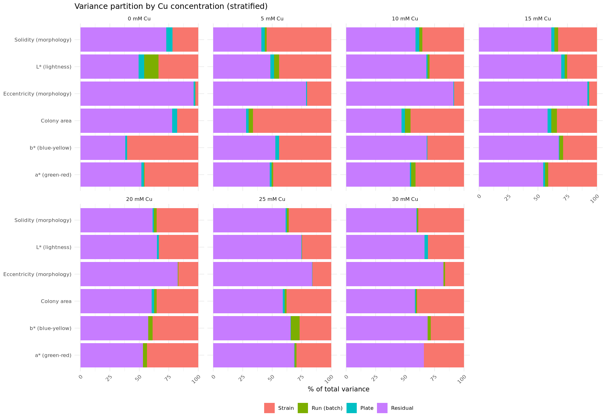
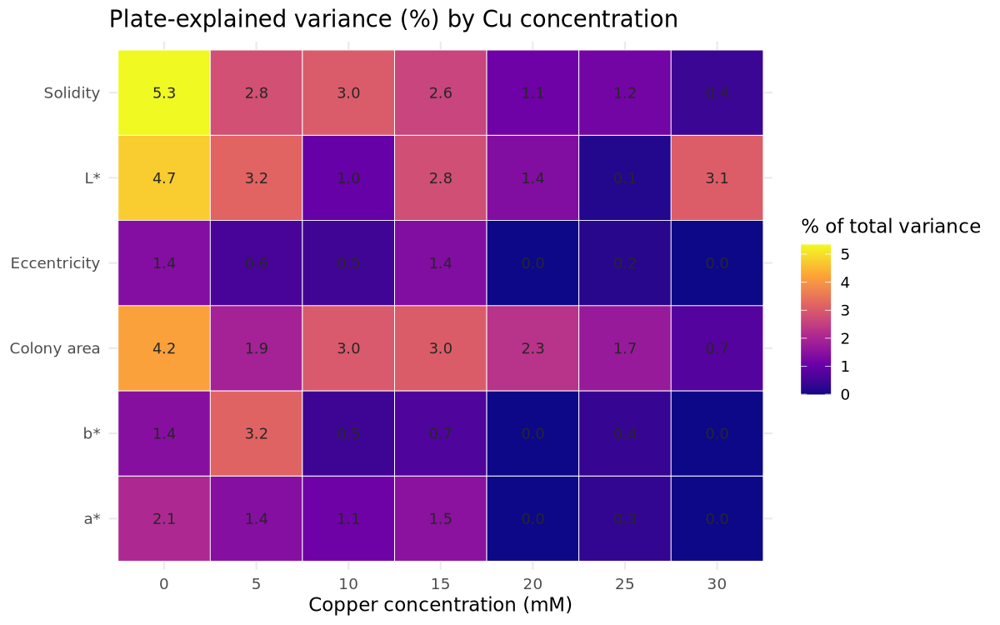
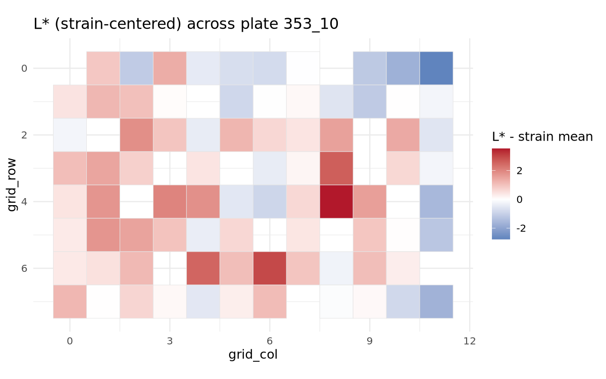
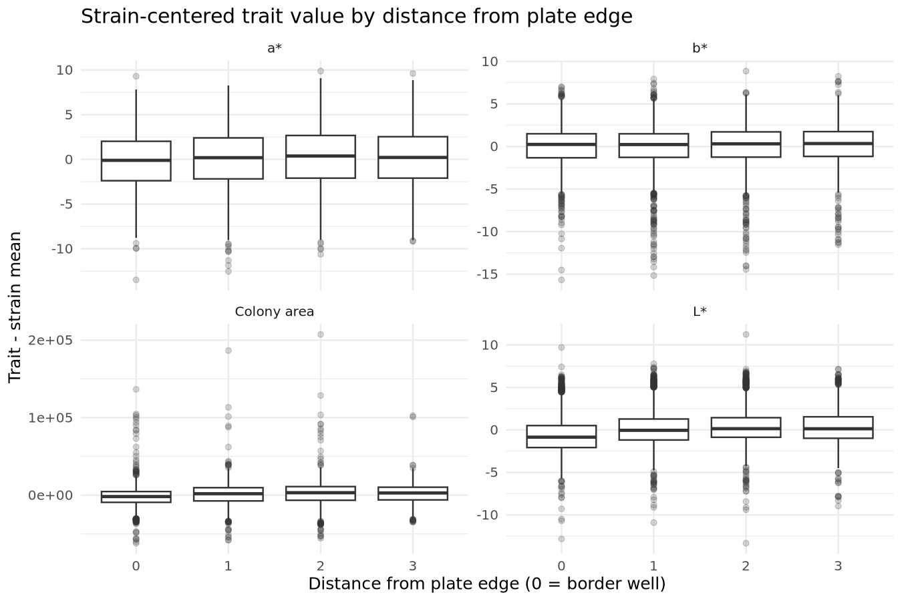
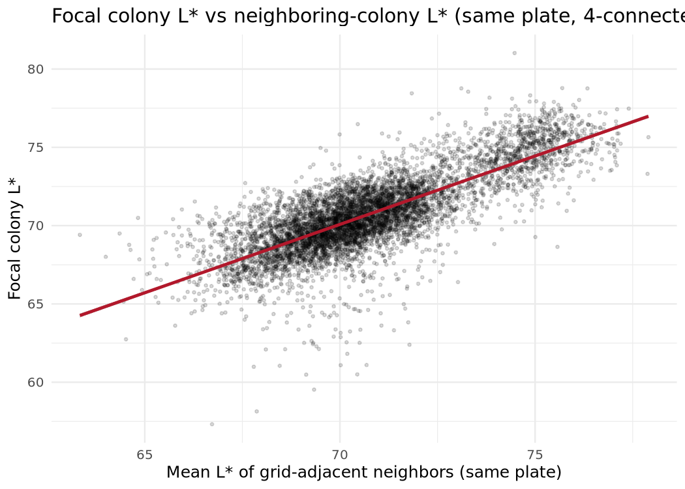
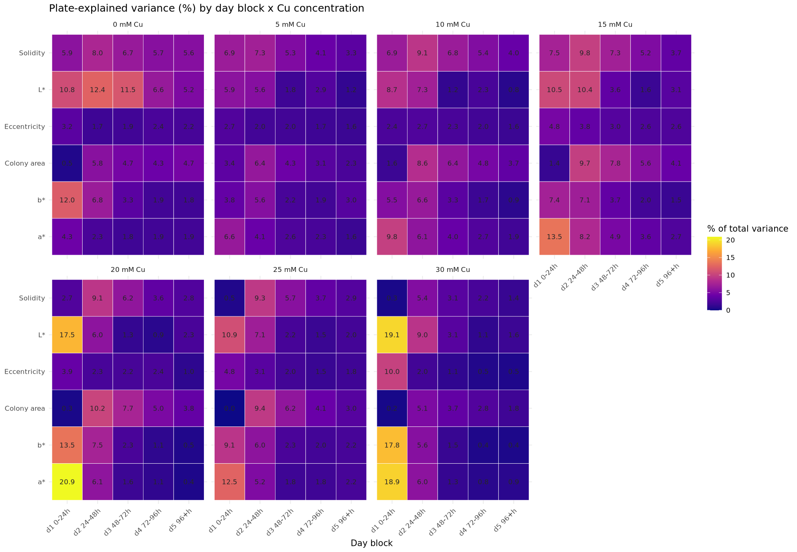
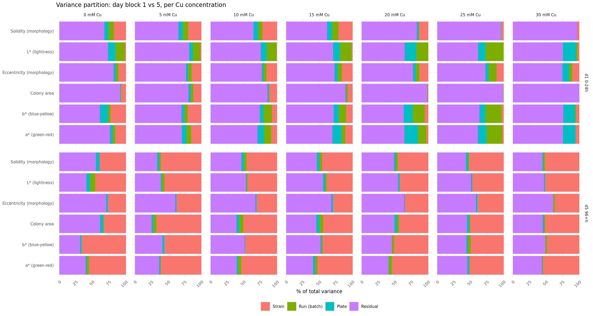
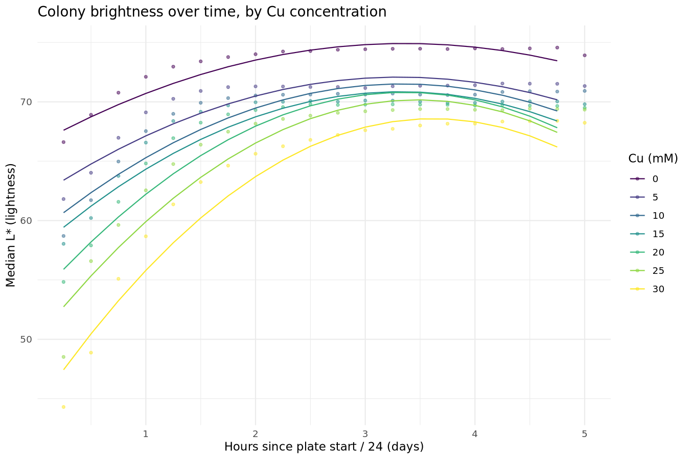
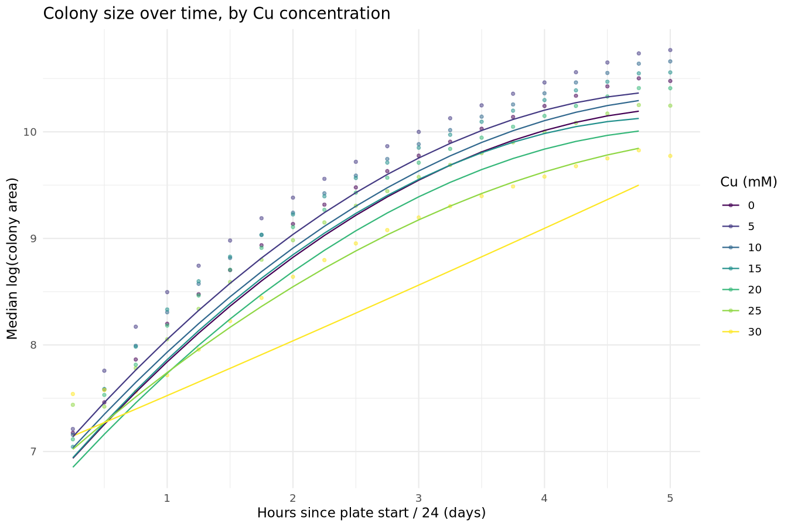
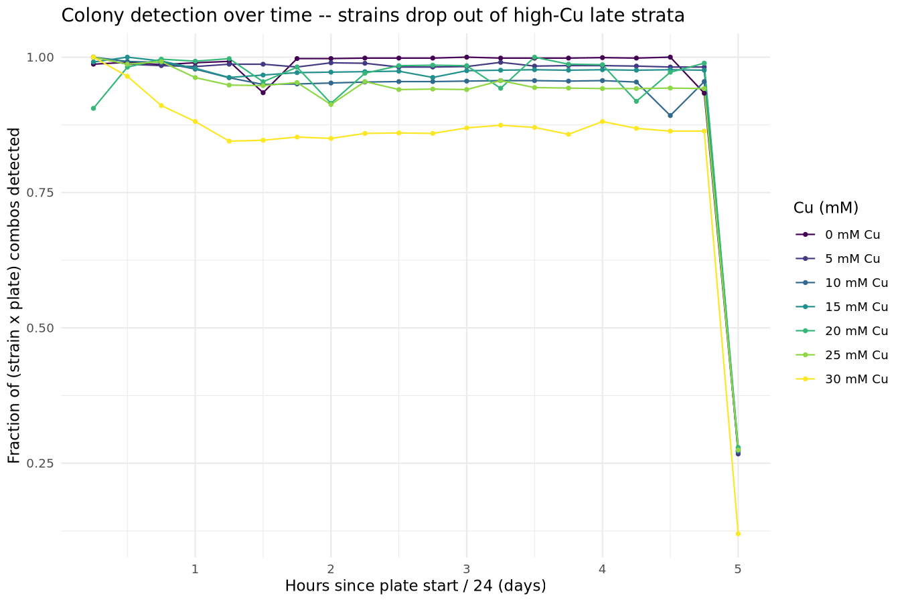

Does plate position explain strain-replicate variance?
================
analysis/explore_plate_position
2026-08-17

- [Question](#question)
- [Data](#data)
- [Primary analysis: variance partition, stratified by Cu
  concentration](#primary-analysis-variance-partition-stratified-by-cu-concentration)
  - [Variance components by Cu
    concentration](#variance-components-by-cu-concentration)
  - [Fixed effects (linear position gradient), per Cu
    concentration](#fixed-effects-linear-position-gradient-per-cu-concentration)
  - [Categorical position robustness check, per Cu
    concentration](#categorical-position-robustness-check-per-cu-concentration)
  - [Visualizing plate structure](#visualizing-plate-structure)
- [Secondary analysis: adjacent-colony
  effect](#secondary-analysis-adjacent-colony-effect)
- [Time component: does growth stage change the
  answer?](#time-component-does-growth-stage-change-the-answer)
  - [Day-block variance partition](#day-block-variance-partition)
  - [Growth curves: do colonies get brighter and bigger with
    time?](#growth-curves-do-colonies-get-brighter-and-bigger-with-time)
- [Interpretation](#interpretation)
- [Reproducing](#reproducing)

## Question

Colony color (`ColorLab_L*Mean`, `a*Mean`, `b*Mean`) and colony
size/morphology (`Shape_Area`, `Shape_Solidity`, `Shape_Eccentricity`)
are measured once per strain per Copper concentration per run, via
`v_phenotype`. Each run is a physically distinct plate/well for that
strain (see [`DATABASE_DESIGN.md`](../../DATABASE_DESIGN.md) and the
README quirks list — `replicate_label` is an imager-run proxy, **not** a
true technical replicate). That gives up to 4 independent (plate, well)
observations per strain per concentration. This analysis asks:

1.  **Primary**: how much of a strain’s across-run variance in these
    traits is attributable to which plate it landed on / where on the
    plate it sat, versus genuine strain identity, versus residual noise?
2.  **Secondary**: after accounting for a colony’s own strain and grid
    position, do its immediate grid-neighbors on the same plate predict
    its trait value (a local microenvironment / segmentation-bleed
    signal distinct from a plate-wide position effect)?

## Data

Built by `scripts/00_build_dataset.R`: one row per colony at the
**endpoint** image of its plate (last timepoint, ~117h) from
`v_phenotype`, restricted to `experiment_name = 'Copper'` and matched
strains (`strain_id IS NOT NULL`). Endpoint-only avoids confounding
growth stage with plate position, since each plate has ~21 timepoints
spanning the full time course.

    ## 7577 colonies | 112 plates | 306 strains | 4 runs (353, 354, 355, 356)

Three wells had two segmented objects at the endpoint timepoint (a real
colony plus a small fragment); `00_build_dataset.R` keeps the larger
object at each and logs which wells were affected.

**Design note (why the analysis is stratified by Cu concentration):**
every plate was imaged at exactly one Copper concentration — `plate_id`
is *nested* inside `copper_mm`, no plate carries multiple Cu levels (112
plates, 0 with more than one level; 7 concentrations × 16 plates each).
A single pooled model would average the plate variance component across
Cu conditions with very different biology (0 mM control vs 30 mM
stress), and a random slope of `Cu` within `plate_id` is not estimable
because Cu does not vary within a plate. The primary analysis is
therefore **fit independently within each Cu concentration** (see
below).

## Primary analysis: variance partition, stratified by Cu concentration

`scripts/01_variance_partition.R` fits, per trait and per Cu
concentration, a mixed model over strains observed on \>= 2 plates
within that concentration:

    trait ~ grid_row_c + grid_col_c + is_edge
            + (1 | strain_code) + (1 | run_number) + (1 | plate_id)

The `copper_mm` term is dropped — it is constant within a stratum.
`strain_code` and `plate_id` are crossed (a strain moves plate-to-plate
across runs); `run_number` captures imager-batch effects; `grid_row_c` /
`grid_col_c` (grid position, mean-centered) and `is_edge` are fixed
effects for a linear position gradient. A categorical-position version
(`grid_row`/`grid_col` as factors, tested by `anova()`) is fit alongside
within each stratum as a robustness check for non-monotonic position
effects the linear terms would average away.

### Variance components by Cu concentration

| trait                     | Cu (mM) | Strain | Run (batch) | Plate | Residual |
|:--------------------------|--------:|-------:|------------:|------:|---------:|
| Solidity (morphology)     |       0 |     NA |          NA |   5.3 |       NA |
| L\* (lightness)           |       0 |     NA |          NA |   4.7 |       NA |
| Colony area               |       0 |     NA |          NA |   4.2 |       NA |
| L\* (lightness)           |       5 |     NA |          NA |   3.2 |       NA |
| b\* (blue-yellow)         |       5 |     NA |          NA |   3.2 |       NA |
| L\* (lightness)           |      30 |     NA |          NA |   3.1 |       NA |
| Colony area               |      10 |     NA |          NA |   3.0 |       NA |
| Solidity (morphology)     |      10 |     NA |          NA |   3.0 |       NA |
| Colony area               |      15 |     NA |          NA |   3.0 |       NA |
| Solidity (morphology)     |       5 |     NA |          NA |   2.8 |       NA |
| L\* (lightness)           |      15 |     NA |          NA |   2.8 |       NA |
| Solidity (morphology)     |      15 |     NA |          NA |   2.6 |       NA |
| Colony area               |      20 |     NA |          NA |   2.3 |       NA |
| a\* (green-red)           |       0 |     NA |          NA |   2.1 |       NA |
| Colony area               |       5 |     NA |          NA |   1.9 |       NA |
| Colony area               |      25 |     NA |          NA |   1.7 |       NA |
| a\* (green-red)           |      15 |     NA |          NA |   1.5 |       NA |
| b\* (blue-yellow)         |       0 |     NA |          NA |   1.4 |       NA |
| Eccentricity (morphology) |       0 |     NA |          NA |   1.4 |       NA |
| a\* (green-red)           |       5 |     NA |          NA |   1.4 |       NA |
| Eccentricity (morphology) |      15 |     NA |          NA |   1.4 |       NA |
| L\* (lightness)           |      20 |     NA |          NA |   1.4 |       NA |
| Solidity (morphology)     |      25 |     NA |          NA |   1.2 |       NA |
| a\* (green-red)           |      10 |     NA |          NA |   1.1 |       NA |
| Solidity (morphology)     |      20 |     NA |          NA |   1.1 |       NA |
| L\* (lightness)           |      10 |     NA |          NA |   1.0 |       NA |
| b\* (blue-yellow)         |      15 |     NA |          NA |   0.7 |       NA |
| Colony area               |      30 |     NA |          NA |   0.7 |       NA |
| Eccentricity (morphology) |       5 |     NA |          NA |   0.6 |       NA |
| b\* (blue-yellow)         |      10 |     NA |          NA |   0.5 |       NA |
| Eccentricity (morphology) |      10 |     NA |          NA |   0.5 |       NA |
| b\* (blue-yellow)         |      25 |     NA |          NA |   0.4 |       NA |
| Solidity (morphology)     |      30 |     NA |          NA |   0.4 |       NA |
| a\* (green-red)           |      25 |     NA |          NA |   0.3 |       NA |
| Eccentricity (morphology) |      25 |     NA |          NA |   0.2 |       NA |
| L\* (lightness)           |      25 |     NA |          NA |   0.1 |       NA |
| a\* (green-red)           |      20 |     NA |          NA |   0.0 |       NA |
| b\* (blue-yellow)         |      20 |     NA |          NA |   0.0 |       NA |
| Eccentricity (morphology) |      20 |     NA |          NA |   0.0 |       NA |
| a\* (green-red)           |      30 |     NA |          NA |   0.0 |       NA |
| b\* (blue-yellow)         |      30 |     NA |          NA |   0.0 |       NA |
| Eccentricity (morphology) |      30 |     NA |          NA |   0.0 |       NA |
| L\* (lightness)           |       0 |   33.7 |          NA |    NA |       NA |
| L\* (lightness)           |       0 |     NA |        12.1 |    NA |       NA |
| L\* (lightness)           |       0 |     NA |          NA |    NA |     49.4 |
| a\* (green-red)           |       0 |   45.6 |          NA |    NA |       NA |
| a\* (green-red)           |       0 |     NA |         0.6 |    NA |       NA |
| a\* (green-red)           |       0 |     NA |          NA |    NA |     51.7 |
| b\* (blue-yellow)         |       0 |   60.5 |          NA |    NA |       NA |
| b\* (blue-yellow)         |       0 |     NA |         0.0 |    NA |       NA |
| b\* (blue-yellow)         |       0 |     NA |          NA |    NA |     38.1 |
| Colony area               |       0 |   18.0 |          NA |    NA |       NA |
| Colony area               |       0 |     NA |         0.0 |    NA |       NA |
| Colony area               |       0 |     NA |          NA |    NA |     77.8 |
| Solidity (morphology)     |       0 |   21.8 |          NA |    NA |       NA |
| Solidity (morphology)     |       0 |     NA |         0.0 |    NA |       NA |
| Solidity (morphology)     |       0 |     NA |          NA |    NA |     72.9 |
| Eccentricity (morphology) |       0 |    2.5 |          NA |    NA |       NA |
| Eccentricity (morphology) |       0 |     NA |         0.1 |    NA |       NA |
| Eccentricity (morphology) |       0 |     NA |          NA |    NA |     96.0 |
| L\* (lightness)           |       5 |   44.2 |          NA |    NA |       NA |
| L\* (lightness)           |       5 |     NA |         4.1 |    NA |       NA |
| L\* (lightness)           |       5 |     NA |          NA |    NA |     48.5 |
| a\* (green-red)           |       5 |   49.1 |          NA |    NA |       NA |
| a\* (green-red)           |       5 |     NA |         1.4 |    NA |       NA |
| a\* (green-red)           |       5 |     NA |          NA |    NA |     48.0 |
| b\* (blue-yellow)         |       5 |   44.1 |          NA |    NA |       NA |
| b\* (blue-yellow)         |       5 |     NA |         0.0 |    NA |       NA |
| b\* (blue-yellow)         |       5 |     NA |          NA |    NA |     52.7 |
| Colony area               |       5 |   66.3 |          NA |    NA |       NA |
| Colony area               |       5 |     NA |         3.8 |    NA |       NA |
| Colony area               |       5 |     NA |          NA |    NA |     28.0 |
| Solidity (morphology)     |       5 |   54.7 |          NA |    NA |       NA |
| Solidity (morphology)     |       5 |     NA |         1.6 |    NA |       NA |
| Solidity (morphology)     |       5 |     NA |          NA |    NA |     40.8 |
| Eccentricity (morphology) |       5 |   20.5 |          NA |    NA |       NA |
| Eccentricity (morphology) |       5 |     NA |         0.0 |    NA |       NA |
| Eccentricity (morphology) |       5 |     NA |          NA |    NA |     78.9 |
| L\* (lightness)           |      10 |   29.3 |          NA |    NA |       NA |
| L\* (lightness)           |      10 |     NA |         1.6 |    NA |       NA |
| L\* (lightness)           |      10 |     NA |          NA |    NA |     68.2 |
| a\* (green-red)           |      10 |   41.2 |          NA |    NA |       NA |
| a\* (green-red)           |      10 |     NA |         3.6 |    NA |       NA |
| a\* (green-red)           |      10 |     NA |          NA |    NA |     54.2 |
| b\* (blue-yellow)         |      10 |   31.1 |          NA |    NA |       NA |
| b\* (blue-yellow)         |      10 |     NA |         0.1 |    NA |       NA |
| b\* (blue-yellow)         |      10 |     NA |          NA |    NA |     68.4 |
| Colony area               |      10 |   45.2 |          NA |    NA |       NA |
| Colony area               |      10 |     NA |         4.7 |    NA |       NA |
| Colony area               |      10 |     NA |          NA |    NA |     47.0 |
| Solidity (morphology)     |      10 |   35.4 |          NA |    NA |       NA |
| Solidity (morphology)     |      10 |     NA |         2.6 |    NA |       NA |
| Solidity (morphology)     |      10 |     NA |          NA |    NA |     59.0 |
| Eccentricity (morphology) |      10 |    8.4 |          NA |    NA |       NA |
| Eccentricity (morphology) |      10 |     NA |         0.0 |    NA |       NA |
| Eccentricity (morphology) |      10 |     NA |          NA |    NA |     91.1 |
| L\* (lightness)           |      15 |   25.1 |          NA |    NA |       NA |
| L\* (lightness)           |      15 |     NA |         2.3 |    NA |       NA |
| L\* (lightness)           |      15 |     NA |          NA |    NA |     69.8 |
| a\* (green-red)           |      15 |   41.4 |          NA |    NA |       NA |
| a\* (green-red)           |      15 |     NA |         2.6 |    NA |       NA |
| a\* (green-red)           |      15 |     NA |          NA |    NA |     54.5 |
| b\* (blue-yellow)         |      15 |   28.6 |          NA |    NA |       NA |
| b\* (blue-yellow)         |      15 |     NA |         3.2 |    NA |       NA |
| b\* (blue-yellow)         |      15 |     NA |          NA |    NA |     67.6 |
| Colony area               |      15 |   33.9 |          NA |    NA |       NA |
| Colony area               |      15 |     NA |         4.8 |    NA |       NA |
| Colony area               |      15 |     NA |          NA |    NA |     58.2 |
| Solidity (morphology)     |      15 |   32.8 |          NA |    NA |       NA |
| Solidity (morphology)     |      15 |     NA |         3.3 |    NA |       NA |
| Solidity (morphology)     |      15 |     NA |          NA |    NA |     61.3 |
| Eccentricity (morphology) |      15 |    6.5 |          NA |    NA |       NA |
| Eccentricity (morphology) |      15 |     NA |         0.2 |    NA |       NA |
| Eccentricity (morphology) |      15 |     NA |          NA |    NA |     92.0 |
| L\* (lightness)           |      20 |   33.6 |          NA |    NA |       NA |
| L\* (lightness)           |      20 |     NA |         0.0 |    NA |       NA |
| L\* (lightness)           |      20 |     NA |          NA |    NA |     65.1 |
| a\* (green-red)           |      20 |   43.4 |          NA |    NA |       NA |
| a\* (green-red)           |      20 |     NA |         3.4 |    NA |       NA |
| a\* (green-red)           |      20 |     NA |          NA |    NA |     53.2 |
| b\* (blue-yellow)         |      20 |   38.8 |          NA |    NA |       NA |
| b\* (blue-yellow)         |      20 |     NA |         3.7 |    NA |       NA |
| b\* (blue-yellow)         |      20 |     NA |          NA |    NA |     57.5 |
| Colony area               |      20 |   35.3 |          NA |    NA |       NA |
| Colony area               |      20 |     NA |         2.1 |    NA |       NA |
| Colony area               |      20 |     NA |          NA |    NA |     60.3 |
| Solidity (morphology)     |      20 |   35.4 |          NA |    NA |       NA |
| Solidity (morphology)     |      20 |     NA |         2.2 |    NA |       NA |
| Solidity (morphology)     |      20 |     NA |          NA |    NA |     61.3 |
| Eccentricity (morphology) |      20 |   16.8 |          NA |    NA |       NA |
| Eccentricity (morphology) |      20 |     NA |         0.4 |    NA |       NA |
| Eccentricity (morphology) |      20 |     NA |          NA |    NA |     82.7 |
| L\* (lightness)           |      25 |   24.7 |          NA |    NA |       NA |
| L\* (lightness)           |      25 |     NA |         0.2 |    NA |       NA |
| L\* (lightness)           |      25 |     NA |          NA |    NA |     74.9 |
| a\* (green-red)           |      25 |   29.4 |          NA |    NA |       NA |
| a\* (green-red)           |      25 |     NA |         1.6 |    NA |       NA |
| a\* (green-red)           |      25 |     NA |          NA |    NA |     68.7 |
| b\* (blue-yellow)         |      25 |   26.7 |          NA |    NA |       NA |
| b\* (blue-yellow)         |      25 |     NA |         7.5 |    NA |       NA |
| b\* (blue-yellow)         |      25 |     NA |          NA |    NA |     65.5 |
| Colony area               |      25 |   37.8 |          NA |    NA |       NA |
| Colony area               |      25 |     NA |         1.6 |    NA |       NA |
| Colony area               |      25 |     NA |          NA |    NA |     58.9 |
| Solidity (morphology)     |      25 |   36.1 |          NA |    NA |       NA |
| Solidity (morphology)     |      25 |     NA |         1.5 |    NA |       NA |
| Solidity (morphology)     |      25 |     NA |          NA |    NA |     61.3 |
| Eccentricity (morphology) |      25 |   16.0 |          NA |    NA |       NA |
| Eccentricity (morphology) |      25 |     NA |         0.0 |    NA |       NA |
| Eccentricity (morphology) |      25 |     NA |          NA |    NA |     83.8 |
| L\* (lightness)           |      30 |   30.6 |          NA |    NA |       NA |
| L\* (lightness)           |      30 |     NA |         0.0 |    NA |       NA |
| L\* (lightness)           |      30 |     NA |          NA |    NA |     66.4 |
| a\* (green-red)           |      30 |   34.0 |          NA |    NA |       NA |
| a\* (green-red)           |      30 |     NA |         0.0 |    NA |       NA |
| a\* (green-red)           |      30 |     NA |          NA |    NA |     66.0 |
| b\* (blue-yellow)         |      30 |   28.1 |          NA |    NA |       NA |
| b\* (blue-yellow)         |      30 |     NA |         2.7 |    NA |       NA |
| b\* (blue-yellow)         |      30 |     NA |          NA |    NA |     69.2 |
| Colony area               |      30 |   39.9 |          NA |    NA |       NA |
| Colony area               |      30 |     NA |         1.0 |    NA |       NA |
| Colony area               |      30 |     NA |          NA |    NA |     58.3 |
| Solidity (morphology)     |      30 |   38.7 |          NA |    NA |       NA |
| Solidity (morphology)     |      30 |     NA |         1.2 |    NA |       NA |
| Solidity (morphology)     |      30 |     NA |          NA |    NA |     59.7 |
| Eccentricity (morphology) |      30 |   16.2 |          NA |    NA |       NA |
| Eccentricity (morphology) |      30 |     NA |         1.2 |    NA |       NA |
| Eccentricity (morphology) |      30 |     NA |          NA |    NA |     82.6 |

% of total variance attributable to each random-effect group, per Cu
concentration

<figure>

<figcaption aria-hidden="true">Variance partition by trait and Cu
concentration (stratified)</figcaption>
</figure>

<figure>

<figcaption aria-hidden="true">Plate-explained variance (%) across trait
and Cu concentration</figcaption>
</figure>

**Reading this table**: `Plate` variance is the headline number for the
primary hypothesis — it is the share of a trait’s total variance
explained purely by which physical plate a colony sat on (pooling
row/col position, local microenvironment, and any plate-to-plate
imaging/lighting drift), over and above strain identity, within a given
Cu concentration. A high `Plate` share alongside a low `Run` share means
the effect is plate-specific, not a run-wide batch shift. Reading down
Cu concentrations shows whether the plate effect grows under Cu stress
(e.g. plate-to-plate heterogeneity in copper handling) or is
condition-independent.

### Fixed effects (linear position gradient), per Cu concentration

| trait | copper_mm | term | estimate | std.error | statistic | p.value |
|:---|---:|:---|---:|---:|---:|---:|
| L\* (lightness) | 0 | grid_row_c | -0.1226 | 0.0150 | -8.1880 | 0.0000 |
| L\* (lightness) | 0 | grid_col_c | -0.1585 | 0.0103 | -15.3657 | 0.0000 |
| L\* (lightness) | 0 | is_edgeTRUE | -0.9843 | 0.0685 | -14.3631 | 0.0000 |
| a\* (green-red) | 0 | grid_row_c | -0.1104 | 0.0281 | -3.9366 | 0.0001 |
| a\* (green-red) | 0 | grid_col_c | -0.0269 | 0.0193 | -1.3948 | 0.1634 |
| a\* (green-red) | 0 | is_edgeTRUE | -0.9643 | 0.1280 | -7.5348 | 0.0000 |
| b\* (blue-yellow) | 0 | grid_row_c | 0.0130 | 0.0184 | 0.7046 | 0.4813 |
| b\* (blue-yellow) | 0 | grid_col_c | 0.0182 | 0.0127 | 1.4358 | 0.1514 |
| b\* (blue-yellow) | 0 | is_edgeTRUE | 0.0286 | 0.0835 | 0.3427 | 0.7319 |
| Colony area | 0 | grid_row_c | -1164.6026 | 185.0588 | -6.2931 | 0.0000 |
| Colony area | 0 | grid_col_c | -135.0967 | 127.6379 | -1.0584 | 0.2901 |
| Colony area | 0 | is_edgeTRUE | -6300.2376 | 860.8254 | -7.3188 | 0.0000 |
| Solidity (morphology) | 0 | grid_row_c | -0.8495 | 0.1358 | -6.2558 | 0.0000 |
| Solidity (morphology) | 0 | grid_col_c | -0.0865 | 0.0936 | -0.9240 | 0.3557 |
| Solidity (morphology) | 0 | is_edgeTRUE | -4.9616 | 0.6293 | -7.8844 | 0.0000 |
| Eccentricity (morphology) | 0 | grid_row_c | 0.0013 | 0.0015 | 0.8913 | 0.3730 |
| Eccentricity (morphology) | 0 | grid_col_c | -0.0013 | 0.0010 | -1.2832 | 0.1997 |
| Eccentricity (morphology) | 0 | is_edgeTRUE | 0.0169 | 0.0069 | 2.4583 | 0.0141 |
| L\* (lightness) | 5 | grid_row_c | 0.0449 | 0.0145 | 3.0881 | 0.0021 |
| L\* (lightness) | 5 | grid_col_c | -0.1454 | 0.0100 | -14.4971 | 0.0000 |
| L\* (lightness) | 5 | is_edgeTRUE | -1.0427 | 0.0666 | -15.6463 | 0.0000 |
| a\* (green-red) | 5 | grid_row_c | 0.0249 | 0.0261 | 0.9542 | 0.3403 |
| a\* (green-red) | 5 | grid_col_c | -0.0004 | 0.0180 | -0.0226 | 0.9820 |
| a\* (green-red) | 5 | is_edgeTRUE | -0.2991 | 0.1197 | -2.4990 | 0.0126 |
| b\* (blue-yellow) | 5 | grid_row_c | 0.0270 | 0.0185 | 1.4616 | 0.1442 |
| b\* (blue-yellow) | 5 | grid_col_c | -0.0049 | 0.0127 | -0.3872 | 0.6987 |
| b\* (blue-yellow) | 5 | is_edgeTRUE | 0.0177 | 0.0848 | 0.2091 | 0.8344 |
| Colony area | 5 | grid_row_c | 9.4783 | 157.7288 | 0.0601 | 0.9521 |
| Colony area | 5 | grid_col_c | -14.0688 | 108.8722 | -0.1292 | 0.8972 |
| Colony area | 5 | is_edgeTRUE | -6343.7231 | 717.6026 | -8.8402 | 0.0000 |
| Solidity (morphology) | 5 | grid_row_c | 0.1340 | 0.1228 | 1.0915 | 0.2754 |
| Solidity (morphology) | 5 | grid_col_c | -0.0176 | 0.0847 | -0.2080 | 0.8353 |
| Solidity (morphology) | 5 | is_edgeTRUE | -3.8655 | 0.5609 | -6.8922 | 0.0000 |
| Eccentricity (morphology) | 5 | grid_row_c | -0.0045 | 0.0014 | -3.1771 | 0.0015 |
| Eccentricity (morphology) | 5 | grid_col_c | 0.0003 | 0.0010 | 0.2774 | 0.7815 |
| Eccentricity (morphology) | 5 | is_edgeTRUE | 0.0132 | 0.0066 | 2.0037 | 0.0454 |
| L\* (lightness) | 10 | grid_row_c | 0.0944 | 0.0153 | 6.1678 | 0.0000 |
| L\* (lightness) | 10 | grid_col_c | -0.1514 | 0.0105 | -14.3913 | 0.0000 |
| L\* (lightness) | 10 | is_edgeTRUE | -1.1057 | 0.0704 | -15.7052 | 0.0000 |
| a\* (green-red) | 10 | grid_row_c | 0.0382 | 0.0257 | 1.4859 | 0.1377 |
| a\* (green-red) | 10 | grid_col_c | -0.0212 | 0.0177 | -1.1991 | 0.2308 |
| a\* (green-red) | 10 | is_edgeTRUE | -0.2578 | 0.1175 | -2.1936 | 0.0285 |
| b\* (blue-yellow) | 10 | grid_row_c | 0.0104 | 0.0249 | 0.4202 | 0.6745 |
| b\* (blue-yellow) | 10 | grid_col_c | -0.0210 | 0.0170 | -1.2293 | 0.2193 |
| b\* (blue-yellow) | 10 | is_edgeTRUE | -0.0870 | 0.1143 | -0.7610 | 0.4469 |
| Colony area | 10 | grid_row_c | 277.4244 | 148.1252 | 1.8729 | 0.0614 |
| Colony area | 10 | grid_col_c | -116.7934 | 101.9657 | -1.1454 | 0.2524 |
| Colony area | 10 | is_edgeTRUE | -5650.3792 | 674.6522 | -8.3752 | 0.0000 |
| Solidity (morphology) | 10 | grid_row_c | 0.2369 | 0.1309 | 1.8108 | 0.0705 |
| Solidity (morphology) | 10 | grid_col_c | -0.0738 | 0.0901 | -0.8198 | 0.4126 |
| Solidity (morphology) | 10 | is_edgeTRUE | -3.4371 | 0.5996 | -5.7325 | 0.0000 |
| Eccentricity (morphology) | 10 | grid_row_c | -0.0005 | 0.0015 | -0.3396 | 0.7342 |
| Eccentricity (morphology) | 10 | grid_col_c | 0.0022 | 0.0010 | 2.2414 | 0.0252 |
| Eccentricity (morphology) | 10 | is_edgeTRUE | -0.0181 | 0.0069 | -2.6347 | 0.0086 |
| L\* (lightness) | 15 | grid_row_c | 0.0573 | 0.0164 | 3.4889 | 0.0005 |
| L\* (lightness) | 15 | grid_col_c | -0.1412 | 0.0113 | -12.4868 | 0.0000 |
| L\* (lightness) | 15 | is_edgeTRUE | -1.0880 | 0.0757 | -14.3824 | 0.0000 |
| a\* (green-red) | 15 | grid_row_c | 0.0091 | 0.0267 | 0.3425 | 0.7321 |
| a\* (green-red) | 15 | grid_col_c | -0.0048 | 0.0184 | -0.2598 | 0.7951 |
| a\* (green-red) | 15 | is_edgeTRUE | -0.1158 | 0.1218 | -0.9511 | 0.3418 |
| b\* (blue-yellow) | 15 | grid_row_c | -0.0082 | 0.0287 | -0.2842 | 0.7763 |
| b\* (blue-yellow) | 15 | grid_col_c | -0.0016 | 0.0198 | -0.0819 | 0.9348 |
| b\* (blue-yellow) | 15 | is_edgeTRUE | 0.2225 | 0.1321 | 1.6840 | 0.0925 |
| Colony area | 15 | grid_row_c | 59.0769 | 144.8873 | 0.4077 | 0.6836 |
| Colony area | 15 | grid_col_c | 11.5376 | 99.8819 | 0.1155 | 0.9081 |
| Colony area | 15 | is_edgeTRUE | -3496.1436 | 663.5130 | -5.2691 | 0.0000 |
| Solidity (morphology) | 15 | grid_row_c | 0.0347 | 0.1423 | 0.2439 | 0.8074 |
| Solidity (morphology) | 15 | grid_col_c | 0.0464 | 0.0981 | 0.4735 | 0.6359 |
| Solidity (morphology) | 15 | is_edgeTRUE | -1.5638 | 0.6524 | -2.3971 | 0.0167 |
| Eccentricity (morphology) | 15 | grid_row_c | -0.0025 | 0.0016 | -1.5285 | 0.1267 |
| Eccentricity (morphology) | 15 | grid_col_c | 0.0009 | 0.0011 | 0.8046 | 0.4212 |
| Eccentricity (morphology) | 15 | is_edgeTRUE | -0.0141 | 0.0077 | -1.8380 | 0.0664 |
| L\* (lightness) | 20 | grid_row_c | 0.0061 | 0.0172 | 0.3564 | 0.7216 |
| L\* (lightness) | 20 | grid_col_c | -0.1595 | 0.0119 | -13.4374 | 0.0000 |
| L\* (lightness) | 20 | is_edgeTRUE | -1.2391 | 0.0792 | -15.6429 | 0.0000 |
| a\* (green-red) | 20 | grid_row_c | -0.0323 | 0.0238 | -1.3568 | 0.1752 |
| a\* (green-red) | 20 | grid_col_c | -0.0183 | 0.0164 | -1.1099 | 0.2673 |
| a\* (green-red) | 20 | is_edgeTRUE | -0.2941 | 0.1089 | -2.6999 | 0.0071 |
| b\* (blue-yellow) | 20 | grid_row_c | -0.0713 | 0.0274 | -2.6078 | 0.0093 |
| b\* (blue-yellow) | 20 | grid_col_c | -0.0307 | 0.0189 | -1.6218 | 0.1052 |
| b\* (blue-yellow) | 20 | is_edgeTRUE | -0.0900 | 0.1255 | -0.7172 | 0.4734 |
| Colony area | 20 | grid_row_c | -51.6236 | 131.2026 | -0.3935 | 0.6941 |
| Colony area | 20 | grid_col_c | -54.6701 | 90.7748 | -0.6023 | 0.5472 |
| Colony area | 20 | is_edgeTRUE | -3168.7264 | 603.7998 | -5.2480 | 0.0000 |
| Solidity (morphology) | 20 | grid_row_c | -0.0706 | 0.1308 | -0.5396 | 0.5896 |
| Solidity (morphology) | 20 | grid_col_c | -0.0440 | 0.0905 | -0.4867 | 0.6266 |
| Solidity (morphology) | 20 | is_edgeTRUE | -1.9093 | 0.6019 | -3.1722 | 0.0016 |
| Eccentricity (morphology) | 20 | grid_row_c | 0.0007 | 0.0017 | 0.4091 | 0.6825 |
| Eccentricity (morphology) | 20 | grid_col_c | 0.0019 | 0.0011 | 1.6412 | 0.1011 |
| Eccentricity (morphology) | 20 | is_edgeTRUE | -0.0322 | 0.0078 | -4.1474 | 0.0000 |
| L\* (lightness) | 25 | grid_row_c | 0.0033 | 0.0195 | 0.1708 | 0.8644 |
| L\* (lightness) | 25 | grid_col_c | -0.1404 | 0.0134 | -10.4855 | 0.0000 |
| L\* (lightness) | 25 | is_edgeTRUE | -1.2267 | 0.0904 | -13.5704 | 0.0000 |
| a\* (green-red) | 25 | grid_row_c | -0.0230 | 0.0249 | -0.9238 | 0.3558 |
| a\* (green-red) | 25 | grid_col_c | -0.0189 | 0.0171 | -1.1032 | 0.2703 |
| a\* (green-red) | 25 | is_edgeTRUE | -0.1843 | 0.1150 | -1.6030 | 0.1093 |
| b\* (blue-yellow) | 25 | grid_row_c | -0.0706 | 0.0314 | -2.2465 | 0.0249 |
| b\* (blue-yellow) | 25 | grid_col_c | -0.0348 | 0.0217 | -1.6090 | 0.1080 |
| b\* (blue-yellow) | 25 | is_edgeTRUE | 0.1981 | 0.1450 | 1.3661 | 0.1723 |
| Colony area | 25 | grid_row_c | 14.0542 | 142.8975 | 0.0984 | 0.9217 |
| Colony area | 25 | grid_col_c | -112.0735 | 98.4521 | -1.1384 | 0.2553 |
| Colony area | 25 | is_edgeTRUE | -3667.3535 | 656.2757 | -5.5881 | 0.0000 |
| Solidity (morphology) | 25 | grid_row_c | -0.0055 | 0.1463 | -0.0379 | 0.9698 |
| Solidity (morphology) | 25 | grid_col_c | -0.0847 | 0.1007 | -0.8409 | 0.4007 |
| Solidity (morphology) | 25 | is_edgeTRUE | -2.2518 | 0.6724 | -3.3489 | 0.0009 |
| Eccentricity (morphology) | 25 | grid_row_c | -0.0002 | 0.0019 | -0.1177 | 0.9063 |
| Eccentricity (morphology) | 25 | grid_col_c | 0.0012 | 0.0013 | 0.9385 | 0.3482 |
| Eccentricity (morphology) | 25 | is_edgeTRUE | -0.0293 | 0.0087 | -3.3861 | 0.0007 |
| L\* (lightness) | 30 | grid_row_c | 0.0127 | 0.0200 | 0.6362 | 0.5248 |
| L\* (lightness) | 30 | grid_col_c | -0.1367 | 0.0140 | -9.7990 | 0.0000 |
| L\* (lightness) | 30 | is_edgeTRUE | -1.2934 | 0.0932 | -13.8806 | 0.0000 |
| a\* (green-red) | 30 | grid_row_c | -0.0044 | 0.0211 | -0.2109 | 0.8330 |
| a\* (green-red) | 30 | grid_col_c | -0.0016 | 0.0147 | -0.1110 | 0.9116 |
| a\* (green-red) | 30 | is_edgeTRUE | -0.2822 | 0.0978 | -2.8840 | 0.0040 |
| b\* (blue-yellow) | 30 | grid_row_c | -0.0316 | 0.0353 | -0.8953 | 0.3709 |
| b\* (blue-yellow) | 30 | grid_col_c | -0.0162 | 0.0246 | -0.6558 | 0.5121 |
| b\* (blue-yellow) | 30 | is_edgeTRUE | -0.0569 | 0.1644 | -0.3464 | 0.7292 |
| Colony area | 30 | grid_row_c | 129.0605 | 133.1621 | 0.9692 | 0.3327 |
| Colony area | 30 | grid_col_c | 62.3974 | 93.0040 | 0.6709 | 0.5025 |
| Colony area | 30 | is_edgeTRUE | -2561.8490 | 616.8067 | -4.1534 | 0.0000 |
| Solidity (morphology) | 30 | grid_row_c | 0.1020 | 0.1555 | 0.6558 | 0.5121 |
| Solidity (morphology) | 30 | grid_col_c | 0.0387 | 0.1086 | 0.3563 | 0.7217 |
| Solidity (morphology) | 30 | is_edgeTRUE | -2.1012 | 0.7205 | -2.9161 | 0.0036 |
| Eccentricity (morphology) | 30 | grid_row_c | 0.0042 | 0.0020 | 2.0802 | 0.0378 |
| Eccentricity (morphology) | 30 | grid_col_c | 0.0007 | 0.0014 | 0.5103 | 0.6100 |
| Eccentricity (morphology) | 30 | is_edgeTRUE | -0.0451 | 0.0094 | -4.8104 | 0.0000 |

Row/column/edge fixed-effect coefficients per Cu concentration,
strain+run+plate accounted for

### Categorical position robustness check, per Cu concentration

| trait                     | copper_mm | term       | F value |  Pr(\>F) |
|:--------------------------|----------:|:-----------|--------:|---------:|
| L\* (lightness)           |         0 | grid_row_f |  39.700 | 0.00e+00 |
| L\* (lightness)           |         0 | grid_col_f |  30.300 | 0.00e+00 |
| a\* (green-red)           |         0 | grid_row_f |   9.110 | 0.00e+00 |
| a\* (green-red)           |         0 | grid_col_f |   3.220 | 2.51e-04 |
| b\* (blue-yellow)         |         0 | grid_row_f |   1.210 | 2.94e-01 |
| b\* (blue-yellow)         |         0 | grid_col_f |   0.857 | 5.83e-01 |
| Colony area               |         0 | grid_row_f |  19.700 | 0.00e+00 |
| Colony area               |         0 | grid_col_f |   1.650 | 8.02e-02 |
| Solidity (morphology)     |         0 | grid_row_f |  21.000 | 0.00e+00 |
| Solidity (morphology)     |         0 | grid_col_f |   2.260 | 1.01e-02 |
| Eccentricity (morphology) |         0 | grid_row_f |   1.290 | 2.52e-01 |
| Eccentricity (morphology) |         0 | grid_col_f |   1.270 | 2.36e-01 |
| L\* (lightness)           |         5 | grid_row_f |  42.400 | 0.00e+00 |
| L\* (lightness)           |         5 | grid_col_f |  24.000 | 0.00e+00 |
| a\* (green-red)           |         5 | grid_row_f |   1.950 | 5.93e-02 |
| a\* (green-red)           |         5 | grid_col_f |   1.580 | 1.00e-01 |
| b\* (blue-yellow)         |         5 | grid_row_f |   0.980 | 4.45e-01 |
| b\* (blue-yellow)         |         5 | grid_col_f |   0.644 | 7.92e-01 |
| Colony area               |         5 | grid_row_f |   8.250 | 0.00e+00 |
| Colony area               |         5 | grid_col_f |   3.850 | 1.97e-05 |
| Solidity (morphology)     |         5 | grid_row_f |   6.190 | 4.00e-07 |
| Solidity (morphology)     |         5 | grid_col_f |   2.890 | 9.67e-04 |
| Eccentricity (morphology) |         5 | grid_row_f |   3.900 | 3.32e-04 |
| Eccentricity (morphology) |         5 | grid_col_f |   1.290 | 2.23e-01 |
| L\* (lightness)           |        10 | grid_row_f |  43.300 | 0.00e+00 |
| L\* (lightness)           |        10 | grid_col_f |  27.500 | 0.00e+00 |
| a\* (green-red)           |        10 | grid_row_f |   2.490 | 1.56e-02 |
| a\* (green-red)           |        10 | grid_col_f |   0.910 | 5.30e-01 |
| b\* (blue-yellow)         |        10 | grid_row_f |   1.010 | 4.21e-01 |
| b\* (blue-yellow)         |        10 | grid_col_f |   1.270 | 2.34e-01 |
| Colony area               |        10 | grid_row_f |   9.180 | 0.00e+00 |
| Colony area               |        10 | grid_col_f |   2.480 | 4.54e-03 |
| Solidity (morphology)     |        10 | grid_row_f |   5.040 | 1.27e-05 |
| Solidity (morphology)     |        10 | grid_col_f |   1.250 | 2.49e-01 |
| Eccentricity (morphology) |        10 | grid_row_f |   0.837 | 5.57e-01 |
| Eccentricity (morphology) |        10 | grid_col_f |   2.800 | 1.35e-03 |
| L\* (lightness)           |        15 | grid_row_f |  31.800 | 0.00e+00 |
| L\* (lightness)           |        15 | grid_col_f |  22.200 | 0.00e+00 |
| a\* (green-red)           |        15 | grid_row_f |   0.756 | 6.24e-01 |
| a\* (green-red)           |        15 | grid_col_f |   0.753 | 6.87e-01 |
| b\* (blue-yellow)         |        15 | grid_row_f |   0.119 | 9.97e-01 |
| b\* (blue-yellow)         |        15 | grid_col_f |   1.510 | 1.22e-01 |
| Colony area               |        15 | grid_row_f |   3.840 | 4.00e-04 |
| Colony area               |        15 | grid_col_f |   1.180 | 3.00e-01 |
| Solidity (morphology)     |        15 | grid_row_f |   1.310 | 2.41e-01 |
| Solidity (morphology)     |        15 | grid_col_f |   0.561 | 8.61e-01 |
| Eccentricity (morphology) |        15 | grid_row_f |   2.180 | 3.36e-02 |
| Eccentricity (morphology) |        15 | grid_col_f |   0.960 | 4.82e-01 |
| L\* (lightness)           |        20 | grid_row_f |  35.400 | 0.00e+00 |
| L\* (lightness)           |        20 | grid_col_f |  24.400 | 0.00e+00 |
| a\* (green-red)           |        20 | grid_row_f |   2.780 | 7.35e-03 |
| a\* (green-red)           |        20 | grid_col_f |   0.627 | 8.07e-01 |
| b\* (blue-yellow)         |        20 | grid_row_f |   2.170 | 3.46e-02 |
| b\* (blue-yellow)         |        20 | grid_col_f |   0.894 | 5.46e-01 |
| Colony area               |        20 | grid_row_f |   4.200 | 1.44e-04 |
| Colony area               |        20 | grid_col_f |   1.280 | 2.32e-01 |
| Solidity (morphology)     |        20 | grid_row_f |   2.360 | 2.18e-02 |
| Solidity (morphology)     |        20 | grid_col_f |   0.919 | 5.21e-01 |
| Eccentricity (morphology) |        20 | grid_row_f |   3.540 | 9.08e-04 |
| Eccentricity (morphology) |        20 | grid_col_f |   2.400 | 6.11e-03 |
| L\* (lightness)           |        25 | grid_row_f |  26.800 | 0.00e+00 |
| L\* (lightness)           |        25 | grid_col_f |  15.200 | 0.00e+00 |
| a\* (green-red)           |        25 | grid_row_f |   1.930 | 6.14e-02 |
| a\* (green-red)           |        25 | grid_col_f |   0.511 | 8.97e-01 |
| b\* (blue-yellow)         |        25 | grid_row_f |   1.760 | 9.20e-02 |
| b\* (blue-yellow)         |        25 | grid_col_f |   0.823 | 6.17e-01 |
| Colony area               |        25 | grid_row_f |   4.460 | 6.91e-05 |
| Colony area               |        25 | grid_col_f |   1.340 | 1.96e-01 |
| Solidity (morphology)     |        25 | grid_row_f |   2.350 | 2.25e-02 |
| Solidity (morphology)     |        25 | grid_col_f |   0.685 | 7.54e-01 |
| Eccentricity (morphology) |        25 | grid_row_f |   2.640 | 1.05e-02 |
| Eccentricity (morphology) |        25 | grid_col_f |   1.320 | 2.07e-01 |
| L\* (lightness)           |        30 | grid_row_f |  30.100 | 0.00e+00 |
| L\* (lightness)           |        30 | grid_col_f |  14.600 | 0.00e+00 |
| a\* (green-red)           |        30 | grid_row_f |   2.320 | 2.37e-02 |
| a\* (green-red)           |        30 | grid_col_f |   0.458 | 9.29e-01 |
| b\* (blue-yellow)         |        30 | grid_row_f |   0.903 | 5.04e-01 |
| b\* (blue-yellow)         |        30 | grid_col_f |   0.308 | 9.84e-01 |
| Colony area               |        30 | grid_row_f |   3.330 | 1.68e-03 |
| Colony area               |        30 | grid_col_f |   1.550 | 1.10e-01 |
| Solidity (morphology)     |        30 | grid_row_f |   2.170 | 3.51e-02 |
| Solidity (morphology)     |        30 | grid_col_f |   0.833 | 6.07e-01 |
| Eccentricity (morphology) |        30 | grid_row_f |   4.190 | 1.47e-04 |
| Eccentricity (morphology) |        30 | grid_col_f |   1.190 | 2.91e-01 |

Type-III ANOVA (Satterthwaite) for row/col as factors, per Cu
concentration

### Visualizing plate structure

A representative plate, colors centered on each strain’s own mean (so
plate structure isn’t swamped by strain-to-strain color differences):

<figure>

<figcaption aria-hidden="true">Strain-centered L* across one
plate</figcaption>
</figure>

<figure>

<figcaption aria-hidden="true">Strain-centered trait value by distance
from plate edge, all plates pooled</figcaption>
</figure>

## Secondary analysis: adjacent-colony effect

`scripts/02_adjacency_effect.R` computes, for every colony, the mean
trait of its 4-connected grid neighbors (up/down/left/right, same
plate/image — not adjacent `well_position`, which is column-major and
not spatially adjacent). It then fits:

    trait ~ copper_mm + is_edge + trait_neighbor_mean
            + (1 | strain_code) + (1 | run_number) + (1 | plate_id)

testing whether a colony’s own trait value tracks its neighbors’ values
after strain identity, run, plate, and edge status are already accounted
for.

| trait | term | estimate | std.error | statistic | df | p.value |
|:---|:---|---:|---:|---:|---:|---:|
| L\* (lightness) | lab_l_mean_neighbor_mean | 0.37500 | 0.0159 | 23.50 | 5530 | 0.000 |
| a\* (green-red) | lab_a_mean_neighbor_mean | 0.02730 | 0.0170 | 1.61 | 6340 | 0.108 |
| b\* (blue-yellow) | lab_b_mean_neighbor_mean | 0.02730 | 0.0187 | 1.46 | 6290 | 0.144 |
| Colony area | shape_area_neighbor_mean | 0.02400 | 0.0184 | 1.31 | 6340 | 0.191 |
| Solidity (morphology) | shape_solidity_neighbor_mean | 0.00728 | 0.0182 | 0.40 | 6330 | 0.689 |

Neighbor-mean coefficient per trait (0 = no adjacency effect)

<figure>

<figcaption aria-hidden="true">Focal colony L* vs mean L* of its
grid-adjacent neighbors</figcaption>
</figure>

## Time component: does growth stage change the answer?

The endpoint table above collapses each plate to its **last** image so
growth stage cannot confound plate-position effects (see Data). But each
plate was also imaged through its own full time course, and those runs
are worth a second pass: every plate is photographed on the same
relative 6-hourly clock (`hours_since_plate_start` = 0, 6, 12, …, ~114
h; run 353 extends to ~117 h), so a *day block* (0-24 h = day 1, …,
96-120 h = day 5) is the same developmental stage on every plate.
`scripts/04_build_timecourse.R` builds `colony_timecourse.rds` — one row
per (plate, well, timepoint), runs 353-356 — and quantifies the
missingness.

**Missing data are expected and informative.** Not every strain grows on
every plate, and a share of strains simply do not grow on high Cu. The
`>=2 plates` per-strain filter therefore runs *within* each stratum,
every variance table row carries its realized `n_*`, and detection is
reported explicitly.

    ## 146053 colony x timepoint rows | 112 plates | 309 strains | 4 runs (353, 354, 355, 356)

| copper_mm | n_strain_plates | n_reached_late | pct_reached_late | n_strains_seen | n_strains_reached_late |
|---:|---:|---:|:---|---:|---:|
| 0 | 1163 | 1126 | 96.8% | 305 | 304 |
| 5 | 1158 | 1105 | 95.4% | 305 | 304 |
| 10 | 1160 | 1058 | 91.2% | 305 | 303 |
| 15 | 1156 | 1069 | 92.5% | 305 | 302 |
| 20 | 1163 | 1052 | 90.5% | 306 | 301 |
| 25 | 1193 | 1010 | 84.7% | 303 | 302 |
| 30 | 1227 | 1011 | 82.4% | 309 | 298 |

Detection per Cu concentration: % of (strain x plate) combos that still
had a colony at \>= 100 h

### Day-block variance partition

`scripts/05_time_variance_partition.R` re-runs the exact variance
partition on each (day block x Cu) stratum — the same model as the
endpoint analysis, with the `copper_mm` term dropped (constant within a
stratum):

    trait ~ grid_row_c + grid_col_c + is_edge
            + (1 | strain_code) + (1 | run_number) + (1 | plate_id)

| trait | copper_mm | d1 0-24h | d2 24-48h | d3 48-72h | d4 72-96h | d5 96+h |
|:---|---:|---:|---:|---:|---:|---:|
| Solidity (morphology) | 0 | 5.9 | 8.0 | 6.7 | 5.7 | 5.6 |
| L\* (lightness) | 0 | 10.8 | 12.4 | 11.5 | 6.6 | 5.2 |
| Colony area | 0 | 0.5 | 5.8 | 4.7 | 4.3 | 4.7 |
| Colony area | 15 | 1.4 | 9.7 | 7.8 | 5.6 | 4.1 |
| Solidity (morphology) | 10 | 6.9 | 9.1 | 6.8 | 5.4 | 4.0 |
| Colony area | 20 | 0.3 | 10.2 | 7.7 | 5.0 | 3.8 |
| Colony area | 10 | 1.6 | 8.6 | 6.4 | 4.8 | 3.7 |
| Solidity (morphology) | 15 | 7.5 | 9.8 | 7.3 | 5.2 | 3.7 |
| Solidity (morphology) | 5 | 6.9 | 7.3 | 5.3 | 4.1 | 3.3 |
| L\* (lightness) | 15 | 10.5 | 10.4 | 3.6 | 1.6 | 3.1 |
| b\* (blue-yellow) | 5 | 3.8 | 5.6 | 2.2 | 1.9 | 3.0 |
| Colony area | 25 | 0.0 | 9.4 | 6.2 | 4.1 | 3.0 |
| Solidity (morphology) | 25 | 0.5 | 9.3 | 5.7 | 3.7 | 2.9 |
| Solidity (morphology) | 20 | 2.7 | 9.1 | 6.2 | 3.6 | 2.8 |
| a\* (green-red) | 15 | 13.5 | 8.2 | 4.9 | 3.6 | 2.7 |
| Eccentricity (morphology) | 15 | 4.8 | 3.8 | 3.0 | 2.6 | 2.6 |
| Colony area | 5 | 3.4 | 6.4 | 4.3 | 3.1 | 2.3 |
| L\* (lightness) | 20 | 17.5 | 6.0 | 1.3 | 0.9 | 2.3 |
| Eccentricity (morphology) | 0 | 3.2 | 1.7 | 1.9 | 2.4 | 2.2 |
| a\* (green-red) | 25 | 12.5 | 5.2 | 1.8 | 1.8 | 2.2 |
| b\* (blue-yellow) | 25 | 9.1 | 6.0 | 2.3 | 2.0 | 2.2 |
| L\* (lightness) | 25 | 10.9 | 7.1 | 2.2 | 1.5 | 2.0 |
| a\* (green-red) | 0 | 4.3 | 2.3 | 1.8 | 1.9 | 1.9 |
| a\* (green-red) | 10 | 9.8 | 6.1 | 4.0 | 2.7 | 1.9 |
| b\* (blue-yellow) | 0 | 12.0 | 6.8 | 3.3 | 1.9 | 1.8 |
| Eccentricity (morphology) | 25 | 4.8 | 3.1 | 2.0 | 1.5 | 1.8 |
| Colony area | 30 | 0.2 | 5.1 | 3.7 | 2.8 | 1.8 |
| a\* (green-red) | 5 | 6.6 | 4.1 | 2.6 | 2.3 | 1.6 |
| Eccentricity (morphology) | 5 | 2.7 | 2.0 | 2.0 | 1.7 | 1.6 |
| Eccentricity (morphology) | 10 | 2.4 | 2.7 | 2.3 | 2.0 | 1.6 |
| L\* (lightness) | 30 | 19.1 | 9.0 | 3.1 | 1.1 | 1.6 |
| b\* (blue-yellow) | 15 | 7.4 | 7.1 | 3.7 | 2.0 | 1.5 |
| Solidity (morphology) | 30 | 0.3 | 5.4 | 3.1 | 2.2 | 1.4 |
| L\* (lightness) | 5 | 5.9 | 5.6 | 1.8 | 2.9 | 1.2 |
| Eccentricity (morphology) | 20 | 3.9 | 2.3 | 2.2 | 2.4 | 1.0 |
| b\* (blue-yellow) | 10 | 5.5 | 6.6 | 3.3 | 1.7 | 0.9 |
| a\* (green-red) | 30 | 18.9 | 6.0 | 1.3 | 0.8 | 0.9 |
| L\* (lightness) | 10 | 8.7 | 7.3 | 1.2 | 2.3 | 0.8 |
| b\* (blue-yellow) | 20 | 13.5 | 7.5 | 2.3 | 1.1 | 0.5 |
| Eccentricity (morphology) | 30 | 10.0 | 2.0 | 1.1 | 0.5 | 0.5 |
| a\* (green-red) | 20 | 20.9 | 6.1 | 1.6 | 1.1 | 0.4 |
| b\* (blue-yellow) | 30 | 17.8 | 5.6 | 1.5 | 0.4 | 0.4 |

Plate-explained variance (%) by day block and Cu concentration

<figure>

<figcaption aria-hidden="true">Plate-explained variance (%) by day block
x Cu concentration</figcaption>
</figure>

<figure>

<figcaption aria-hidden="true">Full variance partition for day block 1
vs 5, per Cu concentration</figcaption>
</figure>

**Reading this back:** the plate effect contributes only a few percent
of total variance at every Cu concentration and day block, so the
headline conclusion of the endpoint analysis (plate position accounts
for a small fraction of strain-replicate variance) holds at every growth
stage. What changes over time is *which* strains are still present (see
the detection table above): late high-Cu strata are estimated on the
Cu-tolerant subset.

### Growth curves: do colonies get brighter and bigger with time?

`scripts/06_growth_curves.R` tracks each colony across its plate’s full
time course and fits, per trait, a quadratic-in-time mixed model with Cu
interactions:

    trait ~ (time_c + I(time_c^2)) * copper
            + (1 + time_c | strain_code) + (1 | plate_id) + (1 | colony_id)

`time_c` = days since plate start, centered at day 4. A positive linear
`time_c` coefficient = brighter (L\*) / bigger (log area) over time, as
expected for growing colonies.

| trait           | term                 | estimate | std.error |  p.value |
|:----------------|:---------------------|---------:|----------:|---------:|
| L\* (lightness) | time_c               | -0.96600 |   0.03740 | 0.00e+00 |
| L\* (lightness) | I(time_c^2)          | -0.75500 |   0.00720 | 0.00e+00 |
| L\* (lightness) | copper5              | -2.96000 |   0.23300 | 0.00e+00 |
| L\* (lightness) | copper10             | -3.60000 |   0.23300 | 0.00e+00 |
| L\* (lightness) | copper15             | -4.31000 |   0.23300 | 0.00e+00 |
| L\* (lightness) | copper20             | -4.44000 |   0.23300 | 0.00e+00 |
| L\* (lightness) | copper25             | -4.91000 |   0.23300 | 0.00e+00 |
| L\* (lightness) | copper30             | -6.30000 |   0.23300 | 0.00e+00 |
| L\* (lightness) | time_c:copper5       | -0.30800 |   0.03230 | 0.00e+00 |
| L\* (lightness) | time_c:copper10      | -0.54800 |   0.03270 | 0.00e+00 |
| L\* (lightness) | time_c:copper15      | -0.67500 |   0.03260 | 0.00e+00 |
| L\* (lightness) | time_c:copper20      | -1.01000 |   0.03300 | 0.00e+00 |
| L\* (lightness) | time_c:copper25      | -0.80800 |   0.03310 | 0.00e+00 |
| L\* (lightness) | time_c:copper30      | -0.45800 |   0.03380 | 0.00e+00 |
| L\* (lightness) | I(time_c^2):copper5  | -0.17100 |   0.01020 | 0.00e+00 |
| L\* (lightness) | I(time_c^2):copper10 | -0.38400 |   0.01030 | 0.00e+00 |
| L\* (lightness) | I(time_c^2):copper15 | -0.45500 |   0.01030 | 0.00e+00 |
| L\* (lightness) | I(time_c^2):copper20 | -0.78800 |   0.01040 | 0.00e+00 |
| L\* (lightness) | I(time_c^2):copper25 | -0.92400 |   0.01040 | 0.00e+00 |
| L\* (lightness) | I(time_c^2):copper30 | -1.11000 |   0.01050 | 0.00e+00 |
| log Colony area | time_c               |  0.33800 |   0.01030 | 0.00e+00 |
| log Colony area | I(time_c^2)          | -0.12900 |   0.00221 | 0.00e+00 |
| log Colony area | copper5              |  0.19100 |   0.08220 | 2.26e-02 |
| log Colony area | copper10             |  0.09210 |   0.08220 | 2.65e-01 |
| log Colony area | copper15             | -0.02840 |   0.08230 | 7.31e-01 |
| log Colony area | copper20             | -0.17500 |   0.08230 | 3.61e-02 |
| log Colony area | copper25             | -0.38800 |   0.08220 | 7.90e-06 |
| log Colony area | copper30             | -0.91800 |   0.08220 | 0.00e+00 |
| log Colony area | time_c:copper5       | -0.02270 |   0.00991 | 2.18e-02 |
| log Colony area | time_c:copper10      |  0.00816 |   0.01000 | 4.16e-01 |
| log Colony area | time_c:copper15      | -0.04580 |   0.00999 | 4.60e-06 |
| log Colony area | time_c:copper20      | -0.01690 |   0.01010 | 9.51e-02 |
| log Colony area | time_c:copper25      |  0.02390 |   0.01010 | 1.87e-02 |
| log Colony area | time_c:copper30      |  0.19900 |   0.01040 | 0.00e+00 |
| log Colony area | I(time_c^2):copper5  | -0.00525 |   0.00312 | 9.28e-02 |
| log Colony area | I(time_c^2):copper10 |  0.00261 |   0.00316 | 4.09e-01 |
| log Colony area | I(time_c^2):copper15 | -0.00977 |   0.00315 | 1.96e-03 |
| log Colony area | I(time_c^2):copper20 |  0.00195 |   0.00320 | 5.43e-01 |
| log Colony area | I(time_c^2):copper25 |  0.04000 |   0.00321 | 0.00e+00 |
| log Colony area | I(time_c^2):copper30 |  0.13300 |   0.00324 | 0.00e+00 |

Growth-curve fixed effects (time^{c} is days since plate start, centered
at day 4)

<figure>

<figcaption aria-hidden="true">Median observed L* and model-fixed-effect
growth curve, per Cu concentration</figcaption>
</figure>

<figure>

<figcaption aria-hidden="true">Median observed log(colony area) and
model-fixed-effect growth curve, per Cu concentration</figcaption>
</figure>

<figure>

<figcaption aria-hidden="true">Fraction of (strain x plate) combos with
a detected colony vs age – strains drop out of high-Cu late
blocks</figcaption>
</figure>

**Reading this back:** L\* rises sharply early then plateaus (fitted
peak near day 3-3.5), and colony area rises roughly log-linearly,
consistent with colonies getting brighter and bigger over time. Cu
shifts the curves (slower growth / reduced final size at high mM). The
detection curve is the companion to the growth curves: at 25-30 mM,
~15-18% of (strain x plate) combos never reach the late timepoints, so
the high-Cu late-time trajectory describes the tolerant subset.

## Interpretation

- Fill in after reviewing the tables above for the current data — the
  numbers change as more experiments are imported, so this section is
  deliberately left for a human read of the live output rather than
  hard-coded prose.
- The analysis is **stratified by Cu concentration** because each plate
  was imaged at exactly one Cu level (`plate_id` nested in `copper_mm`);
  a pooled model would conflate plate-to-plate variance with
  Cu-condition differences. Treat the `Plate %` numbers as
  per-condition, not overall.
- Caveats: `run_number` has only 4 levels *within each Cu stratum*, so
  the `Run (batch)` variance component is estimated on limited data and
  several models report `boundary (singular) fit` for that term — treat
  near-zero `Run` estimates as “not detectably different from zero at
  n=4”, not “definitely zero”. `strain_code` (~300 per stratum) and
  `plate_id` (16 per stratum) are the well-powered terms.
- The adjacency model uses the neighbor’s *raw* trait value, which is
  itself a function of the neighbor’s own strain — a genuine
  local-environment effect and a “similar strains happen to cluster
  spatially by design” artifact would look similar in this test.
  `well_placement` layout would need to be checked to rule the second
  one out if the adjacency signal is used for anything beyond flagging
  plates for QC.

## Reproducing

``` bash
pixi run Rscript analysis/explore_plate_position/scripts/00_build_dataset.R
pixi run Rscript analysis/explore_plate_position/scripts/01_variance_partition.R
pixi run Rscript analysis/explore_plate_position/scripts/02_adjacency_effect.R
pixi run Rscript analysis/explore_plate_position/scripts/03_plots.R
pixi run Rscript analysis/explore_plate_position/scripts/04_build_timecourse.R
pixi run Rscript analysis/explore_plate_position/scripts/05_time_variance_partition.R
pixi run Rscript analysis/explore_plate_position/scripts/06_growth_curves.R
pixi run Rscript -e 'rmarkdown::render("analysis/explore_plate_position/explore_plate_position.Rmd", output_format = "all")'
```

or simply `bash analysis/explore_plate_position/run.sh` from the repo
root. The render step emits both `explore_plate_position.html` and
`explore_plate_position.pdf` (LaTeX via `pdflatex`).
