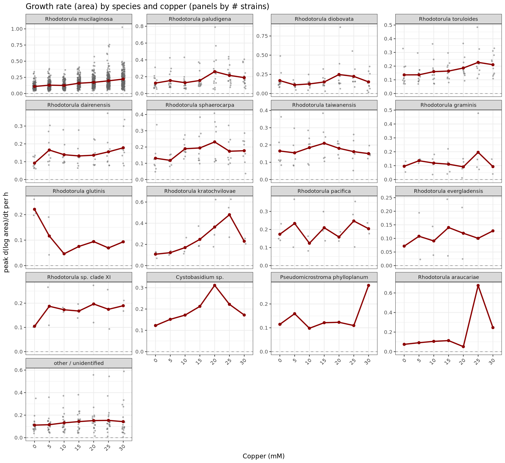
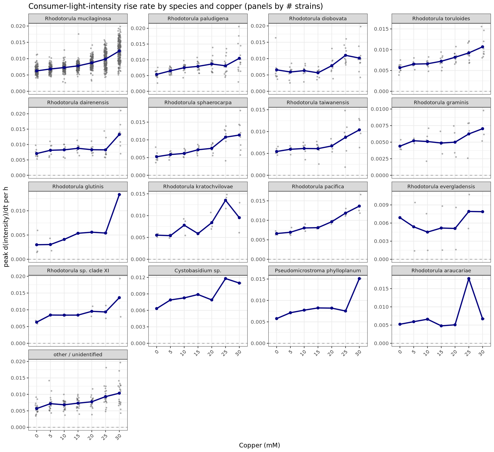
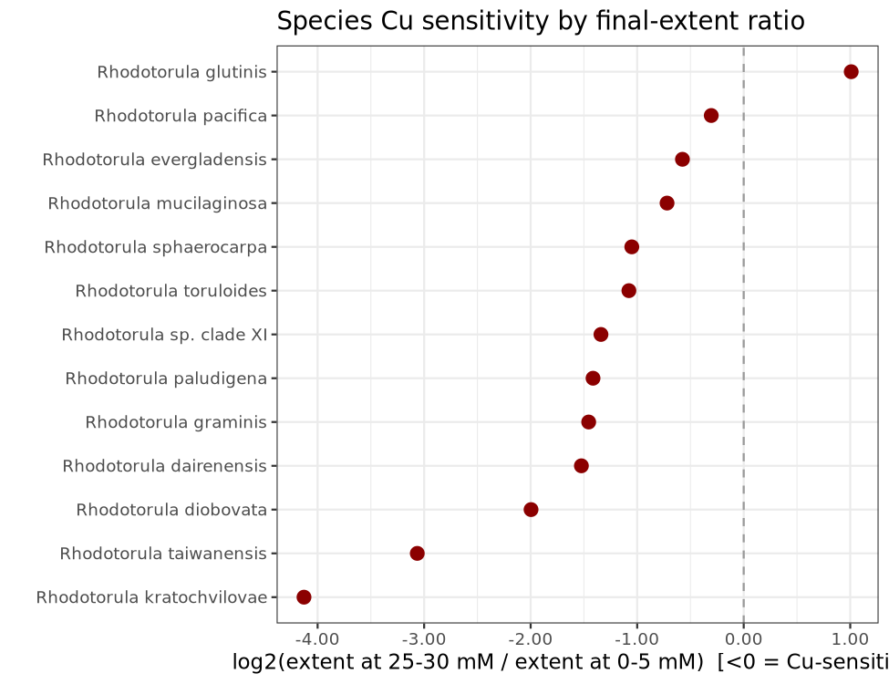
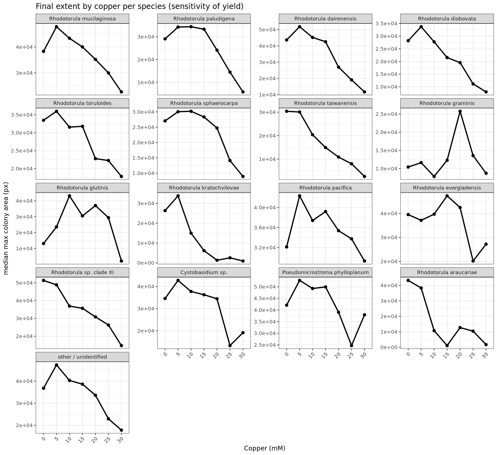
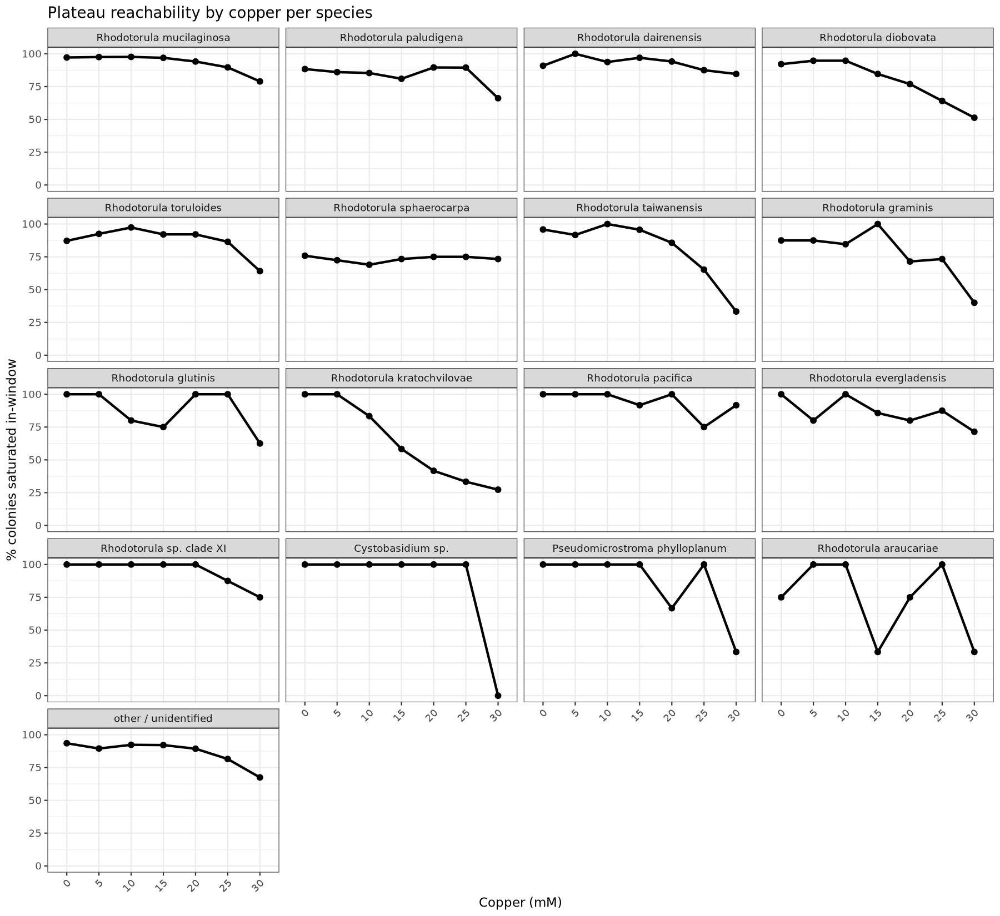
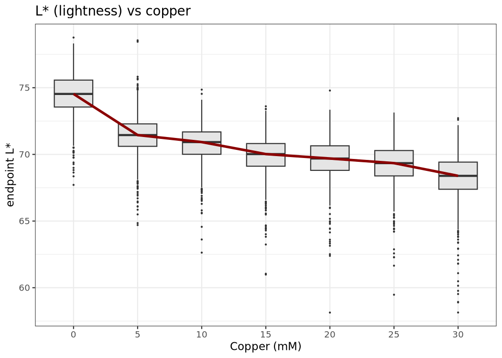
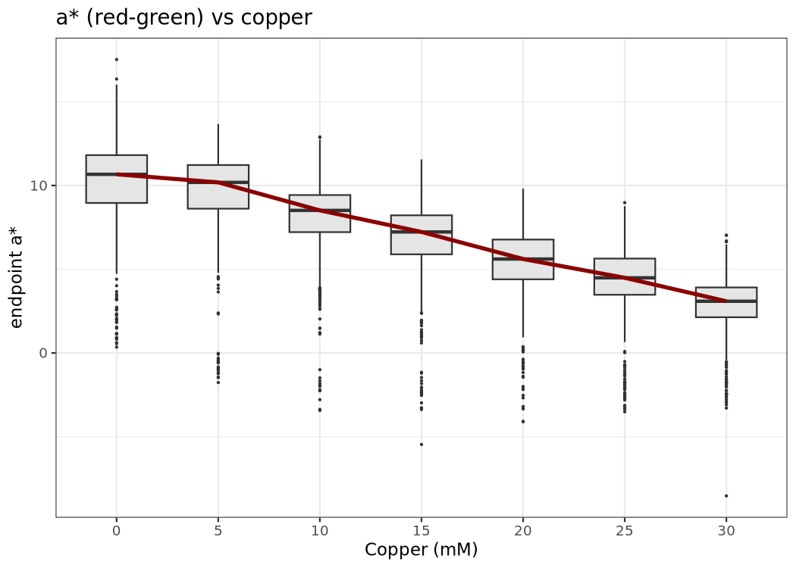
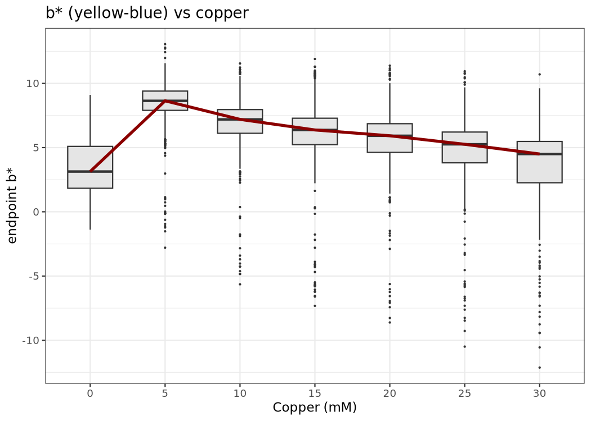

Species, copper, and colony growth-rate parameters
================
analysis/growth_rates
2026-08-15

- [Question](#question)
- [Data construction](#data-construction)
- [Model fitting and rate
  extraction](#model-fitting-and-rate-extraction)
- [Growth rate by copper and
  species](#growth-rate-by-copper-and-species)
- [Doubling-time test: is the copper effect real or a phase
  artifact?](#doubling-time-test-is-the-copper-effect-real-or-a-phase-artifact)
- [Which species and strains are most vs least
  copper-sensitive?](#which-species-and-strains-are-most-vs-least-copper-sensitive)
- [Growth-rate × color / light-intensity
  interaction](#growth-rate--color--light-intensity-interaction)
  - [Endpoint color vs copper
    concentration](#endpoint-color-vs-copper-concentration)
- [Limitations](#limitations)
- [Reproduce](#reproduce)

## Question

Each strain is measured once per Copper concentration per run, on
physically distinct plates (`replicate_label` is an imager-run proxy —
see [`DATABASE_DESIGN.md`](../../DATABASE_DESIGN.md)). Each (plate,
well) is therefore an independent culture grown over ~120 h with
~6-hourly imaging. This analysis fits a growth curve to every culture
and asks:

1.  **Primary**: how does per-strain growth rate vary with copper
    concentration and with species?
2.  **Secondary**: how do growth-rate parameters interact with endpoint
    color (CIELAB `L*`, `a*`, `b*`) — where `L*` is the “light
    intensity” readout of interest and the measured
    `Intensity_MeanIntensity` is ~0.99-collinear with it (same axis)?

Unit of analysis: **per colony = (plate, well)**. Design capacity: 112
plates (runs 353-356, 7 Cu × 16 plates) × 96 wells = 10,752 slots; each
strain appears once per (run, Cu) on a distinct plate, so the
theoretical max is 309 strains × 4 runs × 7 Cu = 8,652 colonies; **8,446
observed (97.6%** detection, the remainder being high-Cu dropout).

## Data construction

`scripts/00_build_series.R` rebuilds the per-colony × timepoint table
from `v_phenotype` using the same selection/dedup as the plate-position
timecourse: runs 353-356, `strain_id IS NOT NULL`,
`hours_since_plate_start > 0`, largest object per plate/well/time,
`plate_id = run_plate`. Two size readouts:

- `ln_area` — `log(Shape_Area)`; colonial expansion / biomass proxy;
  rises throughout the ~120 h window (rarely plateaus in-window).
- `intensity` — `Intensity_MeanIntensity`; rises 0.25-\>0.41 and
  **saturates ~48-54 h** (early window).

| copper_mm | n_tp | n_colonies |
|----------:|-----:|-----------:|
|         0 |    1 |         14 |
|         0 |    2 |         17 |
|         0 |    3 |          4 |
|         0 |    4 |          2 |
|         0 |    7 |          1 |
|         0 |   11 |          1 |
|         0 |   12 |          3 |
|         0 |   13 |          4 |
|         0 |   14 |          1 |
|         0 |   15 |          8 |
|         0 |   16 |          5 |
|         0 |   17 |         16 |
|         0 |   18 |        159 |
|         0 |   19 |        661 |
|         0 |   20 |        300 |
|         5 |    1 |         19 |
|         5 |    2 |         10 |
|         5 |    3 |          8 |
|         5 |    4 |          1 |
|         5 |    5 |          6 |
|         5 |    7 |          3 |
|         5 |    8 |          1 |
|         5 |    9 |          7 |
|         5 |   10 |          4 |
|         5 |   11 |          4 |
|         5 |   13 |          2 |
|         5 |   14 |          5 |
|         5 |   15 |          3 |
|         5 |   16 |          4 |
|         5 |   17 |         12 |
|         5 |   18 |         16 |
|         5 |   19 |        793 |
|         5 |   20 |        293 |
|        10 |    1 |         20 |
|        10 |    2 |         12 |
|        10 |    3 |         26 |
|        10 |    4 |         24 |
|        10 |    5 |         27 |
|        10 |    8 |          1 |
|        10 |    9 |          1 |
|        10 |   11 |          3 |
|        10 |   12 |          1 |
|        10 |   13 |          3 |
|        10 |   14 |          5 |
|        10 |   15 |         11 |
|        10 |   16 |         12 |
|        10 |   17 |         15 |
|        10 |   18 |         86 |
|        10 |   19 |        669 |
|        10 |   20 |        276 |
|        15 |    1 |         25 |
|        15 |    2 |         11 |
|        15 |    3 |         29 |
|        15 |    4 |         28 |
|        15 |    6 |          1 |
|        15 |    7 |          2 |
|        15 |   10 |          1 |
|        15 |   11 |          1 |
|        15 |   13 |          2 |
|        15 |   14 |          2 |
|        15 |   15 |          8 |
|        15 |   16 |         12 |
|        15 |   17 |         20 |
|        15 |   18 |         41 |
|        15 |   19 |        737 |
|        15 |   20 |        268 |
|        20 |    1 |         35 |
|        20 |    2 |         17 |
|        20 |    3 |         16 |
|        20 |    4 |          9 |
|        20 |    5 |          4 |
|        20 |    6 |          3 |
|        20 |    7 |         24 |
|        20 |    8 |          2 |
|        20 |    9 |          4 |
|        20 |   10 |         20 |
|        20 |   11 |         21 |
|        20 |   12 |          6 |
|        20 |   13 |          8 |
|        20 |   14 |          9 |
|        20 |   15 |          9 |
|        20 |   16 |         15 |
|        20 |   17 |         89 |
|        20 |   18 |        140 |
|        20 |   19 |        611 |
|        20 |   20 |        152 |
|        25 |    1 |         58 |
|        25 |    2 |         18 |
|        25 |    3 |         52 |
|        25 |    4 |         38 |
|        25 |    5 |          5 |
|        25 |    6 |          3 |
|        25 |    8 |          3 |
|        25 |    9 |          6 |
|        25 |   10 |         22 |
|        25 |   11 |          1 |
|        25 |   13 |          3 |
|        25 |   14 |         11 |
|        25 |   15 |         11 |
|        25 |   16 |         16 |
|        25 |   17 |         37 |
|        25 |   18 |        107 |
|        25 |   19 |        618 |
|        25 |   20 |        214 |
|        30 |    1 |         38 |
|        30 |    2 |         61 |
|        30 |    3 |         50 |
|        30 |    4 |         43 |
|        30 |    5 |          7 |
|        30 |    6 |          8 |
|        30 |    7 |          4 |
|        30 |    8 |          8 |
|        30 |    9 |          6 |
|        30 |   10 |          9 |
|        30 |   11 |          6 |
|        30 |   12 |          7 |
|        30 |   13 |          9 |
|        30 |   14 |          6 |
|        30 |   15 |         35 |
|        30 |   16 |         19 |
|        30 |   17 |         21 |
|        30 |   18 |         70 |
|        30 |   19 |        778 |
|        30 |   20 |         77 |

Series coverage (runs 353-356)

## Model fitting and rate extraction

`scripts/01_fit_growth_models.R` fits two sigmoid forms per colony per
trait (Zwietering reparameterizations, parameterized as maximum rate
`mu`/h, lag `lambda` h, asymptote `A`), requiring \>=8 usable timepoints
spanning \>=24 h:

- Gompertz: `y = A * exp(-exp((mu*e/A)*(lambda - t) + 1))`
- Logistic: `y = A / (1 + exp((4*mu/A)*(lambda - t) + 2))`

**Identifiability finding (why the headline is a data-derived rate):**
within the available window the lag parameter is structurally
unidentifiable — ~94% of fits put `lambda` on a boundary (\<= -1 h or
\>= 144 h), and for `ln_area` the asymptote is extrapolated in ~82% of
fits because area does not plateau in-window. Unbounded Gauss-Newton
refits on a 60-colony sample reproduced degenerate lags (-297…-20 h).
The parametric `mu` is therefore kept as a secondary parameter (weak
agreement with the data-derived rate), and the **primary estimator is
the data-derived peak slope**:

- `rate_area` — max positive 6 h slope of `log(Shape_Area)` per hour
- `rate_int` — max positive 6 h slope of `Intensity_MeanIntensity` per
  hour

Defined for ~99% of colonies (`rate_area` NA on 2 colonies). Both
Gompertz and logistic fits are retained with AIC; preferred model =
lower AIC (Gompertz favored ~80-88%, depending on trait).

| colonies fitted (\>=8tp, \>=24h) | rate_area defined | rate_int defined | pref. Gompertz (area) | pref. Gompertz (intens.) | Kendall tau (mu vs rate_area) |
|---:|---:|---:|---:|---:|---:|
| 7663 | 15322 | 15326 | 80 | 88 | 0.373 |

Fit coverage and rate-extraction summary (n columns)

## Growth rate by copper and species

`scripts/02_species_cu_rates.R`. Rates are aggregated to strain × Cu
(plain mean across up to 4 run-plates; histogram n=1:130, n=2:161,
n=3:380, n=4:1505 of 2,183 strain-Cu rows — the n\<2 single-culture rows
are flagged). Mixed model (colony level, REML):

`rate ~ factor(copper_mm) + (1 | species / strain_code)`

Species and strain enter as random effects (shrinkage toward the
well-sampled mean; 20 named species + `unknown`, 282 colonies without a
species label).

| term | Estimate | Std..Error | tvalue | pvalue | model |
|:---|---:|---:|---:|---:|:---|
| factor(copper_mm)5 | 0.0175 | 0.00587 | 2.99 | 0.00283 | rate_area ~ Cu(factor) + species/strain (colony-level) |
| factor(copper_mm)10 | 0.0145 | 0.00595 | 2.44 | 0.01460 | rate_area ~ Cu(factor) + species/strain (colony-level) |
| factor(copper_mm)15 | 0.0441 | 0.00594 | 7.42 | 0.00000 | rate_area ~ Cu(factor) + species/strain (colony-level) |
| factor(copper_mm)20 | 0.0627 | 0.00595 | 10.50 | 0.00000 | rate_area ~ Cu(factor) + species/strain (colony-level) |
| factor(copper_mm)25 | 0.0812 | 0.00600 | 13.50 | 0.00000 | rate_area ~ Cu(factor) + species/strain (colony-level) |
| factor(copper_mm)30 | 0.1030 | 0.00601 | 17.10 | 0.00000 | rate_area ~ Cu(factor) + species/strain (colony-level) |

rate_area: fixed effects (diff vs 0 mM)

| copper_mm |    diff |       se |       lo |       hi | tvalue | pvalue | model    |
|----------:|--------:|---------:|---------:|---------:|-------:|-------:|:---------|
|         5 | 0.00063 | 0.000121 | 0.000394 | 0.000867 |   5.23 |  2e-07 | rate_int |
|        10 | 0.00102 | 0.000122 | 0.000785 | 0.001260 |   8.38 |  0e+00 | rate_int |
|        15 | 0.00147 | 0.000122 | 0.001230 | 0.001710 |  12.10 |  0e+00 | rate_int |
|        20 | 0.00240 | 0.000122 | 0.002160 | 0.002630 |  19.60 |  0e+00 | rate_int |
|        25 | 0.00366 | 0.000123 | 0.003420 | 0.003900 |  29.70 |  0e+00 | rate_int |
|        30 | 0.00591 | 0.000123 | 0.005670 | 0.006150 |  47.90 |  0e+00 | rate_int |

rate_int vs 0 mM (Wald 95% CI)

**Result (both readouts): peak growth/brightening rate increases
monotonically with copper** (area: F = 79.0, p ~ 6e-96; intensity: F =
540, p ~ 0; all levels vs 0 mM significant, monotone coefficients 5-\>30
mM). Counter to a naive “Cu is toxic =\> slower growth” expectation,
this is consistent with the plate-position timecourse: at higher Cu,
colony area keeps expanding through the ~120 h window (the log-growth
phase lasts longer), so the realized peak log-slope is **higher** — the
peak-slope measure is phase/length sensitive rather than a growth-rate
constant. Caveat: a phase-independent rate (e.g. fixed-interval doubling
time) would be needed to separate “faster” from “still growing when
observed”.

<!-- --><!-- -->

The species-panel figures facet the top-16 species by strain count (4x4
grid), plus an “other / unidentified” catch-all panel. Well-sampled
species (\>=8 strains): dairenensis (8), diobovata (10), mucilaginosa
(216), paludigena (17), sphaerocarpa (8), toruloides (10);
`Rhodotorula sp. clade I` excluded from the interaction test (unnamed
clade). The Cu × species interaction test (well-sampled subset) is in
`results/tables/rate_models_species_cu.csv/txt`.

## Doubling-time test: is the copper effect real or a phase artifact?

`scripts/04_doubling_time.R`. The peak-slope rate above is phase/length
sensitive. A phase-independent estimator is computed per colony: the
exponential-region specific rate `k` (slope of `log(area) ~ t` over the
highest-R^2 sliding 4-point window, requiring R^2 \>= 0.97), converted
to a doubling time `dbl = ln(2)/k`.

| copper_mm |    n | saturated_pct | median_t50 | median_dbl |
|----------:|-----:|--------------:|-----------:|-----------:|
|         0 | 1196 |         95.40 |      72.56 |      38.66 |
|         5 | 1191 |         95.63 |      73.71 |      39.37 |
|        10 | 1192 |         95.72 |      73.21 |      36.63 |
|        15 | 1188 |         94.19 |      71.08 |      36.24 |
|        20 | 1194 |         91.54 |      70.39 |      37.09 |
|        25 | 1223 |         86.51 |      67.40 |      37.59 |
|        30 | 1262 |         73.93 |      64.14 |      36.59 |

Saturation fraction, t50 and doubling time by copper (medians)

**Results**

- Kendall tau between the peak-slope `rate_area` and doubling time:
  0.00245 — the two estimators are **orthogonal**.
- Mixed model `log(dbl) ~ Cu(factor) + (1 | species/strain)`: Cu
  significant (F = 10.85, p ~ 5e-12) but biologically negligible —
  estimated fold-change in doubling time at 30 mM vs 0 mM = 0.987x.
- The exponential doubling time is **flat ~37 h across 0–30 mM**.

**Conclusion.** The monotonically increasing peak-slope rate with copper
is a **phase artifact**: at low Cu most colonies bend over to a plateau
(saturated 95% at 0 mM) so their realized 6 h log-slope is modest; at
high Cu colonies keep expanding through the ~120 h window (saturated
only 74% at 30 mM) so their observed log-slope stays high. Copper does
**not** change the per-cell exponential doubling rate; its effect is
**extent-limited** — lower final yield (lower max area) and reducing
plateau-reachability (the missingness-as-phenotype axis, consistent with
the plate-position analysis).

## Which species and strains are most vs least copper-sensitive?

`scripts/05_species_cu_sensitivity.R`. Because doubling time is
Cu-neutral, sensitivity is indexed on **final extent / yield**:

    log2 extent = log2( median max(area) @ 25–30 mM / median max(area) @ 0–5 mM )

(log2 \< 0 means the colony reaches less biomass at high copper), plus
the plateau-reachability drop as a second axis. Doubling-time
fold-change is reported for completeness (~1 expected).

| species | n_strains | median_extent_ratio | median_log2_extent | median_sat_drop | median_dbl_fold |
|:---|---:|---:|---:|---:|---:|
| Rhodotorula kratochvilovae | 3 | 0.0572 | -4.130 | 75.00 | 0.427 |
| Rhodotorula araucariae | 1 | 0.0779 | -3.680 | 16.10 | 0.805 |
| Rhodotorula taiwanensis | 6 | 0.1210 | -3.060 | 43.80 | 0.515 |
| Rhodotorula diobovata | 10 | 0.2510 | -2.000 | 29.20 | 0.810 |
| Rhodotorula dairenensis | 10 | 0.3800 | -1.520 | 0.00 | 1.090 |
| Rhodotorula sp. clade XIII | 1 | 0.3590 | -1.480 | 0.00 | 0.986 |
| Rhodotorula graminis | 4 | 0.3650 | -1.460 | 37.50 | 0.999 |
| Rhodotorula paludigena | 17 | 0.3750 | -1.410 | 12.50 | 1.000 |
| Rhodotorula sp. clade I | 9 | 0.3920 | -1.350 | 25.00 | 0.972 |
| Rhodotorula sp. clade XI | 2 | 0.4280 | -1.340 | 18.80 | 1.550 |
| Cystobasidium sp. | 1 | 0.4600 | -1.120 | 50.00 | 0.874 |
| Rhodotorula toruloides | 10 | 0.4740 | -1.080 | 16.40 | 0.876 |
| Rhodotorula sphaerocarpa | 8 | 0.4830 | -1.050 | 9.82 | 1.340 |
| Rhodotorula mucilaginosa | 217 | 0.6070 | -0.720 | 12.50 | 0.947 |
| Rhodotorula evergladensis | 2 | 0.6710 | -0.575 | 14.30 | 0.981 |
| unknown | 12 | 0.6720 | -0.573 | 12.50 | 0.945 |
| Pseudomicrostroma phylloplanum | 1 | 0.7640 | -0.388 | 28.60 | 0.919 |
| Rhodotorula pacifica | 3 | 0.8100 | -0.305 | 12.50 | 1.080 |
| Rhodotorula glutinis | 3 | 2.0100 | 1.010 | 33.30 | 2.570 |

Species ranked by copper sensitivity (log2 extent; lower = more
sensitive)

<!-- --><!-- --><!-- -->

Extent mixed model `log(max_area) ~ Cu x species + (1 | strain_code)` on
well-sampled species (7,288 colonies): Cu F = 72.9 (p ~ 1.6e-17),
species F = 30.2, **Cu x species interaction F = 4.34 (p ~ 6.0e-4)** —
species differ in how copper shrinks final extent.

**Most tolerant (least sensitive):** `R. glutinis` (log2 +1.01), then
`R. pacifica`, `R. evergladensis`, `Pseudomicrostroma phylloplanum`.
Among well-sampled taxa, **`R. mucilaginosa` is the most tolerant**
(log2 = -0.72), then `R. sphaerocarpa` / `R. toruloides` (-1.05/-1.08),
then `R. paludigena` / `R. dairenensis` (-1.41/-1.52).

**Most sensitive:** `R. kratochvilovae` (log2 = -4.13), `R. araucariae`
(-3.68), `R. taiwanensis` (-3.06); among well-sampled, **`R. diobovata`
is the most sensitive** (log2 = -2.00).

*Data-quality note:* two species-name misspellings in the metadata CSV
(`Rhodotorula paludigenum`, `Rhodotorula evergladiensis`) were corrected
to `paludigena` / `evergladensis` and re-imported, so strain 84
(TFCN_43A-0-22) and strain 327 (NRRL_Y-48721) now group with their
correct species. Small-n, single-strain taxa (especially the
`R. glutinis` +1.01 and `R. kratochvilovae` values, which rest on \<30
colonies) still need confirmation — check per-strain tables
(`results/tables/strain_sensitivity.csv`).

## Growth-rate × color / light-intensity interaction

`scripts/03_color_interaction.R`. Endpoint color = last non-NA CIELAB
reading per colony. `L*` (lightness) is the “light intensity” outcome;
the measured `Intensity_MeanIntensity` is the same axis (endpoint r =
0.999) so it enters only as the growth readout `rate_int`, never as a
co-predictor. Model:

`L* ~ rate_area × copper + (1 | species/strain_code)` (and a*/b*
analogues)

| term                                  | Estimate | Std..Error | t.value |   Pr…t.. |
|:--------------------------------------|---------:|-----------:|--------:|---------:|
| rate_area_ln_area:factor(copper_mm)5  |     3.70 |      0.645 |    5.73 | 0.00e+00 |
| rate_area_ln_area:factor(copper_mm)10 |     2.90 |      0.688 |    4.22 | 2.44e-05 |
| rate_area_ln_area:factor(copper_mm)15 |     2.56 |      0.616 |    4.16 | 3.28e-05 |
| rate_area_ln_area:factor(copper_mm)20 |     1.52 |      0.564 |    2.69 | 7.06e-03 |
| rate_area_ln_area:factor(copper_mm)25 |     1.78 |      0.547 |    3.25 | 1.16e-03 |
| rate_area_ln_area:factor(copper_mm)30 |     1.30 |      0.536 |    2.42 | 1.55e-02 |

L\* ~ rate_area x Cu: interaction coefficients

The growth-rate × Cu interaction on `L*` is significant (F = 8.16, p ~
8e-9): faster-growing colonies end lighter, with the slope largest at
low Cu (5 mM: +3.7 L\* per unit rate) and weakest at 30 mM (+1.3).
Copper itself dominates chromatic outcome (Cu F ~ 900 on L*, ~ 1100 on
a*). The two growth modes are weakly correlated (`rate_area` vs
`rate_int` r = 0.21) — area expansion and brightness rise are distinct
axes.

### Endpoint color vs copper concentration

Direct endpoint-outcome view for all three CIELAB axes (well-sampled
species), complementing the rate-interaction plots above:

<!-- --><!-- --><!-- -->

All three axes respond strongly to copper (Cu F ~ 900 `L*`, ~ 1100 `a*`,
see `results/tables/color_growth_models.txt`): `L*` (lightness) falls
with copper while `a*` (red-green) and `b*` (yellow-blue) shift
substantially — consistent with the melt-pigment (carotenoid) response
reported in the plate-position analysis. Per-species faceted versions:
`color_{L,a,b}_by_cu_spp.png`.

## Limitations

- Peak-slope rate is phase/length sensitive, but the doubling-time
  test (04) shows the exponential doubling time is copper-neutral (~37
  h, fold 0.99 at 30 mM); the copper phenotype is extent/yield-limited
  (saturation 95% -\> 74%, lower max area). Parametric `mu` remains
  unidentifiable in-window.
- Species-name misspellings in the metadata CSV (paludigenum,
  evergladiensis) have been corrected (paludigena, evergladensis) and
  re-imported; small-n single-strain taxa still need confirmation.
- 130 of 2,183 strain-Cu aggregates rest on a single culture (flagged,
  kept).
- 282 colonies (3.3%) lack a species label -\> `unknown` random-level.
- `R. sp. clade I` is excluded from the species-interaction test.
- High-Cu missingness (~15-18% of strain-plates never reach late
  timepoints) shapes which colonies reach the fitting threshold;
  missingness itself is Cu-dependent and is part of the sensitivity
  signal (saturation drop).

## Reproduce

    bash analysis/growth_rates/run.sh
