# GWAS, dose-0 consistency, growth rate and IC50 on the DH4148 reference

Generated 2026-10-09. Phenotypes: Chromium, Copper and Lead screens (Iron and Zinc are held out, D-56). Genotypes: popgen callset on the DH4148 assembly (GCA_058775505.1). Panel: 126 haploid *R. mucilaginosa* strains (D-49). All numbers come from `report/tables/*.csv`. Scripts: `scripts/01` to `scripts/12`.

## Summary

1. **The 126-strain panel is 14 clonal lineages.** Strains that differ by at most 2,000 SNPs form 14 groups (sizes 42, 34, 16, 6, 6, 6, 6, 3, 2 and five single strains). Within a lineage the median difference is 557 SNPs. Between lineages it is at least 48,641 SNPs. The 5-SNP de-cloning of D-49 does not remove this structure. The effective sample size for a genome-wide scan is about 14, not 126.
2. **Genome-wide hits are lineage markers.** With the relatedness matrix only, 64 loci pass the Bonferroni threshold (unadjusted phenotypes) and 44 loci pass it (run-adjusted phenotypes). **All of them are SNPs that do not vary inside any lineage.** They mark which lineage a strain belongs to. They cannot be mapped to a gene.
3. **Within lineages, nothing passes the threshold.** With run adjustment and lineage covariates the scans find 0 Bonferroni loci in 20 traits. 17 SNPs reach the suggestive level, against about 94 expected by chance. The 12 suggestive loci are listed for reference (Table 13). They are hypotheses, not results.
4. **Lineage explains part of some traits.** Intraclass correlation by lineage: Cr relative area at the top dose 0.29, Cr area AUC 0.28, Cu a\* AUC 0.26, dose-0 ln area 0.24, dose-0 a\* 0.23, Cu relative area at the top dose 0.20. Pb traits and all growth-rate traits are at most 0.10. With 14 lineages these estimates are uncertain.
5. **Non-additive variance is not detectable.** The strains are haploid, so there is no dominance. For epistasis, the additive-by-additive variance component is not significant in any of 20 traits (smallest p = 0.095). A scan of about 65,000 SNP pairs per trait found no pair below p = 1e-5 (about 0.65 expected by chance).
6. **Dose-0 (YPD) controls are consistent for a\*, less so for size and not for growth rate.** Strain explains 38% of dose-0 a\* variance across the three screens, and the screen itself explains about 0%. For ln area, strain explains 18% and the screen 17%. For the maximum growth rate, strain explains 3%.
7. **Growth rate and IC50.** Relative growth rate falls with dose in Cr (0.41 of control at dose 1.2) and Pb (0.12 at dose 30). Cu barely changes it (0.93 at dose 30). IC50 of relative area could be fitted for almost all strains in Cr and Pb. In Cu 138 of 317 strains are right-censored, because relative area stays at or above 0.5 at the top dose.

## 1. Data

- **Phenotypes** come from the DuckDB `heavy_metal_measurement` table with strain, species and ploidy from the `strain_info` view (D-58). a\* is `ColorLab_a*GeoMedian`. The largest object per well and image is used. The late window and the 2,000 px colony cutoff follow the a\* report (`analysis/carotenoid_stress_vs_baseline`).
- **Growth rate** of a well is the largest slope of ln area against time over windows of 5 consecutive images. A window must start at 300 px or more and span at least 4 h. A well needs at least 6 images.
- **Relative traits** compare a strain with itself at dose 0: area AUC (relative area against dose scaled 0 to 1), relative area at the top dose, relative growth-rate AUC, a\* change at the top dose and a\* AUC.
- **IC50** is fitted for relative area with a two-parameter log-logistic curve. It is reported only when the curve crosses 0.5 inside the tested dose range.
- **GWAS traits** are 20 per strain (Table 1). Each is rank-normalised before the scan. Copper IC50 is not used (46% of panel strains are censored).
- **Genotypes.** Biallelic SNPs from popgen's `rmuc_core` file, kept at minor allele frequency 0.05 or more and at most 10% missing genotypes inside the panel: 244,956 SNPs. After collapsing identical genotype patterns there are 7,199 distinct patterns (the effective number of tests for the lineage-free scans). With lineage covariates there are 2,940.
- **Annotation.** snpEff effects come from the VCF. Gene IDs and product names come from the DH4148 GFF. No GO or KEGG annotation exists for DH4148 yet.

| trait | count | mean | std | min | 50% | max |
|--------------|-------|-------|-----|-------|-------|------|
| d0_a | 125.000 | 0.896 | 2.060 | -5.236 | 1.321 | 6.291 |
| d0_lnA | 125.000 | -0.004 | 0.109 | -0.542 | 0.011 | 0.251 |
| d0_rgr | 125.000 | 0.000 | 0.002 | -0.005 | 0.000 | 0.004 |
| Cr_da_top | 125.000 | -12.880 | 5.731 | -20.941 | -14.248 | 0.299 |
| Cr_a_auc | 125.000 | -1.123 | 1.567 | -4.887 | -1.263 | 1.930 |
| Cr_relarea_top | 125.000 | 0.152 | 0.416 | 0.038 | 0.084 | 3.575 |
| Cr_relarea_auc | 125.000 | 0.591 | 0.067 | 0.450 | 0.577 | 0.897 |
| Cr_relrgr_auc | 124.000 | 0.880 | 0.135 | 0.662 | 0.847 | 1.271 |
| Cr_logIC50 | 123.000 | -0.471 | 0.105 | -0.791 | -0.477 | -0.071 |
| Cu_da_top | 125.000 | -15.411 | 3.007 | -21.478 | -15.299 | -3.941 |
| Cu_a_auc | 125.000 | -6.333 | 2.197 | -13.938 | -6.017 | 1.586 |
| Cu_relarea_top | 125.000 | 0.547 | 0.236 | 0.105 | 0.489 | 1.240 |
| Cu_relarea_auc | 125.000 | 1.006 | 0.213 | 0.549 | 0.988 | 2.377 |
| Cu_relrgr_auc | 125.000 | 1.117 | 0.166 | 0.845 | 1.100 | 1.681 |
| Pb_da_top | 123.000 | -11.111 | 7.199 | -19.034 | -13.645 | 10.347 |
| Pb_a_auc | 123.000 | -0.822 | 3.121 | -6.732 | -1.587 | 7.057 |
| Pb_relarea_top | 123.000 | 0.128 | 0.109 | 0.046 | 0.085 | 0.585 |
| Pb_relarea_auc | 123.000 | 0.542 | 0.125 | 0.336 | 0.506 | 0.947 |
| Pb_relrgr_auc | 122.000 | 0.734 | 0.148 | 0.438 | 0.708 | 1.171 |
| Pb_logIC50 | 119.000 | 2.580 | 0.114 | 2.102 | 2.591 | 2.819 |

*Table 1. GWAS traits in the 126-strain panel (raw values; 119-125 strains per trait).*

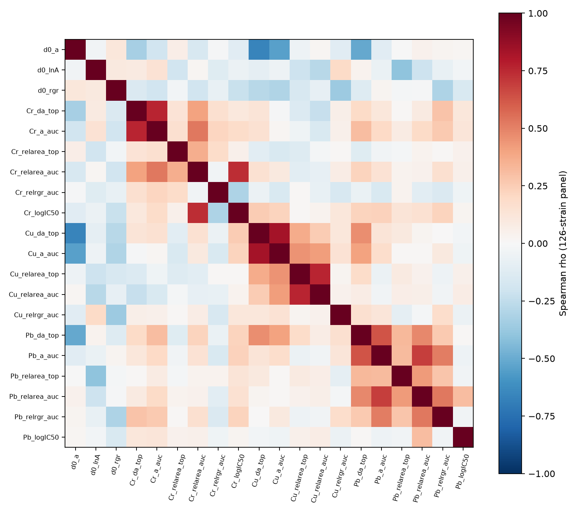

*Figure 1. Spearman correlation among the 20 traits (panel strains).*

## 2. Dose-0 (YPD) consistency across experiments

Dose-0 wells of the three screens are pooled. Model: trait ~ 1 + (1 | strain) + (1 | screen) + (1 | run) + (1 | plate). Wells are replicate wells on dose-0 plates. Fe and Zn dose-0 plates exist but are partial, so the main model uses Cr, Cu and Pb. A version with all five screens is in `report/tables/dose0_variance_components.csv`.

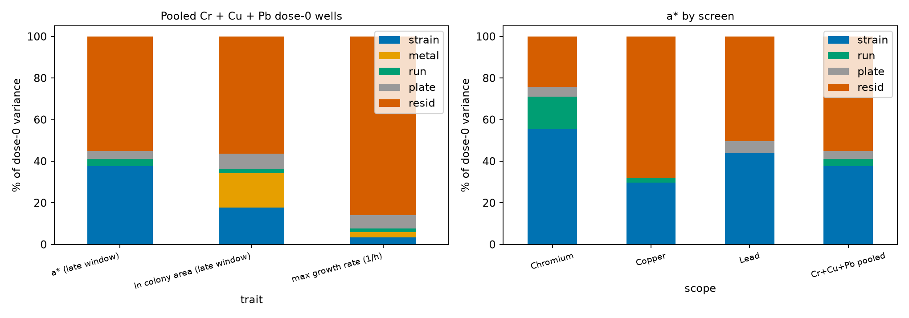

*Figure 2. Shares of dose-0 variance: strain, screen (metal), run, plate and residual.*

| scope | trait | n_wells | n_strains | share_strain | share_metal | share_run | share_plate | share_resid |
|-----------------------------------|-----|-------|---------|------------|-----------|---------|-----------|-----------|
| Cr+Cu+Pb pooled | a | 3282 | 319 | 0.38 | 0.00 | 0.03 | 0.04 | 0.55 |
| Chromium | a | 1188 | 306 | 0.56 |  | 0.15 | 0.05 | 0.24 |
| Copper | a | 1116 | 319 | 0.30 |  | 0.02 | 0.00 | 0.68 |
| Lead | a | 978 | 297 | 0.44 |  | 0.00 | 0.06 | 0.50 |
| Cr+Cu+Pb pooled, GWAS panel strains | a | 1371 | 125 | 0.28 | 0.00 | 0.01 | 0.08 | 0.62 |
| Cr+Cu+Pb pooled | lnA | 3282 | 319 | 0.18 | 0.16 | 0.02 | 0.07 | 0.56 |
| Chromium | lnA | 1188 | 306 | 0.58 |  | 0.09 | 0.04 | 0.30 |
| Copper | lnA | 1116 | 319 | 0.13 |  | 0.02 | 0.06 | 0.80 |
| Lead | lnA | 978 | 297 | 0.29 |  | 0.00 | 0.13 | 0.58 |
| Cr+Cu+Pb pooled, GWAS panel strains | lnA | 1371 | 125 | 0.13 | 0.20 | 0.01 | 0.11 | 0.55 |
| Cr+Cu+Pb pooled | rgr | 3412 | 320 | 0.03 | 0.03 | 0.02 | 0.06 | 0.86 |
| Chromium | rgr | 1194 | 309 | 0.07 |  | 0.10 | 0.02 | 0.81 |
| Copper | rgr | 1141 | 319 | 0.04 |  | 0.00 | 0.06 | 0.90 |
| Lead | rgr | 1077 | 307 | 0.14 |  | 0.00 | 0.08 | 0.78 |
| Cr+Cu+Pb pooled, GWAS panel strains | rgr | 1405 | 125 | 0.02 | 0.04 | 0.03 | 0.06 | 0.85 |

*Table 2. Variance shares of dose-0 wells. `share_metal` is empty for single-screen models. Fits marked singular in the table have a variance component at zero.*

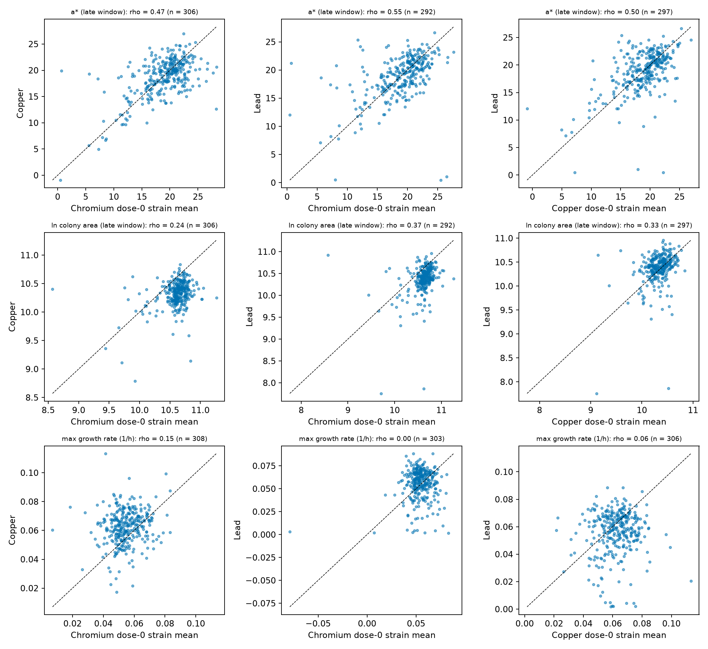

*Figure 3. Dose-0 strain means in one screen against another (dashed = equal values).*

| trait | screen_1 | screen_2 | n_strains | spearman | pearson |
|-----|--------|--------|---------|--------|-------|
| a | Chromium | Copper | 306 | 0.47 | 0.59 |
| a | Chromium | Lead | 292 | 0.55 | 0.48 |
| a | Copper | Lead | 297 | 0.50 | 0.55 |
| lnA | Chromium | Copper | 306 | 0.24 | 0.32 |
| lnA | Chromium | Lead | 292 | 0.37 | 0.32 |
| lnA | Copper | Lead | 297 | 0.33 | 0.33 |
| rgr | Chromium | Copper | 308 | 0.15 | 0.14 |
| rgr | Chromium | Lead | 303 | 0.00 | 0.11 |
| rgr | Copper | Lead | 306 | 0.06 | 0.06 |

*Table 3. Agreement of dose-0 strain means between screens.*

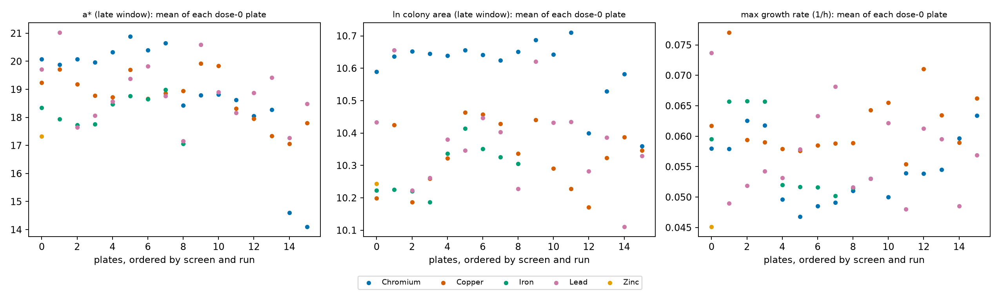

*Figure 4. Mean of each dose-0 plate, by screen.*

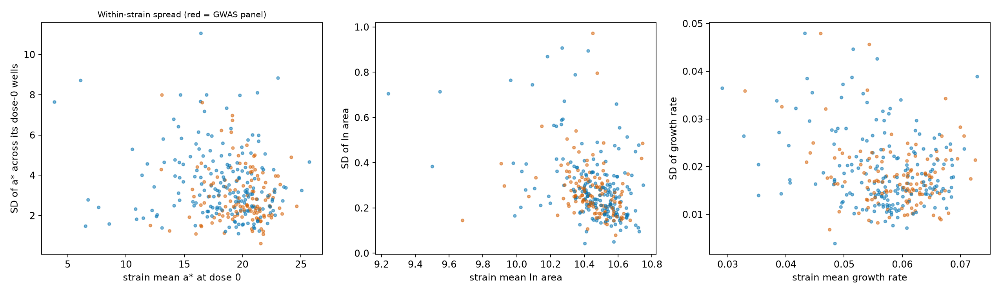

*Figure 5. Spread of a\\*, ln area and growth rate across the dose-0 wells of each strain (red = GWAS panel).*

| sample_name | species | n_wells | a_mean | a_sd | a_sd_z |
|--------------|-------------------|-------|------|-----|------|
| TFCN_25-333Y-2 | R. sp_clade_I | 11 | 16.43 | 11.05 | 5.88 |
| TFCN_25-333D-1 | R. sp_clade_I | 8 | 23.04 | 8.83 | 4.26 |
| DBVPG_6660 | R. frigidialcoholis | 10 | 6.11 | 8.71 | 4.18 |
| TFCN_86A-8 | R. sphaerocarpa | 11 | 21.28 | 8.10 | 3.73 |
| DBVPG_4952 | R. mucilaginosa | 7 | 16.91 | 7.99 | 3.65 |
| DBVPG_6083 | R. graminis | 10 | 14.68 | 7.99 | 3.65 |
| DBVPG_3236 | R. mucilaginosa | 11 | 13.08 | 7.99 | 3.65 |
| TFCN_86A-5 | R. sphaerocarpa | 11 | 19.77 | 7.97 | 3.64 |
| TFCN_86C-10 | R. sphaerocarpa | 7 | 16.40 | 7.66 | 3.41 |
| NRRL_Y-7192 | R. sphaerocarpa | 11 | 3.87 | 7.64 | 3.40 |
| DBVPG_4203 | R. mucilaginosa | 11 | 16.55 | 7.61 | 3.38 |
| DBVPG_3769 | R. dairenensis | 12 | 18.64 | 7.33 | 3.17 |

*Table 4. Strains whose dose-0 wells vary most in a\* (robust z of the SD across wells; strains with at least 6 wells).*

**Reading.**

- **a\* at dose 0 is a reproducible strain trait.** Strain explains 38% of the variance in the pooled model, and the screen explains about 0%. Strain means agree between screens (Spearman 0.47 to 0.55). Run and plate explain 3% and 4%. Half of the variance (55%) is replicate-well noise.
- **Colony size at dose 0 differs between screens.** The screen explains 17% of ln area variance, against 18% for strain. Plate means of ln area are 10.60 (Cr), 10.33 (Cu) and 10.37 (Pb). Strain means agree only weakly between screens (0.24 to 0.38).
- **Growth rate is not a reproducible strain trait here.** Strain explains 3% of its variance and between-screen correlations are 0.00 to 0.15. It is not suitable for mapping.
- **Cr dose-0 plates vary most in a\*.** In the Cr-only model run explains 15% of the variance, against 2% in Cu and 0% in Pb. The plate-mean SD of a\* is 1.98 in Cr, 0.87 in Cu and 1.10 in Pb.
- **Within-strain spread.** The median SD of a\* across a strain's dose-0 wells is 2.98. 13 of 312 strains have a robust z above 3 (Table 4). Spread alone does not show mixed cultures. The identity columns of `strain_curation.csv` (`identity_flag_categories`) should be checked for these strains; this has not been done here.
- **Panel strains.** In the panel strain subset the strain share of a\* is 28% (all strains 38%).

## 3. Growth rate and IC50

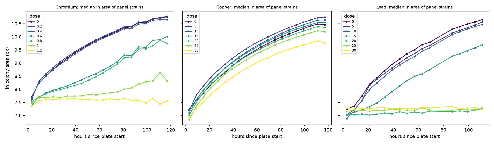

*Figure 6. Median ln colony area of panel strains against time, by dose.*

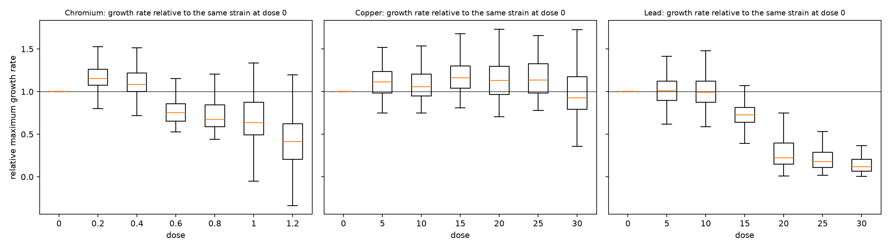

*Figure 7. Maximum growth rate of each strain relative to the same strain at dose 0, by dose (panel strains).*

| Metal | dose | n_strains | median_rel_rgr | q25 | q75 |
|--------|-----|---------|--------------|----|----|
| Chromium | 0.00 | 125 | 1.00 | 1.00 | 1.00 |
| Chromium | 0.20 | 125 | 1.15 | 1.07 | 1.26 |
| Chromium | 0.40 | 125 | 1.08 | 1.00 | 1.22 |
| Chromium | 0.60 | 125 | 0.75 | 0.65 | 0.86 |
| Chromium | 0.80 | 125 | 0.68 | 0.59 | 0.84 |
| Chromium | 1.00 | 124 | 0.64 | 0.49 | 0.88 |
| Chromium | 1.20 | 102 | 0.41 | 0.20 | 0.62 |
| Copper | 0.00 | 125 | 1.00 | 1.00 | 1.00 |
| Copper | 5.00 | 125 | 1.11 | 0.98 | 1.23 |
| Copper | 10.00 | 125 | 1.06 | 0.95 | 1.20 |
| Copper | 15.00 | 125 | 1.16 | 1.04 | 1.30 |
| Copper | 20.00 | 125 | 1.13 | 0.97 | 1.30 |
| Copper | 25.00 | 125 | 1.14 | 0.98 | 1.33 |
| Copper | 30.00 | 125 | 0.93 | 0.79 | 1.17 |
| Lead | 0.00 | 123 | 1.00 | 1.00 | 1.00 |
| Lead | 5.00 | 123 | 1.01 | 0.90 | 1.12 |
| Lead | 10.00 | 123 | 0.99 | 0.88 | 1.12 |
| Lead | 15.00 | 123 | 0.73 | 0.64 | 0.81 |
| Lead | 20.00 | 67 | 0.22 | 0.15 | 0.40 |
| Lead | 25.00 | 76 | 0.18 | 0.11 | 0.29 |
| Lead | 30.00 | 81 | 0.12 | 0.07 | 0.20 |

*Table 5. Relative maximum growth rate by dose (median and quartiles across strains). Pb at doses 20 to 30 has only 67 to 81 strains with enough images for a growth rate.*

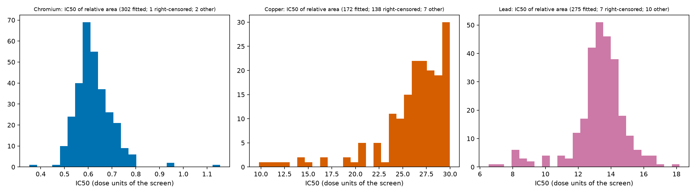

*Figure 8. IC50 of relative area (all strains).*

| Metal | ok | outside_range | right_censored |
|--------|---|-------------|--------------|
| Chromium | 302 | 2 | 1 |
| Copper | 172 | 7 | 138 |
| Lead | 275 | 10 | 7 |

*Table 6. IC50 fit status by metal (all strains).*

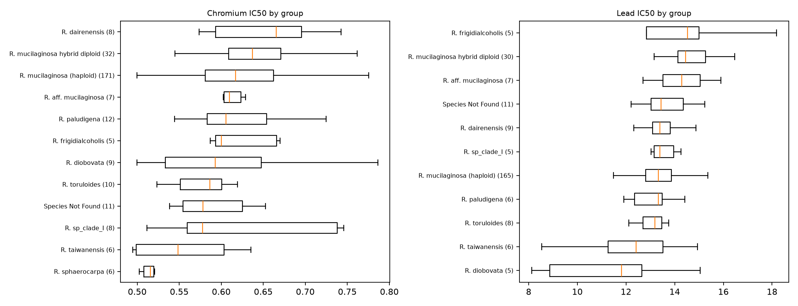

*Figure 9. IC50 by species and ploidy group (groups with at least 5 fitted strains; Cr and Pb).*

| Metal | group | n | median_ic50 | q25 | q75 |
|--------|------------------------------|---|-----------|-----|-----|
| Chromium | R. aff. mucilaginosa | 7 | 0.61 | 0.60 | 0.62 |
| Chromium | R. dairenensis | 8 | 0.67 | 0.59 | 0.70 |
| Chromium | R. diobovata | 9 | 0.59 | 0.53 | 0.65 |
| Chromium | R. frigidialcoholis | 5 | 0.60 | 0.59 | 0.67 |
| Chromium | R. mucilaginosa (haploid) | 171 | 0.62 | 0.58 | 0.66 |
| Chromium | R. mucilaginosa hybrid diploid | 32 | 0.64 | 0.61 | 0.67 |
| Chromium | R. paludigena | 12 | 0.61 | 0.58 | 0.65 |
| Chromium | R. sp_clade_I | 8 | 0.58 | 0.56 | 0.74 |
| Chromium | R. sphaerocarpa | 6 | 0.52 | 0.51 | 0.52 |
| Chromium | R. taiwanensis | 6 | 0.55 | 0.50 | 0.60 |
| Chromium | R. toruloides | 10 | 0.59 | 0.55 | 0.60 |
| Chromium | Species Not Found | 11 | 0.58 | 0.55 | 0.63 |
| Copper | R. aff. mucilaginosa | 5 | 27.16 | 25.58 | 29.59 |
| Copper | R. dairenensis | 9 | 27.92 | 22.19 | 28.50 |
| Copper | R. diobovata | 6 | 26.66 | 24.28 | 28.28 |
| Copper | R. mucilaginosa (haploid) | 86 | 27.49 | 25.28 | 29.10 |
| Copper | R. mucilaginosa hybrid diploid | 20 | 26.97 | 26.01 | 27.54 |
| Copper | R. paludigena | 11 | 25.03 | 23.90 | 28.37 |
| Copper | R. sp_clade_I | 5 | 27.80 | 25.53 | 28.23 |
| Copper | R. toruloides | 7 | 26.54 | 26.06 | 28.59 |
| Lead | R. aff. mucilaginosa | 7 | 14.28 | 13.52 | 15.04 |
| Lead | R. dairenensis | 9 | 13.39 | 13.10 | 13.82 |
| Lead | R. diobovata | 5 | 11.82 | 8.86 | 12.65 |
| Lead | R. frigidialcoholis | 5 | 14.53 | 12.84 | 15.00 |
| Lead | R. mucilaginosa (haploid) | 165 | 13.33 | 12.80 | 13.86 |
| Lead | R. mucilaginosa hybrid diploid | 30 | 14.44 | 14.13 | 15.27 |
| Lead | R. paludigena | 6 | 13.32 | 12.35 | 13.48 |
| Lead | R. sp_clade_I | 5 | 13.39 | 13.15 | 13.96 |
| Lead | R. taiwanensis | 6 | 12.41 | 11.26 | 13.52 |
| Lead | R. toruloides | 8 | 13.18 | 12.70 | 13.47 |
| Lead | Species Not Found | 11 | 13.43 | 13.03 | 14.36 |

*Table 7. IC50 (dose units of the screen) by group. Copper IC50 values are close to the top dose (30) and half of the strains are censored, so Copper IC50 is coarse.*

**Reading.**

- **Cr:** growth rate rises at low doses (1.15 at 0.2) and falls to 0.64 at dose 1.0 and 0.41 at dose 1.2. Median IC50 is about 0.6 dose units for pure haploid *R. mucilaginosa* (IQR 0.58 to 0.66).
- **Cu:** growth rate stays at 0.93 to 1.16 of control through dose 30. Relative area falls only at the top doses. Most Cu IC50 values are outside the tested range.
- **Pb:** growth rate is unchanged to dose 10, 0.73 at dose 15, and 0.12 at dose 30. Median IC50 is about 13.3 for pure haploid strains.
- **Group differences.** *R. sphaerocarpa* and *R. taiwanensis* have the lowest Cr IC50 (0.52 and 0.55, 6 strains each). Hybrid diploids have a higher Pb IC50 (14.4) than pure haploids (13.3). Group sizes are small (5 to 12 strains), so these are descriptive.
- **IC50 against other traits.** Cr IC50 correlates with Cr area AUC (rho 0.74) but not with the a\* change (0.10). Pb IC50 correlates weakly with Pb area AUC (0.31).

## 4. Genetic structure: 14 lineages

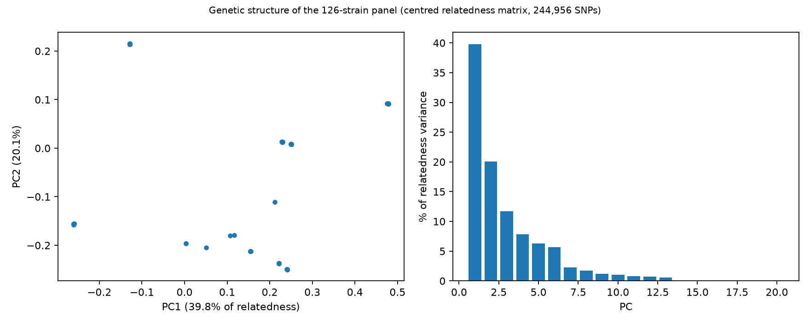

*Figure 10. First two principal components of the centred relatedness matrix and the variance of the first 20 components. Each visible point is a cluster of near-identical strains.*

| max_snp_differences_within_group | n_groups | largest_groups |
|--------------------------------|--------|-------------------|
| 5 | 126 | 1, 1, 1, 1, 1, 1 |
| 50 | 93 | 10, 7, 5, 4, 4, 3 |
| 500 | 35 | 41, 14, 8, 6, 6, 6 |
| 2000 | 14 | 42, 34, 16, 6, 6, 6 |
| 5000 | 14 | 42, 34, 16, 6, 6, 6 |
| 20000 | 14 | 42, 34, 16, 6, 6, 6 |
| 50000 | 13 | 76, 16, 6, 6, 6, 6 |

*Table 8a. Number of single-linkage groups of panel strains by the largest allowed SNP difference. The count is 14 for any cut from 2,000 to 20,000 differences.*

| lineage | n_strains | example_strains |
|-------|---------|----------------------------------------|
| L01 | 42 | TFCN_98A-5, TFCN_102C-2, TFCN_105A-2, TFCN_17-334Y-2 |
| L02 | 34 | TFCN_107A-6, TFCN_102D-1, TFCN_4M-1-2, TFCN_2M-1-4 |
| L03 | 16 | DBVPG_3775, DBVPG_3776, DBVPG_3777, DBVPG_4920 |
| L04 | 6 | DBVPG_3381, DBVPG_3382, DBVPG_3383, DBVPG_3384 |
| L05 | 6 | DBVPG_3983, DBVPG_3984, DBVPG_3044, DBVPG_3090 |
| L06 | 6 | DBVPG_5228, DBVPG_5229, DBVPG_5235, DBVPG_10882 |
| L07 | 6 | DBVPG_4408, DBVPG_4376, DBVPG_5757, DBVPG_5758 |
| L08 | 3 | DBVPG_4945, DBVPG_4947, DBVPG_10842 |
| L09 | 2 | DBVPG_4958, DBVPG_10937 |
| L10 | 1 | TFCN_17-329Y-4 |
| L11 | 1 | DBVPG_4378 |
| L12 | 1 | DBVPG_4618 |
| L13 | 1 | TFCN_25-334D-3 |
| L14 | 1 | DBVPG_4377 |

*Table 8b. Lineage sizes (lineage 1 is the largest).*

- The first two components explain 40% and 20% of the relatedness. The panel has visible clusters, not a continuum.
- Lineage and run are associated in all three screens (chi-square p < 0.001). Strains of one lineage were often on the same runs. Removing run effects therefore removes part of the lineage signal as well.

### Lineage as a source of trait variance

| trait | ICC raw | ICC run-adjusted | p (run-adjusted, ANOVA) |
|--------------|-------|----------------|-----------------------|
| Cr_a_auc | 0.32 | 0.14 | 0.01 |
| Cr_da_top | 0.14 | 0.07 | 0.11 |
| Cr_logIC50 | 0.14 | 0.12 | 0.02 |
| Cr_relarea_auc | 0.27 | 0.28 | 0.00 |
| Cr_relarea_top | 0.32 | 0.29 | 0.00 |
| Cr_relrgr_auc | 0.11 | 0.07 | 0.12 |
| Cu_a_auc | 0.25 | 0.26 | 0.00 |
| Cu_da_top | 0.17 | 0.17 | 0.00 |
| Cu_relarea_auc | 0.02 | 0.02 | 0.33 |
| Cu_relarea_top | 0.18 | 0.20 | 0.00 |
| Cu_relrgr_auc | -0.06 | -0.05 | 0.82 |
| Pb_a_auc | 0.04 | 0.05 | 0.16 |
| Pb_da_top | 0.03 | 0.07 | 0.10 |
| Pb_logIC50 | 0.02 | 0.04 | 0.20 |
| Pb_relarea_auc | -0.02 | 0.00 | 0.44 |
| Pb_relarea_top | -0.00 | 0.08 | 0.09 |
| Pb_relrgr_auc | -0.03 | -0.05 | 0.83 |
| d0_a | 0.23 | 0.23 | 0.00 |
| d0_lnA | 0.24 | 0.24 | 0.00 |
| d0_rgr | 0.10 | 0.10 | 0.05 |

*Table 9. Intraclass correlation of strain-level traits by lineage (one-way ANOVA estimator, 14 lineages), before and after removing run effects (fixed run effects, lineage as a random group).*

- Lineage explains up to 29% of a trait (Cr relative area). With 14 lineages each ICC has a wide interval. This is a broad-sense measure: it mixes additive and non-additive genetic effects and anything else that differs between lineages.
- Pb traits and the growth-rate traits show no lineage component (ICC at most 0.10).

## 5. GWAS

Three scans per trait (GEMMA, univariate LMM, Wald test, centred relatedness matrix from all 244,956 SNPs):

- **(a)** relatedness only, unadjusted phenotypes;
- **(b)** relatedness, phenotypes with run effects removed;
- **(c)** as (b) plus lineage indicator covariates, so that only variation inside lineages is tested.

Bonferroni thresholds use the number of distinct genotype patterns (7,199 for (a) and (b), p < 6.95e-6; 2,940 for (c), p < 1.7e-5). The suggestive level is 1 / that number.

| trait | OLS, no relatedness | LMM (K only) | LMM, run-adjusted | LMM, run-adjusted + lineage | Bonferroni SNPs: LMM (K only) | Bonferroni SNPs: LMM, run-adjusted | Bonferroni SNPs: LMM, run-adjusted + lineage |
|--------------|-------------------|------------|-----------------|---------------------------|-----------------------------|----------------------------------|----------------------------------------|
| d0_a | 3.18 | 0.95 | 0.95 | 1.02 | 0 | 0 | 0 |
| d0_lnA | 1.10 | 1.50 | 1.50 | 1.39 | 0 | 0 | 0 |
| d0_rgr | 3.94 | 1.63 | 1.63 | 0.95 | 0 | 0 | 0 |
| Cr_da_top | 2.03 | 1.07 | 0.82 | 1.33 | 0 | 0 | 0 |
| Cr_a_auc | 3.31 | 1.24 | 1.09 | 0.74 | 0 | 0 | 0 |
| Cr_relarea_top | 5.37 | 1.03 | 1.29 | 1.04 | 31 | 0 | 0 |
| Cr_relarea_auc | 3.81 | 1.34 | 1.03 | 1.27 | 845 | 0 | 0 |
| Cr_relrgr_auc | 0.99 | 1.08 | 0.88 | 1.14 | 0 | 0 | 0 |
| Cr_logIC50 | 3.72 | 1.50 | 1.42 | 1.21 | 0 | 0 | 0 |
| Cu_da_top | 3.21 | 1.06 | 1.04 | 0.31 | 0 | 0 | 0 |
| Cu_a_auc | 2.82 | 1.09 | 1.19 | 0.52 | 0 | 0 | 0 |
| Cu_relarea_top | 4.77 | 0.72 | 0.73 | 0.54 | 8009 | 10099 | 0 |
| Cu_relarea_auc | 2.78 | 1.10 | 1.27 | 0.75 | 0 | 0 | 0 |
| Cu_relrgr_auc | 1.75 | 1 | 1.49 | 1.15 | 0 | 0 | 0 |
| Pb_da_top | 2.01 | 1.30 | 1.23 | 0.87 | 0 | 0 | 0 |
| Pb_a_auc | 3.80 | 1.06 | 1.10 | 1.12 | 0 | 0 | 0 |
| Pb_relarea_top | 2.15 | 0.58 | 1.06 | 1.31 | 0 | 0 | 0 |
| Pb_relarea_auc | 0.70 | 2.50 | 0.58 | 0.81 | 0 | 0 | 0 |
| Pb_relrgr_auc | 0.44 | 0.75 | 0.34 | 1.27 | 0 | 0 | 0 |
| Pb_logIC50 | 1.96 | 1.57 | 1.32 | 0.98 | 0 | 0 | 0 |

*Table 10. Genomic inflation (lambda) of the scans, and the number of SNPs below the Bonferroni threshold. "OLS, no relatedness" is the inflation of a plain regression on the run-adjusted phenotypes.*

| scan | loci_suggestive | loci_bonferroni | bonferroni_lineage_markers | contigs_with_bonferroni_loci | median_lineages_carrying_alt |
|--------------|---------------|---------------|--------------------------|----------------------------|----------------------------|
| unadjusted | 174 | 64 | 64 | 15 | 8.00 |
| runadj | 165 | 44 | 44 | 9 | 7.00 |
| runadj_lineage | 12 | 0 | 0 | 0 |  |

*Table 11. Lead SNPs of the loci (SNPs within 50 kb are one locus) that are lineage markers: SNPs without variation inside any lineage.*

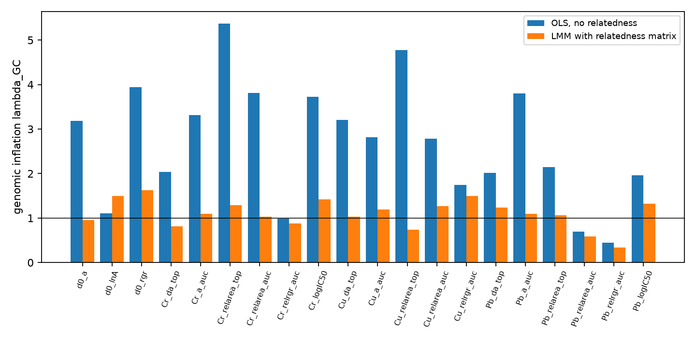

*Figure 11. Inflation with and without the relatedness matrix (run-adjusted phenotypes).*

### Relatedness only (scans a and b)

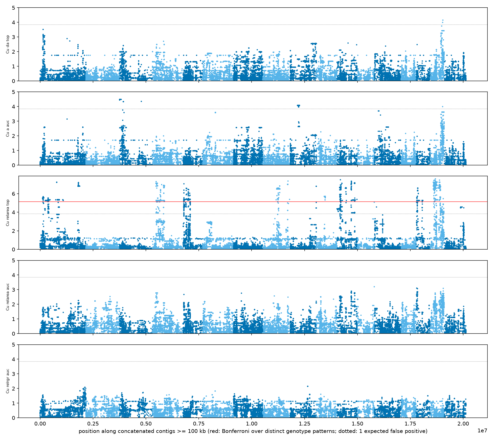

*Figure 12. Cu traits, run-adjusted, relatedness only. The wide vertical blocks are sets of perfectly linked SNPs that mark lineages.*

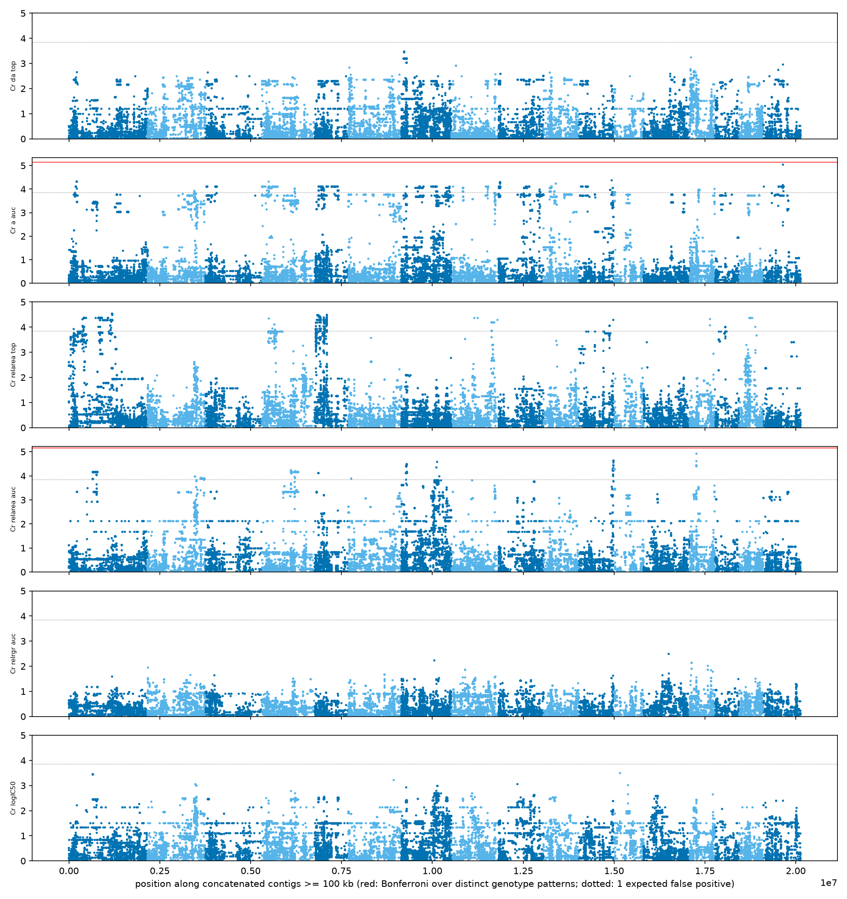

*Figure 13. Cr traits, run-adjusted, relatedness only.*

| trait | chr | pos | af | beta | p_wald | n_suggestive_snps_in_locus | lineages_carrying_alt | lineage_level_marker | gene_id | product |
|--------------|----------|-------|-----|------|-------|--------------------------|---------------------|--------------------|-------------|----------------------------------------|
| Cu_relarea_top | CM179497.1 | 248082 | 0.192 | -0.975 | 4.0e-08 | 938 | 7 | True | ACY3AU_002900 | NADPH:quinone reductase |
| Cu_relarea_top | CM179488.1 | 307303 | 0.225 | -0.959 | 5.9e-08 | 379 | 10 | True | ACY3AU_000108 | 3-dehydrosphinganine reductase |
| Cu_relarea_top | CM179493.1 | 680777 | 0.192 | -0.944 | 6.1e-08 | 205 | 5 | True | ACY3AU_006538 | hypothetical protein |
| Cu_relarea_top | CM179487.1 | 175604 | 0.198 | -0.94 | 6.8e-08 | 448 | 6 | True | ACY3AU_005288 | hypothetical protein |
| Cu_relarea_top | CM179491.1 | 1196734 | 0.208 | -0.926 | 7.5e-08 | 61 | 9 | True | ACY3AU_005187 | methylenetetrahydrofolate reductase (NAD |
| Cu_relarea_top | CM179493.1 | 826983 | 0.199 | -0.938 | 7.9e-08 | 348 | 6 | True | ACY3AU_006945 | hypothetical protein |
| Cu_relarea_top | CM179497.1 | 187085 | 0.195 | -0.94 | 8.3e-08 | 983 | 7 | True | ACY3AU_002885 | meiotic PUF family protein 1 |
| Cu_relarea_top | CM179497.1 | 464560 | 0.2 | -0.928 | 8.4e-08 | 1215 | 7 | True | ACY3AU_002976 | hypothetical protein |
| Cu_relarea_top | CM179497.1 | 319401 | 0.202 | -0.93 | 8.7e-08 | 420 | 8 | True | ACY3AU_002921 | hypothetical protein |
| Cu_relarea_top | CM179485.1 | 786008 | 0.204 | -0.924 | 8.9e-08 | 198 | 8 | True | ACY3AU_004301 | hypothetical protein |
| Cu_relarea_top | CM179487.1 | 236694 | 0.196 | -0.929 | 9.3e-08 | 600 | 6 | True | ACY3AU_005308 | isoleucine-tRNA ligase |
| Cu_relarea_top | CM179488.1 | 33399 | 0.198 | -0.961 | 9.7e-08 | 447 | 7 | True | ACY3AU_000013 | hypothetical protein |

*Table 12. The 12 strongest Bonferroni loci of scan (a). Every one is a lineage marker: it carries the alternate allele in a set of whole lineages. The gene is the one at or nearest the lead SNP, and the gene is not the cause.*

- A locus here is a statement about which lineages differ in the trait, and not about a gene. All SNPs on a lineage's backbone have the same p-value. The lead SNP sits at an arbitrary position along the genome.
- The relatedness matrix does not solve this. With 14 lineages, a lineage-level trait difference is perfectly explained by thousands of SNPs.

### Within lineages (scan c)

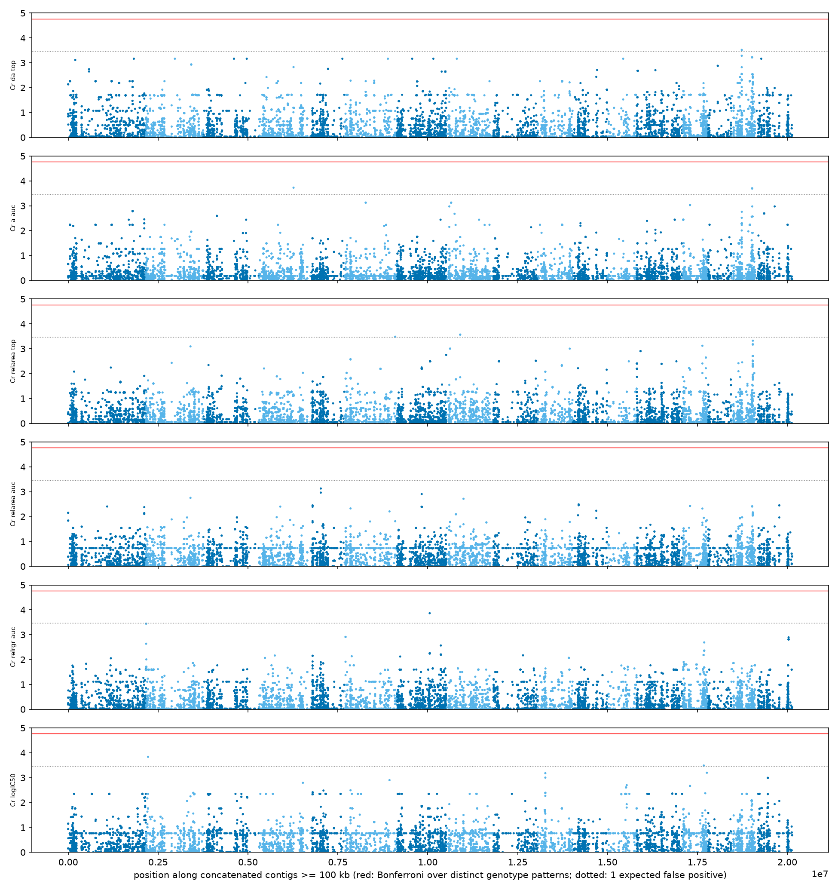

*Figure 14. Cr traits, run-adjusted, lineage covariates.*

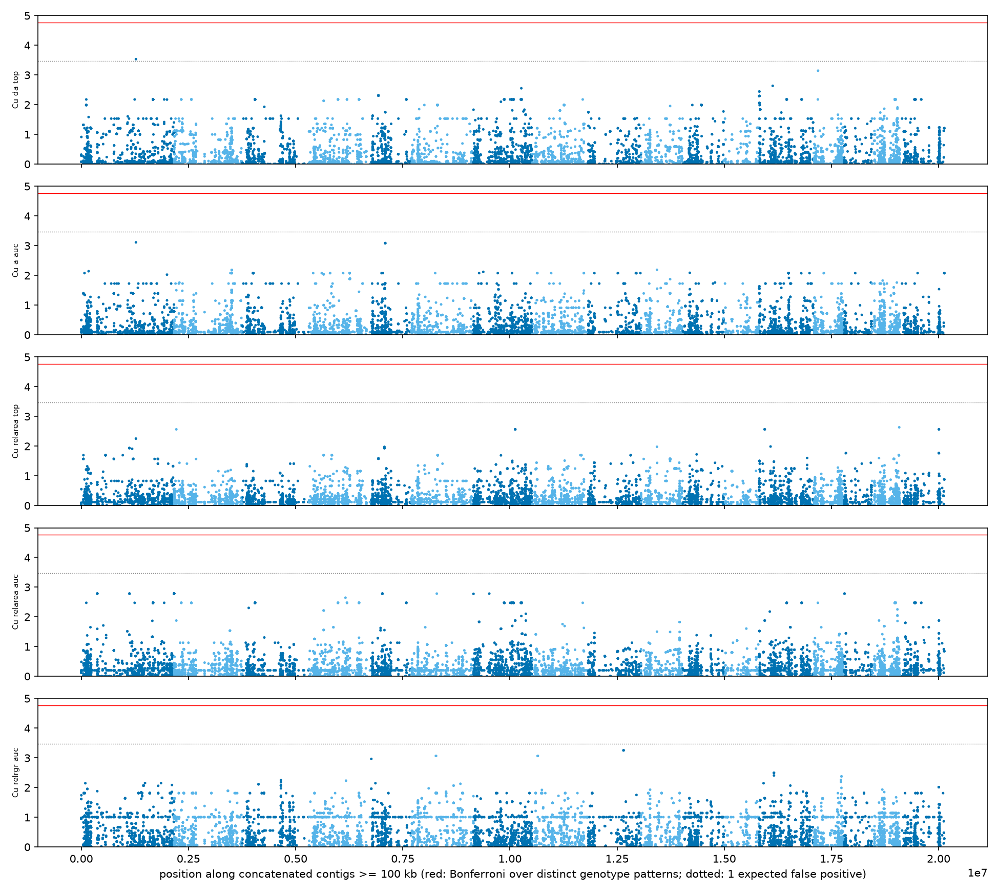

*Figure 15. Cu traits, run-adjusted, lineage covariates.*

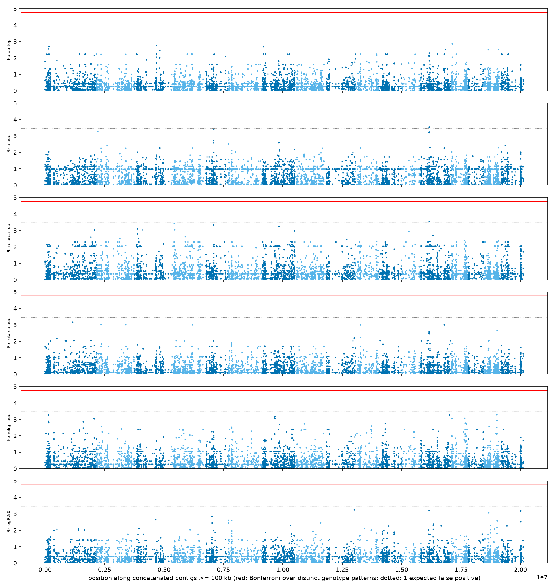

*Figure 16. Pb traits, run-adjusted, lineage covariates.*

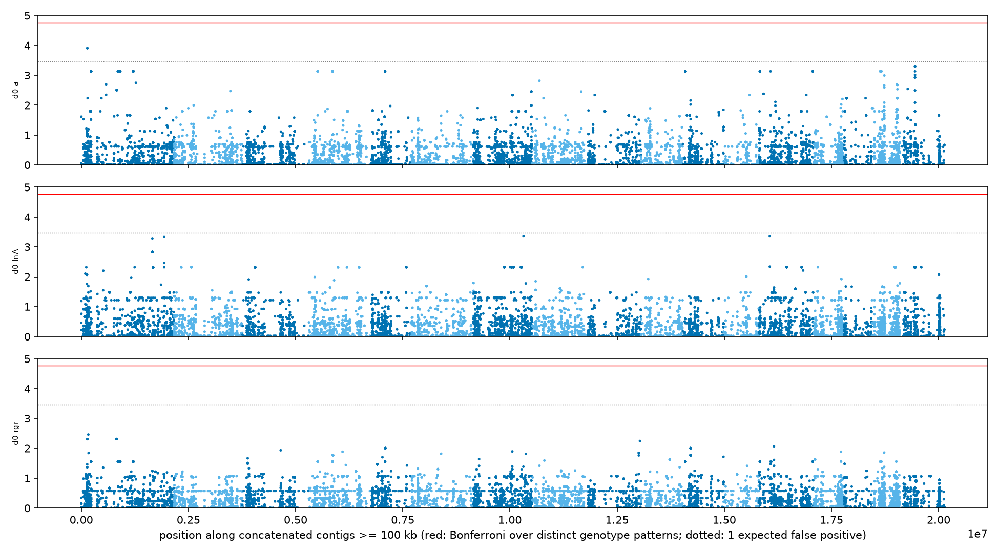

*Figure 17. Dose-0 traits, run-adjusted, lineage covariates.*

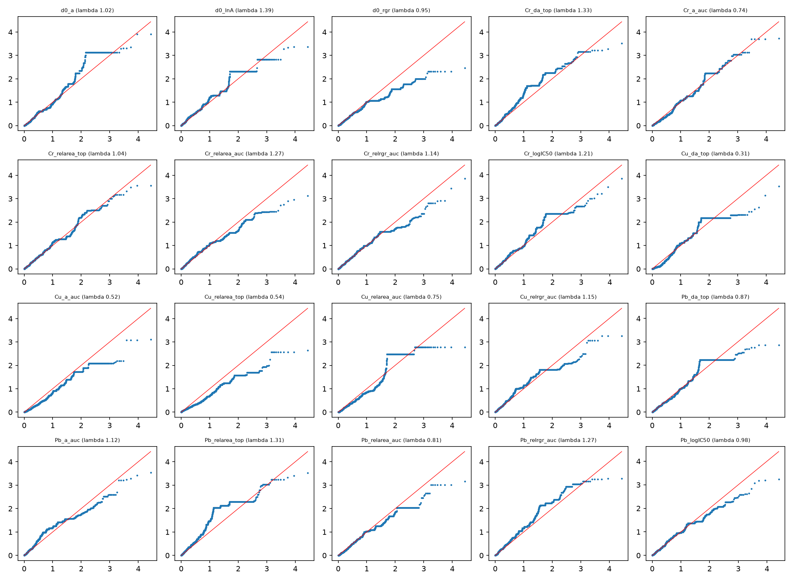

*Figure 18. QQ plots of scan (c).*

| trait | chr | pos | af | beta | p_wald | effect | gene_id | product | distance_bp |
|--------------|-----------------|-------|-----|-----|-------|------------------------------------|-------------|----------------------------------------|-----------|
| d0_a | CM179485.1 | 141640 | 0.264 | 2.38 | 1.2e-04 | upstream_gene_variant | ACY3AU_004087 | cis-prenyltransferase | 0 |
| Cr_relrgr_auc | CM179490.1 | 904292 | 0.053 | -1.87 | 1.4e-04 | 3_prime_UTR_variant | ACY3AU_001509 | hypothetical protein | 0 |
| Cr_logIC50 | CM179486.1 | 55694 | 0.161 | 4.21 | 1.5e-04 | upstream_gene_variant | ACY3AU_000323 | hypothetical protein | 93 |
| Cr_a_auc | CM179487.1 | 957384 | 0.168 | -3.37 | 1.9e-04 | missense_variant | ACY3AU_005580 | Nuclear control of ATPase 2 | 0 |
| Cr_a_auc | CM179497.1 | 588055 | 0.211 | -4.37 | 2.0e-04 | splice_region_variant&intron_variant | ACY3AU_003010 | dolichyl-P-Man:Man(5)GlcNAc(2)-PP-dolichol alpha-1 | 0 |
| Cr_relarea_top | CM179491.1 | 380349 | 0.06 | -2.19 | 2.7e-04 | missense_variant | ACY3AU_004887 | hypothetical protein | 0 |
| Pb_a_auc | CM179495.1 | 344369 | 0.121 | -1.03 | 2.9e-04 | missense_variant | ACY3AU_002286 | hypothetical protein | 0 |
| Cu_da_top | CM179485.1 | 1274990 | 0.132 | 1.63 | 2.9e-04 | upstream_gene_variant | ACY3AU_004469 | hypothetical protein | 20 |
| Pb_relarea_top | CM179495.1 | 346567 | 0.059 | -2.63 | 2.9e-04 | missense_variant | ACY3AU_002287 | hypothetical protein | 0 |
| Cr_da_top | CM179497.1 | 299036 | 0.127 | 1.92 | 3.0e-04 | upstream_gene_variant | ACY3AU_002914 | hypothetical protein | 2354 |
| Cr_logIC50 | JBZGVR010000015.1 | 591343 | 0.112 | -2.07 | 3.2e-04 | upstream_gene_variant | ACY3AU_002808 | hypothetical protein | 102 |
| Cr_relarea_top | CM179489.1 | 1407586 | 0.053 | -3.45 | 3.3e-04 | upstream_gene_variant | ACY3AU_002143 | hypothetical protein | 410 |

*Table 13. Suggestive loci of scan (c) (p below 1 / 2,940). None passes the Bonferroni threshold (p < 1.7e-5). `effect` is the snpEff effect of the lead SNP; the gene is the one overlapping or nearest the lead SNP, with distance in bp.*

- None of the 12 loci passes the threshold, and 17 SNPs reach the suggestive level across 20 traits, against about 94 expected by chance. The scan shows no excess of signal.
- Two loci lie 2 kb apart on contig CM179495.1 (Pb a\* AUC, ACY3AU_002286, and Pb relative area, ACY3AU_002287, both missense variants; p = 2.9e-4 each). The two traits are different summaries of the same Pb data, and the result is not replicated in an independent experiment.
- Candidates with a named product are: ACY3AU_005580 (Nuclear control of ATPase 2, Cr a\* AUC, missense), ACY3AU_003010 (a mannosyltransferase of the dolichol pathway, Cr a\* AUC, splice-region variant) and ACY3AU_004087 (cis-prenyltransferase, dose-0 a\*). Prenyl and dolichol pathway genes are of interest for a\* biology, but this is a hypothesis for later work.
- The SNP heritability estimates that GEMMA reports with lineage covariates are at the boundary (0 or 1) and are not used.

## 6. Non-additive architecture

Strains are haploid, so there is no dominance. Non-additive variance here means epistasis. Two analyses:

- **Variance components (REML).** Model: additive kernel (centred relatedness) plus additive-by-additive kernel (its element-wise square) plus error. The epistatic component is tested by a likelihood ratio test with the boundary correction.
- **Pairwise scan.** All pairs of the 1,401 LD-pruned SNPs (r² < 0.5), interaction term in an LMM that is adjusted for relatedness. Pairs need at least 5 strains in each of the four two-locus classes. Between 51,888 and 65,081 of 980,700 pairs per trait meet this (the others are collinear or rare because of the lineage structure).

| trait | n | h2_additive_only | h2_additive | h2_epistatic_AA | residual_share | LRT | p_epistatic |
|--------------|---|----------------|-----------|---------------|--------------|-----|-----------|
| d0_a | 125 | 0.264 | 0.000 | 0.216 | 0.784 | 1.711 | 0.095 |
| d0_lnA | 125 | 0.000 | 0.000 | 0.160 | 0.840 | 0.000 | 1.000 |
| d0_rgr | 125 | 0.034 | 0.034 | 0.000 | 0.966 | 0.000 | 0.500 |
| Cr_da_top | 125 | 0.091 | 0.056 | 0.037 | 0.907 | 0.191 | 0.331 |
| Cr_a_auc | 125 | 0.184 | 0.177 | 0.007 | 0.816 | 0.006 | 0.470 |
| Cr_relarea_top | 125 | 0.155 | 0.155 | 0.000 | 0.845 | 0.000 | 0.500 |
| Cr_relarea_auc | 125 | 0.129 | 0.123 | 0.006 | 0.871 | 0.003 | 0.479 |
| Cr_relrgr_auc | 124 | 0.058 | 0.000 | 0.062 | 0.938 | 0.893 | 0.172 |
| Cr_logIC50 | 123 | 0.045 | 0.045 | 0.000 | 0.955 | 0.000 | 0.500 |
| Cu_da_top | 125 | 0.177 | 0.173 | 0.004 | 0.824 | 0.001 | 0.489 |
| Cu_a_auc | 125 | 0.228 | 0.228 | 0.000 | 0.772 | 0.000 | 0.500 |
| Cu_relarea_top | 125 | 0.162 | 0.162 | 0.000 | 0.838 | 0.000 | 0.500 |
| Cu_relarea_auc | 125 | 0.065 | 0.027 | 0.043 | 0.930 | 0.149 | 0.350 |
| Cu_relrgr_auc | 125 | 0.000 | 0.000 | 0.012 | 0.988 | 0.311 | 0.289 |
| Pb_da_top | 123 | 0.087 | 0.012 | 0.144 | 0.844 | 0.963 | 0.163 |
| Pb_a_auc | 123 | 0.043 | 0.000 | 0.051 | 0.949 | 1.243 | 0.132 |
| Pb_relarea_top | 123 | 0.000 | 0.000 | 0.000 | 1.000 | 0.000 | 1.000 |
| Pb_relarea_auc | 123 | 0.006 | 0.006 | 0.000 | 0.994 | 0.000 | 0.500 |
| Pb_relrgr_auc | 122 | 0.000 | 0.000 | 0.000 | 1.000 | 0.000 | 1.000 |
| Pb_logIC50 | 119 | 0.060 | 0.060 | 0.000 | 0.940 | 0.000 | 0.500 |

*Table 14. Variance shares from the REML models (RINT traits, panel strains). `h2_additive_only` is the SNP heritability with the additive kernel alone.*

| trait | n_pairs_tested | bonferroni_threshold | min_p | lambda_gc | n_bonferroni | n_expected_at_1e_5 | n_at_1e_5 |
|--------------|--------------|--------------------|-------|---------|------------|------------------|---------|
| d0_a | 65081 | 7.68e-07 | 3.1e-04 | 0.909 | 0 | 0.651 | 0 |
| d0_lnA | 65081 | 7.68e-07 | 1.3e-04 | 0.986 | 0 | 0.651 | 0 |
| d0_rgr | 65081 | 7.68e-07 | 4.0e-04 | 0.63 | 0 | 0.651 | 0 |
| Cr_da_top | 65081 | 7.68e-07 | 0.001 | 0.952 | 0 | 0.651 | 0 |
| Cr_a_auc | 65081 | 7.68e-07 | 0.002 | 1.17 | 0 | 0.651 | 0 |
| Cr_relarea_top | 65081 | 7.68e-07 | 1.9e-04 | 0.88 | 0 | 0.651 | 0 |
| Cr_relarea_auc | 65081 | 7.68e-07 | 7.4e-05 | 1.17 | 0 | 0.651 | 0 |
| Cr_relrgr_auc | 65081 | 7.68e-07 | 8.5e-04 | 1.73 | 0 | 0.651 | 0 |
| Cr_logIC50 | 62079 | 8.05e-07 | 7.3e-05 | 1.11 | 0 | 0.621 | 0 |
| Cu_da_top | 65081 | 7.68e-07 | 6.1e-04 | 1.06 | 0 | 0.651 | 0 |
| Cu_a_auc | 65081 | 7.68e-07 | 1.1e-04 | 0.755 | 0 | 0.651 | 0 |
| Cu_relarea_top | 65081 | 7.68e-07 | 8.2e-04 | 0.525 | 0 | 0.651 | 0 |
| Cu_relarea_auc | 65081 | 7.68e-07 | 4.9e-05 | 1.04 | 0 | 0.651 | 0 |
| Cu_relrgr_auc | 65081 | 7.68e-07 | 6.6e-04 | 1.56 | 0 | 0.651 | 0 |
| Pb_da_top | 64402 | 7.76e-07 | 2.3e-04 | 1.1 | 0 | 0.644 | 0 |
| Pb_a_auc | 64402 | 7.76e-07 | 1.5e-04 | 1.21 | 0 | 0.644 | 0 |
| Pb_relarea_top | 64402 | 7.76e-07 | 0.003 | 1.46 | 0 | 0.644 | 0 |
| Pb_relarea_auc | 64402 | 7.76e-07 | 0.002 | 0.768 | 0 | 0.644 | 0 |
| Pb_relrgr_auc | 64402 | 7.76e-07 | 0.002 | 0.596 | 0 | 0.644 | 0 |
| Pb_logIC50 | 51888 | 9.64e-07 | 8.0e-05 | 0.99 | 0 | 0.519 | 0 |

*Table 15. Pairwise interaction scan. No pair passes the Bonferroni threshold. `n_expected_at_1e_5` is the number expected below 1e-5 by chance.*

- SNP heritability from the additive kernel alone is 0 to 0.26: d0 a\* 0.26, Cu a\* AUC 0.23, Cr a\* AUC 0.18, Cu a\* change 0.18, Cr and Cu relative area at the top dose 0.16. Standard errors are 0.08 to 0.17 (GEMMA, `gwas_inflation_pve_unadjusted.csv`).
- The epistatic component is zero or small in all traits. The smallest p is 0.095 (d0 a\*). When it is non-zero it takes variance away from the additive component (d0 a\*: 0.26 additive only, 0.00 additive and 0.22 epistatic). The two kernels are highly correlated in a clonal panel, so the split between them is not identifiable.
- The pairwise scan has no hit and no excess (lambda 0.5 to 1.7; median 1.02).
- With 14 lineages, no analysis can tell an additive lineage effect from an epistatic one. Both are a difference between whole genotypes.

## 7. Limits and next steps

- **The panel cannot support gene mapping.** Every genome-wide signal tracks lineage. A usable panel needs many more independent lineages or recombinant strains (crosses, or populations with sexual recombination). D-49 (5-SNP cutoff) should be revisited: at 2,000 SNPs only 14 strains remain.
- **Run is confounded with lineage** (all screens). Run adjustment is therefore partial. A design with lineage spread over runs, or repeated runs, would separate them.
- **Replicate noise.** The strain share of the dose-0 variance is 38% for a\* and lower for size and growth. Strain-level traits from 1 to 4 wells per dose are noisy, which lowers power further.
- **Cu IC50** is censored for 46% of panel strains; only coarse.
- **Fe and Zn** are held out (D-56). When complete tables exist, add them to `METALS` in `01_phenotypes.py`.
- **Population analyses** (DH4148 SNP clusters, D-51) are not part of this report. The lineage table (`results/lineages.csv`) is a first version of that grouping.
- **Annotation.** Gene products come from the assembly GFF only. A GO and KEGG annotation of DH4148 would help to interpret candidates.
- **Scope of claims.** Candidate genes in section 5 are suggestive only. They have not been replicated.
