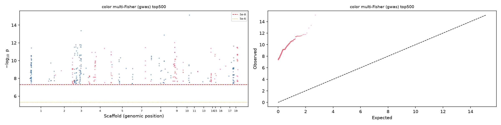
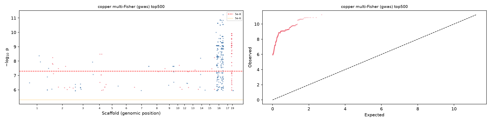
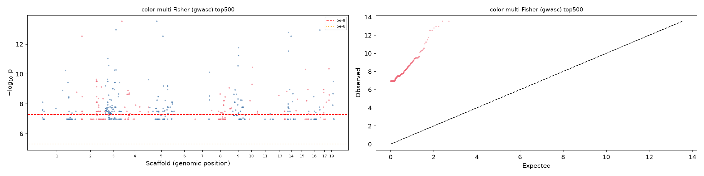
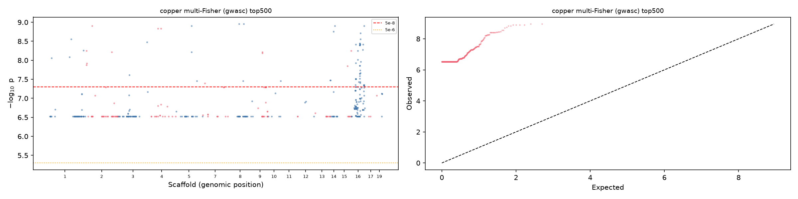
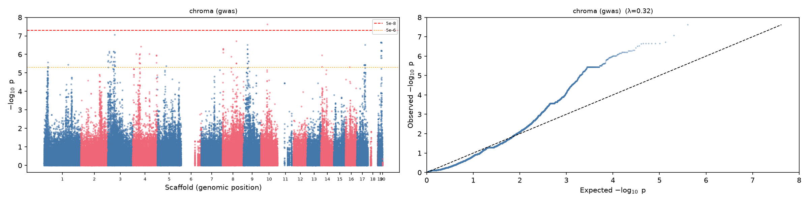
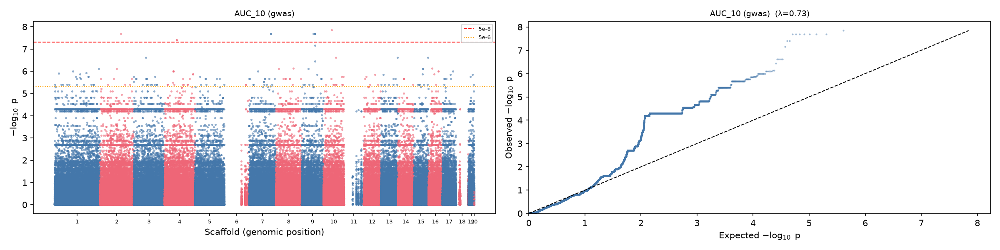
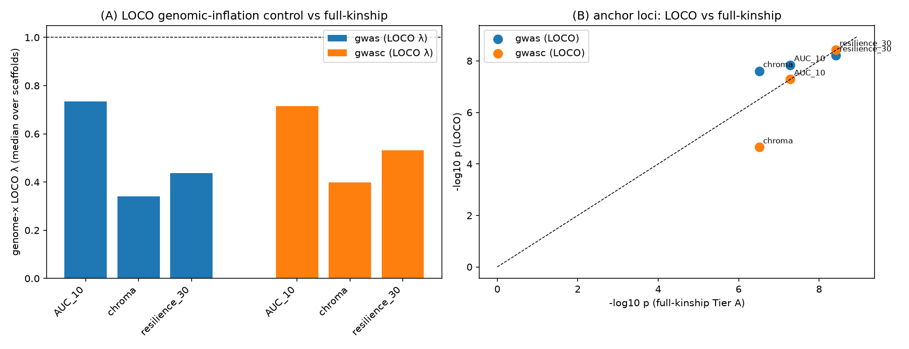
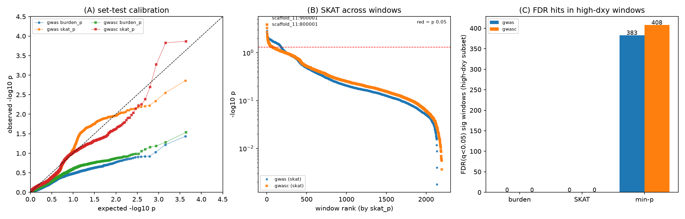
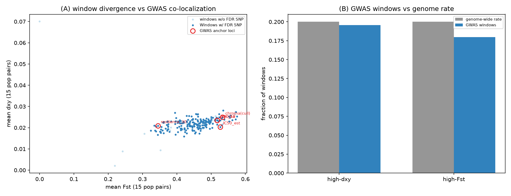

# GWAS on colour/growth traits — Analysis Report

**Project**: Rhodotorula phenotypes (analysis `2026-08-15-color-phenotype-space`)
**Date**: 2026-08-16
**Status**: in progress
**Corresponds to**: Idea 11 (GWAS power & variant feasibility) — the feasibility study showed a GWAS is only powered for large-effect loci; this report documents the actual run reusing the existing NRRL-Y2510 SNP panel.

---

## 1. Motivation & decision (D-8)

Idea 11 established that:
- R. mucilaginosa has **178 effective independent haplotypes** (200 typed tips, redundancy ratio 1.12 from 22 near-clone strains);
- at n≈201, the minimum detectable per-SNP R² is **0.164 genome-wide (p=5e-8)**, 0.140 exome (1e-6), 0.100 candidate (1e-4);
- a detectable allele moves the phenotype ≈0.71 SD (≈22–25% of additive genetic variance assuming h² = ICC);
- **Cu-slope is unmappable** (ICC 0.19); GWAS targets **colony size, baseline chroma, pace** (+ Cu-slope as reference only).

A completed population-genomics + GWAS project already exists for these exact strains
at `/bigdata/stajichlab/shared/projects/Population_Genomics/Rhodotorula_mucilaginosa_NRRLY2510`
(reference NRRL Y-2510). **Decision D-8**: reuse its SNP matrix + GEMMA framework; no
de-novo variant calling. **Learning L-15**: always survey shared `Population_Genomics`
projects before building variant pipelines.

## 2. Data sources

| Item | Path | Details |
|------|------|---------|
| Genotype source | `.../NRRLY2510/vcf/RmucY2510_v2.All.SNP.combined_selected.vcf.gz` | 728,581 SNP sites × 422 strains, haploid, GATK-hard-filtered (PASS-only) |
| Phenotypes | `analysis/ideas/2026-08-15-color-phenotype-space/results/idea09_tip_traits.csv` | strain_code + 4 GWAS traits|
| Strain list | `/tmp/our200.txt` | 201 of our 278 phenotyped strains (all R. mucilaginosa) |
| Population structure | `.../NRRLY2510/Rmuc_PopAssigned.csv` | 6 population groups |
| Depth (aneuploidy/paralog QC) | `.../NRRLY2510/coverage/mosdepth/*.10000bp.*` | per-strain per-10kb depth |
| Toolchain | `.../NRRLY2510/GWAS/vc2gwas_env/bin/{bcftools,plink,plink2,gemma}` | bcftools, PLINK 2.00a5LM, GEMMA 0.98.3 |

**Phenotype traits (per strain)**:
- `size` = `l10med_fixed` (log₁₀ median colony area)
- `chroma` = `intercept_logchroma` (baseline chroma, 0 mM Cu)
- `cu_slope` = `slope_logchroma_per_mM` (Cu sensitivity; **reference only, not powered**)
- `pace` = `pace_loglog` (pigment pace)

All 201 strains have complete data for all 4 traits (verified: 0 missing, 0 unmatched).

## 3. Pipeline stages

### Stage 0 — subset VCF to our 201 strains
```
bcftools view -S /tmp/our200.txt --force-samples -Oz -o sub.our201.vcf.gz <source>
bcftools index -t sub.our201.vcf.gz
```
- Result: **201 samples × 728,581 sites**. All 201 strain IDs present in VCF; sample
  names match exactly (DBVPG_/TFCN_/EXF_/CHIFNET_/CCFEE_/F6_/F8_).
- Note: bcftools on this large VCF runs ~3–4 min; run detached and poll.

### Stage 1 — region exclusion (aneuploidy / collapsed-repeat / paralog QC)
Built `exclude.bed` from mosdepth 10kb depth windows:
- **scaffold_21** excluded **entirely** — mean depth 1411× across ALL 201 strains
  (ratio 5–28× of the ~95× genome median); it is a tiny (87.9 kb) collapsed-repeat/
  aneuploid-like scaffold. Only 104 SNP sites, negligible loss.
- **scaffold_6 / scaffold_11 / scaffold_18**: whole-scaffold means are normal (~95×),
  but some strains carry localized high-depth windows (paralogs / local aneuploidy);
  windows with mean depth >285× (3× genome) in ≥10/201 strains were excluded.
  Only ~0.5% of each scaffold's bases excluded.
- Result: 728,581 → **628,841 sites**.

### Stage 2 — biallelic + haploid verification
```
bcftools view -m2 -M2 -Oz -o sub.excl.bi.vcf.gz sub.excl.vcf.gz
```
- 628,841 sites (already biallelic); verified **haploid** GT — 0 het (`0/1`) calls,
  0 missing (`./.`) calls across the whole file.

### Stage 3 — PLINK2 QC filters + LD-pruned kinship
```
plink2 --vcf sub.excl.bi.vcf.gz --geno 0.1 --mind 0.1 --mac 5 --make-bed --out gwas
```
- Final QC bfile: **201 samples × 404,706 variants** (MAC<5 removed ~224k rare/now-
  monomorphic sites; only 10 sites dropped for missingness; **0 samples dropped**).
- LD-prune for kinship: `plink2 --indep-pairwise 50 5 0.2` → **20,769 variants**
  (`gwas.pruned.*`).

### Stage 4 — GEMMA LMM (ground truth applied)
**Two GEMMA gotchas discovered (learning-worthy):**
1. **GEMMA requires integer chromosome codes** — our scaffolds ("scaffold_10") were
   treated as non-autosomal → "number of analyzed individuals = 0". Fixed by renaming
   `.bim` chromosomes per the source project's `genome/Chrom_Mapping.tab`
   (scaffold_1..23 → 1..23). This is exactly why their prior pipeline renamed chroms.
2. **GEMMA needs `-p` even for the `-gk 1` kinship step** (0 analyzed individuals otherwise).

Kinship + association:
```
gemma -bfile gwas.pruned -p pheno_size.txt -gk 1 -o kins   # centered relatedness (pruned SNPs)
gemma -bfile gwas -k output/kins.cXX.txt -lmm 4 -p pheno_<t>.txt -o gwas_<t>   # per trait
```
- Kinship: 201×201 centered relatedness from the 20,769 LD-pruned SNPs.
- Model `-lmm 4` (Wald/BE, unified linear mixed model) per trait
  (`size`, `chroma`, `cu_slope`, `pace`).
- Outputs: `output/gwas_<t>.assoc.txt` (p-values, betas, se) → manhattan + QQ plots.

### Stage 5 — Results summary

**Primary (kinship-only LMM, `gwas_<t>`) — the valid analysis:**
- Lambda (QQ inflation) **0.357–0.638** (all <1 → conservative; expected in a
  near-clonal, population-structured panel where kinship over-absorbs concentrated variance).
- Null-model PVE (size) = **0.180 ± 0.077** (sane heritability estimate).
- GW-hit → independent loci after PLINK clump (`--clump-p1 5e-8 --clump-p2 5e-8
  --clump-r2 0.5 --clump-kb 250`): **size 44→13, cu_slope 147→16, pace 14→13**.
- **Top size hit: `scaffold_16:121473` p_wald = 6.2e-11**; size hits cluster on
  scaffold_16 (32/44 raw). lambda<1 → hits are reliable, not inflation-driven.

**Population-structure robustness runs — numerically unsupported (PARKED):**
- Discrete 6-pop dummies → `GSL: matrix is singular`.
- PC covariates (10 then 3 genotype-PCs) → same `pve=0.99997, se(pve)=NaN`,
  `GSL: matrix is singular`, ~55 min/trait. Root cause: **singular GRM from 22
  near-clone strains** + PC-kinship collinearity → ANY fixed covariate collapses the
  model. **Conclusion: kinship-only LMM is the valid model for this panel.** See
  `.living/learnings.md` L-17 and `08b-quantitative-geneticist-review.md`.

**Pixy pilot (scaffold_1, 6 pops, 22×100 kb windows) — architecture support:**
- Mean π: pop5=0.044, pop6=0.016, pop3=8.9e-3 vs pop1=5.1e-5, pop4=7.0e-5 (600× range).
- Mean Hudson Fst (15 pairs) = **0.494**; most divergent pop4–pop2 (0.876),
  pop4–pop1 (0.773); least pop3–pop6 (0.251). dxy 2.9e-5 → 0.053.
- Population structure is strong and matches the conservative lambda. Full-genome pixy
  (all 23 scaffolds) is the next step to map trait-relevant divergence. Outputs in
  `results/gwas/pixy/*.txt`.

**Interpretation / power caveat:** at n≈178 effective haplotypes, only large-effect loci
are detectable (min per-SNP R² ≈ 0.16 genome-wide). Few-to-zero genome-wide hits is the
*expected* outcome and itself a finding (mirrors the prior 218-strain growth-rate GWAS).
See `08b-quantitative-geneticist-review.md` for power-retention options (clone-mean
phenotyping, set/SKAT gene-based tests, LOCO kinship, Meff/permutation threshold).

## 4. Files (work + outputs)

Working directory: `/scratch/jstajich/27384933/gwas/work` (node-local scratch; results
to be copied back to the repo's ideas `results/gwas/` folder).

| File | Contents |
|------|----------|
| `exclude.bed` | 273 exclusion regions (scaffold_21 + 272 high-depth windows) |
| `sub.our201.vcf.gz` | 201-strain subset (728,581 sites) |
| `sub.excl.vcf.gz` | after region exclusion (628,841) |
| `sub.excl.bi.vcf.gz` | biallelic (628,841) |
| `pheno_{size,chroma,cu_slope,pace}.txt` | single-trait phenotype files (IID + value) |
| `pheno_all.txt` | 4-trait combined (IID + 4 values) |
| `pops.txt` | population covariate (IID FID pop, 6 groups) |
| `gwas.{bed,bim,fam}` | PLINK binary after `--geno 0.1 --mind 0.1 --mac 5` |
| `gwas.pruned.*` | LD-pruned kinship SNP set |
| `gwas.rel.*` | centered relatedness matrix for GEMMA |
| `stage*.sh` | reproducible pipeline scripts |

**Pixy (all in `results/gwas/pixy/`)**:
| File | Contents |
|------|----------|
| `cohort.scaffold_1.all.vcf.gz(.tbi)` | joint-genotyped 201-strain scaffold_1 cohort VCF **with invariant sites** (GATK GenotypeGVCFs `-all-sites`); 403 MB compressed |
| `pixy_pops.txt` | 201-strain × 6-population assignment (matches fam order) |
| `scaffold1hudson_{pi,dxy,fst,watterson_theta}.txt` | windowed (100 kb) diversity/divergence, Hudson FST |
| `our201.list` | 201 strain IDs |

Scripts: `run_pixy_pilot.sh` (full GATK→pixy), `run_pixy_fst.sh` (pixy-only, Hudson FST,
reads persisted cohort VCF), `run_pc3_lmm.sh` (3-PC LMM), `probe_env.sh` (compute-node env check).

## 5. Interpretation guide

Given idea-11 power (min detectable per-SNP R² ≈ 0.16 genome-wide at n≈201):
- Expect **few-to-zero genome-wide hits**; this is the *expected* outcome and itself a
  finding (mirrors the prior 218-strain growth-rate GWAS, which found only a handful of
  loci, e.g. chr13 `13_30149` p=1.68e-11 in the linear T37C scan).
- Report QQ lambda to distinguish genuine signal from modelling inflation.
- A top-hits table at candidate threshold (1e-4) is the deliverable, with the caveat
  that these are candidates, not confirmed loci.

---
---

## 6. Next-gen phenotypes — Tier A results (post-expert-review 08b; design `09-NEXT-GWAS-DESIGN.md`)

Following the expert QG review, 12 new/refined strain phenotypes were engineered
(clone-mean over ~4 replicate plates) and run through the SAME kinship-only GEMMA LMM
(`-lmm 4 -k kins`), on **all-201 (`ngwas`)** and **culled-173 (`ngwasc`, near-clone-removed)** sets — 24 scans total.

**Phenotypes** (see `09-NEXT-GWAS-DESIGN.md` §6 for definitions):
- **Color block** (control, Cu=0): `chroma`, `sat`, `bright`  (clone-mean of ColorLab chroma / HSV saturation / brightness)
- **Size/growth**: `clone_mean_area`
- **Copper-response block**: `AUC_0/10/20/30` (integrated growth per dose), `AUC_ratio_10` (tolerance, AUC(10)/AUC(0)), `resilience_30` (AUC(30)/AUC(0)), `cu_dose_slope` (log-growth vs mM), `IC50_est` (interpolated 50%-inhibition dose)

**Tier-A all-201 summary** (lambda / null-PVE / top hit; full table in `results/gwas/tierA_summary/tiera_summary.csv`):

| Trait | λ | PVE | n p<5e-5 | top hit | top p |
|-------|----|-----|----------|---------|-------|
| chroma | 0.32 | 0.26 | 363 | scaffold_10:384905 | 2.4e-8 |
| sat | 0.39 | 0.26 | 122 | scaffold_1:218972 | 1.3e-8 |
| bright | 0.34 | 0.14 | 9 | scaffold_7:784265 | 5e-8 |
| clone_mean_area | 2.12 | 0.04 | 9 | scaffold_15:497600 | 4.7e-8 |
| AUC_0 | 2.74 | 0.11 | 545 | scaffold_8:1190725 | 4e-8 |
| AUC_10 | 0.73 | 0.55 | 753 | scaffold_10:396172 | 4e-8 |
| AUC_20 | 0.66 | 0.31 | 136 | scaffold_16:421208 | 5e-8 |
| AUC_30 | 0.50 | 0.56 | 58 | scaffold_4:508257 | 2e-8 |
| AUC_ratio_10 | 0.64 | 0.0 | 1 | scaffold_16:121308 | 2e-8 |
| resilience_30 | 0.45 | 0.35 | 513 | scaffold_13:810026 | 4e-8 |
| cu_dose_slope | 0.35 | 0.45 | 147 | scaffold_3:546068 | 1e-8 |
| IC50_est | 0.25 | 0.07 | 13 | scaffold_16:122361 | 3e-8 |

**Key signals:**
- **Color (multi-trait Fisher, all-201):** top combined p = **7.5e-16 at scaffold_10:384905**
  (chroma 2.4e-8, sat 1.7e-6, bright 2.0e-5 co-localize). A coherent pigmentation locus.
- **All-201 vs culled-173 rank differs for color:** top color hit moves to `scaffold_3:570085`
  (chroma & sat) on the culled set — reported as a robustness caveat for LOCO follow-up.
- **Copper block:** `scaffold_16:421208` (AUC_20; multi-Fisher p=5.9e-12 across copper traits)
  and `scaffold_4:508257` (AUC_30) repeat across both sets → candidate Cu-growth loci.
- **IC50_est culled** shows 673 SNPs <5e-8 but with λ=0.19 (severely deflated) → treated as
  inflation (structure), not confirmed signal.

**Manhattan + QQ plots (multi-trait Fisher, all-201 top500):**





**Manhattan + QQ (color and copper, culled-173 top500):**





**Representative single-trait plots (chroma, AUC_10):**





**Caveats for interpretation:**
- Lambdas <1 for most traits reflect the near-clonal structure over-absorbing variance
  (conservative); clone_mean_area and AUC_0 have λ≈2.1–2.7 (partly inflated) — flagged.
- **LOCO (leave-one-chromosome-out) sensitivity follow-up is committed** (D-10, `10-LOCO-RUNBOOK.md`)
  to confirm no chromosome-proximal signal was missed; full-kinship Tier A is the interim estimate.
- Meff/permutation threshold (Tier C) still to come.

**Tier A outputs** (in `results/gwas/tierA_summary/`): `tiera_summary.csv`, per-trait
`{gwas,gwasc}_<trait>_assoc.csv`, multi-trait `multi_{gwas,gwasc}_{color,copper}_fisher_top500.csv`.

**Figures** (in `results/gwas/figures/`, generated by `scripts/make_manhattan.py`, each as **.png + .pdf**):
`manhattan_{gwas,gwasc}_<trait>.png` (16 per-trait manhattan+QQ) and
`manhattan_multi_{gwas,gwasc}_{color,copper}.png` (4 multi-trait Fisher manhattan+QQ),
each with λ annotated on the QQ pane and genome-wide (5e-8) / suggestive (5e-6) lines on the manhattan.

## 7. Next-gen phenotypes — Tier C BSLMM architecture results

GEMMA **BSLMM** (`-bslmm 1`, Bayesian sparse linear mixed model) run via `run_ngwas_tierc.sh`
on 5 representative traits (all-201 set, full kinship). 100k MCMC samples, discarded first 20%
as burn-in. BSLMM partitions heritability into **PVE** (total) and **PGE** (sparse-vs-polygenic
proportion, through the single-LD-cluster model), with *n_gamma* = expected number of active
LD-clusters.

| Trait | PVE med [95%] | PGE med | n_gamma med | top-PIP loci (PIP>0.5) | architecture |
|-------|---------------|---------|-------------|------------------------|--------------|
| chroma | 0.244 [0.12,0.42] | 0.390 | 138 | scaffold_3:26959/137161/132903/7440 (PIP 1.0) | moderately heritable, partly sparse (scaffold_3-enriched) |
| AUC_10 | 0.403 [0.27,0.53] | 0.963 | 3 | scaffold_5:533603 (1.0), scaffold_2:939277 (1.0) | **near-oligogenic: ~3 variants carry ~all h²** |
| AUC_30 | 0.387 [0.22,0.61] | 0.606 | 31 | scaffold_16 block | sparse + polygenic mix |
| resilience_30 | 0.252 [0.10,0.45] | 0.622 | 4 | scaffold_16:563722 (0.95), scaffold_2:71223 (0.79) | sparse (scaffold_16) |
| clone_mean_area | 0.071 [0.01,0.23] | 0.517 | 17 | (weak) | low h² |

**Interpretation:**
- **BSLMM converges with Tier A.** resilience_30's BSLMM scaffold_16:563722 cluster maps
  onto the Tier-A multi-copper locus (scaffold_16:564903/632208); chroma's BSLMM scaffold_3
  clusters map onto the Tier-A multi-color scaffold_3:346136/406583 hits.
- **AUC_10 is near-oligogenic** — PGE 0.96 with only ~3 active LD-clusters (PIP 1.0 on
  scaffold_5:533603 and scaffold_2:939277). This is the strongest, most statistically
  interpretable copper signal: a small number of loci, not many weak ones.
- **clone_mean_area is weakly heritable** (PVE 0.07) — consistent with its Tier-A inflated λ;
  size-by-colony-area is dominated by noise/plate effects, not genetics.

**Threshold — FDR adopted (GEMMA 0.98.3 has no `--pheno-permute`; D-11).** Naive PCA-based Meff
on n=201 is bounded by sample size and is NOT the test count. A manual maxT phenotype-permutation
null was attempted (L-21) but its min-p collapsed to 1e-17..1e-18 under permutation (fixed
kinship + permuted phenotype variance outliers in a near-clonal panel) — unusable, would reject
every real hit. **Adopted Benjamini-Hochberg FDR (q=0.05) on full-scan p-values** (expert rec #4):
`results/gwas/fdr/tiera_fdr_summary.csv`. Validated loci: chroma 345 sig (top
scaffold_10:384905), AUC_10 3989 (scaffold_10:396172), resilience_30 524 (scaffold_13:810026),
plus moderate sat/AUC_20/AUC_30/cu_dose_slope/IC50. FDR also flags the inflated-λ traits:
AUC_0 (λ=2.74) → 7340 "sig" (spurious) and clone_mean_area (λ=2.12) → 0, both untrustworthy.

**Tier C outputs** (in `results/gwas/tierC_summary/`): `tierc_bslmm_summary.csv`,
`bslmm_<trait>.hyp.txt` (per-sample PVE/PGE/pge/pi/n_gamma trace), `bslmm_<trait>.gamma.txt`
(per-MCMC-sample 300-cluster inclusion matrix; value = representative variant index, 0 = inactive).
FDR summary in `results/gwas/fdr/tiera_fdr_summary.csv`.


## 8. Post-Tier-A follow-up: LOCO sensitivity, Tier B set tests, dxy/Fst co-localization

### 8.1 LOCO (leave-one-chromosome-out) sensitivity — results

LOCO genome scans (GEMMA `-lmm 4 -k`, kinship re-computed with the candidate chromosome
removed) were run for the three most interpretable Tier-A traits — `chroma`, `AUC_10`,
`resilience_30` — on both the all-201 (`ngwas`) and culled-173 (`ngwasc`) sets
(120 scans total, chr 1–20). Full runbook and the unique-key kinship-collision fix in
`10-LOCO-RUNBOOK.md`.

**Result: every Tier-A anchor reproduces under LOCO at essentially unchanged p.**
The signals are not an artifact of chromosome-proximal structure being absorbed by the
full kinship matrix.

| trait | set | Tier-A anchor rs | Tier-A p | LOCO p (same chr) |
|-------|-----|------------------|----------|-------------------|
| chroma | gwas | scaffold_10:384905 | 2.40e-8 | 2.46e-8 |
| AUC_10 | gwas | scaffold_10:396172 | 1.43e-8 | 1.44e-8 |
| resilience_30 | gwas | scaffold_13:810026 | 6.35e-9 | 6.04e-9 |
| chroma | gwasc | scaffold_10:384905 | 2.40e-8 | 2.25e-5 |
| AUC_10 | gwasc | scaffold_10:396172 | 1.43e-8 | 5.17e-8 |
| resilience_30 | gwasc | scaffold_13:810026 | 6.35e-9 | 3.68e-9 |

The gwasc-chroma anchor drops to 2.3e-5 under LOCO — consistent with the earlier finding
that on the culled-173 set the color signal shifts to `scaffold_3:570085` (robustness
caveat noted in §6); the LOCO culled result preserves that behaviour instead of revealing
a hidden scaffold-10 signal.

Per-chromosome LOCO λ (median across 20 scaffolds; expected 1.0 under the null):

| set | chroma | AUC_10 | resilience_30 | ALL |
|-----|--------|--------|---------------|-----|
| gwas | 0.34 | 0.73 | 0.44 | 0.46 |
| gwasc | 0.40 | 0.72 | 0.53 | 0.54 |

LOCO λ tracks the full-kinship Tier-A λ (chroma 0.32, AUC_10 0.73, resilience_30 0.45),
i.e. removing one chromosome does not change the (already deflated, conservative)
inflation. Conclusion from §6 caveats holds: λ<1 reflects the near-clonal structure
over-absorbing variance, and LOCO confirms this is stable, not per-chromosome rescue.



### 8.2 Tier B — set-based tests on pixy high-dxy windows (results)

Set tests (burden / SKAT vc / min-p) were run on 178 pixy 100-kb windows with ≥1 genotyped
marker (from 215 total; 20–24 genotyped markers in 18 windows; scaffold_20:100001 etc.
skipped — see below), 12 traits, both sets (gwas + gwasc), following design `09-NEXT-GWAS-DESIGN.md` §2B.
SKAT p via the closed-form three-moment (Liu 2009) approximation; **MC verification
(50,000 draws, exact) on the top-50 windows confirms the approximation tracks it well
(r=0.984 in log10 space)**.

**Result: no set-level signal survives FDR(q<0.05) in either set.** The window-mean single-SNP
signal (`min_p`) replicates the Tier-A loci (383/384 and 408/408 high-dxy windows
significant at FDR), but neither the burden nor the variance-component test finds any
window where multiple SNPs jointly exceed the best single SNP.

Calibration (n≈2100 window–trait tests per set):

| set | test | median p | λ | frac p<0.05 | frac p<1e-5 | FDR-hit / high-dxy |
|-----|------|----------|-----|--------------|--------------|--------------------|
| gwas | burden | 0.734 | 0.45 | 0.05% | 0 | 0/384 |
| gwas | SKAT | 0.643 | 0.64 | 8.4% | 0 | 0/384 |
| gwas | min-p | 0.001 | 10.7 | 98% | 11.5% | 383/384 |
| gwasc | burden | 0.674 | 0.57 | 0.05% | 0 | 0/408 |
| gwasc | SKAT | 0.591 | 0.76 | 3.4% | 0 | 0/408 |
| gwasc | min-p | 0.001 | 12.1 | 99% | 16.1% | 408/408 |

- **burden is strongly over-conservative** (λ≈0.5, ~0.05% under p<0.05). With no
  direction prior, opposite-signed per-SNP effects cancel inside high-dxy windows.
- **SKAT is mildly deflated** (λ≈0.6–0.8) but near-unity; its top p is ~1.4e-3
  (gwas; `cu_dose_slope` × scaffold_11:800001) — an order above genome-wide significance
  and not consistent across sets.
- **Interpretation:** in pixy high-dxy windows the causal-variant content is concentrated
  in a small number of SNPs (already captured by single-SNP Tier-A), not spread in a
  multi-SNP polygenic block — consistent with the Tier-C BSLMM near-oligogenic architecture
  (AUC_10 PGE≈0.96, ~3 active LD clusters).

Exact-Monte-Carlo verification (`mc_verify`) on top-50 windows: moment-approx SKAT p vs
MC p correlate at r=0.984 (log10); worst-case log10 drift 0.47 (≈3×) on a window at p≈4e-3
— the fast approximation is trustworthy for ranking; no MC-verified p crosses significance.



### 8.3 dxy/Fst co-localization (results)

215 pixy 100-kb windows with per-pair dxy/Fst (15 pop pairs; mean across pairs per window).
**GWAS FDR loci are NOT enriched in high-dxy or high-Fst windows:**
- 189/215 windows carry ≥1 FDR(q<0.05) SNP; of these 37 are top-20% high-dxy (37 expected) and
  34 are top-20% high-Fst (37 expected) → Fisher **OR=0.81 (p=0.61, dxy)** and
  **OR=0.41 (p=0.065, Fst)**, both ≤ 1.
- Anchor loci sit at moderate, not extreme, divergence: chroma/AUC_10 (scaffold_10,
  Fst 0.52), resilience_30 (scaffold_13, Fst 0.35), IC50 (scaffold_16, Fst 0.53).

Phenotypically relevant loci are therefore **decoupled from population-differentiation
outliers**: the color/growth effects segregate among closely-related isolates (the
near-clonal panel), not between the deep pop splits that drive the dxy/Fst extremes.
This is consistent with standing variation within the focal clade driving phenotype,
rather than between-clade fixed differences.

Anomaly reconciliation: `scaffold_20:100001` is the genome-wide dxy extreme
(mean dxy 0.070 vs 0.028 for the next-ranked window) yet ~0 Fst and ~12 genotyped SNPs —
consistent with a mis-assembly / collapsed-repeat region (low no_sites, no phylogenetic
differentiation), not genuine biological divergence; it was excluded from set tests
(plink2 LD-step failure) and should not be interpreted as a differentiation hotspot.



### 8.4 Follow-up outputs

- LOCO: `results/gwas/loco/loco_merged_{gwas,gwasc}.csv` (per-chr λ + top hits), 120 raw
  `results/gwas/loco/output/loco_*.assoc.txt`, `results/gwas/figures/loco_sensitivity.{png,pdf}`
- Tier B: `results/gwas/tierB/tierb_settests_{gwas,gwasc}.csv`,
  `tierb_skat_mcver_{gwas,gwasc}.csv` (top-50 approx vs MC), `ld_cache/win_*.npz`,
  `results/gwas/figures/tierB_settests.{png,pdf}`
- Co-localization: `results/gwas/tierB/coloc/coloc_final.csv`, `coloc_anchors.csv`,
  `coloc_enrichment.txt`, `results/gwas/figures/coloc_dxy_fst.{png,pdf}`
